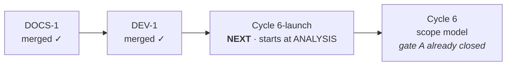

# Handoff — nothing is in flight; next is `Cycle 6-launch`, from its own analysis

**Ephemeral**, like the eight before it: deleted when the next session writes its own.
Nothing is decided here. Everything normative is in [roadmap.md](roadmap.md), the
ADRs, [ux-principles.md](ux/design/ux-principles.md) and the rules in
`.cco/claude/rules/`.

## ✅ Read this first: the suite is safe

**`go test -race ./...` runs in ~8 seconds and leaves nothing behind.** The warning
that opened the last seven handoffs is withdrawn, and `rm -rf /tmp/_MEI*` is **not**
part of any workflow — there is nothing left to remove, so do not reintroduce it.

If some document still says otherwise, it is stale and should be fixed; the ones that
carried it were corrected on 2026-08-26
([ADR-0017](foundation/decisions/0017-dev-container-oracle.md)).

## Where the project is

| | |
|---|---|
| branch | **`main`**, clean, `34c244b` — `main == origin/main` |
| open work units | **none** |
| local branches | **only `main`** — six merged ones deleted with `-d` on 2026-08-26 |
| `go test -race ./...` | green, **8 s**, 14 packages |
| `go vet` · `gofmt -l .` · installer · parity gate · links | clean · empty · 103/103 · empty · green (55 files) |
| released | **v2.2.0**, installed on both Macs |

Two **remote** branches survive — `origin/feat/update-path/implementation` and
`origin/fix/cycle1/consolidation`. Deleting a remote branch is outward-facing and
never automatic; they are the maintainer's to remove when wanted.

## What the last session did, in one paragraph

Closed `DEV-1`. The project's primary gate could destroy the session that ran it, and
had done so four times. Two causes in series: `cmd/ytdl`'s **test binary re-executed
the whole suite** (`resumeIfStalled` called `daemon.Spawn()` with no seam, and Go's
generated main accepts an unknown positional argument instead of rejecting it), and
the container's **yt-dlp was a PyInstaller bundle** that unpacks 78 MB per invocation
and leaks it when killed. Fixed by a seam plus a `TestMain` that refuses `__daemon`,
and by provisioning the **zipapp**, which never unpacks. Details and every measurement
in [ADR-0017](foundation/decisions/0017-dev-container-oracle.md).

⚠️ **`.cco/setup.sh` takes effect at `cco start`.** The zipapp is already in place in
the current container and `~/.local/bin` is a host mount, so it persists; nothing
needs rebuilding.

---

# `Cycle 6-launch` — the desktop launcher

**Start at analysis.** The scope, the four questions the analysis must settle, and the
maintainer's clarification are in
[roadmap § Cycle 6-launch](roadmap.md#cycle-6-launch) — read that section first; this
is the working brief on top of it, not a replacement.

## Why the cycle exists

`ytdl gui` is the only way to open the interface, and it needs a Terminal — which for
the audience the GUI was built for is the one thing it exists to avoid. `C2`,
ADR-0016's acceptance test, **passed with exactly one exception**: the update needed
no Terminal, but *opening the interface* still did. This cycle is that exception.

It delivers the **entry point** half of phase item `6a`, and leaves 6a's
paste/drop-and-enqueue app to a later pass — which may prove unnecessary once the GUI
is one click away.

## What "desktop launcher" means — the maintainer's own words

> «Con "desktop launcher" non intendo che l'icona viva per forza sul Desktop.
> Intendo che l'utente veda ytdl come un'app, quindi icona in Application folder,
> inseribile in dock, Desktop o location arbitraria.»

The name is about the **destination** — the desktop metaphor — not a location on disk.
It is a scope input, not a settled design, and it narrows the artefact question
sharply:

- **A `.command` file is effectively ruled out.** It is not an app: it cannot sit in
  the Applications folder as one, cannot be pinned to the Dock as one, and
  double-clicking it opens a Terminal — the thing being removed.
- **`/Applications` needs admin; `~/Applications` does not.** The installer has never
  used `sudo`, and that is [ADR-0001](distribution/decisions/0001-distribution-channel.md)'s
  whole shape. `~/Applications` is indexed by Spotlight and Launchpad and does not
  exist by default, so the installer would create it.
- **It must survive being moved.** Dragged to the Dock, the Desktop or a folder of the
  user's own, it must still work — so it resolves `ytdl` by absolute path, never by
  its own location.

## ⚠️ The decisive unknown: Gatekeeper. Verify it first, before anything else

ADR-0001 rejected `.pkg`/`.dmg`/`.app` because Gatekeeper blocks unsigned
**downloaded** bundles. This cycle rests on a different claim: **a bundle generated on
the machine** — `osacompile` at install time — carries no quarantine attribute, so it
needs no $99 signing and never enters the territory ADR-0001/0002 ruled out.

**That claim has not been verified.** It cannot be verified in this container — it is
macOS behaviour on real hardware, and the container is not the target platform. So:

- If it **holds**, ADR-0001 gets an amendment or a successor, and the cycle proceeds.
- If it **does not**, the cycle's premise is gone and the analysis must say so
  **early**, not after a design has been built on it.

Put this first in the analysis, not last.

## Three things Cycle 6-plus changed about the problem

1. **`install.sh` now runs on every UPDATE, not only on first install.** Whatever it
   does to the bundle it does again at every update. Deleting and recreating it would
   churn the Dock entry, the Spotlight index and any alias the user made. *"Leave it
   alone when it has not changed"* is probably right, and it has to be a **decision**,
   not a default.
2. **The update replaces `~/.local/bin/ytdl` underneath a running daemon**, and the
   daemon re-execs `os.Executable()`. A launcher that hardcodes anything about the
   binary other than its path goes stale on the first update.
3. **The uninstall path grows a fourth line.** It is documented as three `rm -f` lines
   in [guida-installazione.md](../users/guides/guida-installazione.md) § *Come
   disinstallare* — user-facing Italian, so the change lands there too, not only in
   the changelog.

## Two verified facts worth having to hand

- `ytdl gui` **reuses a daemon that is already listening** and only spawns one when
  nothing is (`cmd/ytdl/main.go`, `guiProbe`). A headless daemon from `ytdl -b` holds
  the queue lock, and `ytdl gui` already handles that by serving the UI and retrying
  the lock.
- The GUI is **one document with hash routing and no reload**, and uses no
  `innerHTML` — tests enforce both. A launcher changes nothing there, but anything
  that opens a *second* tab has to reckon with
  [ADR-0008](engine/decisions/0008-daemon-lifecycle.md): an open SSE connection is the
  daemon's liveness clause.

## The gates this cycle will meet

Per the workflow rules the pack supplies and the
[project profile](../../.cco/claude/rules/project-profile.md):

- **Gate A** — launching the analysis, and approving its direction. The approval is
  what promotes the analysis draft to the approved artefact.
- **Gate B** — approving the design before implementation. `Design × Feature` is `U`
  in the profile, so this one is not delegable.
- **Gate C** — the maintainer's hands-on verification on real hardware. **This cycle
  needs it more than most**: Gatekeeper, the Applications folder, the Dock and
  Spotlight are all things the container cannot see. §8 of the profile records what
  happened the last time a green suite was mistaken for evidence.
- **Merge** — publication, because `install.sh` is served from `main`.

## Tasks

| # | Task | Roadmap entry |
|---|---|---|
| 1 | verify the Gatekeeper claim on macOS — before any design rests on it | `Cycle 6-launch` |
| 2 | analysis: the artefact, idempotence, the update interaction, the uninstall path | `Cycle 6-launch` |
| 3 | gate A, then design, then gate B | `Cycle 6-launch` |

Status lives in the roadmap, not here.

## Still open, and not for this cycle

**Three lessons live only in this file** and are candidates for promotion into
`.cco/claude/rules/`. Promoting a rule is the maintainer's call, so they stay here
until asked:

1. **The container is not the target platform.** Three times Cycle 6-plus got a
   truthful answer to the wrong question: a warm process where the Mac is cold
   (`V20`), bash 5 where the Mac is 3.2 (`V21`), and — widest — the working tree where
   the network serves `origin` (`V24`). ADR-0017 §3 now widens that gap by one more
   axis **knowingly**, which is the difference that matters. **This cycle is where the
   lesson bites hardest**: Gatekeeper is exactly a question the container answers
   wrongly by being silent.
2. **A skipped test looks exactly like a passing one.** Twice in gate C a check
   "passed" while proving nothing. Put in every expectation the line that proves the
   work was **attempted**, not only the absence of failure.
3. **A remedy that requires a working machine is not a remedy** — and the sharper form
   `DEV-1` earned: *containment beats cleanup, but removing the object beats both.*
   Both fixes the roadmap had proposed would have relocated 77 GB onto the
   maintainer's Mac without stopping anything. What worked was asking why the bytes
   existed at all.

## Debts carried, and they are NOT this cycle

The unscheduled ones are in [improvements.md](improvements.md): `V23`, `V19` and the
seven minors. `V25` and `V28` are **closed** by ADR-0017. Two entries are left open
deliberately, each with its reason recorded rather than deleted: **`T3` is dropped**
and **`T4` deferred** — their premise was the cost of killing a PyInstaller bundle,
and the zipapp dissolves it, but `T4` keeps an independent merit (`V28`'s point that
an exec on the critical path is authority `installed.conf` could answer). **Reopening
either is a maintainer call.**

The Cycle 10 ones — `V26`, `V27`, `V29`, `V22` — are on the roadmap, because they are
that cycle's precondition. **`V27` is a normative debt, not a preference**, and Cycle
10 does not start without it.

## Container gotchas

- git and `go build` want
  `GIT_CONFIG_COUNT=1 GIT_CONFIG_KEY_0=safe.directory GIT_CONFIG_VALUE_0=/workspace/yt-download`
  on **every** invocation. `hack/check-docs-links.sh` carries its own exception.
- No credentials for `origin`: pushes are the maintainer's, from the Mac. `gh` is not
  authenticated here and **not installed on the Mac**.
- `.cco/` is read-only unless the session starts with `--cco-access edit-project`, and
  it **cannot be raised afterwards** — a session that must edit the profile, the
  maintenance policy or `CLAUDE.md` has to ask for it at start.
- **No ffmpeg**, deliberately: real conversions and end-to-end downloads are verified
  on macOS, never here.
- cco exposes **no tmpfs and no storage quota** in `project.yml` (`docker:` offers
  `image`, `mount_socket`, `ports`, `env`, `network`), and a session is not root, so
  `mount` is refused. A size-capped filesystem is **not** obtainable from inside —
  worth knowing before anyone proposes one again.
- The container **can** build bash 3.2 in two minutes; recipe and its honest limit in
  [review 004 § bash 3.2](distribution/reviews/004-cycle6plus-gate-c.md#bash32).
