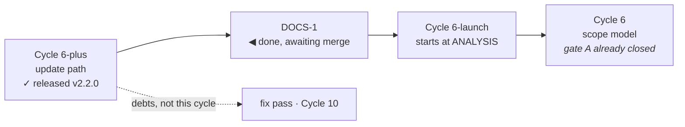

# Handoff — `DOCS-1` done, Cycle 6-launch next

**Ephemeral**, like the five before it: deleted when the next session writes its own.
Nothing is decided here. Everything normative is in
[roadmap.md](roadmap.md), the ADRs, [ux-principles.md](ux/design/ux-principles.md)
and the two rules in `.cco/claude/rules/`.

## Where the project is

**v2.2.0 is released, merged and installed.** `DOCS-1` — the documentation
reorganization onto `core-dev-framework` — is **complete on a branch and not
merged**.

| | |
|---|---|
| branch | `docs/framework/adopt-taxonomy`, **not merged**, off `main` at `0f24363` |
| suite · vet · gofmt · parity gate | green under `-race` (4 m 23 s) · clean · clean · **empty** |
| `tests/test-installer.sh` | 103/103 |
| `./hack/check-docs-links.sh` | green, 52 files |

## What `DOCS-1` changed, in one screen

- `/docs` is now **audience → domain → type**: `users/guides/` and
  `maintainers/{foundation,engine,ux,distribution,process}/`.
- **ADRs are per domain**, plus `foundation/` for the three that sit at project
  level. **One global numbering sequence** — the next is `0017` wherever it lands.
- The roadmap went **1198 → 494 lines**; eleven closed units moved verbatim to
  `roadmap-history.md`, one line each left behind.
- `improvements.md` was 1469 lines and five documents; it is now **the unscheduled
  backlog**, and the five are an analysis plus four review reports in their domains.
- New: [glossary.md](glossary.md), [releasing.md](distribution/guides/releasing.md),
  `scratchpad/README.md`, and `.cco/claude/rules/{project-profile,maintenance}.md`.
- `hack/check-docs-links.sh` is the gate: links, anchors, ADR uniqueness, ADR index
  completeness, and **no document linking into this file**.

## What is open

1. **The merge.** `--no-ff` into `main`, on the Mac — `.cco/` is read-only in a
   normal session, so a merge here fails on any ref touching it. Then the push, and
   the branch cleanup one session later (that is the recorded remote policy, not a
   failure).
2. **`/review-docs` has not run.** This reorganization deliberately moved documents
   without judging whether their *contents* are still true. Several are known to be
   stale in ways nothing here corrected — for example `go-engine.md` advertises a
   ~12 s suite against a measured 4 m 23 s. That review is the natural next step and
   it should run on the new tree.
3. **Two lessons still live only in a handoff** (below). They are durable and are
   candidates for promotion into `.cco/claude/rules/`; that is the maintainer's call.

## Cycle 6-launch — what the next cycle needs, carried forward

The roadmap section is the scope. **Read it before anything else.** The clarification
most likely to be misread:

> «Con "desktop launcher" non intendo che l'icona viva per forza sul Desktop.
> Intendo che l'utente veda ytdl come un'app, quindi icona in Application folder,
> inseribile in dock, Desktop o location arbitraria.»

- **A `.command` file is effectively ruled out** — double-clicking it opens a
  Terminal, the one thing this cycle exists to remove.
- **`/Applications` needs admin, `~/Applications` does not**, and the installer has
  never used `sudo` — that is ADR-0001's whole shape.
- ⚠️ **Gatekeeper is the decisive unknown, and must be verified, not assumed.**
  ADR-0001 rejected `.pkg`/`.dmg`/`.app` because Gatekeeper blocks unsigned
  *downloaded* bundles. The claim this cycle rests on is that a bundle **generated
  on the machine** (`osacompile` at install time) carries no quarantine attribute
  and is a different case. If it holds, ADR-0001 gets an amendment or a successor;
  if not, the cycle's premise is gone and the analysis must say so early.

### Three things Cycle 6-plus changed about this problem

1. **`install.sh` now runs on every UPDATE, not only on first install.** Whatever it
   does to the bundle it does again at every update. Deleting and recreating it would
   churn the Dock entry, the Spotlight index and any alias the user made. "Leave it
   alone when it has not changed" is probably right, and it has to be a decision.
2. **The update replaces `~/.local/bin/ytdl` underneath a running daemon**, and the
   daemon re-execs `os.Executable()`. A launcher that hardcodes anything about the
   binary other than its path goes stale on the first update.
3. **`C2`, ADR-0016's acceptance test, passed with exactly one exception**: the
   update needed no Terminal, but *opening the interface* still did. This cycle is
   that exception.

Two verified facts worth having to hand:

- `ytdl gui` **reuses a daemon that is already listening** and only spawns one when
  nothing is (`cmd/ytdl/main.go`, `guiProbe`) — which partly answers the launcher's
  idempotence question.
- The documented uninstall is three `rm -f` lines in
  [guida-installazione.md](../users/guides/guida-installazione.md) § *Come
  disinstallare*. A launcher adds a fourth, and that file is user-facing Italian.

## Debts carried, and they are NOT the next cycle

The unscheduled ones are in [improvements.md](improvements.md): `V23`, `V19`, `V25`,
`V28` and the seven minors. The Cycle 10 ones — `V26`, `V27`, `V29`, `V22` — are on
the roadmap, because they are that cycle's precondition. **`V27` is a normative
debt, not a preference**, and Cycle 10 does not start without it.

## Two lessons the last cycle paid for, that apply immediately

**1 · The container is not the target platform, and Cycle 6-launch is entirely about
the target platform.** Three times Cycle 6-plus got a truthful answer to the wrong
question: a warm process where the Mac is cold (`V20`), bash 5 where the Mac is 3.2
(`V21`), and — widest — the working tree where the network serves `origin` (`V24`),
which cost three sittings. **Nothing about `osacompile`, Gatekeeper, Launchpad, the
Dock or `~/Applications` can be established here.** Expect to need the Mac earlier
and more often, and write the by-hand checklist as you go, not at gate C.

**2 · A skipped test looks exactly like a passing one.** Twice in gate C a check
"passed" while proving nothing — once because the block never took effect, once
because the installer skipped the step under test. Both ended without errors. Put in
every expectation the line that proves the work was **attempted**, not only the
absence of failure.

## Container gotchas

- git and `go build` want
  `GIT_CONFIG_COUNT=1 GIT_CONFIG_KEY_0=safe.directory GIT_CONFIG_VALUE_0=/workspace/yt-download`
  on **every** invocation. `hack/check-docs-links.sh` carries its own exception and
  needs none.
- No credentials for `origin`: pushes are the maintainer's, from the Mac. `gh` is not
  authenticated here and **not installed on the Mac**.
- `.cco/` is read-only unless the session starts with `--cco-access edit-project`.
  This one did, which is how the profile, the maintenance policy and `CLAUDE.md`
  could be written at all.
- ⚠️ **After any full suite run: `rm -rf /tmp/_MEI*`.** One run leaves ~1657 of them,
  77 GB, and it has taken the container down twice — see
  [`V25`](distribution/reviews/004-cycle6plus-gate-c.md#V25).
- The container **can** build bash 3.2 in two minutes; recipe and its honest limit in
  [review 004 § bash 3.2](distribution/reviews/004-cycle6plus-gate-c.md#bash32).
