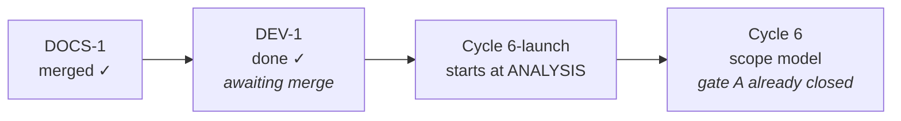

# Handoff — `DEV-1` is done: the suite is safe, and fast

**Ephemeral**, like the seven before it: deleted when the next session writes its own.
Nothing is decided here. Everything normative is in [roadmap.md](roadmap.md),
[ADR-0017](foundation/decisions/0017-dev-container-oracle.md),
[ux-principles.md](ux/design/ux-principles.md) and the rules in `.cco/claude/rules/`.

## ✅ The warning at the top of the last seven handoffs is withdrawn

**`go test -race ./...` is safe to run.** It no longer takes the container down, and
it returns in **8 seconds**. `rm -rf /tmp/_MEI*` is not part of any workflow any
more — there is nothing left to remove, so do not reintroduce it.

If you are reading an older document that says otherwise, that document is stale;
`.cco/claude/CLAUDE.md`, [go-engine.md](engine/design/go-engine.md) and
[improvements.md](improvements.md) were corrected in this session.

## Where the project is



| | |
|---|---|
| branch | `fix/dev1/suite-self-replication`, **not merged**, 3 commits off `main` at `95f124b` |
| `go test -race ./...` | **green, 8 s**, run three times — 14 packages, 0 failures |
| `go vet` · `gofmt -l .` | clean · empty |
| `tests/test-installer.sh` | **103 / 103** |
| parity gate | **empty** — `internal/core` and `internal/daemon` untouched |
| `./hack/check-docs-links.sh` | green, 55 files |
| disk across a full suite run | 8.7 G → 8.7 G, **0** residues, **0** surviving processes |
| working tree | clean |

`DOCS-1` was merged and pushed from the Mac before this session (`95f124b`); its
roadmap block was migrated to the history and its local branch deleted.

## What this session did

**`DEV-1`, opened and closed in a day.** Two causes in series, both fixed:

1. **The multiplier.** `resumeIfStalled` called `daemon.Spawn()` directly — the only
   spawn call site in the tree without the package-var seam the other two have.
   `daemon.spawn` self-exec's `os.Executable()`, which under `go test` **is the test
   binary**, and Go's generated main accepts an unknown positional argument instead
   of rejecting it: the binary ran its whole suite and exited 0. Each run started
   another, detached and released, outliving `go test`, `-test.timeout` and the
   session itself.
2. **The object.** The container's `yt-dlp` was a PyInstaller one-file bundle. It
   unpacks **78 MB** into `$TMPDIR` at *every* invocation under a fresh random name,
   and removes it only on a clean exit — so every probe killed by its timeout leaked
   78 MB that nothing collected.

**The fix for (1)** is two layers: the seam, plus a `TestMain` that refuses
`__daemon` outright. The guard is the backstop for any path the seam does not cover
— and it is also what **measured** `T1`, by recording each refusal, so no session had
to reproduce `V25` in order to confirm `V25`.

**The fix for (2) removes the object rather than relocating it**: the container now
provisions the **zipapp** asset, which never unpacks. 3 MB instead of 38, `--version`
in ~263 ms instead of ~706, and zero residue however it dies. Installed by
replacement, never alongside.

⚠️ **This is the decision that needed you, and you took it** — the container now runs
a *different form* of yt-dlp from every user. The reasoning, the bound, and what
would put it back on the table are in [ADR-0017](foundation/decisions/0017-dev-container-oracle.md) §3.
The installer is untouched: macOS keeps the PyInstaller build, because ADR-0005's
reasons still hold on a non-developer's Mac.

**What fell out of it:** the suite's documented 2 m 24 s – 4 m 26 s, and the near-2×
spread nobody could explain, had *one* cause. The suite was competing with detached
copies of itself while waiting on 30 s timeouts against a process it was killing.

## The next session, in order

### 1 · Merge `fix/dev1/suite-self-replication` into `main`, `--no-ff`, **from the Mac**

`.cco/` is what several of these commits change, and a normal session has it
read-only — a `git merge` here fails on those refs. Then the push.

```
git checkout main && git merge --no-ff fix/dev1/suite-self-replication && git push
```

**No tag, no release, no `CHANGELOG.md` entry.** Nothing user-facing changed: the
`.cco/` work is the development container, and `resumeIfStalled` going through
`spawnQueueDaemon` is behaviour-identical in production, since that var *is*
`daemon.Spawn`.

**No gate C.** It is the maintainer's hands-on verification of the *product* on real
hardware, and this branch ships no product change. The parity gate is empty and the
installer suite is 103/103.

⚠️ **`.cco/setup.sh` takes effect at the next `cco start`**, not on merge. Nothing
needs rebuilding: setup.sh is not baked into the image. The current container's
`~/.local/bin/yt-dlp` was already migrated in-session, and that path is a host mount,
so it persists.

### 2 · Branch cleanup, deferred by one session as always

Delete `fix/dev1/suite-self-replication` locally once it is on the remote — the merge
was its gate ([project-profile.md](../../.cco/claude/rules/project-profile.md) §3).

**Five older merged branches are still lying around** and were left alone deliberately,
since they predate this session: `docs/cycle6/gate-a-rulings`, `docs/release/v2.1.0`,
`docs/roadmap/post-v2.1.0`, `feat/update-path/implementation`,
`feat/ux/cycle5-unified-ux`. All are ancestors of `main`, so `git branch -d` will
take them without argument. Say the word and they go.

### 3 · Then: `Cycle 6-launch`, from its own analysis, in a session of its own

The roadmap section is the scope, and the material carried forward for it is below.

## Tasks

| # | Task | Roadmap entry |
|---|---|---|
| 1 | merge `--no-ff` into `main` from the Mac, then push | `DEV-1` |
| 2 | delete the local branch next session; optionally the five older ones | `DEV-1` |
| 3 | migrate the `DEV-1` block to `roadmap-history.md`, leaving one line | `DEV-1` |
| 4 | start `Cycle 6-launch` at analysis | `Cycle 6-launch` |

Status lives in the roadmap, not here.

## Two entries left open on purpose, and they are decisions

`T3` is marked **dropped** and `T4` **deferred**, both on the roadmap with the reason
written down rather than deleted. Their premise was the cost of exec'ing and killing
a PyInstaller bundle, and the zipapp dissolves it. `T4` keeps an independent merit —
`V28`'s point that an exec on the critical path is authority `installed.conf` could
answer — and that merit is untouched by any of this. **Reopening either is your call,
not a consequence of ADR-0017.**

## Still open, and not for the next session

**Three lessons live only in this file** and are candidates for promotion into
`.cco/claude/rules/`. Promoting a rule is the maintainer's call, so they stay here
until asked. The third one was **paid off** this session and is restated as what it
became:

1. **The container is not the target platform.** Three times Cycle 6-plus got a
   truthful answer to the wrong question: a warm process where the Mac is cold
   (`V20`), bash 5 where the Mac is 3.2 (`V21`), and — widest — the working tree
   where the network serves `origin` (`V24`). ADR-0017 §3 now widens this gap by one
   more axis **knowingly**, which is the difference that matters.
2. **A skipped test looks exactly like a passing one.** Twice in gate C a check
   "passed" while proving nothing. Put in every expectation the line that proves the
   work was **attempted**, not only the absence of failure.
3. **A remedy that requires a working machine is not a remedy** — and the sharper
   form this session earned: *containment beats cleanup, but removing the object
   beats both.* `rm -rf /tmp/_MEI*` was documented in three places and was correct,
   and it was unusable at exactly the moment it was needed. The first two candidate
   fixes on the roadmap would have relocated the 77 GB onto the maintainer's Mac.
   What worked was asking why the bytes existed at all.

## Debts carried, and they are NOT the next cycle

The unscheduled ones are in [improvements.md](improvements.md): `V23`, `V19` and the
seven minors. `V25` and `V28` are **closed** by ADR-0017 — `V25` outright, `V28`'s
disk motive with it, its authority motive surviving as the deferred `T4`. The Cycle 10
ones — `V26`, `V27`, `V29`, `V22` — are on the roadmap, because they are that cycle's
precondition. **`V27` is a normative debt, not a preference**, and Cycle 10 does not
start without it.

## Cycle 6-launch — carried forward, for when it starts

The roadmap section is the scope. The clarification most likely to be misread:

> «Con "desktop launcher" non intendo che l'icona viva per forza sul Desktop.
> Intendo che l'utente veda ytdl come un'app, quindi icona in Application folder,
> inseribile in dock, Desktop o location arbitraria.»

- **A `.command` file is effectively ruled out** — double-clicking it opens a
  Terminal, the one thing this cycle exists to remove.
- **`/Applications` needs admin, `~/Applications` does not**, and the installer has
  never used `sudo` — that is ADR-0001's whole shape.
- ⚠️ **Gatekeeper is the decisive unknown, and must be verified, not assumed.**
  ADR-0001 rejected `.pkg`/`.dmg`/`.app` because Gatekeeper blocks unsigned
  *downloaded* bundles. The claim this cycle rests on is that a bundle **generated on
  the machine** (`osacompile` at install time) carries no quarantine attribute and is
  a different case. If it holds, ADR-0001 gets an amendment or a successor; if not,
  the cycle's premise is gone and the analysis must say so early.

Three things Cycle 6-plus changed about the problem:

1. **`install.sh` now runs on every UPDATE, not only on first install.** Whatever it
   does to the bundle it does again at every update. Deleting and recreating it would
   churn the Dock entry, the Spotlight index and any alias the user made. "Leave it
   alone when it has not changed" is probably right, and it has to be a decision.
2. **The update replaces `~/.local/bin/ytdl` underneath a running daemon**, and the
   daemon re-execs `os.Executable()`. A launcher that hardcodes anything about the
   binary other than its path goes stale on the first update.
3. **`C2`, ADR-0016's acceptance test, passed with exactly one exception**: the
   update needed no Terminal, but *opening the interface* still did. This cycle is
   that exception.

Two verified facts worth having to hand:

- `ytdl gui` **reuses a daemon that is already listening** and only spawns one when
  nothing is (`cmd/ytdl/main.go`, `guiProbe`).
- The documented uninstall is three `rm -f` lines in
  [guida-installazione.md](../users/guides/guida-installazione.md) § *Come
  disinstallare*. A launcher adds a fourth, and that file is user-facing Italian.

## Container gotchas

- git and `go build` want
  `GIT_CONFIG_COUNT=1 GIT_CONFIG_KEY_0=safe.directory GIT_CONFIG_VALUE_0=/workspace/yt-download`
  on **every** invocation. `hack/check-docs-links.sh` carries its own exception.
- No credentials for `origin`: pushes are the maintainer's, from the Mac. `gh` is not
  authenticated here and **not installed on the Mac**.
- `.cco/` is read-only unless the session starts with `--cco-access edit-project`.
  A session that must edit the profile, the maintenance policy or `CLAUDE.md` has to
  ask for it at start; it cannot be raised afterwards. **This session had it**, which
  is why `.cco/setup.sh` and `.cco/claude/CLAUDE.md` could be fixed.
- cco exposes **no tmpfs and no storage quota** in `project.yml` (`docker:` offers
  `image`, `mount_socket`, `ports`, `env`, `network`), and a session is not root, so
  `mount` is refused. A size-capped filesystem for a runaway process is **not**
  available from inside — worth knowing before anyone proposes one again.
- The container **can** build bash 3.2 in two minutes; recipe and its honest limit in
  [review 004 § bash 3.2](distribution/reviews/004-cycle6plus-gate-c.md#bash32).
