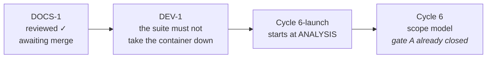

# Handoff — `DOCS-1` reviewed, `DEV-1` opened and urgent

**Ephemeral**, like the six before it: deleted when the next session writes its own.
Nothing is decided here. Everything normative is in [roadmap.md](roadmap.md), the
ADRs, [ux-principles.md](ux/design/ux-principles.md) and the rules in
`.cco/claude/rules/`.

## ⚠️ Read this before running anything

**Do not run `go test -race ./...` until [`DEV-1`](roadmap.md#dev-1) T0 is in.**

That command has now destroyed **four** sessions, the last of them on 2026-08-26 —
a documentation review, killed mid-edit. Once the overlay fills it goes read-only,
and at that point `rm -rf /tmp/_MEI*` **does not work from inside the container**;
the maintainer also could not reach the container's filesystem from the host.
Recovery was rebuilding the image. The old advice — "clean up after the suite" — is
what failed: by the time you want to clean up, you cannot.

Targeted package runs (`go test ./internal/core`, `./internal/config`, …) are fine.
`go build`, `go vet`, `gofmt -l .`, `bash tests/test-installer.sh` and
`./hack/check-docs-links.sh` are all fine and cost nothing.

## Where the project is



| | |
|---|---|
| branch | `docs/framework/adopt-taxonomy`, **not merged**, off `main` at `0f24363` |
| `./hack/check-docs-links.sh` | **green, 53 files** — re-run after every edit of this session |
| `go test -race ./...` | ⚠️ **not run this session, deliberately.** Last green run was 2026-08-26 before D8's edits, which are documentation only |
| `tests/test-installer.sh` · parity gate | not re-run; untouched by this session — no code changed |

`v2.2.0` is released, merged and installed. `DOCS-1` is complete **and now reviewed**;
what remains is its merge.

## What this session did

**D8 — `/review-docs` on the new tree.** Report:
[001-docs1-taxonomy-adoption.md](process/reviews/001-docs1-taxonomy-adoption.md).

The moves were proved verbatim — every renamed file diffed against `main` with link
targets stripped, every split re-extracted from its source range. **The historical
record came through the reorganization intact**, which was its central risk.

Corrected in place, all facts rather than decisions:

1. `go-engine.md` — the suite advertised at ~12 s; it is minutes. Now the measured
   range, 2 m 24 s – 4 m 26 s.
2. **`guida-installazione.md` — the widest, and the only user-facing one.** Step 3
   told a new user to expect **two lines** from `ytdl --version`; the shipped build
   prints **four**. Stale since Cycle 6-plus, and not caused by `DOCS-1` — the file
   moved byte-identical.
3. Three link **labels** naming files that no longer exist.
4. `docs/README.md`'s diagram gave all five domains the same type-folders.
5. The roadmap's D8/D9 status, and a commit count that belongs to `git log`.

Then, after the maintainer approved them:

6. **E1/E2 applied** to `.cco/claude/CLAUDE.md` — `~2-5 min` with `rm -rf /tmp/_MEI*`
   promoted from comment to **command**, and `update` + `buildinfo` added to the
   package list.
7. A same-day inconsistency the review itself had left: `go-engine.md` and
   `improvements.md` gave different figures for the same measurement.
8. The link checker was **red** on the new report — a table illustrating link
   *labels* wrote elided link syntax, which the checker read as real links and could
   not resolve. Rewritten without link syntax; green at 53 files.

**And one finding that is not documentation**, which is why `DEV-1` exists:
[§6 of the report](process/reviews/001-docs1-taxonomy-adoption.md#dev1).

## The next session, in order

### 1 · `D9` — merge `DOCS-1` into `main`, `--no-ff`, **from the Mac**

A normal session has `.cco/` read-only, and `.cco/` is exactly what several of these
commits change — a `git merge` here fails on those refs. Then the push. Branch
cleanup defers by one session: that is the recorded remote policy
([project-profile.md](../../.cco/claude/rules/project-profile.md) §3), not a failure.

No tag, no release: this branch ships no product change, so `CHANGELOG.md` gets
nothing. The two Italian guides moved path but nothing user-facing changed except
the `--version` line count, which is a **correction to the guide**, not to the
product.

Merge before starting `DEV-1`, so `DEV-1` branches off a `main` that already has the
roadmap entry describing it.

### 2 · `DEV-1` — start at analysis

Scope, entries and the open question: [roadmap.md § `DEV-1`](roadmap.md#dev-1). It
absorbs `V25` and `V28`, which review 004 established are one cause and one fix.

**T0 first and on its own** — containment, so the rest can be worked on safely at
all. Then **T1**, the one command that confirms or kills the multiplier hypothesis:

```bash
go test -race -count=1 ./cmd/ytdl/ ; pgrep -af 'ytdl.test'
```

Processes surviving the suite confirm it. Run it **only behind T0**.

The maintainer asked for a designed mechanism, not the first patch that stops the
bleeding, and `Design × Feature` is `U` in the profile — so T2 is a design with a
gate B before any of T3–T5 is written.

⚠️ **The entries in the roadmap are the problem decomposed, not an approved
solution.** The levers named there are candidates for the design to weigh.

### Then: back to the roadmap

`Cycle 6-launch` starts at its own analysis, in a session of its own.

## Tasks

| # | Task | Roadmap entry |
|---|---|---|
| 1 | merge `--no-ff` into `main` from the Mac, then push | `DOCS-1` D9 |
| 2 | delete the local branch next session (remote policy defers it by one) | `DOCS-1` D9 |
| 3 | containment, shipped on its own before anything else | `DEV-1` T0 |
| 4 | run the one command; record what it returned either way | `DEV-1` T1 |
| 5 | design the mechanism; gate B before T3–T5 | `DEV-1` T2 |

Status lives in the roadmap, not here.

## Still open, and not for the next session

**Three lessons live only in this file** and are candidates for promotion into
`.cco/claude/rules/`. Promoting a rule is the maintainer's call, so they stay here
until asked:

1. **The container is not the target platform.** Three times Cycle 6-plus got a
   truthful answer to the wrong question: a warm process where the Mac is cold
   (`V20`), bash 5 where the Mac is 3.2 (`V21`), and — widest — the working tree
   where the network serves `origin` (`V24`).
2. **A skipped test looks exactly like a passing one.** Twice in gate C a check
   "passed" while proving nothing. Put in every expectation the line that proves the
   work was **attempted**, not only the absence of failure.
3. **New, 2026-08-26 — a remedy that requires a working machine is not a remedy.**
   `rm -rf /tmp/_MEI*` was documented in three places and was correct; it was
   unusable at exactly the moment it was needed, because the failure it treats is
   what disables it. `DEV-1` T0 exists because containment beats cleanup.

## Debts carried, and they are NOT the next cycle

The unscheduled ones are in [improvements.md](improvements.md): `V23`, `V19` and the
seven minors. `V25` and `V28` **left that list** on being scheduled as `DEV-1`. The
Cycle 10 ones — `V26`, `V27`, `V29`, `V22` — are on the roadmap, because they are
that cycle's precondition. **`V27` is a normative debt, not a preference**, and
Cycle 10 does not start without it.

## Cycle 6-launch — carried forward, for when it starts

The roadmap section is the scope. The clarification most likely to be misread:

> «Con "desktop launcher" non intendo che l'icona viva per forza sul Desktop.
> Intendo che l'utente veda ytdl come un'app, quindi icona in Application folder,
> inseribile in dock, Desktop o location arbitraria.»

- **A `.command` file is effectively ruled out** — double-clicking it opens a
  Terminal, the one thing this cycle exists to remove.
- **`/Applications` needs admin, `~/Applications` does not**, and the installer has
  never used `sudo` — that is ADR-0001's whole shape.
- ⚠️ **Gatekeeper is the decisive unknown, and must be verified, not assumed.**
  ADR-0001 rejected `.pkg`/`.dmg`/`.app` because Gatekeeper blocks unsigned
  *downloaded* bundles. The claim this cycle rests on is that a bundle **generated on
  the machine** (`osacompile` at install time) carries no quarantine attribute and is
  a different case. If it holds, ADR-0001 gets an amendment or a successor; if not,
  the cycle's premise is gone and the analysis must say so early.

Three things Cycle 6-plus changed about the problem:

1. **`install.sh` now runs on every UPDATE, not only on first install.** Whatever it
   does to the bundle it does again at every update. Deleting and recreating it would
   churn the Dock entry, the Spotlight index and any alias the user made. "Leave it
   alone when it has not changed" is probably right, and it has to be a decision.
2. **The update replaces `~/.local/bin/ytdl` underneath a running daemon**, and the
   daemon re-execs `os.Executable()`. A launcher that hardcodes anything about the
   binary other than its path goes stale on the first update.
3. **`C2`, ADR-0016's acceptance test, passed with exactly one exception**: the
   update needed no Terminal, but *opening the interface* still did. This cycle is
   that exception.

Two verified facts worth having to hand:

- `ytdl gui` **reuses a daemon that is already listening** and only spawns one when
  nothing is (`cmd/ytdl/main.go`, `guiProbe`).
- The documented uninstall is three `rm -f` lines in
  [guida-installazione.md](../users/guides/guida-installazione.md) § *Come
  disinstallare*. A launcher adds a fourth, and that file is user-facing Italian.

## Container gotchas

- git and `go build` want
  `GIT_CONFIG_COUNT=1 GIT_CONFIG_KEY_0=safe.directory GIT_CONFIG_VALUE_0=/workspace/yt-download`
  on **every** invocation. `hack/check-docs-links.sh` carries its own exception.
- No credentials for `origin`: pushes are the maintainer's, from the Mac. `gh` is not
  authenticated here and **not installed on the Mac**.
- `.cco/` is read-only unless the session starts with `--cco-access edit-project`.
  A session that must edit the profile, the maintenance policy or `CLAUDE.md` has to
  ask for it at start; it cannot be raised afterwards.
- ⚠️ **The disk: see the top of this file.** It is no longer a gotcha, it is `DEV-1`.
- The container **can** build bash 3.2 in two minutes; recipe and its honest limit in
  [review 004 § bash 3.2](distribution/reviews/004-cycle6plus-gate-c.md#bash32).
