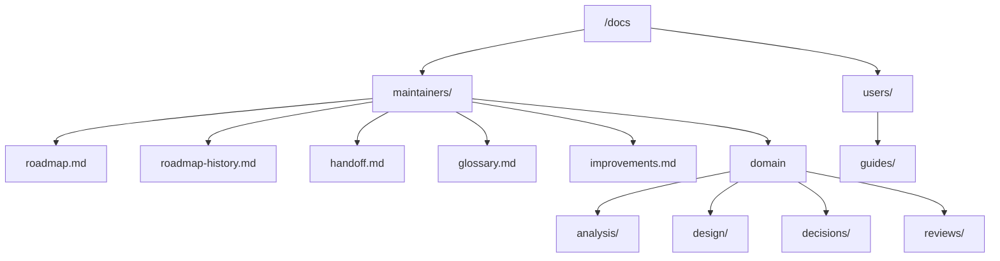

# Code analysis — the documentation estate measured against `core-dev-framework`

**Kind:** code analysis (solution-aware: it inventories what exists and measures it
against a normative contract). **Written:** 2026-08-26. **Status:** draft, awaiting
gate A.

**Scope.** Every document under `/docs`, plus the repo-root documents that the pack
also governs (`README.md`, `CHANGELOG.md`, `.gitignore`) and the configuration files
that point at them. **Not** in scope: the content of any document — this analysis
measures placement, container and completeness, never whether a claim inside a
document is still true (that is `/review-docs`).

**Why now.** The `core-dev-framework` pack was activated for this project
(`.cco/project.yml`, uncommitted). It ships a normative documentation taxonomy that
the repo predates and does not follow. Before any further cycle work, the estate is
brought into conformance — the maintainer's instruction of 2026-08-26.

## 1. Verified state

Measured, not assumed:

| Fact | Value |
|---|---|
| Branch | `main`, at `0f24363`, tracking `origin/main` |
| Release | `v2.2.0` tagged; Cycle 6-plus closed |
| Working tree | two uncommitted files, both `.cco/` (Dockerfile comment, pack activation) |
| Next planned work | Cycle 6-launch, at **analysis** — no design exists |
| `/docs` | 34 files, 11 170 lines, one flat level plus `decisions/` |
| Repo-level `.claude/` | **does not exist** |
| `/workspace/.claude` (pack + rules) | mounted **read-only** |
| `<repo>/.cco/` (incl. `claude/CLAUDE.md`) | tracked in git, mounted **read-only** |

## 2. What the pack prescribes

Three documents carry the contract: `knowledge/docs-organization.md` (the shape),
`rules/documentation.md` (what is enforced), `knowledge/recursive-scope-model.md`
(how much ceremony a scope earns). In summary:

- **Two axes, fixed order:** audience → domain → document type as the leaf.
- **Types:** `analysis/` `design/` `decisions/` `reviews/` `guides/`. `decisions/`
  holds ADRs **and nothing else**; review reports live in their domain's `reviews/`.
- **Cross-cutting, at the top of `maintainers/`:** `roadmap.md` (living SSOT),
  `roadmap-history.md` (historical, append-only), `handoff.md` (ephemeral),
  the glossary, and `improvements.md` where the project opts in.
- **Two compression rules for the roadmap:** open units at the top, a closed one is
  **one line**; an entry needing more than one line gets a document instead.
- **An analysis is named for its kind** — `requirements-` `code-` `tech-choice-`
  `performance-` — because the kind fixes its content contract.
- **Historical documents are immutable in what they assert**, not in their bytes: a
  move changes container, never content.
- **Two templates are instantiated per project**: the project profile and the
  maintenance policy. Neither exists here.

## 3. Inventory — all 35 documents, classified

Nature per the pack: **L** living · **H** historical · **E** ephemeral.

### 3.1 User-facing (Italian, by audience)

| File | Nature | Observation |
|---|---|---|
| `guida-installazione.md` | L | correct content, wrong container — no `users/` axis exists |
| `guida-uso.md` | L | idem |

### 3.2 Engine and parity

| File | Nature | Observation |
|---|---|---|
| `go-engine.md` | L | as-built engine design; the domain's central design document |
| `go-port-parity-contract.md` | L | the parity contract the golden tests enforce — still binding |
| `architecture.md` | H | as-built of the **Bash** script at `46421ba`; frozen reference |
| `golden-test-design.md` | H | already carries its own "superseded by" banner |
| `design-cycle1-core.md` | H | approved at gate B, Cycle 1 — a point-in-time approval |
| `design-cycle1-remaining.md` | H | idem |

### 3.3 User surface (GUI + CLI)

| File | Nature | Observation |
|---|---|---|
| `ux-principles.md` | L | **normative** for both channels; outlives every cycle |
| `cli-reference.md` | L | maintainer reference for the CLI surface |
| `design-cycle5-ux.md` | H | approved at gate B, Cycle 5 |

### 3.4 Distribution and the update path

| File | Nature | Observation |
|---|---|---|
| `distribution.md` | L | constraints and design for shipping to non-developers |
| `design-cycle6plus-update.md` | H | approved at gate B, Cycle 6-plus |

### 3.5 Cross-cutting

| File | Nature | Observation |
|---|---|---|
| `roadmap.md` | L | 1197 lines — see §4.1 |
| `improvements.md` | mixed | 1466 lines, **five documents in one** — see §4.2 |
| `handoff-cycle6launch.md` | E | correct nature, but **linked to** — see §4.3 |
| `dev-testing.md` | L | maintainer guide, explicitly "not transient" |
| `README.md` (of `/docs`) | L | index; **stale** — see §4.4 |
| `decisions/0001`–`0016` | H | 16 ADRs, one global numbering sequence |

Every file in `/docs` is accounted for above: 2 + 6 + 3 + 2 + 5 + 16 = **34**, the
whole estate. This analysis is the 35th, and the first written in the new shape.

## 4. The five findings

### 4.1 The roadmap holds ~700 lines of closed work

Measured section by section. Closed material still occupying the living SSOT:

| Block | Lines |
|---|---|
| Phase 0 · Phase 1 (+ 1.11) · Phase 3 · Phase 4 | 134 |
| Cycle 1 · 2 · 3 · 4 · 5 · 5-closing | 288 |
| **Cycle 6-plus** (closed, released) | **280** |
| Total closed | **~702 of 1197** |

The pack's remedy is exact: each closed unit moves **whole and verbatim** to
`roadmap-history.md`, leaving **one line** — title, outcome, date, link. The roadmap
lands at roughly 250 lines, and the open units reach the top where they are readable.

Two further blocks are not roadmap content at all: *Lesson learned — the raw CDN
cache* (10 lines) and *Lesson learned — the release workflow must reach the default
branch first* (13 lines). Both are operational knowledge about releasing, and both
cost real time when they were learned. They belong in a maintainer guide, not in a
status document.

⚠️ The pack warns that the migration trigger — "the branch appears among the merged"
— **can never fire again once the branch is deleted**. Six merged cycles are already
past that point, so this migration is done by hand, from the roadmap's own text, and
this is the last moment it is cheap.

### 4.2 `improvements.md` is five documents in one container

It is 1466 lines and holds, in order:

| Lines | Content | What it actually is |
|---|---|---|
| 1–164 | initial findings `C`/`U`/`M`/`E` | a **code + requirements analysis**, 2026-07-21 |
| 165–322 | Cycle 5 gate-C findings `G1`–`G26` | a **review report** |
| 323–402 | Cycle 6-plus review findings `V1`–`V9` | a **review report** |
| 403–516 | fix-session second pass `V10`–`V18` | a **review report** |
| 517–578 | documentation phase, `V19` | a **review report** |
| 579–1465 | gate-C by hand `V20`–`V29` + outcome | a **review report** (887 lines) |

The pack reserves `improvements.md` for one thing: **what is known, worth doing, and
not scheduled**. Everything above is either an analysis or a review report, each of
which has its own container and its own nature. The genuine backlog — `V26`, `V27`,
`V29` deferred to Cycle 10, the seven minors deferred in the fix pass — is currently
buried inside 1400 lines of review narrative and is, in practice, unreadable.

This is the largest single win of the reorganization, and the one that most changes
what a future session can find.

### 4.3 The handoff is linked *to*, which the pack forbids

`roadmap.md:735` links to `handoff-cycle6launch.md`. The handoff is deleted when the
cycle closes, so that link is a guaranteed future dangle. The invariant is
one-directional: the handoff links **out** to the durable documents, never the
reverse.

Its name is also right for the wrong reason — the pack's `handoff-<line>.md` form is
for **parallel lines of work**, and this project has one line. The plain
`handoff.md` is the correct name here.

### 4.4 `docs/README.md` is stale in three ways

- Its ADR table stops at **0014**; `0015` and `0016` exist.
- It does not list `dev-testing.md`, `design-cycle6plus-update.md`, or the handoff.
- It describes a flat tree, which is the tree this analysis proposes to replace.

It is not a small edit: after the move it is the index of the new shape, and it is
the first thing a new session reads.

### 4.5 Four required artifacts do not exist

| Missing | Required by | Why it matters here |
|---|---|---|
| `roadmap-history.md` | pack, once a cycle closes | six closed cycles overdue |
| glossary | `rules/documentation.md`, *Ubiquitous language* | this project runs on shared terms — *parity gate*, *gate A/B/C*, *spool*, *log store*, *record id*, *scope*, *attested*, *marker*, *partial outcome* — none of them defined in one place |
| `.claude/rules/project-profile.md` | pack template, once at adoption | autonomy, branch strategy, remote policy, changelog — currently all implicit |
| `.claude/rules/maintenance.md` | pack template, per project | the project acquired its **first non-maintainer user** on 2026-08-12; the phase changed and nothing recorded it |

Two more are proposed rather than required, because both encode knowledge the project
has already paid for:

- **a release guide** — the tag/workflow/verify sequence plus the two lessons
  learned, which currently live in the roadmap and in consumed handoffs;
- **a link checker** (`hack/check-docs-links.sh`) — see §5.

## 5. Mechanical constraints and risk

**321 relative links** resolve inside `/docs`; **19** more point into it from
`README.md` and `CHANGELOG.md`, and `install.sh` names four paths in comments. Every one of them breaks on a move. The
risk is not that a link breaks loudly — it is that it breaks **silently**, and a
future session follows a dead path or, worse, silently loses a document nobody
notices is unreachable.

The mitigation is a self-verification, which `rules/testing.md` requires of every
piece of work: a script that resolves every relative markdown link in the repo and
exits non-zero on a dangling target. It is written **before** the move, run on the
current tree to establish a green baseline, and run again after each step.

**A move must be provably verbatim.** For every historical document — and especially
for the five extracted from `improvements.md` — the check is mechanical: concatenate
the extracted bodies and diff against the source range. A move that rewrites is a
rewrite, and the pack forbids it.

⚠️ **One change cannot be made from inside this session.** `.cco/claude/CLAUDE.md` is
tracked in the repo but mounted **read-only**; its table *"Where to look before
starting anything"* names `docs/roadmap.md`, `docs/improvements.md`,
`docs/ux-principles.md` and `docs/go-engine.md`, and all four paths change. Leaving
it stale would point every future session at paths that no longer exist. It is a
**host step**, and it is a precondition of considering this work done — not a
follow-up.

## 6. Open decisions — gate A

None of these has been decided before; per the golden rule they are the maintainer's.

| # | Decision | Options | Recommendation |
|---|---|---|---|
| D1 | Where ADRs live | (a) per-domain `decisions/`, strict pack shape (b) one central `maintainers/decisions/` | **(b)** — one global numbering sequence is one domain; several ADRs (0005, 0016) span domains, and (a) would break 12 `CHANGELOG.md` links for no gain in findability |
| D2 | The domain set | `engine` · `ux` · `distribution` · `process`, with queue/daemon inside `engine` | as listed — four domains for 34 documents; a fifth for queue/daemon would hold design documents it does not have |
| D3 | The scratchpad | (a) rename `tmp/` to `scratchpad/` (b) keep `tmp/`, declare it | **(b)** — the pack explicitly allows an existing `tmp/`; it holds the maintainer's files and the pack forbids the agent reorganizing them. Change only `.gitignore` (`tmp/*`) and commit a `tmp/README.md`, so the convention survives a clean clone |
| D4 | Renaming | (a) rename everything to pack conventions (b) rename only where a contract requires it | **(b)** — only the analyses take a kind prefix and a date, because the kind fixes their content contract. `go-engine.md`, `ux-principles.md`, `cli-reference.md` keep their names |
| D5 | Autonomy preset | `assistito` (pack default) · `delegato` | **the maintainer's alone.** Current practice reads as `assistito` with every gate held |
| D6 | Remote policy — push after merge | `ask` · `autonomous` · `never — host step` | **`never — host step`**: `gh` is not authenticated in the container and pushes have always been the maintainer's. Recording it stops each cycle rediscovering it |
| D7 | Project phase (maintenance policy) | `production-with-users` · other | **`production-with-users`** — there has been a real non-maintainer user since 2026-08-12, and the update path ships to them |

## 7. What the design phase must produce

Not implementation — the design document that gate B approves:

1. **A complete mapping table**, one row per source file (and per extracted section):
   source path → destination path → nature → verbatim / rewritten.
2. **The link-rewrite plan**, and the checker's contract before it is written.
3. **The staging**, so each commit leaves the tree working: checker first → tree and
   moves → link rewrite → roadmap/history split → `improvements.md` split → new
   documents → indexes → the host step.
4. **The content contract of each new document** — glossary, release guide, profile,
   maintenance policy — since three of the four are declarations, not descriptions.

## 8. Explicitly out of scope

- Whether any statement inside a document is still accurate. That is `/review-docs`,
  and it should run **after** this work, on the new tree.
- Cycle 6-launch, which resumes at its own analysis once this is merged.
- The content of the `.cco` pack itself, which is read-only here and not this
  project's to change.
