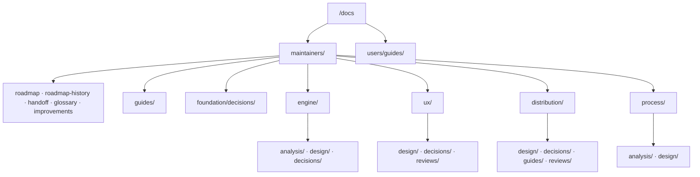

# Design — bringing `/docs` onto the `core-dev-framework` taxonomy

**Status:** awaiting gate B. **Written:** 2026-08-26.
**Derives from:** [the estate analysis](../analysis/2026-08-26-code-docs-estate-vs-pack.md),
approved at gate A on 2026-08-26.

**Analysis waived?** No. The analysis phase ran and its artifact is on disk. What is
*not* derived from a requirements analysis is the *content* of the four new
documents — they are declarations of policy, not descriptions of a system, and §5
gives each one a content contract instead.

## 1. The rulings this design implements

Settled at gate A; not reopened here.

| # | Ruling |
|---|---|
| D1 | ADRs go **per domain**, plus `maintainers/foundation/decisions/` for the ones that sit at project level or genuinely span domains — §4 |
| D2 | Four domains: `engine` · `ux` · `distribution` · `process`, plus `foundation`. Queue/daemon live inside `engine` |
| D3 | `tmp/` is **renamed** `scratchpad/` (maintainer's instruction of 2026-08-26, which overrides the pack's "never reorganize"), `.gitignore` becomes `scratchpad/*`, with a committed `scratchpad/README.md` |
| D4 | Rename only where a contract requires it: analyses take a **kind prefix and a date**. `go-engine.md`, `ux-principles.md`, `cli-reference.md` keep their names |
| D5 | Autonomy preset **`delegato`** — §5.3 |
| D6 | Push after merge: **`never — host step`** |
| D7 | Project phase: **`production-with-users`** |

## 2. The target tree

A domain gets a type folder only when it has a document to put in it — the pack's
"don't pre-create what nobody reads yet", applied to the leaf as well as the axis.

## 3. The complete mapping

**Verbatim** = the bytes of the body do not change; a provenance banner may be
**added** above them (an addition that leaves the original readable — permitted for a
historical document, required for one extracted from a larger file).

### 3.1 Moves — content untouched

| Source | Destination | Nature | Change |
|---|---|---|---|
| `guida-installazione.md` | `users/guides/guida-installazione.md` | L | verbatim + links |
| `guida-uso.md` | `users/guides/guida-uso.md` | L | verbatim + links |
| `go-engine.md` | `maintainers/engine/design/go-engine.md` | L | verbatim + links |
| `go-port-parity-contract.md` | `maintainers/engine/design/go-port-parity-contract.md` | L | verbatim + links |
| `design-cycle1-core.md` | `maintainers/engine/design/cycle1-core.md` | H | verbatim + links |
| `design-cycle1-remaining.md` | `maintainers/engine/design/cycle1-remaining.md` | H | verbatim + links |
| `architecture.md` | `maintainers/engine/analysis/2026-07-21-code-bash-as-built.md` | H | verbatim + links |
| `golden-test-design.md` | `maintainers/engine/analysis/2026-07-22-tech-choice-golden-tests.md` | H | verbatim + links |
| `ux-principles.md` | `maintainers/ux/design/ux-principles.md` | L | verbatim + links |
| `cli-reference.md` | `maintainers/ux/design/cli-reference.md` | L | verbatim + links |
| `design-cycle5-ux.md` | `maintainers/ux/design/cycle5-ux.md` | H | verbatim + links |
| `distribution.md` | `maintainers/distribution/design/distribution.md` | L | verbatim + links |
| `design-cycle6plus-update.md` | `maintainers/distribution/design/cycle6plus-update.md` | H | verbatim + links |
| `dev-testing.md` | `maintainers/guides/dev-testing.md` | L | verbatim + links |
| `handoff-cycle6launch.md` | `maintainers/handoff.md` | E | verbatim + links |
| `decisions/00NN-*.md` ×16 | per §4 | H | verbatim + links |

The `design-` prefix is dropped where the file now sits inside a `design/` folder: it
restated its container. `go-port-parity-contract.md` keeps its name — it is
distinctive and is cited by name in code comments.

### 3.2 Splits — one container becomes several

`improvements.md`, by the boundaries measured in the analysis §4.2:

| Source lines | Destination | Nature |
|---|---|---|
| 1–164 | `maintainers/engine/analysis/2026-07-21-code-initial-findings.md` | H |
| 165–322 | `maintainers/ux/reviews/001-cycle5-gate-c.md` | H |
| 323–402 | `maintainers/distribution/reviews/001-cycle6plus-implementation.md` | H |
| 403–516 | `maintainers/distribution/reviews/002-cycle6plus-fix-session.md` | H |
| 517–578 | `maintainers/distribution/reviews/003-cycle6plus-documentation.md` | H |
| 579–1465 | `maintainers/distribution/reviews/004-cycle6plus-gate-c.md` | H |
| — | `maintainers/improvements.md` | **L, rewritten** — see §5.5 |

The 1–164 block carries both the `C`/`U`/`M` findings (a code analysis) and the
`E1`/`E2` requested evolutions (requirements). It moves **whole**: splitting a
register that was written as one is editing a historical document, which the pack
forbids. Its banner names both kinds so they are not conflated.

Review reports are numbered **per domain**, as in the pack's own example — not on one
global sequence. The sequence records the order reviews happened in that domain.

`roadmap.md`, by the section sizes measured in the analysis §4.1:

| Block | Destination |
|---|---|
| Phases 0, 1 (+1.11), 3, 4 · Cycles 1, 2, 3, 4, 5, 5-closing, 6-plus | `maintainers/roadmap-history.md`, **whole and verbatim**, one block each |
| one line per closed unit — title, outcome, date, link | stays in `maintainers/roadmap.md` |
| *Lesson learned — the raw CDN cache* · *Lesson learned — the release workflow* | `maintainers/distribution/guides/releasing.md` — §5.2 |
| everything else | `maintainers/roadmap.md` |

⚠️ **The link at `roadmap.md:735` to the handoff is deleted, not repointed.** The
invariant is directional: the handoff links out, nothing links in. The two sentences
around it are rewritten to name the *cycle*, not the file.

### 3.3 Rewritten in full

| File | Why |
|---|---|
| `docs/README.md` | it is the index of a tree that no longer exists — analysis §4.4 |
| `maintainers/improvements.md` | it becomes what the pack reserves the name for — §5.5 |

## 4. Where each ADR lands

Numbering stays **one global sequence**: the next ADR is `0017` wherever it lands.
The checker enforces uniqueness across domains — §6.

| Domain | ADRs | Why this domain |
|---|---|---|
| `foundation/decisions/` | **0002** licence · **0003** Go engine · **0005** macOS floor + single engine | project-level constraints everything below inherits; none of them is *about* a module |
| `engine/decisions/` | **0004** package layout · **0006** logs/breadcrumbs/notifications · **0007** queue + daemon · **0008** daemon lifecycle · **0011** cancel/retry/timeout | the runtime and its subsystems |
| `ux/decisions/` | **0009** CLI UX · **0010** web GUI · **0012** titles/disambiguation · **0013** unified UX · **0014** scope + partial outcome · **0015** tab scope + faithful reruns | the user-facing surface, both channels |
| `distribution/decisions/` | **0001** curl installer · **0016** update path | how the product reaches a machine and stays current |

**`foundation/` holds three, not sixteen — and that is the point.** A `foundation/`
that received every pre-existing ADR would not mean "foundational", it would mean
"the ones we had before": a name asserting something its contents do not support,
which is the failure this project's own rule 5 forbids for a user surface and which
is no better in a docs tree. The sort costs nothing extra here because the link
rewrite of §6 touches all 321 links regardless; deferring it buys a second rewrite
pass later, over a larger set.

Two assignments are judgment calls worth naming, so a later reader can disagree with
the reasoning rather than guess at it:

- **0003 (Go engine) → `foundation`, not `engine`.** It chose the language of the
  whole product; `engine/` holds decisions taken *inside* that choice.
- **0010 (web GUI) → `ux`, not `foundation`.** Its mechanism is partly architectural
  (single binary, SSE, authenticated local API), but the domain it describes is the
  GUI, and that is where someone asking "why does the GUI work this way" will look.

## 5. The new documents and their content contracts

### 5.1 `maintainers/glossary.md` — living

One entry per term: the term, one sentence of meaning, and **where it is
authoritative**. Seeded from the vocabulary already load-bearing in this repo, each
entry pointing at the document that owns it: *parity gate* · *gate A / B / C* ·
*cycle* · *spool* · *log store* · *record id* · *breadcrumb* · *scope* (session · tab
· download) · *partial outcome* · *preset* · *marker* · *attested / unattested* ·
*verdict* · `deps.conf` · *front-end* · *golden* · *handoff*.

It defines terms, it does not re-explain mechanisms: an entry that grows past one
sentence has a document, and the entry links to it.

### 5.2 `maintainers/distribution/guides/releasing.md` — living

The release sequence, end to end, for a maintainer on a Mac: version choice,
changelog assembly from the conventional commits, the tag, the workflow, the
hardware verification, the re-install. It absorbs the two *Lesson learned* blocks
now in the roadmap, each of which records a failure that actually happened:

- the raw CDN cache;
- ⚠️ **the release workflow must reach the default branch first** — the trigger fires
  on the default branch, so a tag pushed from a branch that has not been merged
  produces no release.

This is the document whose absence cost time twice.

### 5.3 `.cco/claude/rules/project-profile.md` — living, **needs the elevated session**

Instantiated from the pack template. Recorded values:

| Section | Value |
|---|---|
| Autonomy preset | **`delegato`** (D5) |
| Branch strategy | integration `main`, protected; `feat/<scope>/<desc>` · `fix/<scope>/<desc>` |
| Push after merge | **`never — host step`** (D6) — `gh` is not authenticated in the container |
| Force-push | **denied**, in every permission mode |
| Remote branch deletion | never automatic |
| PRs | not required |
| Changelog | **yes**, `CHANGELOG.md` at the repo root, assembled at the release |
| Permission modes / execution gates | `none` — the enforcement template is not adopted |

Two things the profile must state honestly, or `delegato` promises what this project
does not deliver:

1. **`Design × Feature` cannot take `O` here today.** The pack allows it only when
   the criteria are on disk **and solution-free**. This project's analyses are code
   and tech-choice analyses, not requirements analyses; the precondition does not
   hold, so that cell stays `U` until a cycle produces a solution-free requirements
   artifact.
2. **`Impl + Test × Feature` takes `O`, and the oracle is unusually strong**:
   `go test -race ./...`, `go vet`, `gofmt -l` empty, `tests/test-installer.sh`
   103/103, and the **parity gate** (`git diff main -- internal/core/
   internal/daemon/` must be empty). The precondition — criteria frozen first, from
   the design — is the project's existing practice.

⚠️ And the measurement loop the pack asks for has data already, so it is recorded
rather than invented: **Cycle 6-plus's gate C, by hand, returned ten findings, three
blocking, after a green suite** — `V20` (a slow `yt-dlp` silently disabling half the
update path) and `V24` (the branch never pushed, so no fix was ever under test) are
both outside what any oracle here can see. The profile records that hands-on gate C
at publication is **not** a cell the oracle replaces.

### 5.4 `.cco/claude/rules/maintenance.md` — living, **needs the elevated session**

Instantiated from the pack template, every `EXAMPLE` block removed:

1. **Phase:** `production-with-users` (D7) — a real non-maintainer user since
   2026-08-12, reached by the update path. Implication: a breaking change to the
   installed surface is expensive; stability wins over velocity.
2. **Breaking changes:** SemVer, already in force (`v2.0.0` → `v2.2.0`). What may not
   break without a major: the installed CLI surface, the config file keys, the
   history record format (which is `omitempty` and never migrated), and the
   `~/.local/bin` install location.
3. **Legacy code:** the Bash `ytdl` is frozen-and-isolated as the **golden parity
   reference** — it is not maintained, and it may not be deleted, because
   `internal/core`'s goldens are measured against it.
4. **Documentation archival:** a superseded design doc gets a one-line banner naming
   its successor and moves to `<domain>/design/archive/`. No `archive/` folder is
   created now — nothing is formally superseded yet (YAGNI).
5. **Refactoring triggers:** the same defect fixed in two places; a surface that
   states something untrue (`ux-principles.md`); a module blocking two or more
   pending cycles.
6. **Cadence:** `review-implementation` at the end of each cycle's implementation ·
   `review-docs` after it · `review-refactoring` before each release · roadmap
   reviewed at every `/plan` and `/handoff`.

### 5.5 `maintainers/improvements.md` — living, rewritten

Only what is **known, worth doing, and not scheduled**. One line per entry, each
linking into the review report that carries its analysis: `V26`, `V27`, `V29` and the
seven minors deferred with a reason in the fix pass, plus any `G` finding not yet
claimed by a cycle. An entry here is not a task: nothing is scheduled on it, and when
it is picked up it becomes an ordinary roadmap entry and leaves the list.

### 5.6 `scratchpad/README.md` — committed, the directory ignored

`.gitignore` changes from `tmp` / `tmp/` to `scratchpad/*` with `!scratchpad/README.md`,
so the convention survives a clean clone instead of vanishing with the directory. The
README states whose the place is: the human's, read by the agent always, written by
it only on request, and **never** reorganized by it — with the confidentiality
direction spelled out, content comes in freely and goes out only laundered.

The two files already in `tmp/` move with the rename and are not read, edited, or
tidied.

### 5.7 `docs/README.md` — living, rewritten

The index of the tree in §2: the two audiences, the five domains, the cross-cutting
documents, and the reading order. Its ADR table is regenerated from the filesystem so
it cannot stop at `0014` again.

## 6. The link checker — `hack/check-docs-links.sh`

The self-verification `rules/testing.md` requires. Written **first**, and green on the
current tree before anything moves — a checker whose baseline was never green proves
nothing.

**Contract:**

| | |
|---|---|
| Input | every `*.md` tracked in the repo |
| Checks | (1) every relative link target resolves to an existing file; (2) every `#anchor` on a local target matches a heading in it; (3) ADR numbers are unique across all `decisions/` folders; (4) no living or historical document links to `handoff.md` |
| Ignores | external `http(s)://` links — this is a structural check, not a network one |
| Output | one line per failure: `file:line → target (reason)` |
| Exit | `0` clean, `1` on any failure |

Checks 3 and 4 are not link checks; they are the two invariants this reorganization
introduces that nothing else would catch, and they cost a dozen lines each. It is
added to the repo's own verification set, beside `tests/test-installer.sh`.

## 7. Proving the moves are verbatim

For every historical document, and for each of the six blocks extracted from
`improvements.md` and the eleven from `roadmap.md`:

1. extract the block by its measured line range into the destination;
2. concatenate the destinations **in source order**, strip the added banners, and
   `diff` against the source range;
3. the diff must be **empty**. A non-empty diff is a rewrite, and it stops the step.

Link rewriting is applied **after** that proof, as a separate commit, so the verbatim
check is never run against text a link rewrite has already touched.

## 8. Staging — the commits

Each leaves the tree working and the checker green.

| # | Commit | Content |
|---|---|---|
| 1 | `chore(docs): add a structural link checker` | §6, green on the current flat tree |
| 2 | `docs: move the user guides under users/` | 2 files |
| 3 | `docs: move the engine documents under maintainers/engine/` | 6 files + ADRs 0004/0006/0007/0008/0011 |
| 4 | `docs: move the surface documents under maintainers/ux/` | 3 files + 6 ADRs |
| 5 | `docs: move the distribution documents under maintainers/distribution/` | 2 files + 2 ADRs |
| 6 | `docs: move the project-level ADRs under maintainers/foundation/` | 3 ADRs |
| 7 | `docs: rewrite every internal link for the new tree` | 321 + 19 links; checker green |
| 8 | `docs: split the closed cycles into roadmap-history.md` | roadmap 1197 → ~250 |
| 9 | `docs: split improvements.md into its review reports` | 6 destinations |
| 10 | `docs: rewrite improvements.md as the unscheduled backlog` | §5.5 |
| 11 | `docs: add the glossary` | §5.1 |
| 12 | `docs: add the release guide` | §5.2 |
| 13 | `docs: rename tmp/ to scratchpad/ and declare it` | §5.6 |
| 14 | `docs: rewrite the documentation index` | §5.7 |
| 15 | `chore(cco): record the project profile and the maintenance policy` | §5.3, §5.4 — **elevated session** |
| 16 | `chore(cco): repoint the project instructions at the new tree` | **elevated session** |

Commits 2–6 leave links dangling on purpose; commit 7 repairs them in one pass. The
checker is therefore expected **red** between 2 and 7 and green at 1 and from 7 on —
stated here so a red run in that window is not mistaken for a defect.

Branch: `docs/framework/adopt-taxonomy`, off `main`. Merged `--no-ff` after
`/review-docs`, which runs on the new tree and is the review cadence this work
belongs to.

## 9. What this session cannot do

`.cco/` is tracked in git but mounted **read-only** at `read-project`. Commits 15 and
16 need a session started with `--cco-access edit-project`. The maintainer has
offered to restart and resume, so this is planned as **the last two commits of the
same branch**, not as a follow-up:

- `.cco/claude/CLAUDE.md` — the *"Where to look before starting anything"* table
  names `docs/roadmap.md`, `docs/improvements.md`, `docs/ux-principles.md` and
  `docs/go-engine.md`; **all four paths change**, and the architecture paragraph
  points at `docs/go-engine.md` too.
- `.cco/claude/rules/project-profile.md` and `.cco/claude/rules/maintenance.md` —
  new. This is the directory cco mounts into every session's context
  (`/workspace/.claude/rules/`), which is why they go here and not in a
  repo-level `.claude/` the harness may never read.

Also uncommitted and waiting on that session: the maintainer's own `.cco/Dockerfile`
and `.cco/project.yml` edits (the pack activation), which belong in commit 15.

## 10. Out of scope

- **Whether any statement inside a document is still true.** `/review-docs` runs
  after this, on the new tree.
- Cycle 6-launch, which resumes at its own analysis once this is merged.
- The `core-dev-framework` pack itself.
- Adopting `knowledge/enforcement.template.md` — the profile records `none`; it is
  opt-in and nothing here depends on it.
