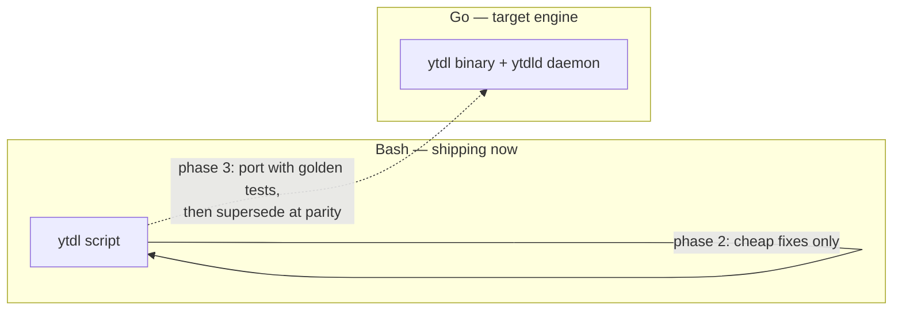

# Roadmap history

Closed work units, in the order they closed. **Historical and append-only**: a
unit's block moves here whole and verbatim when it closes, and one line stays
behind in [the roadmap](roadmap.md).

A block is immutable once written. The short header above each one — title and
outcome — is an **addition** made when it was migrated; the text below it is what
the roadmap carried, unchanged.

The Bash-to-Go migration this history records is finished; the diagram that
tracked it is kept here rather than in the roadmap:

## Phase 0 — Repository & documentation — closed 2026-07-21

## Phase 0 — Repository & documentation — `done`

| # | Item | Status |
|---|---|---|
| 0.1 | git init, baseline commit of the existing script | done |
| 0.2 | Architecture of the current script | done |
| 0.3 | Improvements and evolutions register | done |
| 0.4 | Distribution constraints analysis + ADR-0001 | done |
| 0.5 | This roadmap | done |

Documentation lives in [docs/](../README.md); user-facing install instructions are
in the top-level [README](../README.md).

## Phase 1 — Distribution — closed at v2.0.0, 2026-07-23

## Phase 1 — Distribution — `done`

Goal: a user with no developer tooling installs `ytdl` by pasting one line, on
any macOS from 10.15 up, and can keep it working over time.

Status: **done.** With **v2.0.0 released (2026-07-23)** the compiled-binary path is
verified end to end on real hardware (Apple Silicon): one-liner install,
checksum-verified binary, Gatekeeper launch, `ytdl --version`, and a real tagged
download all confirmed. The legacy Intel/Python path was dropped by
[ADR-0005](foundation/decisions/0005-macos-floor-and-single-engine.md).

| # | Item | Status | Notes |
|---|---|---|---|
| 1.1 | `ytdl --version` + version constant | done | Prerequisite for update and support ([U1](improvements.md)) |
| 1.2 | `install.sh`: macOS + arch detection | done | Handles the `10.x` → `11+` scheme; covered by tests |
| 1.3 | Provision yt-dlp (binary or zipimport per target) | done | `releases/latest/download/…`, no pinned version |
| 1.4 | Verify `SHA2-256SUMS` before installing | done | Mandatory, see ADR-0001 |
| 1.5 | Provision ffmpeg per architecture | done | martin-riedl (signed) for 10.15+, evermeet for 10.13–10.14 |
| 1.6 | Install into `~/.local/bin` + PATH in `.zprofile` / `.bash_profile` | done | Idempotent; login shells are what Terminal.app starts |
| 1.7 | Actionable failure messages (no `brew install`) | done | Now point at `ytdl --update` ([U3](improvements.md)) |
| 1.8 | Guided path for macOS 10.13–10.14 (python.org 3.13) | done | Aborts with an explanation below 10.13 |
| 1.9 | `ytdl --update` (updates yt-dlp **and** the script) | done | Re-runs the installer, single provisioning path ([U2](improvements.md)) |
| 1.10 | Public GitHub repo, first release, documented one-liner | done | Published at `alergyonthestage/ytdl`; one-liner install confirmed working |
| 1.11 | Real-hardware testing | done | Compiled-binary path verified end to end on Apple Silicon at v2.0.0 (below); legacy path dropped (ADR-0005) |
| 1.12 | Licence (PolyForm Strict 1.0.0) | done | Use permitted, redistribution and derivatives are not |
| 1.13 | Italian user guides (install + usage) | done | [installazione](../users/guides/guida-installazione.md), [uso](../users/guides/guida-uso.md) |

> **Superseded by [ADR-0005](foundation/decisions/0005-macos-floor-and-single-engine.md)
> (2026-07-22):** items 1.3 (zipimport per target), 1.5 (evermeet for legacy Intel),
> 1.8 (Mojave Python path) and the legacy half of 1.11 are dropped — Cycle 1 raises
> the floor to **macOS 10.15** and removes the Python/legacy path. They stay marked
> *done* for the currently-shipping Bash installer; the removal lands with the
> installer change (item 3.2, Session 3).

**Definition of done:** a tester who has never opened Terminal completes the
install unaided and downloads a track.

### 1.11 — hardware verification (closed at v2.0.0, 2026-07-23)

An earlier run (2026-07-22, macOS 15.6, Apple Silicon) verified the yt-dlp/ffmpeg
provisioning end to end, but it predated the compiled-binary install path: the
installer then fetched the Bash script, and `install_ytdl` — download the
cross-compiled Go binary, hard-fail on a missing checksum, replace in place —
landed ~6 h later (a gap surfaced by the Cycle 1 consolidation review).

**Closed at v2.0.0 (2026-07-23).** On Apple Silicon against the real release:
`install.sh` fetched and checksum-verified `ytdl_macos_arm64`, the ad-hoc-signed
(Go-linker, not `codesign`) binary **launched under Gatekeeper**, `ytdl --version`
printed the tag, and a real "paste a URL, get a tagged file" download succeeded —
the true definition of done, now met. The release mechanics (asset names, ldflags
version wiring, checksum format, `--latest`/trigger/permissions, darwin
cross-compile) were verified in the consolidation review that preceded the tag.

**The legacy path is no longer a gap.** macOS 10.13–10.14 (Intel + python.org
Python 3.13 + zipimport yt-dlp) was only ever checked on paper; rather than close
that gap on old hardware, [ADR-0005](foundation/decisions/0005-macos-floor-and-single-engine.md)
**drops** the legacy path (the Go engine needs 10.15+). No old-Intel-Mac testing is
required.

## Phase 3 — Go engine foundations — closed at v2.0.0, 2026-07-23

## Phase 3 — Go engine foundations — `done`

The pivot to the Go engine ([ADR-0003](foundation/decisions/0003-engine-language-go.md)).
Establish the binary and reach parity with the Bash `ytdl`, so it can supersede it
without regressions. This is "foundations" in the confirmed sequence.

| # | Item | Status | Ref |
|---|---|---|---|
| 3.1 | Go module + CI cross-compile (macOS arm64 + Intel) + checksum publication | done | ADR-0003 |
| 3.2 | Installer provisions the `ytdl` binary the same way as yt-dlp/ffmpeg | done | ADR-0003 |
| 3.3 | Port the yt-dlp arg builder + metadata pipeline; **golden tests** vs the Bash argv | done | ADR-0003 |
| 3.4 | Thin CLI front-end over the shared core (parity with today's flags) | done | — |
| 3.5 | Persistent config file (`~/.config/ytdl/config`), strict `key=value` **parse, not `source`** | done | U4 |
| 3.6 | Precedence: flag > env > session override > config file > built-in default | done | U4 |

**Implemented (Session 3, 2026-07-22)** on branch `feat/go-engine/cycle1`:
`internal/{config,core,cli,run,buildinfo}` + `cmd/ytdl`, golden-tested for byte-exact
argv parity against the Bash `ytdl`; CI (`.github/workflows/`) and the single-path
installer per [ADR-0005](foundation/decisions/0005-macos-floor-and-single-engine.md). Designed in
[design-cycle1-core.md](engine/design/cycle1-core.md) + [design-cycle1-remaining.md](engine/design/cycle1-remaining.md).
**Released as v2.0.0 (2026-07-23)** after a consolidation review; `release.yml`
cross-compiles and publishes the macOS binaries + `SHA2-256SUMS`.

Useful config settings — the full list lives in [improvements.md](engine/analysis/2026-07-21-code-initial-findings.md#u4)
(output dir, format, name template, background-by-default, concurrency, notify,
log dir/retention, embed options, …).

## Phase 4 — Backend integrations (Go) — closed at v2.1.0, 2026-08-09

## Phase 4 — Backend integrations (Go) — `done`

The maintainer's requested backend evolutions, built on the Go core. Split into
Cycle 2A (logs + notifications) and Cycle 2B (queue + daemon, in 2B-core then
2B-plus) — every item below is done, and all of it shipped in v2.1.0 (2026-08-09).

| # | Item | Status | Ref |
|---|---|---|---|
| 4.1 | Persistent central log store (`~/.local/state/ytdl/logs/`) + retention | done (2A) | U7 |
| 4.2 | In-destination failure breadcrumb, keyed by **hash(URL)** / item id | done (2A) | U7 |
| 4.3 | Auto-cleanup: a successful download removes the stale breadcrumb for that URL | done (2A) | U7 |
| 4.4 | System notification on completion, toggleable (`notify`, `notify_on`, …) | done (2A) | U6 |
| 4.5 | Real queue + daemon (`ytdld`): filesystem spool with atomic state transitions | done (2B-core) | U5 |
| 4.6 | Bounded concurrency (default cap 3; `unlimited` allowed but discouraged) | done (2B-core) | U5 |
| 4.7 | Job inspection: `queue [--watch]`, `status`, `history`, in-place watch + count/history redesign (done 2B-core + 2C); `cancel`, `retry` (done 2B-plus) | done | U5 |

**Cycle 2A (done, merged to `main` 2026-07-23):** `internal/logstore`
(central store + retention + breadcrumb + per-item playlist reconcile) and
`internal/notify` (osascript / no-op), wired through `internal/run`; seven config
keys added. `core.BuildArgs` and the goldens are byte-unchanged (parity preserved).
Decisions in [ADR-0006](engine/decisions/0006-cycle2a-logs-breadcrumbs-notifications.md).
Shipped in v2.1.0.

**Cycle 2B-core (done, merged to `main` 2026-07-23):** `internal/queue` (lock-free
maildir spool, atomic `mv` transitions) and `internal/daemon` (on-demand `ytdld`:
`flock` single-instance, bounded worker pool, crash recovery, idle-exit), plus the
`concurrency` config key, the `queue`/`status` subcommands, and `-b` rewritten to
enqueue (superseding the unbounded `Setsid` detach). The daemon is the same `ytdl`
binary self-exec'd into a hidden `__daemon` role — no always-on service. Queued
jobs run in silent mode, inheriting the 2A store/breadcrumb/notify. `core.BuildArgs`
and the goldens are byte-unchanged (parity preserved). Adversarially reviewed (3
reviewers; the real findings — per-job panic isolation, escaping a persistent-error
daemon wedge, best-effort recovery, `queue`-resumes-a-stalled-daemon — fixed).
Decisions in [ADR-0007](engine/decisions/0007-cycle2b-queue-daemon.md). Shipped in v2.1.0.

## Cycle 1 — Go engine foundations & parity — done, shipped as v2.0.0 (2026-07-23)

### Cycle 1 — Go engine foundations & parity (phase 3) — **done**

**Status (2026-07-22):** run across three sessions — (1) core analysis + design,
(2) remaining analysis + design, (3) implementation. **All three done.**

- **Session 1 — core:** 3.3 + 3.4 + shared-core scaffolding + config seam. See
  [design-cycle1-core.md](engine/design/cycle1-core.md),
  [ADR-0004](engine/decisions/0004-go-engine-package-layout.md),
  [parity contract](engine/design/go-port-parity-contract.md),
  [golden-test design](engine/analysis/2026-07-22-tech-choice-golden-tests.md).
- **Session 2 — remaining:** config file (3.5/3.6), CI (3.1), installer (3.2),
  plus the macOS floor raise. See
  [design-cycle1-remaining.md](engine/design/cycle1-remaining.md) and
  [ADR-0005](foundation/decisions/0005-macos-floor-and-single-engine.md) (floor → 10.15, single
  Go engine, Python removed).
- **Session 3 — implementation:** the whole cycle built on branch
  `feat/go-engine/cycle1` (lead inline + adversarial review subagents). Delivered:
  the golden capture harness + 20 byte-exact references, `internal/{config,core,cli,
  run,buildinfo}` + `cmd/ytdl`, CI (`ci.yml` + `release.yml`), the single-path
  installer, and the user-doc flip to the 10.15 floor / 2.0.0. `go test -race ./...`,
  `go vet`, `gofmt`, and the 19 installer checks all green; a Stage-4 review found no
  critical issues and its fixes are applied.

**Done:** the Go `ytdl` reproduces the Bash tool's behaviour byte-for-byte (goldens
green + end-to-end argv checks), reads the config file, and installs through the
updated installer. The crown-jewel metadata pipeline is pinned by the golden tests.

**Consolidation & release (2026-07-23).** A pre-release adversarial review (3
reviewers over parity/config, runtime, release/CI/installer) found and fixed, on
branch `fix/cycle1/consolidation` (merged to `main`): an empty-`-o`/`-f` exit-code
parity gap, the signal-death exit code (128+signal), an empty-`output_dir` config
hole, plus CI hardening (darwin cross-compile + `-race`), a supported Go toolchain,
the yt-dlp quarantine strip, and a test for the installer's checksum hard-fail.
Deferred as non-regressions / Cycle-2: the `.log` collision (parity-inherited →
central log store) and assorted minors. **Shipped as v2.0.0** — merged to `main`,
CI green on GitHub, `release.yml` published the binaries, and the compiled-binary
install + a real download are verified on Apple Silicon (see 1.11).

## Cycle 2 — Backend integrations — 2A, 2B-core, 2C and 2B-plus all done and merged (2026-07-23/24)

### Cycle 2 — Backend integrations (phase 4 + phase 5 hardening)

Split into two sessions; the queue/daemon is substantial enough to stand alone.

**Cycle 2A — logs + notifications — done, merged to `main` (2026-07-23).** Central
persistent logs + age retention; in-destination failure breadcrumb keyed by
hash(URL) / item id with auto-cleanup; toggleable completion notifications
(silent/background by default, foreground opt-in). Built as `internal/logstore` +
`internal/notify` wired through `internal/run`, plus seven config keys — all off the
golden argv path, so parity is preserved. Adversarially reviewed (one real bug —
breadcrumb cleanup vs. glob metacharacters in the output folder — found and fixed);
suite green under `-race`. See [ADR-0006](engine/decisions/0006-cycle2a-logs-breadcrumbs-notifications.md).
Shipped in v2.1.0.

**Cycle 2B-core — queue + on-demand daemon — done, merged to `main` (2026-07-23).**
Filesystem spool (`internal/queue`, atomic `mv` transitions) drained by an on-demand
`ytdld` daemon (`internal/daemon`: `flock` single-instance, bounded worker pool,
crash recovery, idle-exit), the `concurrency` config key (default 3; `unlimited`
draws an advisory warning), `ytdl queue [--watch]`/`status`, and `-b` rewritten to
enqueue. The daemon is the same `ytdl` binary self-exec'd into a hidden `__daemon`
role (no always-on service — deferred to the GUI cycle). Reuses the 2A primitives
(the central store as job history; `NormalizeURL`/`Hash` as stable job identity;
queued jobs run silent, inheriting store/breadcrumb/notify). Parity preserved
(`core.BuildArgs`/goldens byte-unchanged). Adversarially reviewed (3 reviewers).
See [ADR-0007](engine/decisions/0007-cycle2b-queue-daemon.md). Shipped in v2.1.0.

- **Entry:** Cycle 1 shipped as v2.0.0; Cycle 2A merged to `main`. Based off the
  latest `main`.
- **Done when:** queued/background downloads run under a concurrency cap with
  inspectable status. ✓

**Cycle 2B-plus — queue completion + hardening — done, merged to `main`
(2026-07-24).** `ytdl cancel`/`retry` (index or stable id-prefix, `--all`), a
per-job execution timeout (`job_timeout`, default off) that kills hung downloads via
a process-group teardown, a "no residue in the destination" guarantee (yt-dlp
intermediates routed to a per-job scratch dir; a cancel/timeout also drops no
breadcrumb), a daemon diagnostics log, and the removal of the dead `core.ReExecArgs`
+ `background-*` goldens. Cross-process cancel is a filesystem marker the daemon's
watcher turns into a ctx cancel; `Retry`/`RequeueRunning` clear stale markers so a
fresh run is never retroactively cancelled. Runtime/CLI layer only —
`core.BuildArgs` and the goldens stay byte-unchanged (the residue redirect is
appended off the golden path; verified against real yt-dlp that an absolute `-o`
ignores `--paths`, hence the relative-`-o` override). Adversarially reviewed (3
reviewers; the real findings — a stale-marker delete, a raced-success mis-recorded
as failed, retry/cancel exit codes and error surfacing — all fixed).
[ADR-0011](engine/decisions/0011-cycle2b-plus-cancel-retry-hardening.md). Shipped in v2.1.0.

- **Entry:** Cycle 2B-core merged to `main`. Based off the latest `main`.
- **Done:** failed jobs can be retried and pending/running jobs cancelled from the
  CLI; hung downloads are bounded and surfaced; failed/cancelled downloads leave no
  residue; test suite green under `-race`. ✓
- **Deferred to a dedicated Phase-5 cycle:** automatic retries/backoff and YouTube
  rate-limit handling; wiring cancel/retry into the web GUI (still read-only).

**Cycle 2C — CLI UX pass — done, merged to `main` (2026-07-23).** A dedicated
polish of the command-line surface exposed by Cycle 2B-core, driven by real-use
feedback. Built as `internal/term` + the log-store `history.jsonl`/`Load` read-API
+ `queue.PruneTerminal`, with the `queue`/`status` redesign, the new `history`
subcommand, and the in-place `--watch`; adversarially reviewed (3 reviewers; 1
critical + 6 warnings, all real ones fixed). Parity preserved
([ADR-0009](ux/decisions/0009-cycle2c-cli-ux.md)). Shipped in v2.1.0. Scope delivered:
(1) `queue --watch` redraws its region **in place** instead of clearing the whole
screen (which wiped the terminal and spammed scrollback); (2) the completion count
is redesigned — `queue` shows only **live** work (pending/running), `status` shows
the daemon (informationally) plus a **recent** summary, and a new `ytdl history`
reads the **log store** (which, unlike the spool, also records foreground
downloads and already has timestamps + age retention), with the spool's
`done/`/`failed/` pruned to fix their unbounded growth; (3) `-n` (preview) failures
are surfaced **legibly** rather than dumping raw yt-dlp output; (4) cross-cutting:
distinct `queue`/`status`/`history` roles, TTY-aware restrained colour (off when
piped), empty-state hints. Designed **daemon-lifecycle-agnostic**
([ADR-0008](engine/decisions/0008-daemon-lifecycle.md)) so it stays correct across the
Cycle 3 daemon.

- **Entry:** Cycle 2B-core merged to `main`. Separate from 2B-plus; coordinate on
  the shared spool (2C prunes `done/`/`failed/`; 2B-plus reads `failed/` for retry).
- **Done when:** `--watch` updates in place; `queue`/`status`/`history` have
  distinct, truthful semantics; the spool no longer leaks terminal jobs; `-n`
  failures read cleanly; suite green.

## Cycle 3 — GUI (phase 6b) — done, merged 2026-07-24

### Cycle 3 — GUI (phase 6b) — **done, merged to `main` (2026-07-24)**

- **Scope delivered:** the web UI served by the daemon — `ytdl gui`, a
  self-contained embedded page, live per-job progress via SSE, format/settings,
  per-run/session/global output dir, a settings editor (`config.Save`), and a
  queue + in-progress + recent-history view. The queue is read-only (`cancel`/
  `retry` deferred to 2B-plus); the 6a AppleScript MVP is deferred.
- **Entry:** Cycles 1–2 done (config + queue + runner exist). Off the latest `main`.
- **Done:** a non-developer runs `ytdl gui`, starts a download and watches its
  progress bar, launches background downloads, sees the queue and history, and edits
  settings — all without the Terminal. Verified end-to-end against real yt-dlp.
- **Built as:** `internal/webui` (server + SSE + embedded SPA), `config.Save`, the
  `internal/run` progress seam (`RunQueued` + splitter), and the daemon lifecycle
  wiring (`LiveClients`/`FirstClientGrace`, `SpawnGUI`, `Config.Run` takes a
  `queue.Claim`). Standard library only; `internal/core` byte-unchanged.
- **Security:** authenticated local API (per-session token + `Origin` +
  `application/json` + URL validation); the API is only opened by a GUI daemon.
- **Decisions:** [ADR-0010](ux/decisions/0010-cycle3-web-gui.md) (single binary, SSE
  progress from both streams, config write API, the local-API security model).
- **Deferrals recorded in ADR-0010:** an editor `concurrency` change applies to the
  next GUI session; per-client ~1 Hz spool polling; `PUT /api/settings` is a
  whole-document overwrite.

Phase 7 (Windows/Linux) stays deferred and is not a scheduled cycle.

## Cycle 4 — CLI UX pass #2 — done, merged 2026-07-24

### Cycle 4 — CLI UX pass #2 (command/URL disambiguation + job titles) — **done, merged to `main` (2026-07-24)**

A second CLI UX pass driven by two maintainer findings from real use. Runtime/CLI
layer only; **`internal/core` and `internal/daemon` are byte-unchanged** (parity
held). [ADR-0012](ux/decisions/0012-cycle4-cli-ux-title-disambiguation.md).

- **Scope delivered:** (1) a mistyped subcommand (`ytdl queu`) is no longer forwarded
  to yt-dlp as a URL — a bare word close to a known command gets a "did you mean"
  hint, while a bare video/playlist id still passes through (a command-similarity
  guard, **not** a URL allow-list, which would have broken bare ids); (2)
  `ytdl queue`/`retry`/`cancel` now show the video **title + full URL** instead of a
  truncated stub — the title is written back onto the running job by the run layer
  (daemon untouched), `retry` additionally enriches from history, and `--watch` clips
  each line by **display columns** so CJK/emoji titles never wrap.
- **Entry:** Cycles 1–3 + 2B-plus merged to `main`. Off the latest `main`.
- **Done when:** a typo'd command is caught with a suggestion; bare video ids still
  download; queue/retry/cancel name the video; `--watch` never wraps; suite green.
- **Built as:** `queue.Job.Title` + `Spool.SetTitle`; `run.RunQueued` `onTitle`
  callback + watcher goroutine; `cli.looksLikeURL`/`nearestCommand`;
  `logstore.TitleForURL`/`TitleIn`; `term.Width`/`DisplayWidth`/`Clip`; the `cli`
  renderers.
- **Adversarially reviewed** (3 reviewers): 3 CRITICALs found and fixed — bare video
  ids rejected, `--watch` clip counting runes not display columns, spinner/footer
  unclipped — plus HIGH/MEDIUM (per-job log dir, O(N·M) enrichment, panic-safe join).
- **Deferred (unchanged):** the dedicated Phase-5 hardening cycle, the 6a AppleScript
  MVP, and the GUI multi-page / UX overhaul (recorded below).

## Cycle 5 — Unified GUI/CLI UX — done, merged 2026-08-05, shipped in v2.1.0 — the block below still says «in progress», which is what the roadmap carried

### Cycle 5 — Unified GUI/CLI UX (phase 6c + CLI) — **in progress**

The UX cycle the maintainer had recorded as deferred, **brought forward** ahead of
the Phase-5 hardening cycle and the 6a MVP (their call, 2026-07-26). It is designed
from the **user task model** rather than from the existing commands, and covers both
channels in one pass so they stop diverging. Runtime/CLI/GUI layers only —
`internal/core` and `internal/daemon` stay byte-unchanged for the third cycle running.

- **Scope approved at gate B (2026-07-27):**
  (1) the GUI becomes three task-scoped views — Download (new download + live queue
  side by side, plus the last 3 downloads), Cronologia (filters, search, pagination,
  ranked row actions), Impostazioni (five groups, advanced settings collapsed, sticky
  unsaved-changes bar);
  (2) the queue becomes **actionable from the GUI** (cancel), lifting ADR-0010's
  read-only decision;
  (3) the history record is extended **once** (`path`, `dir`, `count`, `playlist`,
  capped `error`) so both channels can finally answer *where did the file go* and
  *why did it fail*, with the record id and its per-job `.log` name **derived** so
  pre-Cycle-5 records stay addressable;
  (4) open/reveal actions in both channels, behind an API that takes a **record id,
  never a path**;
  (5) a CLI pass: short task-oriented help with `ytdl help <argomento>` and
  per-command `--help`, a numbered actionable `history` with `open`/`again`, a
  read-only `ytdl config`, and the long-documented `open_folder_on_done`.
- **Entry:** Cycles 1–4 merged to `main`. Branch `feat/ux/cycle5-unified-ux` off `main`.
- **Done when:** a GUI-only user can start, watch, stop and re-run a download, find
  an old one and open it, and change the settings that matter without meeting the
  advanced ones; the CLI does the same with the same words; suite green under
  `-race`; goldens byte-unchanged.
- **Designed in:** [design-cycle5-ux.md](ux/design/cycle5-ux.md) ·
  [ADR-0013](ux/decisions/0013-cycle5-unified-ux.md) ·
  [ux-principles.md](ux/design/ux-principles.md) (normative for later cycles).
- **Built and reviewed (2026-07-27):** ten feature commits (one per design §14
  step) plus eight fixes from a three-reviewer adversarial pass (3 CRITICALs:
  an unvalidated URL on the new "riscarica" path, `open`/`again` acting on the
  wrong record under a narrowed listing, and a permanently-pinned unsaved-changes
  bar). Suite green under `-race`; `internal/core` byte-unchanged; `internal/daemon`
  untouched.
- **Gate C (2026-08-03): passed with findings.** The maintainer verified the GUI
  and the open/reveal actions on real hardware and returned twenty-six findings —
  the register is [improvements.md § Gate-C findings](ux/reviews/001-cycle5-gate-c.md#gate-c),
  and the two decisions they forced are
  [ADR-0014](ux/decisions/0014-ux-scope-model-and-partial-outcome.md). The cycle does
  **not** merge as-is: it closes on the `R` group below.

## Cycle 5 closing — gate-C fixes (R) — done, merged and released in v2.1.0

### Cycle 5 closing — gate-C fixes (`R`) — **done, merged and released in v2.1.0**

The eleven findings where a surface contradicts either `ux-principles.md` or its
own label. None needed a new decision, so the session **started at
implementation** — no analysis, no design gate — on the existing branch. It ends
at the merge and the long-deferred release, both of which are still open.

- **Scope:** G1 (queue rows state the destination, both channels) · G2 (the
  session-folder field can no longer show a value that is not in force) · G3 (the
  per-download folder really is per-download) · G4 (the playlist checkbox returns
  to its default after a submit) · G5 (`open_folder_on_done` stops being a live
  control that cannot work in the GUI) · G6 (the log panel scrolls into view) ·
  G7 (`audio_quality` accepts yt-dlp's real 0-10 domain, help and docs follow) ·
  G8 (failures carry an actionable hint, derived at render time from the stored
  line — no schema change, retroactive on existing records, and only remedies
  that exist today) · G9 (the reveal labels name the folder, not the Finder, in
  both channels) · G10 (the `beforeunload` wording stops implying that closing
  the tab cancels the queue).
- **Rulings taken (2026-08-04, [ADR-0014](ux/decisions/0014-ux-scope-model-and-partial-outcome.md)
  §3–§4), so nothing here waits on a decision:** G9 is **in** — `ux-principles.md`
  §3 is already amended, the strings follow in `app.js` (+ the `spa_test.go`
  assertion), `cli/messages.go` and `cli/help.go`, while "Finder" stays in the
  macOS guides. G11 is **out** — the missing "Riprova" surface is recorded as an
  asymmetry per §7 and lands in Cycle 6.
- **Deliberately out:** everything requiring a decision or a data-model change.
  G3 and G4 ship their *truthfulness* half here; the full scope model (visible
  effective destination, explicit promotion, the same rule for the format
  control) is Cycle 6. G8 ships the catalogue; the age/bot remedy needs Cycle 9.
- **Done when:** ~~no GUI surface asserts something untrue~~ · ~~suite green under
  `-race`~~ · ~~goldens byte-unchanged~~ · ~~branch merged `--no-ff` into `main`~~
  (`b36774e`, 2026-08-05) · ~~pushed to `origin/main`~~ · ~~the changelog closed
  at **v2.1.0**~~ (2026-08-06) · ~~the tag pushed and the build verified on
  hardware~~ (2026-08-09). **The cycle is closed and released; nothing is open.**
- **Built (2026-08-04):** ten commits, one per finding, in the order G9 · G10 ·
  G7 · G6 · G1 · G5 · G3 · G4 · G2 · G8 — cheapest and most isolated first, so
  every commit is green on its own. What each one shipped, and the two judgement
  calls it took, are in
  [improvements.md § R — delivered](ux/reviews/001-cycle5-gate-c.md#gate-c).
- **Reviewed (2026-08-04):** an adversarial pass on three lenses (the SPA, the Go
  layers, this document's contract), every finding re-verified before acting and
  every fix confirmed to fail with the fix reverted. **Seven further commits**:
  the CLI hint was being clipped into `ytdl --updat…`; three hints named the
  wrong remedy (a full disk sent to reinstall dependencies, a dead link sent to
  check the network); three holes in G2 itself, including a stale state frame
  that silently undid a just-applied override; an unguarded `showLog` that could
  show one download's log next to another's remedy; and one *new* untruth, a hint
  promising a notification the user may have switched off. Detail in the same
  register section.
- **Baseline, measured 2026-08-04** (unchanged after all seventeen commits):
  `go vet` clean, `gofmt` clean, **whole suite green under `-race`**,
  `git diff main -- internal/core/ internal/daemon/` empty — the parity gate has
  now held for four cycles. The toolchain is baked into the project container
  image, so a session no longer spends its opening minutes provisioning Go (see
  [go-engine.md](engine/design/go-engine.md#build-test-release)).
- **The release — done (2026-08-09), as v2.1.0.** The changelog's open
  `[Unreleased]` block turned out to hold six cycles and to be **missing Cycle 5
  entirely** (the closing's docs commits had touched roadmap, improvements,
  cli-reference and go-engine, never the changelog); it was written from
  [improvements.md § R — delivered](ux/reviews/001-cycle5-gate-c.md#gate-c) and closed as
  **2.1.0** — a minor, because everything since v2.0.0 is additive for valid input
  bar two recorded behaviour changes (`-b` enqueues; the failure `.log` became the
  log store). Then `main` pushed, tag pushed, workflow green, and the published
  build installed and verified on the Mac. The v2.0.0 trigger gotcha did not
  recur: `release.yml` has been on the default branch since then.
- **Found while cutting it, not fixed:** the GitHub release body is generated with
  `--generate-notes`, i.e. from commit titles, so the changelog entry does not
  reach it. Switching `release.yml` to `--notes-file` would need the 2.1.0 section
  extracted at build time — a workflow change, deliberately left to its own commit.
- **Known, not blocking:** `TestRunQueuedCancelKillsProcessGroup` flaked once
  under container load on a cold-cache `-race` run (it waits `killGrace+2s` for a
  process-group signal); it passed in the 2026-08-04 baseline. Pre-existing timing
  fragility → Phase-5 hardening cycle.

## Cycle 6-plus — the update path (F) — gate C passed 2026-08-23, released as v2.2.0

#### Cycle 6-plus — the update path (`F`) — **gate C PASSED 2026-08-23; ten findings, three blocking, all closed or deferred with a reason**

Not a gate-C finding: raised by the maintainer on 2026-08-09, immediately after
installing v2.1.0 by hand. **Pulled ahead of Cycle 6 on 2026-08-12**, when ytdl
was about to be installed for a user who is not the maintainer: without it, every
future release means physically returning to that machine.

**Clarified by the maintainer, 2026-08-21:** that installation was **deferred**
rather than carried out, precisely because this cycle had not shipped. Two
consequences, and both matter. There is currently **no installation anywhere that
a release could reach**, which is why gate C's handover test may use a real
pre-release (A1b, run and passed on 2026-08-23). And this
cycle is the **blocker** for that first install, not merely an improvement to
it — which is the sharper reason it was pulled ahead. It keeps the name `-plus`
rather than renumbered (the `2B-plus` precedent), because
[improvements.md](ux/reviews/001-cycle5-gate-c.md#gate-c) pins G19–G23 to Cycle 7, G24 to Cycle 8,
G25 to Cycle 9 and the `S` group to Cycle 10 — taking a number here would falsify
every one of those references.

**Its rulings are [ADR-0016](distribution/decisions/0016-cycle6plus-update-path.md) and its
design is [design-cycle6plus-update.md](distribution/design/cycle6plus-update.md)** — read
those first: they answer all four questions below. The design was **approved at
gate B on 2026-08-13** and **built the same day**. It was then **reviewed twice**,
and the session that documents it started from a gate-C handoff, since consumed —
as was the closing handoff that followed it. What comes next is
[Cycle 6-launch](roadmap.md#cycle-6-launch).

**Where it stands (2026-08-19).** All eleven implementation steps are done on
`feat/update-path/implementation`, **not yet merged**, and **both review passes
and both fix passes are done**. Re-verified without the test cache: the suite is
green under `-race`, `go vet` and `gofmt` are clean,
`tests/test-installer.sh` passes **103/103** — re-run 2026-08-22, and also under
a real bash 3.2 — and the parity gate
(`git diff main -- internal/core/ internal/daemon/`) is **empty**.

**The documentation phase is done** (2026-08-21). The three normative documents
that contradicted the code are realigned, the four ratified decisions are
[ADR-0016](distribution/decisions/0016-cycle6plus-update-path.md) §16, and the user- and
reference-facing documentation — which did not exist — is written: `guida-uso.md`
§ *Tenere ytdl aggiornato*, `guida-installazione.md`, `README.md`,
`cli-reference.md` §8, `go-engine.md`, and the `[Unreleased]` changelog entry the
file had no section for. The register records what was discharged and one new
finding, `V19` (a package comment claims an import the package does not have;
cosmetic, deliberately unfixed — the docs phase writes no code).

**Gate C is running, by hand on macOS, and it has already justified itself.** The
maintainer asked for it explicitly — "i test passano, ma voglio verificare a mano"
— and in two sittings it produced **four findings the suite could not reach, two
of them blocking**, registered as
[`V19`–`V22`](distribution/reviews/004-cycle6plus-gate-c.md#cycle6plus-gatec):

- **`V20` (fixed, `8b80b66`)** — a *cold* `yt-dlp --version` takes 7.4 s on stock
  macOS against a 3-second budget. The surface then called a working tool
  «versione non registrata» and, far worse, reported **«sei aggiornato» while
  structurally unable to compare yt-dlp at all** — ADR-0016 §2's whole purpose,
  silently inert. The budget came from a real 650 ms measurement taken in the
  container, where the invocation was warm: the measurement was true and the
  conclusion did not describe the target platform.
- **`V21` (fixed, `70368cd`)** — `install.sh` aborted mid-install on **macOS's
  bash 3.2**, whose parser reads the bytes of a multi-byte character as part of an
  identifier: an unbraced expansion before an ellipsis named a variable that does
  not exist, and `set -u` did the rest. The GUI therefore offered the same update
  for ever. It survived 101 green assertions because the only shell that
  reproduces it is the one this project never tests on; the suite now refuses the
  shape outright.
- **`V23` (mechanism proven; the applied hardening does *not* fix it)** — that
  aborted install was recorded as `done, exit 0`, so the page reported success for
  an install that installed nothing. Settled in the container on 2026-08-22
  against a **bash 3.2 built from source**: it enters the `EXIT` trap with
  `$? = 0` after a `set -u` abort, and only after that one. `local rc=$?; exit
  "$rc"` therefore still exits 0 — and the test that pins the invariant aborts
  through an explicit `exit 1`, the case 3.2 gets right. A fix that works under
  both shells is measured (a completion flag) and not yet written.
- **`V24` (open, blocking)** — **the branch was never pushed**, and the update
  runner fetches `install.sh` from `raw.githubusercontent.com/<slug>/<branch>/`,
  i.e. from `origin`, which is eight commits behind. So every *Aggiorna* on the
  Mac ran the **pre-`V21`** installer, and `V21`, `V23`'s hardening and `V20`'s
  branch code have **never been exercised on real hardware**. The `v2.2.0-rc1`
  release is the asymmetric case: its tag was pushed from a local commit, so the
  release and the branch describe different code. The checklist's `P3` asked
  whether the branch *existed* on `origin`; it now compares **content**.
- **`V25` (open, blocking for the merge)** — one `go test -race ./...` takes
  **4 m 26 s** and leaves **1715 `/tmp/_MEI*` directories, 91 GB**: a *killed*
  `yt-dlp` never removes its PyInstaller extraction, and `V20`'s 30-second budget
  makes `cmd/ytdl` kill it in bulk. That is what turned the container's filesystem
  read-only twice, and it answers the question `V20` left open.
- **`V22`** (open, minor) and **`V19`** (cosmetic, deliberately unfixed).

**The lesson of this gate, three times over, is about the container**: it answered
truthfully every time and the question was not the one that mattered. Warm where
the Mac is cold (`V20`); bash 5 where the Mac is 3.2 (`V21`); and — the widest —
**the working tree is not what the update path runs** (`V24`). For anything
fetched over the network the artefact under test is the *published* one, and a
local commit is invisible to it.

The by-hand pass also rewrote its own instructions three times: the checklist
assumed the released `ytdl` on `$PATH` was under test, then that a rebuild
replaces a running daemon, then that the handover could work with the binary
somewhere other than the installer's target. Those corrections produced
`hack/ytdl-dev.sh` and [dev-testing.md](guides/dev-testing.md), a **permanent** sandbox
for running dev builds — the one artefact of this phase that outlives the cycle.

**Gate C passed on 2026-08-23**, after four by-hand sittings on real hardware.
Everything reachable was run — the handover end to end, the installer against the
real network, its idempotence, the withdrawn-build fallback **and** the boundary
that must not fall back, the abandoned-run state, a run adopted in a second tab,
and the acceptance test. The full outcome, including what was **not** run and what
was **deferred with a reason**, is
[improvements.md § Gate C — esito](distribution/reviews/004-cycle6plus-gate-c.md#cycle6plus-gatec-esito).

Three defects are deferred to **Cycle 10** as one decision rather than three
(`V26` · `V27` · `V29`), and three to a **fix pass** (`V23` · `V25` · `V28`).
`V27` is a deliberate deferral of a normative rule and is pinned under Cycle 10
for that reason.

**Closed on 2026-08-23.** Merged `--no-ff` into `main`, tagged **`v2.2.0`**,
`release.yml` published both architectures, and the maintainer re-installed on
their own machine — the v2.1.0 they were running had no update path, which is the
gap this cycle closes, so that manual install is also the last one they will ever
need. `deps.conf` is now on `main`, and from here a commit to it reaches every
installation within a day.

**Two review passes, eighteen findings, all fixed.** The first reviewed the
implementation and found nine (`V1`–`V9`,
[register](distribution/reviews/001-cycle6plus-implementation.md#cycle6plus-review)); the second reviewed **the fix
session itself** and found nine more (`V10`–`V18`,
[register](distribution/reviews/002-cycle6plus-fix-session.md#cycle6plus-fixreview)). Every finding in both was
reproduced by execution, and every fix was run against the code *before* it to
prove the test fails there.

The second pass is the one worth remembering, because four of its findings were
**regressions the first pass introduced** — including a race that made a
successful update read as abandoned on every run, and a GUI that told a Homebrew
user ffmpeg was not installed. Two of them had been asserted as impossible, in
writing, in the commit messages that caused them. The lesson the register records:
a property claimed in a commit has to be verified by executing, not by re-reading
the diff.

Seven further findings were **deliberately deferred**, each with its reason, in
the second register's "Deferred to a later cycle" section. None is a regression
and none is reachable without an unusual precondition.

Neither the handover, nor the installer against the real network, nor the
withdrawn-build fallback, nor the canary has ever run, and **no browser has ever
rendered this GUI** — neither review changed that, and both handoffs say so rather
than letting "reviewed" read as "exercised".

**Four ratified decisions the documentation phase must record** (maintainer,
2026-08-18, after the second review supplied the evidence): an abandoned run is
recognised by **PID with a clock backstop**, never by the clock alone — a
clock-only rule would declare a live installer abandoned, which the review
reproduced as a second `install.sh` launched over one still doing `mv`; the GUI
panel gains a **fifth state**, which design §7.3 had already promised and had no
state to live in; the V3 fix **costs exactly one ffmpeg download** on machines
carrying `ffmpeg_pinned = false`, proven to converge and therefore creating no
recurring obligation; and the abandoned state is **GUI-only by right**, because
`ytdl --update` is synchronous and never writes a run record.

**Three normative documents were behind the code, and are no longer** (closed
2026-08-21): ADR-0008's lifetime rule is stated as the three-way union it became,
with the keep-alive clause separated from the exit cause; design §7.3 says
`abandoned` instead of "stays `running`"; and the GUI-only asymmetry is recorded
in ADR-0016 §16.4 and registered in `ux-principles.md` §7, as that section's own
rule demands. The user-facing documentation, which did not exist at all, is
written — along the way `cli-reference.md`'s description of `ytdl -V` turned out
to be outright **false**, and the config leaf in `go-engine.md` still claimed the
9-key `Settings` of Cycle 1 (it has 20).

Three things the implementation learned that the design could not have known, all
carried back into [ADR-0016](distribution/decisions/0016-cycle6plus-update-path.md) §14:

- **ffmpeg's build id is per architecture** (`1785863997_9.0` on arm64,
  `1785871427_9.0` on amd64, for the same ffmpeg 9.0). A single `ffmpeg_build`,
  as the design sketched it, could not have described both.
- **The Go probe tolerates an unknown deps.conf key; install.sh still refuses
  one.** A deployed binary is arbitrarily older than the file it reads, so a key
  added later would otherwise drop the whole fleet to "non verificato" — and
  stop it seeing the very update that teaches it that key.
- **`--ffmpeg-location` is appended after `core.BuildArgs`.** ytdl never invokes
  ffmpeg (yt-dlp does, off the inherited `$PATH`), so without it the pin said
  which ffmpeg was *installed* but not which one was *used*.

**Two things the container cannot close, carried to the maintainer:** the four
ffmpeg sha256 values in `deps.conf` were **computed here, not attested** — they
must be verified on the Mac before the release that ships them, since the whole
value of §12 is that the sum means someone checked; and the GUI's visuals, the
banner, the update panel and the handover reload have been exercised by node and
by curl against a live daemon, but never by a browser.

**What already exists, so the cycle does not rebuild it:** `ytdl --update`
(`internal/run/runner.go`) re-runs `install.sh` through `curl … | bash`, and the
installer is the single provisioning path — it fetches ytdl, yt-dlp and ffmpeg,
checksum-verifies **ytdl and yt-dlp only** (ffmpeg's upstream publishes no sums we
consume — corrected 2026-08-12; the cycle closes the gap by pinning an immutable
ffmpeg build and attesting its sha256,
[ADR-0016](distribution/decisions/0016-cycle6plus-update-path.md) §12), and already handles
replacing a *running* binary (atomic `mv`; the live process keeps its inode,
`install.sh:253`). Applying an update is not the gap. The gap is:

- **Nothing detects one.** There is no version comparison anywhere: the installer
  always fetches `releases/latest` (re-downloading ffmpeg even when current), and
  ytdl never asks GitHub anything. The only trigger a user has today is a download
  that has started failing — they learn of the update from the breakage.
- **The GUI has no update surface at all**, so the GUI-only user — the audience the
  GUI exists for — has to open a Terminal. Same class of defect as the gate-C
  findings: one channel cannot do what the other does, and the person who needs it
  most has the fewest tools.

- **Scope:** a probe, a cached verdict, a notice in each channel, and a way to act
  on it from the GUI. **Semi-automatic by maintainer decision (2026-08-09): detect,
  then ask.** Never a silent self-replacement — there is no rollback story, and
  other people depend on this tool.
- **Widened on 2026-08-13 by the dependency ruling** ([ADR-0016](distribution/decisions/0016-cycle6plus-update-path.md)
  §2–§4, §11–§13): **ytdl declares what it drives** in a `deps.conf` the installer
  fetches, so which dependency a machine runs stops being an accident of when it
  was installed, and stops being a user decision. The **mechanism is a pin; the
  policy is separate** and starts at `latest` — a frozen version would convert
  yt-dlp's frequent, self-healing staleness into a failure waiting on a maintainer
  whose reaction latency is weeks, while the file gives the rollback lever the
  project has never had (one commit reaches every installation within a day).
  ffmpeg *is* pinned hard, because there the pin buys the missing checksum at no
  recurring cost. The user is left with **one axis** — update ytdl — the installer
  becomes **idempotent**, a scheduled **canary** exercises ytdl end to end against
  the newest yt-dlp so a regression arrives as an email rather than as a user who
  quietly stops using the tool, and ytdl resolves its own binaries by absolute path
  instead of losing a `$PATH` race to a Homebrew yt-dlp it never installed.
- ~~**Analysis must settle:**~~ **all four answered** by
  [ADR-0016](distribution/decisions/0016-cycle6plus-update-path.md):
  - ~~**The probe.**~~ The `releases/latest` redirect wins (§1). Measured: both
    components already carry locally the exact string their tag carries, so the
    comparison is **string equality**, not version ordering — no semver parser, no
    date parser. `api.github.com` is rejected (60 requests/hour per IP).
  - ~~**When it runs.**~~ At startup, never as a poll (§2); every surface reads a
    cached verdict from `${XDG_STATE_HOME}/ytdl/update.json`, refreshed off the
    critical path for the *next* invocation.
  - ~~**Consent.**~~ `update_check`, default **on** (§3), governing the automatic
    probe only — the manual check and `ytdl --update` stay available when it is off.
  - ~~**Where it lives.**~~ A new `internal/update`, driven from `cmd/ytdl`. The
    daemon takes everything by injection, so **the constraint needed no amendment**
    and `internal/daemon` stays byte-unchanged. What ADR-0016 §7 *does* amend is
    ADR-0008: the daemon gains a third exit cause, an explicit user request.
- ~~**Design must settle — applying it from the GUI**~~, the hard half: **answered
  and built** ([ADR-0016](distribution/decisions/0016-cycle6plus-update-path.md) §9,
  [design](distribution/design/cycle6plus-update.md) §7.2). The installer runs detached and
  setsid'd, so it outlives the binary it replaces; the old daemon keeps its own
  inode and therefore survives to *report* the outcome; it then closes the
  listener with `Close` (never `Shutdown`, which an SSE connection would block
  for ever), hands the session token to the child in the environment, and exits
  — the third exit cause ADR-0008 gains. The browser reconnects by polling, not
  by SSE, because that connection dies at the handover by construction.
  Downloads in flight gate the **action** and never the news, and emptiness is
  re-checked server-side at the click. Most updates cost no restart at all: after
  the installer became idempotent, a re-pinned yt-dlp leaves the page where it is.
- **Non-negotiable:** the update stays the installer. No second download-and-verify
  path in Go (item 1.9,
  [ADR-0005](foundation/decisions/0005-macos-floor-and-single-engine.md)) — that one is what
  checks the checksums.
- **Done when:** a user on a stale build is told so in the channel they actually
  use, without ever having waited on the network to find out; a GUI-only user can
  update without opening a Terminal; and the check can be turned off. **Raised on
  2026-08-12:** the acceptance test is now a person who is not the maintainer —
  they must be able to go from "there is an update" to "I am on it" from the GUI
  alone, with nobody at their keyboard. **Built as of 2026-08-13; the acceptance
  test itself is verified when the maintainer opens the page on macOS, which is
  the one thing the container cannot do.**
- **The ffmpeg pin creates no standing obligation** (ADR-0016 §15, ruled
  2026-08-13 after the risk was raised at review). Pinning an exact build trades a
  moving target for a fixed one, and a fixed URL can be withdrawn — which would
  have made *every new install* fail until someone re-pinned, with nobody
  reporting it, because a person who cannot install a tool gives up rather than
  files an issue. That is the failure mode the canary exists to prevent,
  reintroduced through the back door. So the pin is a **preference**: a withdrawn
  build (404/410) falls back to the current one and is recorded as unattested,
  every surface says `non verificata`, and only a withdrawal does this — "could
  not ask" still aborts. An unattested copy is left uncompared, so it never
  becomes a phantom update. **Nothing here needs periodic maintenance: if
  `deps.conf` is never touched again, installs keep working.** If withdrawals turn
  out to be common, the durable fix is mirroring the four zips as ytdl release
  assets — a cycle of its own, never a quieter fallback.

## `DOCS-1` — Documentation framework adoption — done, merged into `main` 2026-08-26, no release

D1–D9 all closed. The block below is what the roadmap carried, and it still shows
`DOCS-1` as `in progress` with **D9** `next`: the merge was performed from the Mac
(`--no-ff`, merge commit `b2a10bf`, pushed) after that text was last written, and the
roadmap was never updated before the unit closed. **D9 is done.** No tag and no
`CHANGELOG.md` entry, deliberately: the unit shipped documentation only.

One link target was rewritten on migration: the block's reference to `DEV-1` was a
bare intra-document anchor, which resolved while the block lived in the roadmap and
would dangle here. It now points at the roadmap's own `DEV-1` section. Nothing else
was touched.

### `DOCS-1` · Documentation framework adoption — `in progress` (opened 2026-08-26)

**Why now:** the `core-dev-framework` pack was activated for this project and the
documentation estate predates it. Every later cycle would otherwise keep adding
documents to a shape that is about to change.

**Implementation and review are complete on `docs/framework/adopt-taxonomy`, not
merged.** What remains is the merge.

| id | entry | depends on | status |
|---|---|---|---|
| D1 | structural link checker, green before anything moves | — | `done` |
| D2 | the tree on the pack's two axes: audience → domain → type | D1 | `done` |
| D3 | closed units migrated to `roadmap-history.md` | D2 | `done` |
| D4 | `improvements.md` split into its analysis and its review reports | D2 | `done` |
| D5 | the missing documents: glossary, release guide, rewritten index | D3 · D4 | `done` |
| D6 | project profile and maintenance policy instantiated | — | `done` |
| D7 | the project instructions repointed at the new tree | D2 · D5 | `done` |
| D8 | `/review-docs` on the new tree, plus the fixes it returns | D1–D7 | `done` |
| **D9** | **merge `--no-ff` into `main`, from the Mac** | D8 | **`next`** |

**Constraints.** Every historical block moves **verbatim**, proved by diff before
any link is touched. No living or historical document links **into** the handoff.
The ADR numbering stays one global sequence across the per-domain folders, and the
checker enforces it.

**D1–D7 deliberately did NOT** judge whether any document's *contents* were still
true — only containers moved. **D8 did that**, on 2026-08-26: the moves were proved
verbatim, every gate re-run green, and five stale statements corrected in place. The
one already known — `go-engine.md`'s ~12 s suite — is fixed; the widest was a **user
guide telling a new user to expect two lines from `ytdl --version` when the shipped
build prints four**. Two items were escalated rather than changed, both in
`.cco/claude/CLAUDE.md`: see the review.

The two escalations in `.cco/claude/CLAUDE.md` — the ~12 s figure and an `internal/`
list missing `update` — were **approved and applied on 2026-08-26**, on the same
branch: the suite line now reads `~2-5 min` and carries `rm -rf /tmp/_MEI*` as a
command rather than a comment, and the package list is complete. A third
inconsistency the review had left — `go-engine.md` and `improvements.md` giving
different same-day figures for the same measurement — was reconciled to the measured
range.

⚠️ **D8 also found a defect that is not documentation.** Chasing the ~12 s figure to
its cause surfaced a probable multiplier behind `V25`, and it is scheduled as
[`DEV-1`](roadmap.md#dev-1) below rather than fixed here: this branch ships documentation only.

Analysis: [the estate measured against the pack](process/analysis/2026-08-26-code-docs-estate-vs-pack.md) ·
Design: [the move](process/design/docs-reorganization.md) ·
Review: [D8](process/reviews/001-docs1-taxonomy-adoption.md)

## `DEV-1` — The suite must not be able to take the container down — done, merged into `main` 2026-08-26, no release

Opened and closed on the same day. The project's primary gate, `go test -race ./...`,
could destroy the session that ran it and had done so four times; it now returns green
in 8 s and leaves nothing behind. Two causes in series, both fixed: the `cmd/ytdl` test
binary re-executed the whole suite detached and unbounded, and the container's yt-dlp
was a PyInstaller bundle that unpacked 78 MB per invocation. The decision and every
measurement are in
[ADR-0017](foundation/decisions/0017-dev-container-oracle.md); no product change, so
no tag, no release and no `CHANGELOG.md` entry.

The block below is what the roadmap carried at closure, unchanged.

### `DEV-1` · The suite must not be able to take the container down — `done` (opened and closed 2026-08-26)

**Why now, and why ahead of `Cycle 6-launch`.** `V25` has been paid for **four**
times, and the fourth was not a suite run — it was a *review* session, killed
mid-edit. The cost is no longer "a slow suite": it is that any session can be
destroyed by running the project's own primary gate, `go test -race ./...`. On
2026-08-26 the maintainer could not even clear it — `rm` failed inside the container
(the overlay was already read-only) and the container's filesystem was not reachable
from the host. **Recovery required rebuilding the image.** A gate that can do that is
not usable, and a project whose oracle is unusable has no oracle.

This is developer environment, not product: **nothing user-facing ships from it**,
which is why it is `DEV-1` and not a cycle in the `R → M → F → S` order.

**It absorbs `V25` and `V28`**, which [review 004](distribution/reviews/004-cycle6plus-gate-c.md#V25)
already established are *"la stessa causa e la stessa correzione"*. Both leave
[improvements.md](improvements.md) on being scheduled here.

**Closed on the day it opened, with a mechanism rather than a patch.** Analysis
established the cause; validating the proposed remedy found a better one, which the
maintainer approved directly at that point — so the design phase was **waived, not
skipped**, and its decision is recorded as an ADR instead of a design document:
[ADR-0017](foundation/decisions/0017-dev-container-oracle.md).

**Two causes in series, both fixed:**

1. **The multiplier.** `cmd/ytdl`'s test binary re-executed the whole suite,
   detached and unbounded, because `resumeIfStalled` self-exec'd `os.Executable()`
   with no seam. Fixed by the seam plus a `TestMain` that refuses `__daemon`.
2. **The object.** The container's yt-dlp was a PyInstaller bundle that unpacks
   78 MB per invocation and leaks it when killed. Replaced by the **zipapp**, which
   unpacks nothing — the leak class was removed, not relocated.

**Measured after:** `go test -race ./...` green in **8 s** (from 2 m 24 s – 4 m 26 s),
zero residue, zero surviving processes, disk unchanged across a full run.

| id | entry | depends on | status |
|---|---|---|---|
| T0 | **containment.** Delivered as two independent levers: the zipapp (no extraction exists) and the spawn seam + `TestMain` guard (no replication). The `TMPDIR` levers this entry proposed were **dropped, not implemented** — they relocate the bytes without stopping the replication | — | `done` |
| T1 | confirm or kill the **multiplier**. Confirmed, and **measured: exactly 1 self-exec per suite run** — a linear chain, not a tree, and unbounded all the same. Measured by the guard itself, so no session had to reproduce `V25` to confirm `V25` | — | `done` |
| T2 | design the mechanism | T1 | `waived` — superseded by ADR-0017, see above |
| T3 | the **budget**: make the version-probe timeout injectable | T2 | `dropped` — premise dissolved, see below |
| T4 | the **exec count** (`V28`): answer from `installed.conf` for a copy that is ours | T2 | `deferred` — premise weakened, see below |
| T5 | **prevention**: the suite proves it left nothing behind | T3 · T4 | `deferred`, and no longer urgent — the regression test proves the guard holds, which is the failure that mattered |

⚠️ **`T3` and `T4` need a decision they did not need before, and it is not taken
here.** Both were framed around the cost of exec'ing and killing a PyInstaller
bundle. With the zipapp the probe answers in ~263 ms and leaks nothing however it
dies, so `T3`'s stated purpose — *"so tests stop killing yt-dlp"* — no longer
describes a problem, and `T4`'s saving is now milliseconds rather than gigabytes.

They are recorded as `dropped` and `deferred` rather than silently deleted: `T4`
retains an independent merit (`V28`'s point that an exec on the critical path is
authority the marker could answer) and its own staleness question, and that merit
is unchanged by any of this. Reopening either is a maintainer call, not a
consequence of ADR-0017.

**What is now settled and must not be re-litigated:** the cause (both halves), that
the container runs a different *form* of yt-dlp from every user and why that is
bounded, and that `rm -rf /tmp/_MEI*` is no longer part of any workflow. All in
ADR-0017.

**Confirmed, then fixed.** The candidate named by D8's code reading was exactly
right: `TestRealMainQueueListsEnqueued` reached `resumeIfStalled` → `daemon.Spawn()`
→ `os.Executable()`, which under `go test` is the test binary, and nothing
intercepted the `__daemon` argument. `TestRunRetryCmdRequeues` had been holding the
daemon flock by hand for precisely this reason, so the hazard was known and exactly
one test was immunised — which is why a per-test convention was not enough.

The mechanism in full is in the analysis; the decision and the measurements are in
[ADR-0017](foundation/decisions/0017-dev-container-oracle.md).

Analysis: [the suite re-executes itself](engine/analysis/2026-08-26-code-test-suite-self-replication.md)
(2026-08-26, with a same-day addendum recording what the fix overtook) ·
Decision: [ADR-0017](foundation/decisions/0017-dev-container-oracle.md) ·
[review 004 § `V25`](distribution/reviews/004-cycle6plus-gate-c.md#V25) ·
[review 004 § `V28`](distribution/reviews/004-cycle6plus-gate-c.md#V28) ·
[D8 § 5](process/reviews/001-docs1-taxonomy-adoption.md#dev1)
