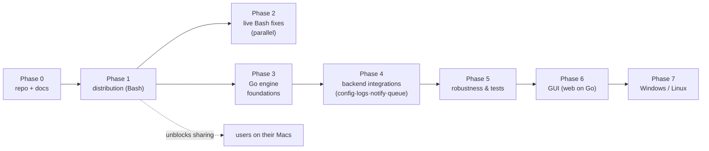
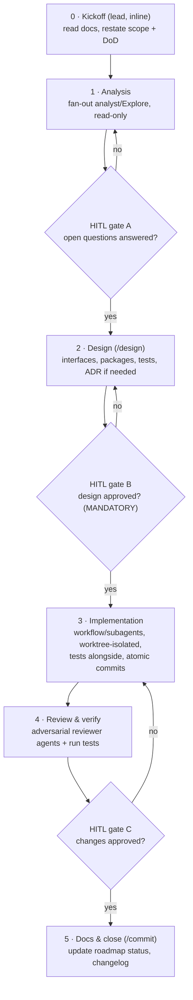
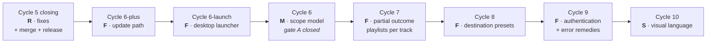

# Roadmap

Single source of truth for **where the work stands and where it is going**.
Updated at the end of each cycle, at `/plan`, at `/review-docs` and at `/handoff`.

Status: `done` · `in progress` · `planned` · `deferred`

`ytdl` is a single Go binary — CLI, on-demand queue daemon and local web GUI over
one core — shipped to non-developer macOS users by a Bash installer that
provisions yt-dlp and ffmpeg itself. See
[ADR-0003](foundation/decisions/0003-engine-language-go.md) for the choice of Go
and [go-engine.md](engine/design/go-engine.md) for the engine as built.

**Where we are now.** **v2.2.0 is released, merged and installed**, Cycle 6-plus is
closed, `DOCS-1` is **closed and merged**, and **`DEV-1` is done** — the project's
primary gate, `go test -race ./...`, no longer destroys the session that runs it and
returns in 8 s ([ADR-0017](foundation/decisions/0017-dev-container-oracle.md)). Its
block below moves to the history once its branch is merged, like every closed unit.

Next is **Cycle 6-launch** — ytdl as a double-clickable app — whose **design is done,
whose gate B was approved on 2026-08-27, and whose work is now planned below as
`L1`–`L12`**. It resumes at **implementation**, starting with `L2`. Cycle 6 (the
scope model) has its gate A closed too, and follows it.

A closed unit keeps **one line** here and its full block in
[roadmap-history.md](roadmap-history.md). What is known, worth doing and **not**
scheduled is in [improvements.md](improvements.md), not here.

## Open now

**[`Cycle 6-launch`](#cycle-6-launch) — the desktop launcher — is in flight, and its
work is now planned.** Its gate B was approved on 2026-08-27 and design §8's eight
steps are on the roadmap below as `L1`–`L12`, each with what it depends on. `L1` is `done` — the
design, ADR-0019 and their index rows are on the branch `feat/launch/design`, **not yet
merged**. The next phase is **implementation**, and it starts at `L2`.

Its rulings are, in the order to read them:
[ADR-0018](distribution/decisions/0018-desktop-launcher-app-bundle.md) (gate A — the
artefact) → [ADR-0019](distribution/decisions/0019-launcher-mach-o-and-recorded-versions.md)
(gate B — which Mach-O, and the cold-start remedy) →
[the design](distribution/design/cycle6launch-launcher.md). The measurements behind
all of them are the
[analysis](distribution/analysis/2026-08-26-tech-choice-desktop-launcher.md).

`DOCS-1` and `DEV-1` both closed and merged on 2026-08-26. Cycle 6 (the scope model)
keeps its closed gate A and follows this cycle.

✅ **The Gatekeeper unknown is settled, on hardware.** A bundle generated on the
machine carries **no quarantine attribute**, so Gatekeeper never assesses it and no
Developer ID is needed. [ADR-0001](distribution/decisions/0001-distribution-channel.md)
is superseded in part — its rejection reasoned about a *downloaded* bundle. The
artefact is fixed: an app bundle around a **linker-signed Mach-O**, not a shell
script and not an `osacompile` applet.

⚠️ **What the same verification found instead** now sets this cycle's hardest
constraint: the GUI daemon takes **~7.5 s** to open its port against `waitForGUI`'s
**10 s** cap, and the cost is a single `yt-dlp --version` — **7.33 s on macOS, warm
or cold** — called synchronously before the port opens. A first click that fails
silently is not a launcher that ships, so it is **in scope**, not deferred behind it.
Its remedy is decided:
[ADR-0019 §2](distribution/decisions/0019-launcher-mach-o-and-recorded-versions.md) —
the daemon answers from `installed.conf` and reconciles with a probe once the port is
open, which **closes `T4`**.

## Closed phases

| Phase | Outcome | Block |
|---|---|---|
| Phase 0 — Repository & documentation | closed 2026-07-21 | [block](roadmap-history.md#phase-0) |
| Phase 1 — Distribution | closed at v2.0.0, 2026-07-23 | [block](roadmap-history.md#phase-1) |
| Phase 3 — Go engine foundations | closed at v2.0.0, 2026-07-23 | [block](roadmap-history.md#phase-3) |
| Phase 4 — Backend integrations (Go) | closed at v2.1.0, 2026-08-09 | [block](roadmap-history.md#phase-4) |

The release sequence these phases established, and the two failures it cost, are
in [the release guide](distribution/guides/releasing.md).

## Phase 2 — Live Bash fixes — `planned` (parallel, optional)

Cheap correctness fixes to the **currently shipping** Bash tool, worth doing for
real users today while the Go engine (phases 3–6) is built. Kept deliberately
small: only what is low-cost on Bash and not superseded by the port. The
substantive versions of persistent logs, notifications, config and the queue are
delivered by the Go engine, not bolted onto the Bash script.

| # | Item | Ref |
|---|---|---|
| 2.1 | Validate `--format` against the supported list | C1 |
| 2.2 | Handle multiple URLs, or reject extra arguments explicitly | C3 |
| 2.3 | Harden the `-b` re-exec argument forwarding | C4 |
| 2.4 | Sanitise failure-log filenames | C5 |
| 2.5 | Check AtomicParsley when format is `m4a`, or restrict formats | C2 |

## Phase 5 — Robustness & tests (Go) — `in progress`

Hardening of the new engine once its features exist: comprehensive error handling,
edge cases, retries/backoff, YouTube rate-limit handling, and a real test suite
(Go's `testing`, beyond the golden tests of 3.3).

**Started in Cycle 2B-plus (2026-07-24):** a per-job execution timeout (`job_timeout`,
default off) that kills a hung download via a process-group teardown; a daemon
diagnostics log surfacing the previously-invisible failures ADR-0007 flagged; and a
"no residue in the destination" guarantee (intermediates routed to a scratch dir).
See [ADR-0011](engine/decisions/0011-cycle2b-plus-cancel-retry-hardening.md). **Still
planned as a dedicated cycle:** automatic retries/backoff (`Attempts`/`NotBefore`)
and YouTube rate-limit handling — the riskiest hardening, deliberately separated
from the manual cancel/retry above.

## Phase 6 — GUI — `in progress` (6b + 6c done and shipped in v2.1.0; 6d planned; 6a split — launcher next, paste/drop deferred)

A GUI for non-developer users. It is a **front-end over the Go engine** (config +
queue + runner already built), not a reimplementation. Runtime is settled by
ADR-0003: a web UI served by the Go daemon. Its **lifecycle** is settled by
[ADR-0008](engine/decisions/0008-daemon-lifecycle.md): the daemon is **long-lived but
session-scoped, not always-on** — it lives while a GUI client is connected OR the
queue has work, and exits only when the GUI is closed AND the queue is drained
(the CLI-only path is the no-GUI special case). No `launchd` always-on service is
installed by default.

| # | Item | Status | Notes |
|---|---|---|---|
| 6a | AppleScript/Automator MVP: paste/drop URL, pick folder, enqueue | split (2026-08-12) | its **entry point** — a double-clickable icon that brings up the GUI — is pulled out as **Cycle 6-launch** and runs next; the paste/drop-and-enqueue app stays planned, and may prove unnecessary once the GUI is one click away |
| 6b | Web UI served by the daemon: live progress, format/settings, per-run/session/global output dir, settings editor, queue + in-progress view | done (Cycle 3) | `net/http` + SSE; single binary; authenticated local API |
| 6c | Multi-view GUI (Download · Cronologia · Impostazioni), actionable queue and history, open/reveal the downloaded file | done (Cycle 5, shipped in v2.1.0) | designed with the CLI in one pass; [ADR-0013](ux/decisions/0013-cycle5-unified-ux.md) |
| 6d | GUI/CLI follow-through from the gate-C review: scope model, partial outcomes, destination presets, authentication, visual language | planned (Cycles 6–10) | [ADR-0014](ux/decisions/0014-ux-scope-model-and-partial-outcome.md) · [findings](ux/reviews/001-cycle5-gate-c.md#gate-c) |

**Cycle 3 (6b) — done, merged to `main` (2026-07-24), shipped in v2.1.0.** `ytdl gui`
opens a self-contained embedded web page served by the same binary (a `__daemon
--gui` role — no separate `cmd/ytdld`, refining ADR-0008 for installation
simplicity). Live per-job progress streams over SSE, captured from both of yt-dlp's
output streams off the golden argv path (`internal/core` byte-unchanged). The
settings editor persists through the new `config.Save` (whitelist-only, validated,
atomic). The queue is **read-only** by decision (`cancel`/`retry` stay Cycle
2B-plus). The local API is authenticated (per-session token + `Origin` +
`application/json` + URL validation) and only opened by a GUI daemon — `ytdl -b`
stays headless. Adversarially reviewed (3 reviewers; the real findings —
progress-on-stdout, a hub close-race that could kill the daemon, a CSRF→argv-
injection path, and the port-before-lock ordering — all fixed and verified against
real yt-dlp). See [ADR-0010](ux/decisions/0010-cycle3-web-gui.md).

The settings editor writing the config file is safe precisely because the config
is parsed with a whitelist, not `source`d (3.5).

## Phase 7 — Windows / Linux — `deferred`

Out of scope until macOS distribution is proven with real users. Now mostly a
second installer and dependency path, since the Go engine cross-compiles
(`GOOS`/`GOARCH`). Notifications abstract to `notify-send` on Linux.

## Deferred / evaluated, not scheduled

- **GUI installer window (`.dmg`/`.pkg`)** — deferred. A native installer window
  without Gatekeeper friction needs paid signing ($99/yr), which is out of scope.
  The constraint-respecting alternative is a double-clickable `install.command`
  (browser-quarantined → one-time Privacy & Security override), a shell wrapper
  over the same installer. Not a priority.
- **Python as a universal dependency** — evaluated and rejected
  ([ADR-0003](foundation/decisions/0003-engine-language-go.md)): it would break the
  non-interactive install for the majority to benefit only the GUI, which Go
  serves without a runtime dependency.

## Implementation via development cycles

Phases 3–6 are executed as **sequential development cycles — one per session**.
Each session orchestrates its cycle by delegating to subagents / workflows, under
one non-negotiable rule:

> **Implementation never starts without preliminary analysis + design + an explicit
> human-in-the-loop (HITL) approval of the design.**

### Per-session protocol

- **No file writes before gate B.** Stages 0–2 are analysis/design only (per the
  workflow rules). Stage 3 is the first that touches implementation files.
- **Skills/agents:** `/analyze` + `analyst`/`Explore` (stage 1), `/design` (stage 2),
  `reviewer` + `/review` (stage 4), `/commit` (stage 5).
- **Agent budget — balance by complexity, soft cap ~5–10 per cycle** (the workflow
  engine caps concurrency regardless): analysis 1–3, design 1–2, implementation
  3–8 (widest), review 2–3.
- **Workflow vs subagent:** use the Workflow tool for wide deterministic fan-out /
  pipelines and adversarial review panels (requires explicit opt-in per session —
  e.g. "orchestrate this cycle with a workflow"); use individual subagents for a
  handful of independent analysis/review tasks.

### Closed cycles and work units

| Unit | Outcome | Block |
|---|---|---|
| Cycle 1 — Go engine foundations & parity | shipped as v2.0.0, 2026-07-23 | [block](roadmap-history.md#cycle-1) |
| Cycle 2 — Backend integrations (2A · 2B-core · 2C · 2B-plus) | merged 2026-07-23/24, shipped in v2.1.0 | [block](roadmap-history.md#cycle-2) |
| Cycle 3 — GUI (phase 6b) | merged 2026-07-24, shipped in v2.1.0 | [block](roadmap-history.md#cycle-3) |
| Cycle 4 — CLI UX pass #2 | merged 2026-07-24, shipped in v2.1.0 | [block](roadmap-history.md#cycle-4) |
| Cycle 5 — Unified GUI/CLI UX | merged 2026-08-05, shipped in v2.1.0 | [block](roadmap-history.md#cycle-5) |
| Cycle 5 closing — gate-C fixes (`R`) | released in v2.1.0, 2026-08-09 | [block](roadmap-history.md#cycle-5-closing) |
| Cycle 6-plus — the update path (`F`) | gate C passed 2026-08-23, released as v2.2.0 | [block](roadmap-history.md#cycle-6-plus) |
| `DOCS-1` — documentation framework adoption | merged 2026-08-26, documentation only — no tag, no release | [block](roadmap-history.md#docs-1) |
| `DEV-1` — the suite must not be able to take the container down | merged 2026-08-26, development environment only — no release | [block](roadmap-history.md#dev-1) |

### Post-gate-C cycles — `R → M → F → S`

Class order, decided by the maintainer (2026-08-03): fix what misinforms the user
first, decide what is ambiguous next, add capability after that, restyle last.
Correlated findings are grouped so each session owns one coherent surface.

**Order changed on 2026-08-12.** ytdl was installed for its first user who is not
the maintainer, and two capabilities became urgent for a reason no finding had:
that user must be able to receive the *next* releases, and to start the GUI,
without a terminal and without the maintainer touching their machine again. So
the update path and the desktop launcher are pulled **ahead** of Cycle 6, whose
gate A is closed and which is ready to start on demand. The cycle *names* keep
their suffixes — the numbers are pinned by the `G*` references in
[the Cycle 5 gate-C register](ux/reviews/001-cycle5-gate-c.md#gate-c), so renumbering would falsify them —
and the running order is stated here rather than implied by the names.

Every cycle from 6 onward **starts with its own analysis stage** and follows the
full per-session protocol (analysis → gate A → design → gate B → implementation →
review → gate C → docs). Cycle 5's closing is the only one that skips to
implementation, because its findings carry no open questions.

#### Cycle 6 — the scope model (`M`) — **analysis done, gate A closed (2026-08-12)**

Implements [ADR-0014](ux/decisions/0014-ux-scope-model-and-partial-outcome.md)
decision 1 across the Download view, plus the three findings that live on the
same controls.

**Its analysis ran on 2026-08-12 and its rulings are
[ADR-0015](ux/decisions/0015-cycle6-tab-scope-and-faithful-reruns.md)** — read that
first: it answers the question below (presets do *not* retire the middle scope),
renames that scope to **"in questa scheda"** and moves it into the page, rules
G11 onto the history row, makes a re-run faithful to the original destination,
turns the audio-quality control into a stepped 0–10 slider with a word per step,
and puts every user-supplied value behind one shared validator. It also added
two findings, **G27** and **G28**, which land in this cycle. What remains is the
**design phase**: interfaces, DOM, endpoints and tests.

- **Scope:** G12 + G13 (one rule for folder, format and playlist: one-shot by
  default, effective value always visible with its scope, explicit promotion) ·
  G14 (the playlist control knows whether the link carries `list=`, and says so —
  the `v=…&list=…` case is the one that silently downloads two hundred tracks) ·
  G15 (named audio-quality steps; hidden or disabled with a reason for lossless
  formats) · G16 (the session override is validated before it is accepted) · G17
  (the GUI confirms a completion in the view the user is on, and offers "Apri" on
  what just finished) · G18 (filters and search survive a reload) · G11 (the
  failed-spool row, deferred here from the closing session: the design must first
  settle what that row *is*, since the same job also appears in the history under
  a different verb).
- ~~**Analysis must settle:** whether destination presets (Cycle 8) **retire** the
  session scope altogether.~~ **Answered** (ADR-0015 §1): they do not. A preset is
  a *value*, a scope is a *duration*; they compose, so Cycle 6 builds a promotion
  affordance that Cycle 8 fills with named values and adds no fourth scope.
- **Recorded by the Cycle 5 review, for the views this cycle reworks anyway:**
  the failure-log panel does not return focus when it closes and does not close
  on Escape (it became focusable in G6, so this is now worth having); switching
  views leaves it open over a list that has been reloaded under it; and a
  **relative** `output_dir` is displayed unresolved by both new destination
  surfaces. That last one is a trap: it must **not** be "fixed" by making the
  path absolute in the reader, because it is the daemon's working directory that
  resolves it — the reader would state something false. It belongs with G16,
  which is where a session override stops being accepted unvalidated. **Ruled**
  (ADR-0015 §7): the refusal happens at input and the value is never rewritten;
  an existing relative `output_dir` is displayed as written, marked as resolved
  by the engine.
- **Done when:** a user can always see where the next download will land and
  which scope decided it; no per-download control is sticky by accident; the same
  rule is stated once in `ux-principles.md` §8 and holds in both channels.

#### `Cycle 6-launch` · The desktop launcher (`F`) — `planned` (opened 2026-08-23, planned 2026-08-27)

**Why now.** Cycle 6-plus's gate C passed with exactly one recorded exception,
`C2`: the update no longer needed a Terminal, but **opening the interface still
did** — for an audience the GUI exists to spare a Terminal, the one thing it was
built to avoid. This cycle delivers the **entry point** half of phase item `6a`
and leaves 6a's paste/drop-and-enqueue app to a later pass, if it is still wanted
once the interface is one click away.

**Read in this order:**
[ADR-0018](distribution/decisions/0018-desktop-launcher-app-bundle.md) (gate A —
the artefact, `~/Applications/YTDL.app`, the name, Gatekeeper measured on
hardware) →
[ADR-0019](distribution/decisions/0019-launcher-mach-o-and-recorded-versions.md)
(gate B — a dedicated launcher, and the cold start answered from `installed.conf`)
→ [the design](distribution/design/cycle6launch-launcher.md), §8 for the steps and
§5 for the cold start. Every measurement behind the three is in the
[analysis](distribution/analysis/2026-08-26-tech-choice-desktop-launcher.md).
**The questions this entry used to hold open are all answered there** — the
artefact, the name, idempotence, the port and the headless daemon, what "quit"
means, and what the user sees while it starts. None is reopened here.

| id | entry | depends on | status |
|---|---|---|---|
| L1 | the design, ADR-0019, and their two rows in `docs/README.md` | — | `done` |
| L2 | `internal/update`: the recorded version walk, `RecordedDependencies`, and the two comments the measurements falsified | — | `planned` |
| L3 | `cmd/ytdl`: the constructor reads the record; `runDaemon` reconciles with a probe after `startWebUI` | L2 | `planned` |
| L4 | `cmd/ytdl-launch`: resolve `ytdl` absolutely, run `ytdl gui`, always log, alert only on failure | — | `planned` |
| L5 | `.github/workflows/release.yml`: the two launcher assets, in `SHA2-256SUMS`, with the arm64 `LC_CODE_SIGNATURE` asserted | L4 | `planned` |
| L6 | `install.sh` pure functions: `app_dir`, `launcher_asset_for`, `render_app_plist`, `app_is_current`, `app_sidecar_path` | L4 | `planned` |
| L7 | `install.sh`: `install_app_bundle`, wired after `verify_install` and before `write_marker`, non-fatal | L6 | `planned` |
| L8 | the Italian surfaces — both user guides, `YTDL_APP_DIR` in `hack/ytdl-dev.sh` and `dev-testing.md`, `CHANGELOG.md` under `[Unreleased]` | L3 · L7 | `planned` |
| L9 | `/review-implementation`, then `/review-docs` on the same branch | L1–L8 | `planned` |
| L10 | merge `--no-ff` into `main` | L9 | `planned` |
| L11 | **cut the release**, so `releases/latest` carries the launcher assets | L10 | `planned` |
| L12 | **gate C** on hardware — the eight items in [design §9](distribution/design/cycle6launch-launcher.md) | L11 | `planned` |

**Two independent halves, in this order.** L2–L3 are the cold-start remedy and
ship without the bundle; L4–L7 are the bundle, which without the remedy would ship
the defect ADR-0018 pulled into scope. Neither half depends on the other; they land
in this order so the diff reads as two coherent halves.

**Constraints.**

- `internal/core` stays **byte-unchanged** and `internal/daemon` untouched. The
  parity gate `git diff main -- internal/core/ internal/daemon/` comes back empty
  at **every** commit, not only at the end.
- Every step ends green on the **whole** gate, not just its own oracle:
  `go test -race ./...` · `go vet ./...` and `gofmt -l` empty ·
  `bash tests/test-installer.sh` · `./hack/check-docs-links.sh` · the parity gate.
- **Tests are written from the design, by the independent tester role.**
  [Appendix C](distribution/design/cycle6launch-launcher.md) is the contract list;
  it is not derived from the implementation.
- **The bundle step never fails the install** (design §4.4) — an app that cannot be
  written is warned about, never aborted on.

⚠️ **L11 is not optional, and the L10 → L11 gap is a surface.** `install.sh` is
served from `main` while assets come from `releases/latest`, so in that window the
newest release carries no launcher. Any run of the installer in it — a fresh
install, a `deps.conf` change, a forced `ytdl --update` — takes the warn-and-continue
path and installs **no app**. Non-fatal by design, and still a user meeting a
warning for something that is merely not released yet. **Gate C's four
bundle items cannot be observed before L11.**

- **Done when:** a non-developer starts ytdl **as an app** — from the Applications
  folder, the Dock, or wherever they chose to put it — twice in a row, without a
  Terminal ever appearing, and uninstalling removes it. That closes `C2`, the
  single exception Cycle 6-plus's gate C recorded.

#### Cycle 7 — partial outcome and playlists per track (`F`) — planned

Implements ADR-0014 decision 2, plus the storage work it forces.

- **Scope:** G19 (three outcomes end to end: record, both history renderers, the
  notifier, the breadcrumbs) · G20 (per-item data is persisted, not discarded —
  expandable per-track detail in the GUI, an equivalent in the CLI, and a
  "Riscarica" that offers the failed items) · G21 (`history.jsonl` stops being an
  unbounded full-file scan, which per-item records make urgent) · G22 (cursor
  paging, since the same read path is being reworked) · G23 (land the concurrent
  `Append` stress test the Cycle 5 review wrote but never committed).
- **Design must settle:** how a selective retry addresses items. Item ids are
  stable and playlist indices are not, so `--match-filters` on id is the leading
  candidate over `--playlist-items`, a per-item job fan-out, or
  `--download-archive` (which would also block deliberate re-downloads). Whatever
  it picks is appended **after** `core.BuildArgs`, like `TempRedirectArgs`, so the
  parity gate holds.
- **Done when:** a playlist that lost one track says so, in both channels, with
  the ratio and the per-track detail one step away; retrying it does not
  re-download what already succeeded; history reads no longer scale with the
  whole file.

#### Cycle 8 — destination presets (`F`) — planned

- **Scope:** G24 — named folder presets recalled instead of retyped, in both
  channels, plus a **native folder picker** driven by the daemon (`osascript -e
  'choose folder'` on macOS, `zenity`/`kdialog` on Linux) exposed as an advertised
  capability, since a browser cannot obtain a real path. `internal/open` already
  owns desktop actions and the "never render a control the platform cannot
  honour" rule.
- **Design must settle:** the config representation. The file is strict
  `key=value` with a whitelist and is never `source`d (U4, a security property,
  not a convention), so a list needs a scheme — the leading candidate is a
  `preset_<name>` prefix rule with a validated name charset, which keeps one
  hand-editable, diffable document and lets `ytdl config` list them.
- **Inherits from Cycle 6** ([ADR-0015](ux/decisions/0015-cycle6-tab-scope-and-faithful-reruns.md) §1):
  presets do **not** replace a scope. A preset is a *value*, a scope is a
  *duration*, and they compose — a preset can be used for one download, kept for
  the tab, or saved as the default. This cycle fills the affordance Cycle 6
  builds; it does not add a fourth scope.

#### Cycle 9 — authentication and error remedies (`F`) — planned

- **Scope:** G25 — a validated `cookies_from_browser` key wired through to
  `--cookies-from-browser`, appended off the golden argv path, **off by default**
  and plainly labelled, with its own failure modes anticipated (Full Disk Access
  for Safari, a keychain prompt for Chrome). Completes the G8 hint catalogue with
  the age- and bot-restriction remedies, which only become honest once the
  remedy exists.
- **Note:** the 429 / rate-limit hint shipped in the closing cycle points at the
  same territory as the deferred Phase-5 hardening cycle (auto-retry/backoff).
  If Phase-5 runs first, the hint text is revisited there instead.

#### Cycle 10 — visual language (`S`) — planned

- **Scope:** G26 — write `docs/ux-visual-language.md` (type scale, spacing scale,
  radii, elevation, colour **semantics** separated from the action colour,
  density, focus, motion) and then apply it. The document is the deliverable that
  outlives the restyle, exactly as `ux-principles.md` outlived Cycle 5.
- **Plus the update surface, added 2026-08-23 by the maintainer at gate C.** The
  update path works end to end, and the way it is *presented* is the weakest part
  of it. Two things to take as input, not as settled requirements:
  - [`V26`](distribution/reviews/004-cycle6plus-gate-c.md#V26) — while an install is running the *Conferma*
    button stays live in the versions block, and pressing it answers «un
    aggiornamento è già in corso». A control that cannot work is still offered,
    which `ux-principles.md` §5 forbids. **One line closes it** (the finding names
    it); it is deferred here because the third point subsumes it.
  - [`V27`](distribution/reviews/004-cycle6plus-gate-c.md#V27) — **this one is normative, and its deferral is a
    debt rather than a preference.** With an unattested ffmpeg the page prints the
    tool twice, the first time as «versione non registrata», while the marker holds
    its build and the CLI prints it correctly. A surface stating something untrue
    is what `ux-principles.md` §5 and non-negotiable #5 forbid outright. It is here
    because the honest fix is the same scope decision as the point below — the page
    must stop reusing the COMPARISON shape for DISPLAY — and because no
    installation is in that state today. Upstream is already at 9.0.1, so that will
    change. **Cycle 10 does not start without this item.**
  - [`V29`](distribution/reviews/004-cycle6plus-gate-c.md#V29) — *Controlla ora* is never disabled during an
    update, and its answer can put *Aggiorna* back on screen. Reproduce it before
    fixing: the finding separates what the code explains from what was observed.
  - **An update in flight probably deserves a surface of its own** — the
    maintainer's words: "meglio una pagina ad hoc «updating», così l'utente non
    usa ytdl o clicca altro mentre l'update è in corso". Today it is a panel
    beside controls that keep working, on a page whose other sections stay live.
    That is a scope question (does the whole document go into an updating state?
    what happens to the queue?), not a styling one, so it is analysed here rather
    than patched now.
  - Also carried in: [`V22`](distribution/reviews/004-cycle6plus-gate-c.md#cycle6plus-gatec) — immediately after
    an update the verdict reads «nessun controllo ancora eseguito», which is true
    and reads as a failure.
- **Hard constraints:** no external assets — the CSP is `script-src 'self'` and
  the binary is self-contained, so no CDN fonts and inline icons only; no
  `innerHTML` (a test enforces it); dark mode; one document that never reloads
  (ADR-0008's liveness clause).
- **Runs last on purpose:** restyling a surface whose controls are still moving
  would be done twice.

## Deferred / planned, not yet scheduled

- **Phase-5 hardening cycle** — automatic retries/backoff (`Attempts`/`NotBefore`)
  and YouTube rate-limit handling, plus the flaky
  `TestRunQueuedCancelKillsProcessGroup` timing. **Constrained by
  [ADR-0015](ux/decisions/0015-cycle6-tab-scope-and-faithful-reruns.md) §5:** manual
  and automatic retry are one feature with one state, not two features that meet
  on a row. A job awaiting an automatic attempt waits *in the queue* and says what
  for; its "Riprova" is disabled with the reason and the wait; pressing it means
  "now, not later" and cancels the pending attempt rather than adding a second. A full design already exists from
  a mis-scoped design fork during Cycle 4; it is a good starting point. It was
  "next after Cycle 5" until the gate-C review; it now follows the R → M → F → S
  cycles, and can be pulled forward ahead of Cycle 9, whose rate-limit hint text
  overlaps with it.
- **6a AppleScript/Automator MVP** — **split (2026-08-12)**: the launcher icon is
  now Cycle 6-launch and runs next; what stays deferred is the paste/drop-and-
  enqueue app, which may not be wanted once the GUI opens from the desktop.
- ~~**Release of everything since v2.0.0**~~ — **done: v2.1.0, 2026-08-09.** Cut at
  the Cycle 5 merge as decided on 2026-07-26, carrying Cycles 2A, 2B-core, 2C, 3,
  2B-plus, 4 and 5 in one tag.
- **Writable CLI config editor** (`ytdl config set`) — deferred by ADR-0013: it would
  duplicate `config.Save`'s validation for a task the GUI already serves.
- **Reordering the pending queue** — considered for Cycle 5 and left out: it needs a
  new spool primitive (the spool is FIFO by filename today).

## Known open questions

- ~~Does the Python 3.13 install path actually work end-to-end on a real Mojave
  machine?~~ **Closed by [ADR-0005](foundation/decisions/0005-macos-floor-and-single-engine.md):**
  the floor is raised to macOS 10.15 and the Python/legacy path is dropped, so the
  question is moot.
- Is ffmpeg strictly required for every format we advertise, or only for cover
  embedding and some conversions? Affects whether ffmpeg can be optional (C2).
- Sequoia/Tahoe Gatekeeper specifics matter only if a `.app`/`.pkg` ships — now
  only relevant to a possible `install.command`, not the web GUI.
- ~~**Documentation drift (found in Session 1):** the `ytdl` script header comment
  lists an *album* ID3 tag, but `meta_args` writes only `meta_artist`/`meta_title`.~~
  **Closed (Session 3):** the Go port correctly omits album (parity, golden-tested)
  and the Bash header comment was corrected.
