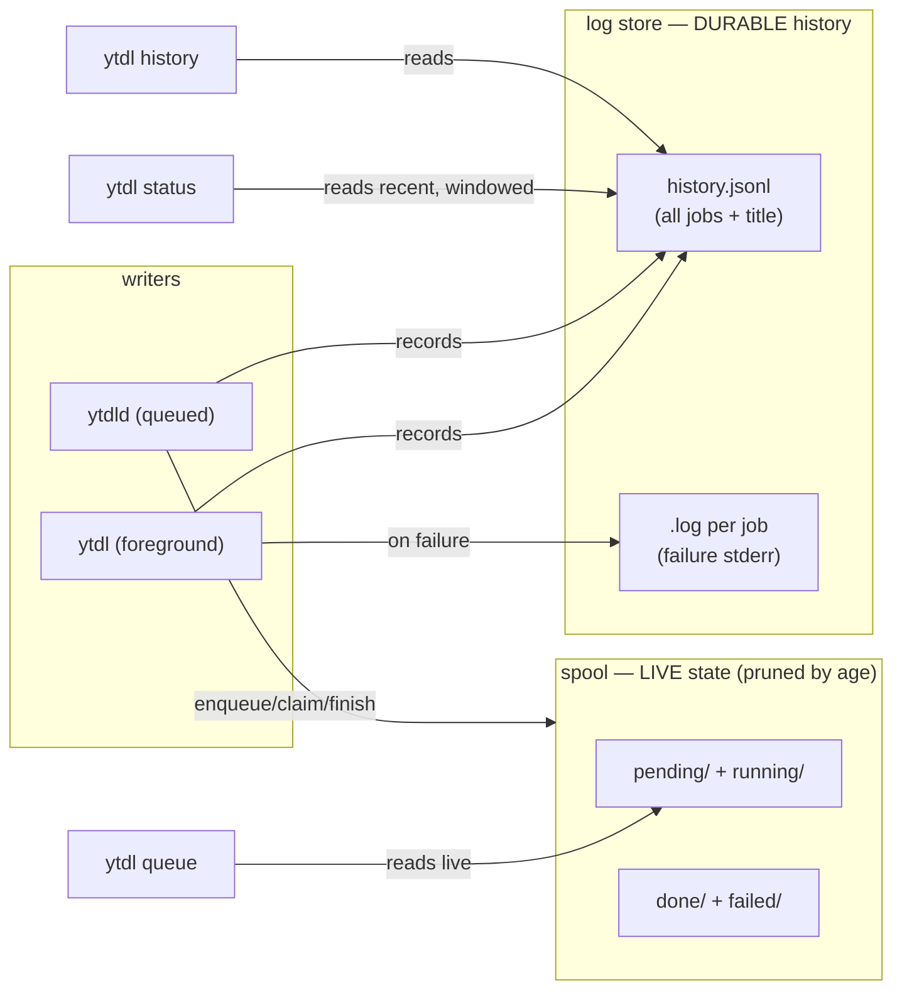

# ADR-0009 — Cycle 2C: CLI UX pass

- **Status:** accepted
- **Date:** 2026-07-23
- **Context:** [roadmap.md](../../roadmap.md) (Phase 4, Cycle 2C), [ADR-0006](../../engine/decisions/0006-cycle2a-logs-breadcrumbs-notifications.md)
  (log store + notifications), [ADR-0007](../../engine/decisions/0007-cycle2b-queue-daemon.md) (queue +
  on-demand daemon), [ADR-0008](../../engine/decisions/0008-daemon-lifecycle.md) (daemon lifecycle → the
  UX is lifecycle-agnostic), [improvements.md](../../improvements.md) (U5 queue, U7 logs).
- **Scope:** a UX polish of the CLI surface exposed by Cycle 2B-core. **Runtime/CLI
  layer only** — `internal/core` is untouched and the golden argv references stay
  byte-identical. The full principles + command→action map live in the maintainer
  reference [cli-reference.md](../design/cli-reference.md).

## Context

Cycle 2B-core shipped correct queue/daemon *mechanics*, but its CLI *surface* was
not yet designed as UX. Real use (2026-07-23) surfaced three concrete problems and
a few structural ones:

1. **`queue --watch` cleared the whole screen** each tick (`\033[H\033[2J`), which
   wiped the user's terminal and — because the erased lines fall into scrollback —
   spammed the buffer (a wall of repeated frames when copy-pasted).
2. **The completion count was misleading.** `status`'s `completati` counts files in
   the spool `done/` directory: **background-only** (foreground downloads never
   touch the spool), **lifetime-cumulative**, **never pruned** (a storage leak),
   and **path-global**. It answers no real question and hides foreground downloads.
3. **`-n` (preview) dumped raw yt-dlp errors** (e.g. YouTube's "Sign in to confirm
   you're not a bot"), unmediated — the one mode that surfaces the external tool's
   stderr verbatim.

Plus: `queue` and `status` overlap; there is **no history command** although the
help already promises *"riepilogo e storico"*; and output has no colour or
TTY-awareness.

The hard constraint is unchanged from 2A/2B: `core.BuildArgs` and the goldens stay
**byte-for-byte identical**. Every change here is runtime/CLI, off the golden path.

## Decision

Six coordinated changes, plus cross-cutting output conventions.

### 1. Role separation — three distinct questions

| Command | Answers | Content |
|---|---|---|
| `ytdl queue [--watch]` | *what is happening now?* | **live work only**: pending + running. No lifetime counts. |
| `ytdl status` | *is everything OK?* | daemon liveness (**informational**) + live counts + a **recent, windowed** summary from the log store. |
| `ytdl history [--failed] [--limit N]` | *what did I download?* | the durable log (foreground **and** background). Delivers the promised "storico". |

### 2. Count redesign — live vs history

The lifetime `completati`/`falliti` footer is **removed from `queue`**. The spool
tracks only **live** work (pending/running) plus **recently-terminal** jobs (for
`history` cross-reference and the future retry/cancel); the **durable history is
the log store**, which records foreground *and* background jobs. `status`'s
recent summary and `history` both read the log store, so foreground downloads
finally appear.

### 3. Structured history — `history.jsonl` + track title

The log store gains an **append-only `history.jsonl`** in `log_dir`: one JSON
record per job `{time, url, title, mode, format, rc, success}`, written
best-effort alongside the existing per-job `.log`. The **track title** is now
recorded (captured in the runner from the saved-file/`before_dl` output), so
`history` shows a readable *"Artist - Track"* rather than a bare URL (URL is the
fallback for failures with no resolved title). A `Load(dir, QueryOpts)` read-API
(`QueryOpts{Since, Limit, OnlyFailed}`) powers `history` and the `status` summary.
The per-job `.log` files remain the **failure-detail** artifact (they carry the
captured stderr).

### 4. Spool retention — fix the leak

`PruneTerminal` removes `done/` and `failed/` spool files **by age**, reusing the
existing `log_retention_days` (default 30; `0` = keep everything). One retention
concept across the tool. Pruning is best-effort and opportunistic (on the queue
read paths and after the daemon marks a job terminal).

### 5. In-place `--watch`

Region redraw, not a screen clear: remember the printed line count `N`; each tick
move the cursor up `N` (`\033[{N}A`) and clear to end of screen (`\033[0J`), then
rewrite. **Redraw only on change**, with a header spinner for liveness; the cursor
is hidden during the watch and restored on exit. **Non-TTY fallback**: when stdout
is not a terminal (piped/redirected) emit no ANSI and print a single snapshot.
**Auto-exit** when the queue drains, with a one-line final summary; Ctrl-C still
interrupts and restores the terminal.

### 6. Legible `-n`

`runDryRun` captures yt-dlp's stderr (as `runDefault` already does) instead of
teeing it raw. On failure it prints a mediated message; the YouTube bot-check
signature is recognised and gets a specific hint (*"Anteprima non disponibile:
YouTube ha chiesto una verifica anti-bot… il download vero di solito funziona"*).
Raw detail stays available via `-v`. **Aligning the preview's *extraction* with the
download path is a deferred follow-up**, gated on an empirical repro on real
hardware (the bot-check is YouTube-side and non-deterministic).

### Cross-cutting output conventions

- **TTY-aware restrained colour** (green ✓, red ✗, dim pending, cyan running),
  **off when piped** and when `NO_COLOR` is set. `isatty` via `os.ModeCharDevice`
  — **stdlib only, no new dependency**.
- **Explicit window labels** on every windowed count/list, derived from the
  *effective* `log_retention_days`: *"ultimi 30 giorni"* (or the configured N;
  *"da sempre"* when `0`). A number is never shown without its window.
- **Empty-state hints** (`(coda vuota) · accoda con ytdl -b <url>`).
- **Consistent vocabulary**: ▸ action · ✓ ok · ✗ fail · ! warning · ♪ track ·
  • pending · ⟳ running.

## Alternatives considered

- **Minimal history by parsing the existing `.log` files** (no title) — rejected in
  favour of `history.jsonl` + title. Titles make history actually answer *"what did
  I download?"*; parsing human-readable `.log` bodies for a listing is brittle.
- **Keep the lifetime counts, just label them** — rejected. A lifetime cumulative of
  *background-only* jobs answers no real question; the right decomposition is
  live + windowed-recent + durable-history.
- **Alternate screen buffer (`\033[?1049h`) for `--watch`** — rejected: it hides the
  user's existing terminal context during the watch. Region redraw keeps it visible.
- **Full-screen clear plus `\033[3J`** (also clears scrollback) — rejected: still
  wipes the terminal on every tick; the region redraw is non-invasive by design.
- **Retention by fixed count, or age-OR-count** — rejected for a single reused age
  concept (`log_retention_days`), the least surprising and already-configured.

## Consequences

- **New public surface:** `ytdl history [--failed] [--limit N]`; `queue`/`status`
  output changes; `--watch` now auto-exits. User docs (`guida-uso.md`) updated on close.
- **`internal/logstore`** gains the structured stream, a `Load`/`QueryOpts`
  read-API, JSONL retention, and a `Title` field on the record.
- **`internal/run`** records the title (best-effort) and mediates `-n` failures.
- **`internal/queue`** gains `PruneTerminal`; spool `done/`/`failed/` stop growing.
- **New `internal/term`** (isatty + colour helper), stdlib-only.
- **Parity preserved:** `internal/core` byte-identical; goldens untouched;
  `concurrency`/log keys still off the argv path.
- **Coordinates with 2B-plus** on the shared spool: 2C prunes `done/`/`failed/`;
  2B-plus reads `failed/` for `retry`. Non-conflicting (prune is age-based; retry
  acts on recent failures), but sequenced to avoid a merge clash on `queue.go`.

