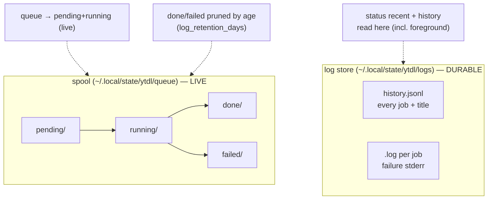

# ytdl CLI — Maintainer Reference

The reference for the command-line surface of `ytdl`: the design principles, the
command → action map, output conventions, the live-vs-history state model, and the
rationale behind each UX choice. It is a **maintainer** document — for how the CLI
is *built and extended*, not an end-user guide (that is
[guida-uso.md](../../../users/guides/guida-uso.md), in Italian). Written against the Cycle 2C design
([ADR-0009](../decisions/0009-cycle2c-cli-ux.md)); update it when the surface changes.

> **Interface language.** User-facing CLI strings are **Italian** (the audience);
> code, identifiers and this document are English. Keep new messages Italian and in
> the shared message files, never inlined ad hoc.

## 1. Design principles

- **P1 — Live vs history are different questions, answered by different commands.**
  "What is running now?" (`queue`) is not "what did I download?" (`history`) is not
  "is the system healthy?" (`status`). Never fold one into another.
- **P2 — No lifetime counters. Windowed, and always labelled.** A cumulative
  count-since-forever answers nothing. Every count/list that covers a time window
  states the window, derived from the *effective* `log_retention_days`
  (*"ultimi 30 giorni"*; *"da sempre"* when `0`). A number without its window is a bug.
- **P3 — Daemon-lifecycle-agnostic.** The CLI reads **live** work from the spool and
  **history** from the log store; daemon liveness is *informational*, never treated
  as an error. This stays correct whether the daemon is on-demand (today),
  session-scoped, or a future start-on-work agent ([ADR-0008](../../engine/decisions/0008-daemon-lifecycle.md)).
- **P4 — Non-invasive terminal output.** Live views update **in place** (region
  redraw), never clear the whole screen or pollute scrollback. Anything that emits
  ANSI first checks it is writing to a TTY.
- **P5 — Mediate external errors.** yt-dlp/ffmpeg stderr is captured and translated
  into a legible message; the raw dump is available behind `-v`, not the default.
- **P6 — One source of truth per concern.** The **spool** owns live + recently-
  terminal state; the **log store** owns durable history. Do not derive history from
  the spool (it is background-only and pruned) or liveness from the log store.
- **P7 — Consistent vocabulary.** The same glyph always means the same thing (§3.1).
- **P8 — Standard library only.** No third-party CLI/TTY/colour dependency; `isatty`
  is `os.ModeCharDevice`. Keeps the single-static-binary distribution intact
  ([ADR-0003](../../foundation/decisions/0003-engine-language-go.md)).

## 2. Command → action map

`realMain` dispatches in this order: `__daemon` (hidden, intercepted before the
parser) → reserved subcommand keywords (`queue`, `status`, `history`, `gui`,
`cancel`, `retry`) → the download parser (a URL never collides with a keyword).
Exit codes: `0` success, `1` user/parse/setup error (incl. a cancel/retry whose
target could not be acted on), yt-dlp's own code (incl. `128+signal`) for a
download.

**Command/URL disambiguation (Cycle 4, ADR-0012).** A reserved keyword is only
dispatched at `args[0]`; any other positional is the download URL. To catch a
mistyped subcommand (`ytdl queu`) without breaking valid inputs, the download parser
rejects a **bare word** (a token with none of `/ . :`) *only when it is close to a
known command* (Levenshtein ≤ 2) — printing a "did you mean" hint. A bare word that
is not near any command is passed straight to yt-dlp, because a bare 11-char YouTube
video id or a playlist id is a valid yt-dlp input (verified 2026.07.04) and must not
be rejected. `looksLikeURL`/`nearestCommand` live in `internal/cli/guess.go`;
`ytdl -- <token>` bypasses the guard.

| Invocation | Action | Reads / writes | Output |
|---|---|---|---|
| `ytdl URL` | download, default mode | writes: log store + title; breadcrumb on failure | progress + `✓ Salvata in …` |
| `ytdl -n URL` | preview (no download) | reads yt-dlp (simulate) | filenames, or a **mediated** failure (§3.5) |
| `ytdl -s URL` | download, silent | as default, no stdout | none (log/breadcrumb/notify only) |
| `ytdl -v URL` | download, verbose | as default | full yt-dlp output |
| `ytdl -b URL` | enqueue + ensure daemon | writes: spool `pending/` | `▸ Download accodato (N in coda)` |
| `ytdl queue` | live queue snapshot | reads: spool `pending/`+`running/` | live list + live footer (no lifetime counts) |
| `ytdl queue --watch` | live queue, in-place | reads: spool (loop) | region redraw; **auto-exit** on drain (§4) |
| `ytdl status` | health summary | reads: spool (live) + log store (recent) + cached verdict | daemon (informational) + live + windowed recent + the update state line (§8.2) |
| `ytdl history [--failed] [--limit N]` | durable history | reads: log store `history.jsonl` | chronological list, title-first (§3.4) |
| `ytdl cancel [<n>\|<id>\|--all]` | stop live work | writes: spool `cancel/` marker; deletes `pending/` | numbered list (no arg), or a per-target `▸ Annullato/Annullamento richiesto` line; exit 1 if any target failed |
| `ytdl retry [<n>\|<id>\|--all]` | re-queue failed | moves `failed/`→`pending/`; resumes daemon | numbered failed list (no arg), or `▸ Rimesso in coda`; exit 1 if any re-queue failed |
| `ytdl gui` | open the web interface | spawns a GUI daemon (`__daemon --gui`) if none is listening, then opens the browser | `▸ Interfaccia ytdl su http://127.0.0.1:8765/` |
| `ytdl -V` / `--version` | version | reads: marker + cached verdict; execs each tool for its version | **all three components**, each with its state, then the update state line (§8.2) |
| `ytdl -h` / `--help` | help | — | usage |
| `ytdl --update` | re-run installer | network; discards the cached verdict on success | streamed installer output (synchronous — §8.4) |

**Flags** (download actions): `-o/--output DIR`, `-f/--format FMT` (validated,
fail-fast), `-p/--playlist`, and the mode flags `-n/-s/-b/-v` (priority: dry-run >
background > verbose > silent > default). `--` takes the next token as the URL.

**Job line format (Cycle 4).** `queue`/`retry`/`cancel` render each job **title-first**
(the resolved `Artist - Track`) with the full URL on the line below; a job with no
known title yet shows the URL alone, and a playlist shows the URL flagged
`(playlist)`. Since Cycle 5's closing, `queue` adds a third line — `cartella: <dir>`,
`~`-contracted — from the output dir **frozen in the job's settings at enqueue**, so
it answers "where will *this* job land" rather than "where would the settings send
one now" (gate-C finding G1). A job whose spec cannot be read prints no such line
rather than an empty label. `cancel`/`retry` do not add it: those lists exist to
identify a job to act on, not to describe where it goes. The title is written onto the spool job while it runs
(`queue.Spool.SetTitle`, driven by `run.RunQueued`'s `onTitle` callback — the daemon
package is untouched); `retry` additionally back-fills a title from the log store
(`logstore.TitleForURL`, per-job `Settings.LogDir`) for jobs that failed before their
metadata resolved.

**Where each part lives** (keep this separation when extending):

- **Parsing** → `internal/cli/parse.go` (`Parse`, `parseQueue`, `parseStatus`,
  `parseHistory`, `parseTargeted` for `cancel`/`retry`). Pure: string args →
  `Parsed`. No I/O. Target resolution (index vs. unique id-prefix, tri-state) lives
  in `cmd/ytdl` (`resolveTarget`), since it needs the live spool snapshot.
- **Rendering** → `internal/cli/*.go` (`RenderQueue`, `RenderStatus`,
  `RenderHistory`). **Pure functions over snapshots/records** → string. No I/O, no
  time-now, no colour decision inside (colour is applied by a passed-in styler).
- **I/O & control flow** → `cmd/ytdl/main.go` (read the spool/log store, the
  `--watch` redraw loop, isatty, signal handling, exit codes).
- **User-facing strings** → `internal/cli/messages.go` (parse-time) and
  `internal/run` (runtime). Italian, centralised.

## 3. Output conventions

### 3.1 Vocabulary

| Glyph | Meaning | Colour (TTY) |
|---|---|---|
| `▸` | an action starting/queued | default |
| `✓` | success | green |
| `✗` | failure | red |
| `!` | warning / advisory | yellow |
| `♪` | a saved track | default |
| `•` | pending job | dim |
| `⟳` | running / spinner | cyan |

### 3.2 Colour

Applied **only** when stdout is a TTY **and** `NO_COLOR` is unset (the
[NO_COLOR](https://no-color.org/) convention). When piped/redirected: plain text,
no escape codes. Colour is a presentation concern applied at the edge (`cmd/ytdl` /
a small styler), never baked into the pure renderers — so a renderer's golden test
is colour-free and stable.

### 3.3 Window labels (P2)

Any count or list bounded by retention prints its window from the effective
`log_retention_days`:

- `N > 0` → *"ultimi N giorni"*
- `N == 0` → *"da sempre"*

Example: `status` → `recenti (ultimi 30 giorni): 12 ok · 1 fallito`.

### 3.4 History listing

Numbered (the index is what `ytdl open`/`again` take), most-recent-first, one line
per job, and then the one fact that differs by outcome — **where** it landed for a
success, **why** it failed for a failure:

```
STORICO ytdl — ultimi 30 giorni
  [1] ✓ 23/07 20:47  Massive Attack - Black Milk   .mp3   ~/Music/ytdl
  [2] ✗ 23/07 19:12  youtu.be/Xk3…                 .mp3   ERROR: … HTTP Error 429: Too Ma…
        YouTube sta limitando le richieste: aspetta qualche minuto e riprova. Se
        succede spesso, riduci i download in parallelo nelle impostazioni.
Apri:  ytdl open <n>   ·   riscarica:  ytdl again <n>   ·   solo falliti:  ytdl history --failed
```

The title comes from `history.jsonl`; a failure with no resolved title falls back
to a shortened URL. `--failed` filters to failures, `--limit N` caps the count,
`--search` matches title, link and saved filename, and `--ids` adds the stable id.
A **narrowed** listing prints ids and advertises those instead of the index, since
`open`/`again` resolve `<n>` against the unfiltered history.

The indented line under a failure is the **next step** (gate-C finding G8,
`ux-principles.md` §5: an error that only states what went wrong is incomplete).
It is derived at render time by `jobs.FailureHint` from the reason already stored,
so records written before the catalogue existed get one too, and the GUI shows the
identical text because it calls the same function. It **wraps** rather than
clipping — the rest of the row may be cut, an instruction may not, or the user
reads `ytdl --updat…` and types a command that does not exist. A failure with no
remedy that exists today (an age- or bot-restricted video, until Cycle 9 ships
`cookies_from_browser`) prints no hint at all rather than an invented one.

### 3.5 Error mediation (P5)

Download modes already translate yt-dlp outcomes. `-n` joins them: its stderr is
captured, and on failure a mediated line is printed. The YouTube anti-bot signature
(*"Sign in to confirm you're not a bot"*) is recognised and gets a specific hint
that the real download usually still works. Unknown failures print a generic line
plus the last stderr line; the full dump is behind `-v`.

This is **live** mediation, in `internal/run`, about the run happening now. It is
distinct from the **history** hint of §3.4 (`jobs.FailureHint`), which is derived
from a stored record long after the fact and is shared with the GUI. The two agree
by intent, not by mechanism: note that the bot signature gets a hint here — "the
real download usually still works", which is true of a dry run — while the history
catalogue stays deliberately silent on it, because a *failed* download has no
remedy for it until Cycle 9.

### 3.6 Empty states

Never a blank or a bare zero — give the next action:
`(coda vuota) · accoda con ytdl -b <url>`.

### 3.7 Advisories, and why they are on stderr

An **advisory** is something ytdl says that the user did not ask for: the update
notice and the foreign-dependency warning (§8). Both carry the `!` mark of §3.1
and both go to **stderr**, never stdout.

That is a compatibility rule, not a stylistic one. `ytdl <url>` prints the saved
path on stdout, and a script may be reading it; an advisory that appeared there
would corrupt output that was correct before Cycle 6-plus. On a terminal the user
sees both interleaved and nothing changes for them.

They print **after** the command's own output, never before it — including when
the command failed. A stale dependency is *more* relevant after a failed
download, and the notice still never claims to be the cause.

## 4. The `--watch` redraw contract

1. **TTY check first.** Not a TTY → print one snapshot and return (no loop, no
   ANSI). This is what makes `ytdl queue --watch | tee log` sane.
2. **Region redraw.** Track the printed line count `N`. Each tick: `\033[{N}A`
   (cursor up N) + `\033[0J` (clear to end of screen), then rewrite; update `N`.
   Never `\033[2J` (whole-screen clear wipes the terminal and fills scrollback).
   The redraw assumes **one logical line = one physical row**, so every rendered
   line — job lines, the header/section/footer, and the spinner — is clipped to the
   terminal width (`term.Width`, 80 fallback) in **display columns**, not runes
   (`term.DisplayWidth`/`term.Clip`: CJK/emoji count as 2), so a wide title never
   wraps and desyncs the cursor math. One-shot views (`queue` without `--watch`,
   `cancel`, `retry`) print the full untruncated URL — a wrap is harmless there.
   `RenderQueue(snap, full, width)`: one-shot passes `full=true`; `--watch` passes
   `full=false` + the width.
3. **Redraw on change only**, with a header spinner (`⟳`) advanced each tick for
   liveness even when the snapshot is unchanged.
4. **Cursor** hidden on entry (`\033[?25l`), restored on exit (`\033[?25h`) — on the
   normal path **and** on SIGINT.
5. **Auto-exit** when the queue drains (no pending, no running): print a one-line
   final summary and return `0`. Ctrl-C also exits cleanly at any time.
6. **Session deltas, not lifetime.** If the watch shows a completed counter, it
   counts transitions observed *since the watch started* (`questa sessione: +K`),
   never the spool's lifetime — consistent with P2.

## 5. State model — spool vs log store

Two stores, two jobs. Keep them from bleeding into each other.



- **Spool** (`internal/queue`): the queue's live truth. `pending`/`running` are the
  only "live" states; `done`/`failed` are *recently-terminal* and **pruned by age**
  (`PruneTerminal`, reusing `log_retention_days`). Only background/queued jobs ever
  enter the spool.
- **Log store** (`internal/logstore`): durable history of **every** job — foreground
  *and* background — since each `run.Dispatch` records one entry. `history.jsonl`
  is the structured index (`{time,url,title,mode,format,rc,success}`); the per-job
  `.log` holds the captured stderr for failure diagnosis. Read via
  `Load(dir, QueryOpts{Since, Limit, OnlyFailed})`. Pruned by age.

Consequence: **history and the `status` summary come from the log store**, so they
include foreground downloads; **`queue` comes from the spool**, so it shows only
what a daemon is (or will be) draining. This is why the old spool-`done/` count was
wrong for "how much have I downloaded".

## 6. UX choices & rationale

| Choice | Why | Ref |
|---|---|---|
| `queue` = live only; no lifetime footer | a lifetime, background-only, unpruned count answered nothing and hid foreground | ADR-0009 §1–2 |
| history from the log store, not the spool | the log store records foreground + background and has retention | ADR-0009 §2–3 |
| `history.jsonl` + title (not parse `.log`) | titles make history useful; structured parse is robust | ADR-0009 §3 |
| in-place redraw, not screen clear | screen clear wiped the terminal and spammed scrollback | ADR-0009 §5 |
| `--watch` auto-exit on drain | matches "enqueue and watch until done" | ADR-0009 §5 |
| daemon liveness informational | the daemon is on-demand today, session-scoped later — "down" is normal | ADR-0008 |
| windowed labels everywhere | a number without its window is ambiguous (the "2" that confused a real user) | ADR-0009 P2 |
| TTY-aware colour, `NO_COLOR` | colour helps interactively, breaks pipes | ADR-0009 |
| stdlib-only isatty/colour | preserve the single-static-binary install | ADR-0003 |

## 7. Extending the CLI — checklist

When adding a command or flag:

1. **Parse** in `internal/cli` (pure), with an unknown-option error + usage, like the
   existing subcommands. Add a test in `parse_test.go`.
2. **Render** as a pure function over a data snapshot in `internal/cli`; golden/table
   test it colour-free. No `time.Now()` inside — pass the clock in.
3. **Wire I/O** in `cmd/ytdl/main.go`; keep the exit-code ownership there.
4. **Strings** go in the message/`run` files, in Italian; add the window label if it
   is windowed (§3.3).
5. **Colour** only at the edge; **TTY-check** before any ANSI.
6. **Docs:** update this file's §2 map and, if user-facing, `guida-uso.md` and the
   `Usage` help text. Record a non-trivial design decision as an ADR.
7. **Parity:** if the change touches `internal/core`, it must keep the goldens
   byte-identical — CLI/UX work should not need to.

## 8. Updates on the CLI (Cycle 6-plus)

Rulings: [ADR-0016](../../distribution/decisions/0016-cycle6plus-update-path.md). Design:
[design-cycle6plus-update.md](../../distribution/design/cycle6plus-update.md). What the GUI does with
the same facts is in [guida-uso.md](../../../users/guides/guida-uso.md) § *Aggiornamenti*.

The CLI has **one axis**: *is there a newer ytdl for me?* Whatever moved — the
ytdl binary, the pinned yt-dlp, or both — the answer is one verdict with one
action. Dependency versions are attributes of the install, never a second thing to
decide.

### 8.1 Where the verdict comes from

Every surface reads a **cached verdict** (a file read in the state dir). No probe
is ever on a path a user waits on. The cache is refreshed off the critical path,
for the *next* invocation, at two startup sites (`update.RefreshAsync`):

- the foreground download path — which covers the plain `ytdl <url>` the installer
  itself tells people to type;
- the daemon path — which covers `-b`, `gui`, `again` and `retry`, and, unlike the
  foreground one, runs in a process still alive when the probe answers.

A refresh runs only when `update_check` is on, the build is not `dev`, and the
cache is older than `update.DefaultTTL` (**24 h**). A round is bounded by
`RefreshBudget` (**30 s**) and writes nothing if the process exits first — the
goroutine simply dies with it, which is intended and not a leak.

A round that got no answer from a source **never overwrites a complete one**: that
would destroy the last known result and its date, which the not-verified state is
required to carry.

### 8.2 The state line — three states that never collapse into two

Printed as the last line of `ytdl -V` and, indented, by `ytdl status`
(`cli.RenderUpdateState`). This is the clause Cycle 5's gate C existed for: a
machine behind a captive portal is **not** a machine that is up to date.

| condition | line |
|---|---|
| local build | `non controllati (build locale)` |
| `update_check = false` | `controllo automatico disattivato` |
| no round ever completed | `non verificati (mai controllato)` |
| a source stayed silent | `non verificati (l'ultimo tentativo non ha ricevuto risposta)` |
| something differs | `disponibile un aggiornamento · ytdl --update` |
| everything matches | `sei aggiornato · verificato il GG/MM/AAAA` |

Only the last one carries a date, and it always carries one: the claim is about a
moment, not about now.

### 8.3 `ytdl -V` — every component with its state

One line per component, then the state line of §8.2. The local facts print
**whether or not any probe ever succeeded**. Per dependency
(`cli.dependencyLine`), the states stay distinct:

| what is true | line |
|---|---|
| not on this machine at all | `yt-dlp non installato` |
| ours, matching the pin | `yt-dlp 2026.07.04   (verificata con questo ytdl)` |
| ours, but the pin names another | `yt-dlp 2026.06.01   (questo ytdl richiede la 2026.07.04)` |
| ours, but its attested build was withdrawn (ADR-0016 §15) | `ffmpeg 9.0   (non verificata: la versione attestata non è più disponibile)` |
| resolved outside our bin dir | `ffmpeg 8.1   (da /opt/homebrew/bin/ffmpeg — non installata da ytdl)` |
| present, but nothing recorded a version | `ffmpeg (versione non registrata)` |
| pin unknown (no round completed) | `yt-dlp 2026.07.04` — bare, because there is nothing to compare against |

ffmpeg is **compared** by build id (`1785863997_9.0`) and **shown** by version
(`9.0`): the build number is the only exact answer and means nothing to a reader.

This screen was opened deliberately, so it pays to exec each tool for its version.
The advisories of §3.7 do not: `yt-dlp --version` is a Python zipapp and costs the
better part of a second, so they read the versions from the cached verdict.

### 8.4 The two advisories

**The update notice** (`cli.RenderUpdateNotice`) — at most two lines on stderr
after a download:

```
! Aggiornamento disponibile per ytdl v2.2.0 (hai v2.1.0), con yt-dlp 2026.08.01.
  Aggiorna con:  ytdl --update   (per non controllare più: update_check = false)
```

It is **silent** when the sources agree, when `update_check` is off, on a local
build, and when no round ever completed. A failed probe says nothing at all: never
an error, never a red line about something the user did not ask for.

The wording stays true in **both directions**. A pin may legitimately name an
*older* yt-dlp — that is the rollback lever — so when ytdl itself is not moving the
sentence becomes `richiede X (hai Y)` rather than "è disponibile una versione più
recente", which would then be a lie.

`ytdl status` prints the **state line, not the notice**: its state line already
reads `disponibile un aggiornamento · ytdl --update`, so the notice beside it would
say the same thing twice.

**The foreign-dependency warning** (`cli.RenderForeignDependency`) — a different
problem with a different remedy, so a different message: nothing is out of date,
but the pin is **not in force**, because `$PATH` resolved a copy ytdl did not
install (a Homebrew yt-dlp winning over `~/.local/bin`).

```
! ytdl sta usando yt-dlp da /opt/homebrew/bin/yt-dlp, che non ha installato lui.
  La versione verificata con questo ytdl è 2026.07.04.  Ripristinala con:  ytdl --update
```

It is **never gated on `update_check`**: where a binary came from is a local fact,
and consent to phone home has nothing to do with it. When no round ever completed
there is no pin to quote, and the message says what it knows and stops.

### 8.5 `ytdl --update`

`run.Update()`: streams `curl … | bash` of `install.sh` straight to the terminal
and **waits for it** (`sh.Wait()`). It writes no run record, which is why the
`abandoned` state of the GUI has no CLI counterpart — the CLI has no run it could
fail to follow (ADR-0016 §16.4).

It works with `update_check = false`: that key is consent for the machine to phone
home *by itself*, never a restriction on the user's right to ask.

On success the cached verdict is **discarded**, best-effort. Keeping it would have
the notice tell the user, for up to a day, to do the thing they have just done.

The installer is idempotent (ADR-0016 §11), so re-running it when nothing changed
is cheap and safe — it reports what it skipped.

### 8.6 `update_check`

`update_check = true|false` in `${XDG_CONFIG_HOME:-~/.config}/ytdl/config`,
**default `true`**. A value that is neither warns and falls back to the default,
like every other key.

It governs the **automatic probe only**. With it off: no outbound call is made on
its own, the state line reads `controllo automatico disattivato`, the notice never
prints — and `ytdl --update`, the GUI's *Controlla ora*, and every local fact keep
working.

The default is on because the person this cycle exists for will never open a
settings screen to switch it on. The honesty cost of that default is paid by the
notice, which names the key every time it prints (§8.4) — that is how a user who
never went looking learns the check exists.
