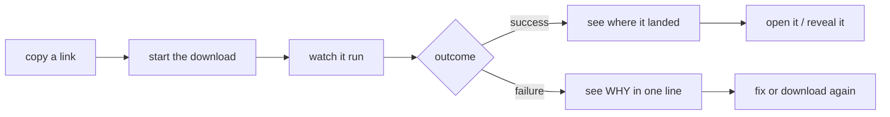
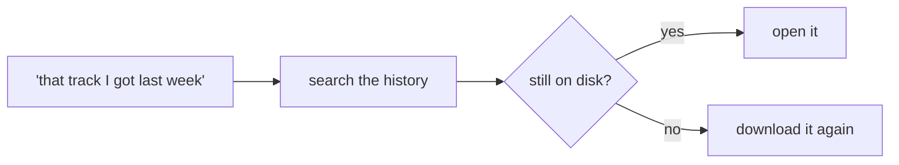
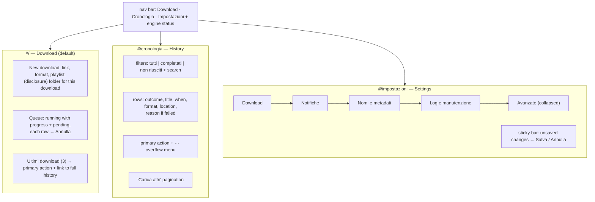
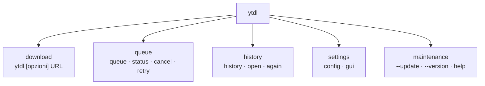
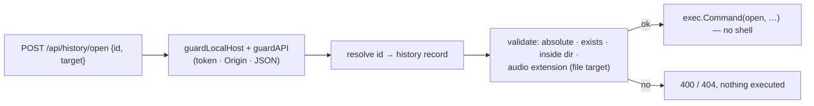

# Design — Cycle 5: unified UX across GUI and CLI

- **Status:** approved at gate B (2026-07-27) — implementation may start
- **Date:** 2026-07-27
- **Scope:** roadmap "GUI multi-page + broader UX overhaul (CLI + GUI)"
  ([roadmap.md](../../roadmap.md)), brought forward ahead of the Phase-5 hardening cycle
  and the 6a AppleScript MVP by maintainer decision.
- **Decisions:** [ADR-0013](../decisions/0013-cycle5-unified-ux.md).
- **Builds on:** [ADR-0009](../decisions/0009-cycle2c-cli-ux.md) (command roles,
  spool-vs-log-store state model), [ADR-0010](../decisions/0010-cycle3-web-gui.md)
  (single binary, SSE, local-API security), [ADR-0011](../../engine/decisions/0011-cycle2b-plus-cancel-retry-hardening.md)
  (cancel/retry mechanics), [ADR-0012](../decisions/0012-cycle4-cli-ux-title-disambiguation.md)
  (job titles, display-width clipping).

## 1. Goals and non-goals

### Goals

1. **Organise the GUI.** Replace the single scrolling column with three
   task-scoped views (Download · History · Settings) so the user is never shown
   every control the tool has at once.
2. **Close the loop on a finished download.** Today nothing tells the user
   *where the file went* and nothing opens it. This is the single largest gap in
   both channels.
3. **Make the queue actionable from the GUI** — a GUI-only user must be able to
   stop a stuck download without opening a terminal.
4. **Design both channels from the same task model,** so an action has one name,
   one meaning and one behaviour whether it is a button or a subcommand.
5. **Make the CLI legible** — a short task-oriented help with topics on demand,
   an actionable history, and a way to see the effective configuration.

### Non-goals

- No change to `internal/core`: the yt-dlp argv and the golden references stay
  **byte-identical** (the standing parity gate since Cycle 1).
- No change to `internal/daemon`: cancel already works through the spool marker
  its watcher polls, so the GUI reuses the CLI's mechanism unchanged.
- No automatic retries/backoff, no rate-limit handling — that remains the
  separate Phase-5 hardening cycle.
- No remote access, no multi-user, no authentication beyond the existing
  per-session token: the GUI stays a loopback tool for one person.

## 2. User task model

The design starts from what the user wants to do, not from the commands that
exist. Frequencies are the maintainer's real use, cross-checked against the
features each cycle was asked for.

| # | Task | Frequency | Today in CLI | Today in GUI |
|---|---|---|---|---|
| T1 | Download this link | very high | `ytdl <url>` ✓ | form ✓ |
| T2 | Is it working? (progress, queue) | high | `queue [--watch]` ✓ | live panel ✓ |
| T3 | Where did the file go? Open it | high | partial (foreground prints the path) | **missing** |
| T4 | Stop it / do it again | medium | `cancel` / `retry` ✓ | **missing** |
| T5 | What did I download? Find it again | medium | `history` (not actionable) | 25 rows, not actionable |
| T6 | Why did it fail? | medium | find the `.log` by hand | a bare ✗ |
| T7 | Change default folder / format | medium | edit the config file by hand | buried in 17 flat fields |
| T8 | It broke — fix it | low but critical | `--update`, hidden in 60 help lines | **missing** |

Two structural findings follow from the table:

- **T3, T6 and T8 are unserved or barely served in both channels.** They are not
  "nice to have": T3 is the end of every successful flow and T8 is the recovery
  path when YouTube changes something.
- **The gaps are asymmetric** (T4 CLI-only, T2 GUI-first). Every asymmetry is a
  place where a user who learned one channel is lost in the other.

### 2.1 The two flows that matter





Everything in this cycle serves one of these two flows, or the settings/help
that support them.

### 2.2 Information hierarchy

Three tiers, applied identically to both channels. The current UI puts all three
on one plane, which is the cause of the reported confusion.

| Tier | Content | GUI treatment | CLI treatment |
|---|---|---|---|
| **Always visible** | what is running, what is queued, where the last files went | main view | `queue`, `status`, first screen of `history` |
| **One step away** | full history, failure detail, per-run overrides | second view / row menu | a subcommand or a flag |
| **Rare but reachable** | naming regexes, log dir, retention, timeout | collapsed "Advanced" group | `ytdl config`, `ytdl help impostazioni` |

## 3. Shared vocabulary

One concept, one word, in both channels. The normative table — labels, CLI
surface, and the *Riprova* vs *Riscarica* rule — lives in
[ux-principles.md](ux-principles.md) §3, extracted there because it governs every
future cycle, not only this one. The same document carries the information
hierarchy of §2.2, the action-ranking rule this cycle's history view implements
(§8.3), and the message conventions both channels follow.

## 4. Information architecture

### 4.1 GUI — three views, one document



The Download view is the default and the one the browser opens on. `F` and `Q`
sit side by side above ~900 px and stack below it.

### 4.2 CLI — commands grouped by task



New: `ytdl open`, `ytdl again`, `ytdl config`, `ytdl help [argomento]`, plus
`--help` on every subcommand. Everything else keeps its current name and
behaviour.

## 5. Data model — the history record

### 5.1 Why it must change

`logstore.Entry` ([internal/logstore/history.go](../../../../internal/logstore/history.go))
records `{time, url, title, mode, format, rc, success}`. The saved file's path is
known at run time (`readSavedPaths` in
[internal/run/runner.go](../../../../internal/run/runner.go) returns the first path and the
count) but is discarded. Without it, T3, T5-open and T6 are unimplementable. The
record is extended **once**, covering every action this cycle introduces, rather
than growing a field per feature.

### 5.2 The extended record

```go
// internal/logstore/history.go
type Entry struct {
    Time    time.Time `json:"time"`
    URL     string    `json:"url"`
    Title   string    `json:"title,omitempty"`
    Mode    string    `json:"mode"`
    Format  string    `json:"format"`
    RC      int       `json:"rc"`
    Success bool      `json:"success"`

    // Cycle 5. All omitempty: a record written by an older ytdl simply has none
    // of them, and the actions that need them are offered as unavailable.
    Path     string `json:"path,omitempty"`     // absolute path of the first saved file
    Dir      string `json:"dir,omitempty"`      // the job's resolved output directory
    Count    int    `json:"count,omitempty"`    // how many files the job saved
    Playlist bool   `json:"playlist,omitempty"` // needed to reproduce the job
    Error    string `json:"error,omitempty"`    // one-line, capped failure reason
}
```

`logstore.Job` gains the same five fields; `recordJob` in the runner fills them
from data it already has (`readSavedPaths` → `Path`/`Count`, `o.Settings.OutputDir`
→ `Dir`, `o.Playlist` → `Playlist`, the captured stderr → `Error`).

**`Error` is derived, not raw.** It is the last non-empty stderr line
(`lastNonEmptyLine`, already in the runner), stripped of control characters,
truncated to 200 runes. It exists so both channels can show *why* inline; the
full detail stays in the per-job `.log`.

### 5.3 Identity and the log file — derived, not stored

```go
// ID is the stable handle both channels use to reference a record. Derived, so
// records written before this cycle have one too.
func (e Entry) ID() string // Hash(e.Time.Format(time.RFC3339Nano) + "|" + e.URL), 16 hex

// LogName is the per-job .log written by Record() for the same job.
func (e Entry) LogName() string // "<time>-<hash(normalised url)>-<ok|fail>.log"
```

`Record` ([internal/logstore/logstore.go](../../../../internal/logstore/logstore.go)) already
composes exactly that name from the same `Job`, so the history record can point at
its own failure log with no new field. A missing file (pruned, or never written)
simply disables the "vedi errore" action.

**Compatibility.** `Load` is unchanged in shape: new fields decode as zero values
for old lines, and `pruneHistory` preserves unknown/malformed lines verbatim, so
a downgrade cannot corrupt the file either.

## 6. API changes

All new routes sit behind the existing `guardAPI` (session token · `Origin` ·
`Content-Type: application/json` on writes) and `guardLocalHost`; nothing about
the ADR-0010 security model is relaxed.

| Method | Route | Purpose |
|---|---|---|
| GET | `/api/state` | unchanged + `canOpen` (platform capability) + queue rows now carry `title`; embedded history shrinks to the 3 rows the Download view shows |
| GET | `/api/history?limit=&offset=&failed=&q=` | **new** — the full history view: window-filtered, searchable, paginated |
| POST | `/api/queue/cancel` `{id}` | **new** — cancel a pending/running job |
| POST | `/api/history/again` `{id}` | **new** — enqueue a fresh job from a history record |
| POST | `/api/history/open` `{id, target}` | **new** — open the file, or reveal it in the file manager |
| GET | `/api/history/log?id=` | **new** — the per-job `.log` as `text/plain`, capped at 64 KiB |
| GET/PUT | `/api/settings` | + `jobTimeout`, `openFolderOnDone`; the `handlers.go` job-timeout carry-through hack is removed |
| PUT | `/api/session` | unchanged |

`/api/history/again` refuses to enqueue when the same normalised URL is already
pending or running, answering `409` with "è già in coda" — otherwise a
double-click silently queues the same download twice.

## 7. Security — the open/reveal endpoint

This is the one genuinely new attack surface in the cycle: an HTTP endpoint that
causes `open(1)` to run. The design assumption is unchanged from ADR-0010 — the
adversary is **a web page the user visits while the GUI is open**, not the local
user (who can already run anything).

Five constraints, each closing a case the others do not:

1. **The client never supplies a path.** The request carries a record *id*; the
   server resolves the path from its own history store. There is no code path
   from request body to `exec.Command` argument.
2. **The resolved path must still be plausible**: non-empty, absolute, existing,
   and — for `target=file` — a regular file whose extension is one of the five
   audio formats ytdl produces. A tampered `history.jsonl` therefore cannot turn
   this into "open any file on the disk".
3. **The path must live under the record's own `dir`** (`filepath.Clean` on both,
   prefix check on a path-separator boundary). Rejects `..` traversal introduced
   by hand-editing.
4. **No shell.** `exec.Command("open", "-R", path)` with the path as its own
   argv element; nothing is interpolated into a string.
5. **The existing guards still apply** — a cross-site page has no token and its
   `Origin` is rejected, so it never reaches the handler at all.

Platform: macOS uses `open` / `open -R`; Linux falls back to `xdg-open` on the
containing directory (there is no portable reveal). On any other platform the
capability flag is false, the buttons are not rendered and the endpoint answers
`501`.



## 8. GUI design

### 8.1 Shell and routing

One document, client-side hash routing (`#/`, `#/cronologia`, `#/impostazioni`).
Views are shown/hidden; **the page never reloads**. This is a correctness
requirement, not only a UX one: a full page load per navigation would drop the
SSE connection, and `HasClients()` is the "GUI connected" clause of the daemon's
exit test (ADR-0008) — a daemon could idle-exit in the gap between two page
loads.

The asset is split into `assets/index.html` + `assets/app.css` + `assets/app.js`,
embedded with `embed.FS` and served from an explicit allow-list of three names.
The UI roughly triples in size this cycle; keeping it as one inline blob would
make it unreviewable. The split also lets the CSP tighten from
`script-src 'unsafe-inline'` to `script-src 'self'` (there are no inline handlers
today, so nothing has to be rewritten). Assets are served `no-store`, so an
upgraded binary never serves a stale mix.

### 8.2 Download view

- **New download**: the link field is the primary control (autofocus, submit on
  Enter). Format and "intera playlist" stay visible — both are per-link
  decisions. "Cartella per questo download" moves into a small disclosure, since
  it defaults to the configured folder and is the rarer choice.
- **Queue**: running jobs with title (now carried on the DTO), progress bar,
  speed/ETA, and an "Annulla" action; pending jobs with title/URL and "Annulla".
  Empty state teaches the next step rather than saying only "Coda vuota".
- **Ultimi download (3)**: the same row component as the history view, primary
  action only, plus "Vedi tutta la cronologia →".

### 8.3 History view and action hierarchy

Per the maintainer's instruction, actions are ranked, not enumerated as a row of
equal buttons:

| Row state | Primary (visible button) | Overflow `···` |
|---|---|---|
| success, file present | **Apri** | Mostra nel Finder · Riscarica · Copia link |
| success, file gone/unknown | **Riscarica** | Copia link · (Mostra la cartella, if `dir` exists) |
| failure | **Riscarica** | Vedi errore · Copia link |

The failure reason (`Error`) is shown inline under the title, so "why" needs no
click; "Vedi errore" opens the full `.log` in a panel. The overflow menu closes
on outside-click and on `Escape`, and is keyboard reachable.

Filters (tutti / completati / non riusciti) and a search box map onto the
`failed` and `q` query parameters, so they search the whole retention window
rather than only the loaded page. "Carica altri" pages by 50.

### 8.4 Settings view

Groups, in this order: **Download** (folder, format, quality, playlist default,
parallel downloads, open folder when done) · **Notifiche** · **Nomi e metadati**
(name template; the two strip regexes inside an "Avanzate" disclosure) · **Log e
manutenzione** (log dir, retention, breadcrumb, job timeout). The session-only
folder override keeps its own clearly-labelled block at the top, stating that it
is not written to the config file.

Saving stays a whole-document `PUT` (the SPA always sends every field), but the
UI gains a **sticky "modifiche non salvate" bar** with Salva / Annulla instead of
a button at the bottom of a long form. Adding a `jobTimeout` control removes the
carry-through workaround in `handleSettings`.

## 9. CLI design

### 9.1 Help — short by default, deep on demand

`ytdl` (no arguments) and `ytdl -h/--help` print the same ~18-line task-oriented
screen: what it is, the five things people actually type, the most used options,
the "it broke" line, the quoting warning, and where to find more. The current
60-line wall becomes a set of topics:

```
ytdl help                 argomenti disponibili
ytdl help opzioni         tutti i flag
ytdl help coda            queue · status · cancel · retry
ytdl help storico         history · open · again
ytdl help impostazioni    file di configurazione e chiavi
ytdl help gui             l'interfaccia grafica
ytdl help titoli          come vengono puliti titolo e tag
ytdl help problemi        errori comuni e cosa fare
ytdl help tutto           il testo completo (come oggi)
ytdl <comando> --help     dettaglio di un comando
```

An unknown topic reuses the Cycle-4 `nearestCommand` Levenshtein suggestion, so
`ytdl help stroico` proposes `storico`. Nothing is deleted: `ytdl help tutto`
prints the whole reference, which also keeps `docs/cli-reference.md` honest.

Seam: a new `internal/cli/help.go` holding `ShortUsage`, a topic registry
(`map[string]Topic{Title, Body}`) and per-command help bodies; `Usage` stays as
the "tutto" body. `cli.Parse` gains a help topic and a per-command `--help`.

### 9.2 History becomes actionable

```
STORICO ytdl — ultimi 30 giorni
  [1] ✓ 27/07 18:04  Artista - Traccia          .mp3   ~/Music/ytdl
  [2] ✗ 27/07 17:58  Altro - Pezzo              .mp3   HTTP Error 403: Forbidden
  [3] ✓ 26/07 22:10  Terzo - Brano (3 tracce)   .mp3   ~/Music/ytdl/Playlist
Apri:  ytdl open <n>   ·   riscarica:  ytdl again <n>   ·   solo falliti:  ytdl history --failed
```

- The numbered-list + `<n>`-or-id-prefix grammar is exactly the one `cancel` and
  `retry` already use (`resolveTarget` in `cmd/ytdl/main.go`), so there is one
  targeting idiom in the tool. History ids are the derived `Entry.ID()`.
- Paths are printed home-relative (`~/…`) and clipped by display width
  (`term.Clip`, Cycle 4) so a long path never wraps.
- New flag `--search Q` mirrors the GUI search.
- `ytdl open <n|id> [--folder]` and `ytdl again <n|id>` share the resolution and
  validation code with the GUI handlers — the same guarantees, not a parallel
  implementation.

### 9.3 `ytdl config` — read-only

Prints the resolved settings, the file they came from, and where each value was
decided (default / config file / environment), plus how to change them. It is
deliberately read-only: a CLI write path would duplicate `config.Save`'s
validation surface for no task in the model above (T7 is served by the GUI and
by editing the file).

```
IMPOSTAZIONI ytdl
  file: ~/.config/ytdl/config            (modificale con: ytdl gui)
  cartella      ~/Music/ytdl             (file di configurazione)
  formato       mp3                      (predefinito)
  …
```

`--path` prints only the config file path, for scripts.

### 9.4 `open_folder_on_done`

The long-documented, never-implemented key (`improvements.md` U4) lands here,
default **off**, and applies to **foreground** downloads only: a Finder window
opening by itself out of a background daemon while the user is doing something
else is hostile, and background completion already has the notification. It
reuses the same platform launcher as the GUI's reveal action.

## 10. Package seams

| Package | Change |
|---|---|
| `internal/logstore` | 5 new `Entry`/`Job` fields; `Entry.ID()`, `Entry.LogName()`; `Load` gains `Search` and `Offset` in `QueryOpts`; `Find(dir, id)` |
| `internal/run` | `recordJob` fills the new fields; `open_folder_on_done` on foreground success |
| `internal/open` (new, ~60 lines) | platform launcher: `Reveal(path)`, `File(path)`, `Supported() bool`. One place both channels and the config key call; the only package that shells out to `open`/`xdg-open` |
| `internal/jobs` (new, small) | `Cancel(spool, id)` (today inlined as `cancelOne` in `cmd/ytdl`) and `Again(spool, entry, settings)`, so GUI and CLI cannot drift |
| `internal/cli` | `help.go` (short usage + topics), history rendering with index/path/reason, `open`/`again`/`config` parsing and renderers |
| `internal/webui` | routing for the new endpoints, history DTO + query params, capability flag, split assets, 3-view SPA |
| `internal/config` | `open_folder_on_done` key; `Settings.OpenFolderOnDone` |
| `internal/core` | **untouched** (parity gate) |
| `internal/daemon` | **untouched** |

## 11. Testing plan

Tests are written alongside each unit, per the workflow rules, and assert the
contract from this document rather than the implementation.

- **logstore**: new fields round-trip; a pre-Cycle-5 line still loads and yields
  empty extras; `ID()` is stable across a marshal/unmarshal cycle and distinct
  for same-URL-different-time records; `LogName()` matches what `Record` writes
  for the same job; `Error` capping strips control characters and long lines;
  search/offset filtering.
- **open**: `Supported()` false on an unknown platform; the launcher is invoked
  with the path as a separate argument (injected fake exec).
- **webui**: `/api/history` filtering, paging, search; `/api/history/open`
  rejects an unknown id, a record with no path, a path outside its `dir`, a
  non-audio extension, and answers 501 when unsupported; `/api/history/again`
  409s on a URL already queued; `/api/queue/cancel` reaches the spool; the
  settings round-trip keeps `jobTimeout`; asset allow-list serves exactly three
  files and 404s anything else; CSP header no longer allows inline script.
- **cli**: short help fits the stated line budget and mentions every task group;
  every topic is reachable and non-empty; an unknown topic suggests the nearest;
  `<cmd> --help` for each command; history rendering (index, home-relative path,
  inline reason, display-width clipping); target resolution for `open`/`again`
  (index, id prefix, ambiguous, not found); `config` output shows provenance.
- **run**: a recorded job carries path/count/dir/playlist; a failure carries the
  reason; `open_folder_on_done` fires only on foreground success and never in
  silent/background mode.
- **parity**: `internal/core` diff-empty against `main`; golden argv tests green;
  full suite under `-race`.
- **manual (maintainer, macOS)**: the three views at narrow and wide widths, the
  reveal/open actions against a real download, and light/dark appearance.

## 12. Risks and mitigations

| Risk | Mitigation |
|---|---|
| The open endpoint becomes a "run anything" primitive | id-not-path, extension and containment checks, no shell, dedicated review dimension (§7) |
| The SPA grows past what one reviewer can hold | split into three assets; one row component reused by both history surfaces |
| History schema churn | one additive change covering every planned action; `omitempty`; unknown lines preserved by prune |
| Losing the daemon during navigation | hash routing, no page reload, SSE connection held across views (§8.1) |
| Regressing the parity gate | no `internal/core` edits; goldens run in CI |
| Cannot exercise real downloads in the container (no ffmpeg/yt-dlp) | unit + handler tests with fakes; maintainer verifies end to end on macOS before gate C |

## 13. Alternatives considered

- **Separate HTML pages per view** — rejected: an SSE reconnect per navigation
  fights ADR-0008's liveness signal, and it triples the asset routes for no gain.
- **Storing the reveal path in the request** — rejected: it is the exact shape
  that turns a local API into an arbitrary-file-open primitive (§7).
- **Extending `ytdl retry` to cover history records** — rejected: it would give
  one command two different index spaces. `again` is a separate verb with a
  separate list, matching the GUI's separate button.
- **A writable `ytdl config set`** — deferred: it duplicates `config.Save`
  validation for a task already served by the GUI and by editing the file.
- **Per-group save buttons in Settings** — rejected in favour of one sticky
  unsaved-changes bar; the API is a whole-document PUT, so per-group saves would
  imply a guarantee the transport does not make.

## 14. Implementation order

Each step is one atomic commit with its tests, and leaves the tree green.

1. `logstore`: extended record, `ID()`/`LogName()`, query options.
2. `run`: populate the new fields (history now records where files land).
3. `internal/open` + `open_folder_on_done` (config key + foreground wiring).
4. `internal/jobs`: shared cancel/again; `cmd/ytdl` uses it (no behaviour change).
5. CLI: `history` rendering + `open` + `again` + `config`.
6. CLI: help restructuring (short usage, topics, per-command help).
7. webui: API additions (history query, cancel, again, open, log, settings keys).
8. webui: asset split + CSP tightening (no visual change yet).
9. webui: the three views, nav, and the Download layout.
10. webui: history view with the ranked actions; settings grouping + sticky bar.
11. Docs: roadmap, changelog, `cli-reference.md`, the Italian user guides.

Steps 1–6 leave the GUI untouched and the CLI fully usable; steps 7–10 are the
GUI, gated behind the API landing first.
