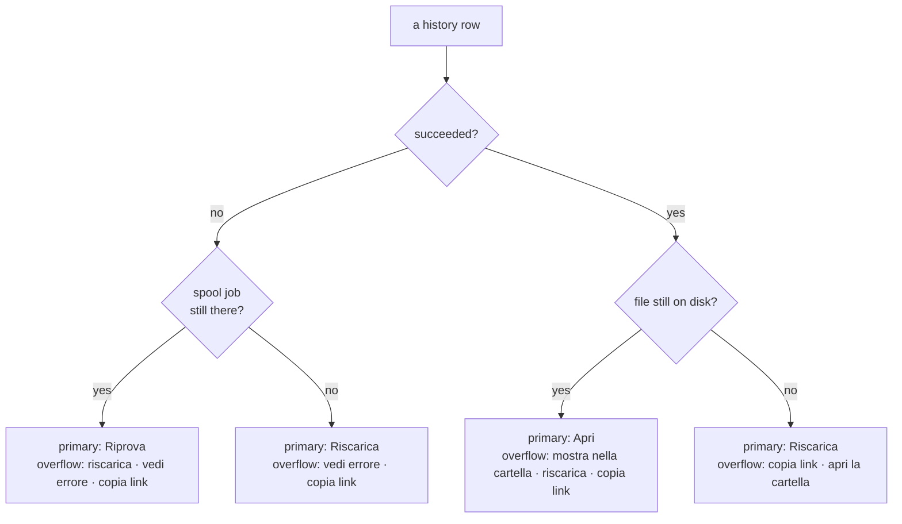
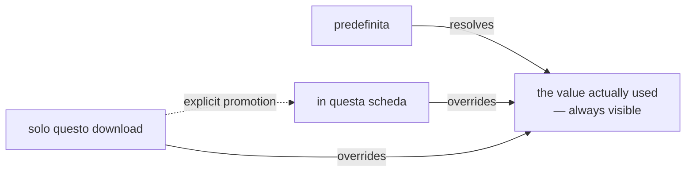

# UX principles — GUI and CLI

Normative reference for ytdl's user-facing surface, in **both** channels. It
outlives any single cycle: when a cycle adds a capability, it conforms to this
document or amends it in its ADR.

Established by [ADR-0013](../decisions/0013-cycle5-unified-ux.md) (Cycle 5), which
derived it from the task analysis in [design-cycle5-ux.md](cycle5-ux.md).
Earlier conventions it absorbs: [ADR-0009](../decisions/0009-cycle2c-cli-ux.md)
(command roles, windowed counts, TTY-aware colour) and
[ADR-0012](../decisions/0012-cycle4-cli-ux-title-disambiguation.md) (titles,
display-width clipping).

Amended by [ADR-0014](../decisions/0014-ux-scope-model-and-partial-outcome.md)
(gate-C review of Cycle 5): the scope vocabulary and §8 below, and the partial
outcome in §3 and §5. Amended again by
[ADR-0015](../decisions/0015-cycle6-tab-scope-and-faithful-reruns.md) (gate A of
Cycle 6): the middle scope is the browser tab, and §3 and §8 say so. Amended a
third time by [ADR-0016](../../distribution/decisions/0016-cycle6plus-update-path.md) §16.4 (Cycle
6-plus): §7 now carries the register of asymmetries recorded under its own rule.
Section numbers are stable — amendments append rather than renumber, because code
comments and design documents cite them.

## 1. The tasks the tool serves

Design against these, not against the list of existing commands. The full
analysis, with per-channel gaps at the time of Cycle 5, is in the design
document; this is the durable list.

| # | Task | Frequency |
|---|---|---|
| T1 | Download this link | very high |
| T2 | Is it working? (progress, queue) | high |
| T3 | Where did the file go? Open it | high |
| T4 | Stop it / do it again | medium |
| T5 | What did I download? Find it again | medium |
| T6 | Why did it fail? | medium |
| T7 | Change the default folder / format | medium |
| T8 | It broke — fix it (`--update`) | low, critical |

## 2. Information hierarchy

Three tiers. A surface that puts them on one plane is the defect Cycle 5 was
called to fix — do not reintroduce it.

| Tier | Content | GUI | CLI |
|---|---|---|---|
| **Always visible** | what is running and queued; where the last files landed | main view | `queue`, `status`, first screen of `history` |
| **One step away** | full history, failure detail, per-run overrides | second view, row overflow menu | a subcommand or a flag |
| **Rare but reachable** | naming regexes, log dir, retention, job timeout | collapsed "Avanzate" group | `ytdl config`, `ytdl help <argomento>` |

Corollary for help and settings: the default screen serves the top tier only.
Everything else is reachable in one step, never deleted.

## 3. Shared vocabulary

One concept, one word, both channels. Labels, help text and messages must not
invent synonyms.

| Concept | GUI label (it) | CLI surface |
|---|---|---|
| queued, not started | "In attesa" | `in attesa` |
| currently downloading | "In corso" | `in corso` |
| finished OK | "Completato" ✓ | ✓ |
| finished with some items lost | "Completato parzialmente" ! | `!` (see §5) |
| finished badly | "Non riuscito" ✗ | ✗ |
| stop a live job | "Annulla" | `ytdl cancel` |
| requeue a failed **spool** job | "Riprova" | `ytdl retry` |
| download the same thing again (from history) | "Riscarica" | `ytdl again` |
| open the audio file | "Apri" | `ytdl open` |
| show the file in the file manager | "Mostra nella cartella" | `ytdl open --folder` |
| open the folder itself (the file is gone) | "Apri la cartella" | — |
| the durable record | "Cronologia" | `ytdl history` |
| the settings document | "Impostazioni" | `ytdl config` |
| the stored default (config file) | "predefinita" | `ytdl config` |
| in force until this browser tab is closed or reloaded | "in questa scheda" | — (GUI only, see §8) |
| in force for one enqueue | "solo questo download" | `-o` / `-f` / `-p` on one invocation |

**Riprova vs. Riscarica** are distinct verbs because they act on distinct
objects: *Riprova* re-runs a job the spool still holds, keeping its settings
snapshot and spool identity — so it lands **where the original job was going**;
*Riscarica* creates a new job from a history record, which outlives the spool
entry. Each is offered **only where its object exists**: a record offers Riprova
exactly while its spool job is still there, and Riscarica always
([ADR-0015](../decisions/0015-cycle6-tab-scope-and-faithful-reruns.md) §4). One job
is one row — the record's, because it is the only one that also carries the
reason, the hint and the log.

> **Not built yet.** The GUI queue shows running and pending jobs only, and the
> history row carries no Riprova, so the verb currently has no GUI surface. It
> lands in Cycle 6 on the row described above; until then the asymmetry recorded
> in [ADR-0014](../decisions/0014-ux-scope-model-and-partial-outcome.md) §4 stands.

**Naming the file manager.** The label names the *folder*, never the platform's
file manager: "Mostra nel Finder" is false on Linux, and a user who has never
opened a Terminal does not need to learn a second product name to find their
music. The two neighbouring actions stay distinguishable — *Mostra nella
cartella* reveals a file that exists, *Apri la cartella* opens the folder of one
that does not. "Finder" is still the right word in the macOS install and usage
guides, which talk about the actual application.

## 4. Action hierarchy

Never present a row of equal buttons. Each row exposes **one primary action**,
chosen by the row's state, with everything else behind an overflow (`···` in the
GUI, a hint line in the CLI).

An action that cannot work in the current context is shown **disabled with a
reason**, or not rendered at all when the platform does not support it — never
rendered live only to fail.

## 5. Messages and output

- **Language:** everything the user reads is Italian; code, comments, identifiers
  and documentation are English (`docs/guida-*.md` are the Italian exceptions, by
  audience).
- **Marks:** `✓` success · `✗` failure · `▸` an action taken · `!` a warning **or
  a partial outcome** · `•`/`▸` list items. Consistent across both channels.
- **A partial outcome is never rounded to one of the other two** (ADR-0014): a
  job that saved some items and lost others is marked `!` and states the ratio
  (`21/22 tracce`) — a partial count always names its total, like every other
  number here. The reason one item failed is never presented as the reason the
  job failed.
- **An error says what to do next.** A message that only states what went wrong
  is incomplete (e.g. a missing dependency points at `ytdl --update`, not at a
  package manager).
- **Empty states teach.** "Coda vuota" alone is a wasted line; it carries the
  next step (`accoda con ytdl -b <url>`).
- **Never a number without its window** (ADR-0009): counts and lists state the
  period they cover ("ultimi 30 giorni", "da sempre").
- **Failure reason inline, detail on demand:** one capped line explains *why* in
  the list; the full `.log` is one action away.
- **Terminal output is width-aware** (ADR-0012): lines are clipped by display
  **columns**, not runes, so CJK and emoji never wrap; colour only on a TTY with
  `NO_COLOR` unset.

## 6. Platform actions

Opening files and revealing folders is the only place ytdl invokes the desktop
(`open` on macOS, `xdg-open` on Linux). It lives in one package, is advertised as
a capability so no dead control is ever rendered, and — when reached over the
local HTTP API — resolves its path from ytdl's own records, never from the
request (see ADR-0013 §3).

## 7. Rule for new capability

A capability lands in **both** channels, or the cycle's ADR records the asymmetry
and its reason. The asymmetries Cycle 5 inherited (cancel/retry CLI-only, live
progress GUI-only, "where is my file" in neither) all came from nobody having
written this rule down.

**Asymmetries recorded under this rule**, so the register is one list rather than
a search through the ADRs:

| asymmetry | recorded in | why |
|---|---|---|
| Applying an update **asynchronously**, and therefore the `abandoned` run state, is GUI-only | [ADR-0016](../../distribution/decisions/0016-cycle6plus-update-path.md) §16.4 | `ytdl --update` is synchronous and streams to the terminal; it writes no run record, so the CLI has no run it could fail to follow. The *capability* — apply an update — is in both channels |

Note what the rule asks for, on the evidence of Cycle 6-plus: the **capability**
is what must land in both channels, not every state its implementation needs. The
update itself is in both (`ytdl --update` and the GUI's *Aggiorna*), and both show
the same three verdict states; only the record of an apply that outlived the
surface watching it is GUI-only, because only the GUI's apply can outlive it.

## 8. Scope of a choice

Added by [ADR-0014](../decisions/0014-ux-scope-model-and-partial-outcome.md), the
middle scope renamed and re-dated by
[ADR-0015](../decisions/0015-cycle6-tab-scope-and-faithful-reruns.md). Three scopes
exist, named in §3, and a surface must always make clear which one is in force.

1. **A per-download control returns to the resolved default after a successful
   submit.** This holds for *every* such control — folder, format, playlist —
   not only the ones a user has complained about. A choice that should last is
   promoted on purpose; sticky-by-accident is a defect.
2. **The effective value is visible without opening anything**, together with the
   scope it comes from: `Cartella: ~/Music/ytdl (predefinita)`. A collapsed
   disclosure states its current value in the summary.
3. **Promotion is one explicit act, made where the choice was made.** A promoted
   value has one source of truth and is reflected everywhere that scope appears.
4. **A control changed but not yet applied says so** — the unsaved-changes
   pattern. A surface may never display a value that is not in force without
   marking it as pending. This is the §5 honesty rule applied to input, not only
   to output.

5. **A scope's lifetime is stated in words the user can check.** "In questa
   scheda" means this tab, until it is closed or reloaded — not a "session"
   whose end nobody can point at. A value the user cannot see expiring must not
   be able to expire: the middle scope is therefore held *in the page*, so it
   dies with the surface that shows it and no other tab inherits it.
6. **A re-run keeps the destination the original job had**, and says which one
   that is before it runs. "Do it again" that quietly means "somewhere else" is
   the §5 honesty rule broken on the way out instead of on the way in.

**Channel asymmetry, recorded per §7:** the *tab* scope is GUI-only. A CLI
invocation is a process, so it has no tab to hold one; its equivalents are the
config file (`predefinita`) and per-invocation flags (`solo questo download`). A
GUI tab override is therefore invisible to a terminal running beside it — and to
the tab next to it, which is the point.

## 9. Input the surface accepts

Added by [ADR-0015](../decisions/0015-cycle6-tab-scope-and-faithful-reruns.md) §7.
§5 governs what a surface *says*; this governs what it *takes*.

1. **One validator per value, shared by every entry point.** The GUI, the CLI and
   the config file judge the same string identically. A rule enforced in one
   channel only is a bug in the other.
2. **A refusal carries its remedy**, in the form its channel can act on: a button
   where the user has no shell, the exact command where they do.
3. **The surface never silently repairs a value.** A path that cannot be shown
   truthfully is refused, not rewritten — a relative folder is resolved by the
   engine's working directory, so displaying it as absolute would state a
   destination that is not the one in force.
4. **Creating something is always a separate, deliberate act**, never a side
   effect of accepting a value. A folder that does not exist is refused with an
   offer to create it, so a typo cannot make one.
5. **Validation happens when the value is applied**, not only when it is finally
   used, so the user learns while they are still looking at the control.
