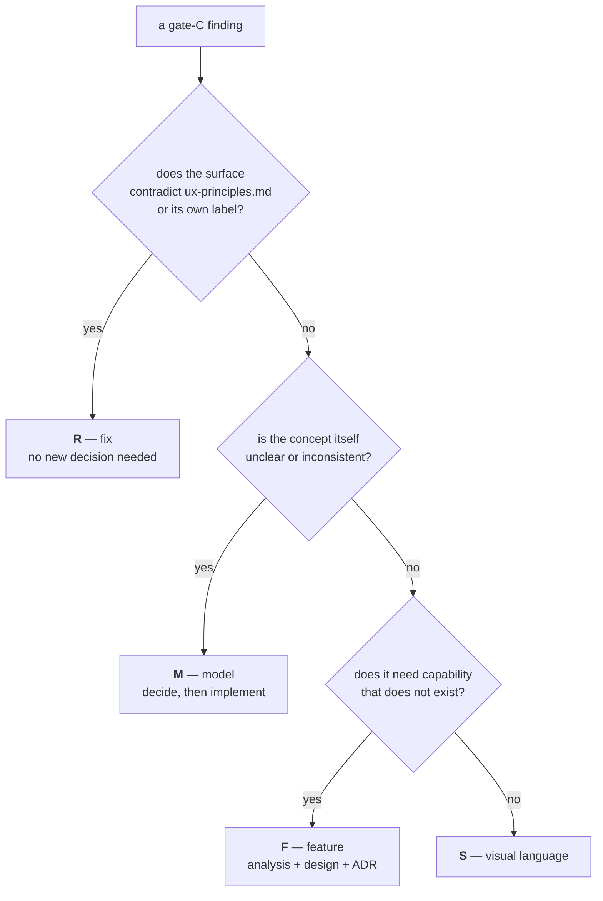

# Review 001 — Cycle 5, gate C by hand

> **Provenance.** Extracted verbatim on 2026-08-26 from `docs/improvements.md` (lines 165–322).
> The maintainer's hands-on verification of the Cycle 5 GUI, and the `G` register
> it produced.

## Gate-C findings — Cycle 5 verification (2026-08-03)

Cycle 5 shipped the three-view GUI and the actionable history, then stopped at
**gate C**, whose whole purpose is the maintainer using the result on real
hardware. They did, and produced a findings list. This section is that list,
verified against the code, classified, and mapped onto cycles. Sequencing —
which cycle runs when — lives in [roadmap.md](../../roadmap.md).

Two cross-cutting decisions came out of the same review and settle roughly half
of the list on their own; they are recorded in
[ADR-0014](../decisions/0014-ux-scope-model-and-partial-outcome.md) and are now
normative in [ux-principles.md](../design/ux-principles.md).

### How a finding is classified

The class decides *where the work goes*, not how important it is. A finding that
contradicts a document we have already declared normative is not a feature
request — it is a defect, and it outranks everything additive.

> The class letters `R` / `M` / `F` / `S` are **not** the finding-ID prefixes used
> by the initial-analysis register above (`C`/`U`/`M`/`E`). Gate-C findings are
> numbered `G1…G26`; `M` as a *class* means "model decision", never
> "maintainability".

Order of execution, decided by the maintainer (2026-08-03): **R → M → F → S**.
Fixes first because they are the ones actively misinforming the user; additive
work last.

### R — the surface contradicts itself (Cycle 5 closing, no new decisions)

| # | Finding | Severity | Verified cause |
|---|---|---|---|
| G1 | The queue never says **where** a job will land | medium | `queue.Job.Settings` already carries the resolved `OutputDir`, frozen at enqueue; only `jobDTO` fails to expose it. The history row shows `location`, so the same row component says it in one list and not the other. `ytdl queue` omits it too — both channels. |
| G2 | The session-folder field can display a value that is **not in force** | **high** | Only the "Applica alla sessione" button issues the `PUT /api/session`; there is no auto-apply. But nothing marks the field dirty — while the settings form immediately below it has a sticky unsaved-changes bar. Type without pressing, then download: the file goes to the old folder while the field shows the new one. |
| G3 | "Vale solo per questo download" is **false** | **high** | The API is right (per-request dir wins for that request only); the SPA clears only the URL field after a submit, never the folder field, and leaves the disclosure open. The label promises one-shot, the UI delivers sticky. |
| G4 | The playlist checkbox never returns to its default | **high** | Initialised from `playlist_default` and never reset. See G14 for why the consequence is worse than "one unwanted playlist". |
| G5 | `open_folder_on_done` is a **dead control in the GUI** | medium | It applies to foreground downloads only, and *every* GUI download is enqueued — so the setting can never do anything for a GUI-only user, yet it is rendered live in the GUI's Download group. `ux-principles.md` §4 forbids exactly this. |
| G6 | "Vedi errore" can appear to do nothing | low | The log panel sits above the list; opening it from a row far down reveals it off-screen, with no scroll into view. |
| G7 | `audio_quality` accepts 0-9; yt-dlp's scale is **0-10** | low | The validator tests a single character, so `10` is unrepresentable; help and docs repeat "0-9". yt-dlp: *"a value between 0 (best) and 10 (worst) for VBR or a specific bitrate like 128K (default 5)"*. |
| G8 | A failure says what went wrong, never **what to do** | **high** | `Entry.Error` is yt-dlp's last stderr line, in English, capped at 200 runes — the observed record ends mid-URL (`…github.com/yt-dl…`). `ux-principles.md` §5 requires the next step. Fixable with a **render-time** hint derived from the stored raw line: no schema change, and it works on records already written. Ships only with remedies that exist today; the age/bot remedy waits for G25. |
| G9 | "Mostra nel Finder" is offered on Linux | low | **Ruled 2026-08-04** ([ADR-0014](../decisions/0014-ux-scope-model-and-partial-outcome.md) §3): the label names the folder on every platform — "Mostra nella cartella", with its neighbour becoming "Apri la cartella". §3 is already amended; the strings still have to follow in `app.js` (+ `spa_test.go`), `cli/messages.go`, `cli/help.go`. "Finder" stays in the macOS guides, which mean the application. |
| G10 | `beforeunload` implies that closing the tab cancels the queue | low | "Vuoi uscire? Hai download in coda." — the daemon keeps draining, by design (ADR-0008). Wording only. |
| G11 | *(deferred to Cycle 6)* "Riprova" is normative vocabulary with **no surface** | low | §3 lists it as a GUI label, but `queueDTO` exposes only `pending` and `running`: a job that failed in the spool is invisible in the GUI. **Ruled 2026-08-04** ([ADR-0014](../decisions/0014-ux-scope-model-and-partial-outcome.md) §4): the asymmetry is recorded per §7 and the surface lands in **Cycle 6**, which reworks that view anyway — showing failed spool jobs needs a decision (the same job also sits in the history under a different verb), and the closing session takes no decisions. **Decided 2026-08-12** ([ADR-0015](../decisions/0015-cycle6-tab-scope-and-faithful-reruns.md) §4): **no new row** — the *history* row gains Riprova as its primary action while the spool still holds the job, because a spool-built row cannot state why the job failed (`queue.Job` has no failure reason; `Attempts`/`LastError` are reserved for the Phase-5 cycle). Needs the spool id on `logstore.Entry` (`omitempty`, no migration) since nothing links the two today. Riscarica is demoted to the overflow, not retired. |

#### R — delivered (2026-08-04, branch `feat/ux/cycle5-unified-ux`)

Ten of the eleven, one atomic commit each; **G11 is out by ADR-0014 §4** and lands
in Cycle 6. The register above keeps the *causes* — this is what shipped.

| # | Shipped as |
|---|---|
| G1 | `jobDTO.Location` + both GUI queue rows, and a `cartella:` line under each `ytdl queue` row. Both channels say **the same words**, from the dir frozen at enqueue — what *this* job will do, not what the settings would do now. `RenderQueue` took a `QueueView{Full,Width,Home}`, the shape `HistoryView` already had, so `$HOME` stays at the edge |
| G2 | The unsaved-changes pattern on the session field (`ux-principles.md` §8.4): a pending note whenever it disagrees with what is in force, where "in force" is the **server's echo**. A state refresh neither overwrites an edit in progress nor makes a pending one look applied |
| G3 | The one-shot controls return to their resolved default after a **successful** submit; a failed one keeps what the user typed |
| G4 | The playlist box returns to the **configured default**, not to unticked — and follows a default just changed in Impostazioni |
| G5 | Not disabled: the CLI honours the key and this form is its only editor (`ytdl config set` deferred by ADR-0013). Moved behind the Download group's *Avanzate* disclosure (§2 tier 3), relabelled to name the channel, and genuinely disabled-with-a-reason where the platform has no launcher |
| G6 | The log panel is scrolled to **and focused** before the fetch, so it is on screen while it loads |
| G7 | One home for the domain (`config.ValidAudioQuality` + `MaxAudioQuality`), the API's hand-rolled copy deleted. Found on the way: the GUI select stopped at 9 while the server took 10, so a config set to 10 **lost its value** at the first save |
| G8 | `jobs.FailureHint` — derived at render time from the stored line, so pre-catalogue records get it too; one function, therefore identical text in both channels. Age/bot matches a deliberately **empty** first entry until Cycle 9 |
| G9 | The two labels of §3 exactly, in `app.js`, `cli/messages.go`, `cli/help.go` — and in `ytdl config`, the surface the first pass missed. "Finder" survives only in the macOS guides and in comments about macOS behaviour |
| G10 | Wording only; ADR-0008 quoted the replaced string, so it carries the correction |

**Reviewed adversarially (2026-08-04)** — three reviewers (SPA · Go · this
document), every finding re-verified by the lead before acting, each fix
confirmed to fail with the fix reverted. Seven further commits. What the ten had
got wrong:

- **G8's hint was clipped** at terminal width: at 80 columns the ffmpeg one read
  `ytdl --updat…`, an instruction that cannot be run — the very defect §5 names.
  Fixed by `term.Wrap`, the counterpart to `Clip`: a title may be cut, an
  instruction may not. The test that missed it passed `Width: 0`.
- **Three hints pointed at the wrong remedy.** yt-dlp reports a full disk and an
  unwritable folder as *postprocessing* errors, and the generic needle sat above
  both — "reinstall the dependencies" onto the full disk that caused it. A 404
  also says "unable to download webpage", so a permanently dead link sent the
  user to check their network.
- **Three holes in G2 itself**: a stale `/api/state` frame (they arrive on every
  reconnect) undid a just-applied override *with no marker*; the success branch
  discarded typing done while the PUT was in flight; the trim comparison pinned
  the marker on for ever on an untouched field.
- **`showLog` had no sequence guard**, so one download's log could land under
  another's title — and, since G8, next to another's remedy.
- **A new untruth introduced by G5's own hint**: it promised a completion
  notification unconditionally, while `notify` is editable two sections below.

### M — the concept is unclear (Cycle 6, analysis first)

**Ruled at gate A (2026-08-12,
[ADR-0015](../decisions/0015-cycle6-tab-scope-and-faithful-reruns.md)).** The
analysis is closed and every finding below has its decision; what remains is
Cycle 6's design phase. The ruling per finding is in the last column — the rest
of each row keeps the *cause*, which is what the register is for.

| # | Finding | Severity | Notes |
|---|---|---|---|
| G12 | Three folder scopes, no visible model | **high** | Default (config) · session (GUI-only) · this download. Nothing on screen says which is in force, and §3 has no words for them. Settled in principle by [ADR-0014](../decisions/0014-ux-scope-model-and-partial-outcome.md) decision 1; the surface work is Cycle 6. **Ruled:** the three scopes stay, the middle one becomes **"in questa scheda"** and is held in the page (ADR-0015 §2); the effective value and its scope are stated in the Download view, and promotion happens there (§8.3). Presets do **not** retire it (§1). |
| G13 | Format, playlist and folder are all per-request, with three different implicit behaviours | **high** | The folder claims one-shot and is sticky (G3); the checkbox is sticky and claims nothing (G4); the format is sticky and nobody ever mentioned it. One rule, applied identically to all three. **Ruled:** one rule for all three, format included — the reset the closing cycle deliberately left out (`app.js:700`) lands here, together with the promotion affordance that makes a durable choice possible on purpose. |
| G14 | The playlist control does not know whether the link **is** a playlist | **high** | The dangerous case is not a bare video — `--yes-playlist` is a no-op there. It is the link YouTube hands you when you click a track inside a playlist or a mix: it carries `v=…&list=…`, and a forgotten checkbox turns one track into the whole list. **Ruled:** unchanged in substance — the control reads `list=` from the pasted link and says what it found. Design detail for the cycle; no ADR-0015 ruling was needed. |
| G15 | Audio quality exposes an ffmpeg VBR scale to a non-technical user, and is applied to lossless formats | medium | `--audio-quality` is passed for `flac`/`wav` too, where it means nothing. Proposal: named steps (massima/alta/media/compatta) mapped onto values, hidden or disabled with a reason for lossless formats. Default stays `0`, so no behaviour changes. **Ruled** (ADR-0015 §6): **not** four named steps — a **stepped slider over the whole 0–10 domain**, each step showing its number *and* a word (`3 · alta`), so every valid value stays reachable and no "custom" case exists. On `flac`/`wav` the control is **disabled with its reason** in both the Download view and Impostazioni; the argv is untouched (`internal/core` is byte-frozen), which is exactly why the fix must be a surface one. |
| G16 | The session override is never validated | medium | Non-existent or unwritable paths are accepted; the first download then silently `MkdirAll`s a new folder somewhere the user did not intend. **Wider than reported:** the *per-download* folder is unvalidated too (`handlers.go:480-500`), so this is about every destination a user can type. **Ruled** (ADR-0015 §7): one shared validator (absolute · exists · directory · writable) used by GUI, CLI and config reader; a missing folder is **refused with an explicit offer to create it**, never created as a side effect; a **relative** path is refused at input and never rewritten — one already in a config file is displayed as written and marked as resolved by the engine. |
| G17 | Completion produces no feedback in the view the user is looking at | medium | The row leaves the queue and reappears under "Ultimi download". The system notification comes from the daemon; the GUI itself says nothing, and does not offer "Apri" on the thing that just finished. **Ruled** (ADR-0015 §8): announced in the current view, **derived on the client** from a job leaving the running set — no new SSE event, no protocol change, `internal/daemon` untouched. |
| G18 | History filters and search are not in the URL hash | low | A reload loses them, and Back moves between views but not between filter states. **Ruled** (ADR-0015 §8): filters and search go in the hash; chips **push** a history entry, typing **replaces** it. The router must split the route from its query — it matches the whole hash exactly today (`app.js:78-86`), so `#/cronologia?q=x` would resolve to no view at all. |

### F — capability that does not exist yet

**Cycle 7 — partial outcome and playlists per track** (ADR-0014 decision 2):

| # | Finding | Severity | Notes |
|---|---|---|---|
| G19 | A partially-failed playlist is recorded as a **total failure** | **high** | `success := rc == 0 && count > 0`, and yt-dlp returns a non-zero code when any item failed even under `-i`. The maintainer's own record is the proof: ✗, "21 tracce", and the error line of the single age-restricted track — while 21 files sit on disk. The record states something untrue about work that succeeded. |
| G20 | Per-item data is collected and then thrown away | medium | The runner already captures attempted (`id\ttitle`) and succeeded (`id`) items and feeds them to `ReconcilePlaylist` for the per-item breadcrumbs — then discards them. Nothing reaches the history record, so there is no per-track detail and a retry re-downloads everything. Collection is also gated on `breadcrumb_on_failure` and on silent/background mode. |
| G21 | `log_retention_days = 0` leaves `history.jsonl` unbounded, and every history operation is a full-file scan | medium | Deferred at gate C. Per-item arrays multiply record size, so this stops being theoretical in the same cycle that adds them. |
| G22 | Offset paging can duplicate or skip a row | low | Deferred at gate C. Inherent to offset paging; the fix is cursor paging (`?before=<id>`), which is a design change. |
| G23 | `Append`'s doc cites a concurrent stress test that is not in the repo | low | Deferred at gate C. The test was written during the Cycle 5 review and passes; it just never landed. |

**Cycle 8 — destination presets:**

| # | Finding | Severity | Notes |
|---|---|---|---|
| G24 | The only way to choose a folder is to type an absolute path into a browser text field | medium | Requested: named presets, recalled instead of retyped. Config is strict `key=value` with a whitelist, so a list needs a scheme (proposal: a `preset_<name>` prefix rule — one document, diffable, hand-editable). Related: a browser cannot obtain a real path, so a **native picker** driven by the daemon (`osascript -e 'choose folder'` / `zenity`) is the only way; `internal/open` already owns desktop actions. ~~May retire the session override entirely~~ — **answered 2026-08-12** ([ADR-0015](../decisions/0015-cycle6-tab-scope-and-faithful-reruns.md) §1): it does not. A preset is a *value*, a scope is a *duration*; they are orthogonal and compose, so this cycle inherits a preset × scope matrix and adds no fourth scope. |

**Cycle 9 — authentication and error remedies:**

| # | Finding | Severity | Notes |
|---|---|---|---|
| G25 | Age- and bot-restricted videos have no remedy path | **high** | The real fix is `--cookies-from-browser`, i.e. a validated `cookies_from_browser` config key appended off the golden argv path. Sensitive by nature: off by default, plainly labelled, and its own failure modes anticipated (Full Disk Access for Safari, a keychain prompt for Chrome). Completes the G8 hint catalogue. |

### S — visual language (Cycle 10)

| # | Finding | Severity | Notes |
|---|---|---|---|
| G26 | The GUI has no visual language | medium | Not sloppy — anaemic, and the causes are nameable: no type scale (everything sits between 0.78 and 1rem; `h2` is *smaller* than the URL field, so headings do not read as headings); no spatial rhythm (1rem padding everywhere); the download form, the app's whole reason to exist, weighs the same as the log section; and one green means primary action, success **and** selected chip. The deliverable is a written `docs/ux-visual-language.md` (type scale, spacing scale, radii, elevation, colour **semantics** split from the action colour, density, focus, motion) applied afterwards. Hard constraints: no external assets (CSP `script-src 'self'`, self-contained binary → no CDN fonts, inline icons only), no `innerHTML`, dark mode, one document. |

### Post-gate-C findings — Cycle 6 analysis (2026-08-12)

Not from the gate-C session: found by reading the code behind G11–G18. Numbered
in the same sequence, and both **ruled in
[ADR-0015](../decisions/0015-cycle6-tab-scope-and-faithful-reruns.md)**, so both land
in Cycle 6 alongside the findings that exposed them.

| # | Finding | Severity | Verified cause |
|---|---|---|---|
| G27 | **"Riscarica" does not re-download where the original went** | **high** | `jobs.Again` reuses the record's format and playlist flag but resolves the folder from *today's* settings (`settingsForRun(nil, nil)`). A job enqueued into a one-shot folder comes back somewhere else, with nothing said — the same class as G3, one step further down the flow. **Ruled** (§3): Riscarica takes the record's own `Dir` — never `filepath.Dir(Path)`, which for a playlist is yt-dlp's own subfolder and would nest one level deeper per re-run. A record with no `Dir` (pre-Cycle-5) falls back to the default **and says so before the click**. |
| G28 | **The "session" scope is neither a session nor scoped** | medium | It is a field of the `ytdl gui` *process* (`webui.Server.sessOut`), so every tab pointed at that process shares one value — change it in one tab and the others follow, unannounced — it survives closing the tab that set it, and it vanishes when the process idle-exits per ADR-0008, which can happen while a tab is merely disconnected (a sleeping laptop); the field then blanks silently on the next state frame. Three behaviours, none of them visible, and the label promised a fourth. **Ruled** (§2): the scope becomes the **tab**, named "in questa scheda", held in the page — `Server.sessOut`, `PUT /api/session` and the `sessionEpoch` reconciliation all retire with it. |
