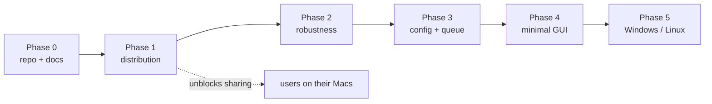

# Roadmap

Single source of truth for planned work. Updated at the end of each cycle.

Status: `done` · `in progress` · `planned` · `deferred`

## Phase 0 — Repository & documentation — `done`

| # | Item | Status |
|---|---|---|
| 0.1 | git init, baseline commit of the existing script | done |
| 0.2 | Architecture of the current script | done |
| 0.3 | Improvements and evolutions register | done |
| 0.4 | Distribution constraints analysis + ADR-0001 | done |
| 0.5 | This roadmap | done |

Documentation lives in [docs/](README.md); user-facing install instructions are
in the top-level [README](../README.md).

## Phase 1 — Distribution — `in progress` — **immediate priority**

Goal: a user with no developer tooling installs `ytdl` by pasting one line, on
any macOS from 10.13 up, and can keep it working over time.

Status: published and working. The one-liner installs cleanly on current macOS
(Apple Silicon, verified on hardware). Two things remain before calling it done:
a real end-to-end download, and a test of the legacy path on an old Intel Mac.

| # | Item | Status | Notes |
|---|---|---|---|
| 1.1 | `ytdl --version` + version constant | done | Prerequisite for update and support ([U1](improvements.md)) |
| 1.2 | `install.sh`: macOS + arch detection | done | Handles the `10.x` → `11+` scheme; covered by tests |
| 1.3 | Provision yt-dlp (binary or zipimport per target) | done | `releases/latest/download/…`, no pinned version |
| 1.4 | Verify `SHA2-256SUMS` before installing | done | Mandatory, see ADR-0001 |
| 1.5 | Provision ffmpeg per architecture | done | martin-riedl (signed) for 10.15+, evermeet for 10.13–10.14 |
| 1.6 | Install into `~/.local/bin` + PATH in `.zprofile` / `.bash_profile` | done | Idempotent; login shells are what Terminal.app starts |
| 1.7 | Actionable failure messages (no `brew install`) | done | Now point at `ytdl --update` ([U3](improvements.md)) |
| 1.8 | Guided path for macOS 10.13–10.14 (python.org 3.13) | done | Aborts with an explanation below 10.13 |
| 1.9 | `ytdl --update` (updates yt-dlp **and** the script) | done | Re-runs the installer, single provisioning path ([U2](improvements.md)) |
| 1.10 | Public GitHub repo, first release, documented one-liner | done | Published at `alergyonthestage/ytdl`; one-liner install confirmed working |
| 1.11 | Real-hardware testing | in progress | Modern path verified on Apple Silicon (below); legacy path still pending |
| 1.12 | Licence (PolyForm Strict 1.0.0) | done | Use permitted, redistribution and derivatives are not |
| 1.13 | Italian user guides (install + usage) | done | [installazione](guida-installazione.md), [uso](guida-uso.md) |

**Definition of done:** a tester who has never opened Terminal completes the
install unaided and downloads a track.

### 1.11 — what is verified, what remains

**Verified on real hardware (2026-07-22, MacBook Pro, macOS 15.6, Apple Silicon):**
the full modern path end to end — checksum verification, ffmpeg/ffprobe download
and extraction from the martin-riedl arm64 zips, the signed ffmpeg actually
running, PATH written to `.zprofile` and `.bash_profile`, and the final
`ytdl --version` / `yt-dlp` / `ffmpeg` checks all passing.

**Still unverified — the legacy path.** macOS 10.13–10.14 (Intel), with
python.org Python 3.13 driving the zipimport yt-dlp, has only been checked on
paper. This is the remaining gap in phase 1, and needs an old Intel Mac to close.

**A real download** has not been run yet either — installation succeeded, but the
end-to-end "paste a URL, get a tagged file" test is the true definition of done.

### Lesson learned — the raw CDN cache

`raw.githubusercontent.com` serves through a CDN that caches a branch path for a
few minutes. Right after a push, `.../main/install.sh` can still return the
previous version, which looks exactly like "the fix didn't work". A commit-pinned
URL (`.../<sha>/install.sh`) bypasses it. `git ls-remote` and `codeload` are
authoritative for what GitHub actually holds. Not worth engineering around —
`--update` runs rarely and the window is minutes — but worth remembering when a
fresh push appears not to have taken effect.

## Phase 2 — Robustness — `planned`

Fixes from [improvements.md](improvements.md), worth doing once real users exist.

| # | Item | Ref |
|---|---|---|
| 2.1 | Validate `--format` against the supported list | C1 |
| 2.2 | Check AtomicParsley when format is `m4a`, or restrict formats | C2 |
| 2.3 | Handle multiple URLs, or reject extra arguments explicitly | C3 |
| 2.4 | Harden the `-b` re-exec argument forwarding | C4 |
| 2.5 | Sanitise failure-log filenames | C5 |
| 2.6 | macOS notification on completion in silent/background mode | U6 |
| 2.7 | Move failure logs out of the music directory | U7 |
| 2.8 | Test harness for arg parsing and mode selection (bats) | M1 |
| 2.9 | README + licence | M3 |
| 2.10 | Double-clickable `install.command` for Finder-only users | — |

## Phase 3 — Persistent config & queue — `planned`

Prerequisites for the GUI; also valuable on the CLI alone.

| # | Item | Ref |
|---|---|---|
| 3.1 | Config file (`~/.config/ytdl/config`) for output dir and format | U4 |
| 3.2 | Precedence: flag > env > config file > default | U4 |
| 3.3 | Real queue with a concurrency limit, replacing unbounded `-b` | U5 |
| 3.4 | Job status inspection (`ytdl --status` or similar) | U5 |

## Phase 4 — Minimal GUI — `planned` (secondary priority)

A clickable app opening a small window: URL field, run button, queued runs with
optional background flag, output directory per-run and global.

Depends on phase 3 — the GUI should be a front-end over a real queue and a real
config file, not a reimplementation of either.

Open decision, to be settled with a dedicated design pass and its own ADR:

- **AppleScript / Automator app bundle** — zero dependencies, native dialogs,
  works down to Mojave, no build toolchain. Ugly, limited layout.
- **SwiftUI app** — proper UI, but needs a build toolchain, raises a minimum-macOS
  floor, and reopens notarization ($99/year).
- **Local web UI opened in the browser** — easiest layout work, no signing, but
  needs a background process and feels less like an app.

Recommendation to evaluate first: the AppleScript route, as the only option that
adds no dependency and no signing cost while covering the whole support matrix.

## Phase 5 — Windows / Linux — `deferred`

Out of scope until macOS distribution is proven with real users. The installer
should not be over-generalised in advance; the script itself is portable Bash,
so the work is mostly a second installer and dependency-provisioning path.

## Known open questions

- Does the Python 3.13 install path actually work end-to-end on a real Mojave
  machine? Verified from documentation, not from hardware (1.11).
- Is ffmpeg strictly required for every format we advertise, or only for cover
  embedding and some conversions? Affects whether ffmpeg can be optional (C2).
- Sequoia/Tahoe Gatekeeper specifics matter only if phase 4 ships a `.app`.
