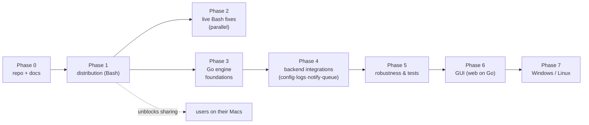
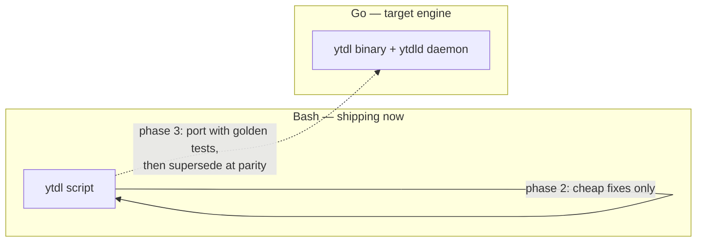
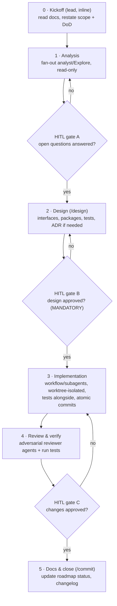
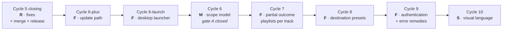

# Roadmap

Single source of truth for planned work. Updated at the end of each cycle.

Status: `done` · `in progress` · `planned` · `deferred`

The engine is a single Go binary (CLI + future queue daemon + web GUI), shelling
out to yt-dlp/ffmpeg; the installer stays Bash and Python is not adopted. See
[ADR-0003](decisions/0003-engine-language-go.md) for the rationale, and
[go-engine.md](go-engine.md) for the as-built engine. The confirmed sequence is
**foundations → backend integrations → robustness → GUI**, with the GUI last.
**Cycle 1 (foundations, phase 3) is done and shipped as v2.0.0 (2026-07-23)**;
**Cycle 2A (backend logs + notifications, phase 4)** (2026-07-23); **Cycle 2B-core
(queue + on-demand `ytdld` daemon)** (2026-07-23); **Cycle 2C (CLI UX pass — roles,
count/history redesign, in-place `--watch`)** (2026-07-23); **Cycle 3 (the web GUI,
phase 6b)** (2026-07-24); **Cycle 2B-plus (`cancel`/`retry`, per-job timeout,
no-residue downloads, daemon diagnostics)** (2026-07-24); **Cycle 4 (CLI UX pass #2
— command/URL disambiguation, job titles)** (2026-07-24); and **Cycle 5 (unified
GUI/CLI UX)**, verified by the maintainer at gate C (2026-08-03), closed on its
gate-C fixes and merged (2026-08-05, `b36774e`) — **all done, all merged to `main`,
and all shipped together in v2.1.0 (2026-08-09), verified on hardware.**

That verification produced twenty-six findings
([improvements.md § Gate-C findings](improvements.md#gate-c)) and two
cross-cutting decisions ([ADR-0014](decisions/0014-ux-scope-model-and-partial-outcome.md)).
By maintainer decision (2026-08-03) they are executed **in class order —
R → M → F → S** — as Cycle 5's closing plus the new cycles described under
[Implementation via development cycles](#implementation-via-development-cycles);
the update path (2026-08-09, not a gate-C finding) joins them as the first `F`.
The release of everything accumulated since v2.0.0 was cut at the Cycle 5 merge
rather than at the end of that queue, and shipped as **v2.1.0** on 2026-08-09.
**Re-ordered on 2026-08-12**, when ytdl was installed for its first non-maintainer
user: the **update path** and a new **desktop launcher** cycle run first, so that
user can receive releases and start the interface without a terminal and without
the maintainer returning to their machine. Cycle 6's analysis ran that same day
and its gate A is closed ([ADR-0015](decisions/0015-cycle6-tab-scope-and-faithful-reruns.md));
it resumes at its design phase. The dedicated Phase-5 cycle (auto-retry/backoff +
YouTube rate-limit) still follows the new cycles.

## Phase 0 — Repository & documentation — `done`

| # | Item | Status |
|---|---|---|
| 0.1 | git init, baseline commit of the existing script | done |
| 0.2 | Architecture of the current script | done |
| 0.3 | Improvements and evolutions register | done |
| 0.4 | Distribution constraints analysis + ADR-0001 | done |
| 0.5 | This roadmap | done |

Documentation lives in [docs/](README.md); user-facing install instructions are
in the top-level [README](../README.md).

## Phase 1 — Distribution — `done`

Goal: a user with no developer tooling installs `ytdl` by pasting one line, on
any macOS from 10.15 up, and can keep it working over time.

Status: **done.** With **v2.0.0 released (2026-07-23)** the compiled-binary path is
verified end to end on real hardware (Apple Silicon): one-liner install,
checksum-verified binary, Gatekeeper launch, `ytdl --version`, and a real tagged
download all confirmed. The legacy Intel/Python path was dropped by
[ADR-0005](decisions/0005-macos-floor-and-single-engine.md).

| # | Item | Status | Notes |
|---|---|---|---|
| 1.1 | `ytdl --version` + version constant | done | Prerequisite for update and support ([U1](improvements.md)) |
| 1.2 | `install.sh`: macOS + arch detection | done | Handles the `10.x` → `11+` scheme; covered by tests |
| 1.3 | Provision yt-dlp (binary or zipimport per target) | done | `releases/latest/download/…`, no pinned version |
| 1.4 | Verify `SHA2-256SUMS` before installing | done | Mandatory, see ADR-0001 |
| 1.5 | Provision ffmpeg per architecture | done | martin-riedl (signed) for 10.15+, evermeet for 10.13–10.14 |
| 1.6 | Install into `~/.local/bin` + PATH in `.zprofile` / `.bash_profile` | done | Idempotent; login shells are what Terminal.app starts |
| 1.7 | Actionable failure messages (no `brew install`) | done | Now point at `ytdl --update` ([U3](improvements.md)) |
| 1.8 | Guided path for macOS 10.13–10.14 (python.org 3.13) | done | Aborts with an explanation below 10.13 |
| 1.9 | `ytdl --update` (updates yt-dlp **and** the script) | done | Re-runs the installer, single provisioning path ([U2](improvements.md)) |
| 1.10 | Public GitHub repo, first release, documented one-liner | done | Published at `alergyonthestage/ytdl`; one-liner install confirmed working |
| 1.11 | Real-hardware testing | done | Compiled-binary path verified end to end on Apple Silicon at v2.0.0 (below); legacy path dropped (ADR-0005) |
| 1.12 | Licence (PolyForm Strict 1.0.0) | done | Use permitted, redistribution and derivatives are not |
| 1.13 | Italian user guides (install + usage) | done | [installazione](guida-installazione.md), [uso](guida-uso.md) |

> **Superseded by [ADR-0005](decisions/0005-macos-floor-and-single-engine.md)
> (2026-07-22):** items 1.3 (zipimport per target), 1.5 (evermeet for legacy Intel),
> 1.8 (Mojave Python path) and the legacy half of 1.11 are dropped — Cycle 1 raises
> the floor to **macOS 10.15** and removes the Python/legacy path. They stay marked
> *done* for the currently-shipping Bash installer; the removal lands with the
> installer change (item 3.2, Session 3).

**Definition of done:** a tester who has never opened Terminal completes the
install unaided and downloads a track.

### 1.11 — hardware verification (closed at v2.0.0, 2026-07-23)

An earlier run (2026-07-22, macOS 15.6, Apple Silicon) verified the yt-dlp/ffmpeg
provisioning end to end, but it predated the compiled-binary install path: the
installer then fetched the Bash script, and `install_ytdl` — download the
cross-compiled Go binary, hard-fail on a missing checksum, replace in place —
landed ~6 h later (a gap surfaced by the Cycle 1 consolidation review).

**Closed at v2.0.0 (2026-07-23).** On Apple Silicon against the real release:
`install.sh` fetched and checksum-verified `ytdl_macos_arm64`, the ad-hoc-signed
(Go-linker, not `codesign`) binary **launched under Gatekeeper**, `ytdl --version`
printed the tag, and a real "paste a URL, get a tagged file" download succeeded —
the true definition of done, now met. The release mechanics (asset names, ldflags
version wiring, checksum format, `--latest`/trigger/permissions, darwin
cross-compile) were verified in the consolidation review that preceded the tag.

**The legacy path is no longer a gap.** macOS 10.13–10.14 (Intel + python.org
Python 3.13 + zipimport yt-dlp) was only ever checked on paper; rather than close
that gap on old hardware, [ADR-0005](decisions/0005-macos-floor-and-single-engine.md)
**drops** the legacy path (the Go engine needs 10.15+). No old-Intel-Mac testing is
required.

### Lesson learned — the raw CDN cache

`raw.githubusercontent.com` serves through a CDN that caches a branch path for a
few minutes. Right after a push, `.../main/install.sh` can still return the
previous version, which looks exactly like "the fix didn't work". A commit-pinned
URL (`.../<sha>/install.sh`) bypasses it. `git ls-remote` and `codeload` are
authoritative for what GitHub actually holds. Not worth engineering around —
`--update` runs rarely and the window is minutes — but worth remembering when a
fresh push appears not to have taken effect.

### Lesson learned — the release workflow must reach the default branch first

At v2.0.0 the tags were pushed **before** the branch was merged to `main`, so
`release.yml` had never existed on the default branch. GitHub had not registered
it (`/actions/workflows` → `total_count: 0`, zero runs), so the `v2.0.0` /
`v2.0.0-rc1` tag pushes triggered nothing — no release, no assets, and
`install.sh` correctly failed with a 404 on `releases/latest/download/…`. A tag
push *can* run a workflow from a non-default-branch commit, but the workflow is
only activated once it has reached the default branch. **Order that matters:**
merge to `main` (registers the workflows; CI runs) → push a pre-release tag →
smoke-test the install → tag the real version. The burned tags had to be deleted
and recreated after the merge, since an already-fired tag push does not retrigger.

## Phase 2 — Live Bash fixes — `planned` (parallel, optional)

Cheap correctness fixes to the **currently shipping** Bash tool, worth doing for
real users today while the Go engine (phases 3–6) is built. Kept deliberately
small: only what is low-cost on Bash and not superseded by the port. The
substantive versions of persistent logs, notifications, config and the queue are
delivered by the Go engine, not bolted onto the Bash script.

| # | Item | Ref |
|---|---|---|
| 2.1 | Validate `--format` against the supported list | C1 |
| 2.2 | Handle multiple URLs, or reject extra arguments explicitly | C3 |
| 2.3 | Harden the `-b` re-exec argument forwarding | C4 |
| 2.4 | Sanitise failure-log filenames | C5 |
| 2.5 | Check AtomicParsley when format is `m4a`, or restrict formats | C2 |

## Phase 3 — Go engine foundations — `done`

The pivot to the Go engine ([ADR-0003](decisions/0003-engine-language-go.md)).
Establish the binary and reach parity with the Bash `ytdl`, so it can supersede it
without regressions. This is "foundations" in the confirmed sequence.

| # | Item | Status | Ref |
|---|---|---|---|
| 3.1 | Go module + CI cross-compile (macOS arm64 + Intel) + checksum publication | done | ADR-0003 |
| 3.2 | Installer provisions the `ytdl` binary the same way as yt-dlp/ffmpeg | done | ADR-0003 |
| 3.3 | Port the yt-dlp arg builder + metadata pipeline; **golden tests** vs the Bash argv | done | ADR-0003 |
| 3.4 | Thin CLI front-end over the shared core (parity with today's flags) | done | — |
| 3.5 | Persistent config file (`~/.config/ytdl/config`), strict `key=value` **parse, not `source`** | done | U4 |
| 3.6 | Precedence: flag > env > session override > config file > built-in default | done | U4 |

**Implemented (Session 3, 2026-07-22)** on branch `feat/go-engine/cycle1`:
`internal/{config,core,cli,run,buildinfo}` + `cmd/ytdl`, golden-tested for byte-exact
argv parity against the Bash `ytdl`; CI (`.github/workflows/`) and the single-path
installer per [ADR-0005](decisions/0005-macos-floor-and-single-engine.md). Designed in
[design-cycle1-core.md](design-cycle1-core.md) + [design-cycle1-remaining.md](design-cycle1-remaining.md).
**Released as v2.0.0 (2026-07-23)** after a consolidation review; `release.yml`
cross-compiles and publishes the macOS binaries + `SHA2-256SUMS`.

Useful config settings — the full list lives in [improvements.md](improvements.md#u4)
(output dir, format, name template, background-by-default, concurrency, notify,
log dir/retention, embed options, …).

## Phase 4 — Backend integrations (Go) — `done`

The maintainer's requested backend evolutions, built on the Go core. Split into
Cycle 2A (logs + notifications) and Cycle 2B (queue + daemon, in 2B-core then
2B-plus) — every item below is done, and all of it shipped in v2.1.0 (2026-08-09).

| # | Item | Status | Ref |
|---|---|---|---|
| 4.1 | Persistent central log store (`~/.local/state/ytdl/logs/`) + retention | done (2A) | U7 |
| 4.2 | In-destination failure breadcrumb, keyed by **hash(URL)** / item id | done (2A) | U7 |
| 4.3 | Auto-cleanup: a successful download removes the stale breadcrumb for that URL | done (2A) | U7 |
| 4.4 | System notification on completion, toggleable (`notify`, `notify_on`, …) | done (2A) | U6 |
| 4.5 | Real queue + daemon (`ytdld`): filesystem spool with atomic state transitions | done (2B-core) | U5 |
| 4.6 | Bounded concurrency (default cap 3; `unlimited` allowed but discouraged) | done (2B-core) | U5 |
| 4.7 | Job inspection: `queue [--watch]`, `status`, `history`, in-place watch + count/history redesign (done 2B-core + 2C); `cancel`, `retry` (done 2B-plus) | done | U5 |

**Cycle 2A (done, merged to `main` 2026-07-23):** `internal/logstore`
(central store + retention + breadcrumb + per-item playlist reconcile) and
`internal/notify` (osascript / no-op), wired through `internal/run`; seven config
keys added. `core.BuildArgs` and the goldens are byte-unchanged (parity preserved).
Decisions in [ADR-0006](decisions/0006-cycle2a-logs-breadcrumbs-notifications.md).
Shipped in v2.1.0.

**Cycle 2B-core (done, merged to `main` 2026-07-23):** `internal/queue` (lock-free
maildir spool, atomic `mv` transitions) and `internal/daemon` (on-demand `ytdld`:
`flock` single-instance, bounded worker pool, crash recovery, idle-exit), plus the
`concurrency` config key, the `queue`/`status` subcommands, and `-b` rewritten to
enqueue (superseding the unbounded `Setsid` detach). The daemon is the same `ytdl`
binary self-exec'd into a hidden `__daemon` role — no always-on service. Queued
jobs run in silent mode, inheriting the 2A store/breadcrumb/notify. `core.BuildArgs`
and the goldens are byte-unchanged (parity preserved). Adversarially reviewed (3
reviewers; the real findings — per-job panic isolation, escaping a persistent-error
daemon wedge, best-effort recovery, `queue`-resumes-a-stalled-daemon — fixed).
Decisions in [ADR-0007](decisions/0007-cycle2b-queue-daemon.md). Shipped in v2.1.0.

## Phase 5 — Robustness & tests (Go) — `in progress`

Hardening of the new engine once its features exist: comprehensive error handling,
edge cases, retries/backoff, YouTube rate-limit handling, and a real test suite
(Go's `testing`, beyond the golden tests of 3.3).

**Started in Cycle 2B-plus (2026-07-24):** a per-job execution timeout (`job_timeout`,
default off) that kills a hung download via a process-group teardown; a daemon
diagnostics log surfacing the previously-invisible failures ADR-0007 flagged; and a
"no residue in the destination" guarantee (intermediates routed to a scratch dir).
See [ADR-0011](decisions/0011-cycle2b-plus-cancel-retry-hardening.md). **Still
planned as a dedicated cycle:** automatic retries/backoff (`Attempts`/`NotBefore`)
and YouTube rate-limit handling — the riskiest hardening, deliberately separated
from the manual cancel/retry above.

## Phase 6 — GUI — `in progress` (6b + 6c done and shipped in v2.1.0; 6d planned; 6a split — launcher next, paste/drop deferred)

A GUI for non-developer users. It is a **front-end over the Go engine** (config +
queue + runner already built), not a reimplementation. Runtime is settled by
ADR-0003: a web UI served by the Go daemon. Its **lifecycle** is settled by
[ADR-0008](decisions/0008-daemon-lifecycle.md): the daemon is **long-lived but
session-scoped, not always-on** — it lives while a GUI client is connected OR the
queue has work, and exits only when the GUI is closed AND the queue is drained
(the CLI-only path is the no-GUI special case). No `launchd` always-on service is
installed by default.

| # | Item | Status | Notes |
|---|---|---|---|
| 6a | AppleScript/Automator MVP: paste/drop URL, pick folder, enqueue | split (2026-08-12) | its **entry point** — a double-clickable icon that brings up the GUI — is pulled out as **Cycle 6-launch** and runs next; the paste/drop-and-enqueue app stays planned, and may prove unnecessary once the GUI is one click away |
| 6b | Web UI served by the daemon: live progress, format/settings, per-run/session/global output dir, settings editor, queue + in-progress view | done (Cycle 3) | `net/http` + SSE; single binary; authenticated local API |
| 6c | Multi-view GUI (Download · Cronologia · Impostazioni), actionable queue and history, open/reveal the downloaded file | done (Cycle 5, shipped in v2.1.0) | designed with the CLI in one pass; [ADR-0013](decisions/0013-cycle5-unified-ux.md) |
| 6d | GUI/CLI follow-through from the gate-C review: scope model, partial outcomes, destination presets, authentication, visual language | planned (Cycles 6–10) | [ADR-0014](decisions/0014-ux-scope-model-and-partial-outcome.md) · [findings](improvements.md#gate-c) |

**Cycle 3 (6b) — done, merged to `main` (2026-07-24), shipped in v2.1.0.** `ytdl gui`
opens a self-contained embedded web page served by the same binary (a `__daemon
--gui` role — no separate `cmd/ytdld`, refining ADR-0008 for installation
simplicity). Live per-job progress streams over SSE, captured from both of yt-dlp's
output streams off the golden argv path (`internal/core` byte-unchanged). The
settings editor persists through the new `config.Save` (whitelist-only, validated,
atomic). The queue is **read-only** by decision (`cancel`/`retry` stay Cycle
2B-plus). The local API is authenticated (per-session token + `Origin` +
`application/json` + URL validation) and only opened by a GUI daemon — `ytdl -b`
stays headless. Adversarially reviewed (3 reviewers; the real findings —
progress-on-stdout, a hub close-race that could kill the daemon, a CSRF→argv-
injection path, and the port-before-lock ordering — all fixed and verified against
real yt-dlp). See [ADR-0010](decisions/0010-cycle3-web-gui.md).

The settings editor writing the config file is safe precisely because the config
is parsed with a whitelist, not `source`d (3.5).

## Phase 7 — Windows / Linux — `deferred`

Out of scope until macOS distribution is proven with real users. Now mostly a
second installer and dependency path, since the Go engine cross-compiles
(`GOOS`/`GOARCH`). Notifications abstract to `notify-send` on Linux.

## Deferred / evaluated, not scheduled

- **GUI installer window (`.dmg`/`.pkg`)** — deferred. A native installer window
  without Gatekeeper friction needs paid signing ($99/yr), which is out of scope.
  The constraint-respecting alternative is a double-clickable `install.command`
  (browser-quarantined → one-time Privacy & Security override), a shell wrapper
  over the same installer. Not a priority.
- **Python as a universal dependency** — evaluated and rejected
  ([ADR-0003](decisions/0003-engine-language-go.md)): it would break the
  non-interactive install for the majority to benefit only the GUI, which Go
  serves without a runtime dependency.

## Implementation via development cycles

Phases 3–6 are executed as **sequential development cycles — one per session**.
Each session orchestrates its cycle by delegating to subagents / workflows, under
one non-negotiable rule:

> **Implementation never starts without preliminary analysis + design + an explicit
> human-in-the-loop (HITL) approval of the design.**

### Per-session protocol

- **No file writes before gate B.** Stages 0–2 are analysis/design only (per the
  workflow rules). Stage 3 is the first that touches implementation files.
- **Skills/agents:** `/analyze` + `analyst`/`Explore` (stage 1), `/design` (stage 2),
  `reviewer` + `/review` (stage 4), `/commit` (stage 5).
- **Agent budget — balance by complexity, soft cap ~5–10 per cycle** (the workflow
  engine caps concurrency regardless): analysis 1–3, design 1–2, implementation
  3–8 (widest), review 2–3.
- **Workflow vs subagent:** use the Workflow tool for wide deterministic fan-out /
  pipelines and adversarial review panels (requires explicit opt-in per session —
  e.g. "orchestrate this cycle with a workflow"); use individual subagents for a
  handful of independent analysis/review tasks.

### Cycle 1 — Go engine foundations & parity (phase 3) — **done**

**Status (2026-07-22):** run across three sessions — (1) core analysis + design,
(2) remaining analysis + design, (3) implementation. **All three done.**

- **Session 1 — core:** 3.3 + 3.4 + shared-core scaffolding + config seam. See
  [design-cycle1-core.md](design-cycle1-core.md),
  [ADR-0004](decisions/0004-go-engine-package-layout.md),
  [parity contract](go-port-parity-contract.md),
  [golden-test design](golden-test-design.md).
- **Session 2 — remaining:** config file (3.5/3.6), CI (3.1), installer (3.2),
  plus the macOS floor raise. See
  [design-cycle1-remaining.md](design-cycle1-remaining.md) and
  [ADR-0005](decisions/0005-macos-floor-and-single-engine.md) (floor → 10.15, single
  Go engine, Python removed).
- **Session 3 — implementation:** the whole cycle built on branch
  `feat/go-engine/cycle1` (lead inline + adversarial review subagents). Delivered:
  the golden capture harness + 20 byte-exact references, `internal/{config,core,cli,
  run,buildinfo}` + `cmd/ytdl`, CI (`ci.yml` + `release.yml`), the single-path
  installer, and the user-doc flip to the 10.15 floor / 2.0.0. `go test -race ./...`,
  `go vet`, `gofmt`, and the 19 installer checks all green; a Stage-4 review found no
  critical issues and its fixes are applied.

**Done:** the Go `ytdl` reproduces the Bash tool's behaviour byte-for-byte (goldens
green + end-to-end argv checks), reads the config file, and installs through the
updated installer. The crown-jewel metadata pipeline is pinned by the golden tests.

**Consolidation & release (2026-07-23).** A pre-release adversarial review (3
reviewers over parity/config, runtime, release/CI/installer) found and fixed, on
branch `fix/cycle1/consolidation` (merged to `main`): an empty-`-o`/`-f` exit-code
parity gap, the signal-death exit code (128+signal), an empty-`output_dir` config
hole, plus CI hardening (darwin cross-compile + `-race`), a supported Go toolchain,
the yt-dlp quarantine strip, and a test for the installer's checksum hard-fail.
Deferred as non-regressions / Cycle-2: the `.log` collision (parity-inherited →
central log store) and assorted minors. **Shipped as v2.0.0** — merged to `main`,
CI green on GitHub, `release.yml` published the binaries, and the compiled-binary
install + a real download are verified on Apple Silicon (see 1.11).

### Cycle 2 — Backend integrations (phase 4 + phase 5 hardening)

Split into two sessions; the queue/daemon is substantial enough to stand alone.

**Cycle 2A — logs + notifications — done, merged to `main` (2026-07-23).** Central
persistent logs + age retention; in-destination failure breadcrumb keyed by
hash(URL) / item id with auto-cleanup; toggleable completion notifications
(silent/background by default, foreground opt-in). Built as `internal/logstore` +
`internal/notify` wired through `internal/run`, plus seven config keys — all off the
golden argv path, so parity is preserved. Adversarially reviewed (one real bug —
breadcrumb cleanup vs. glob metacharacters in the output folder — found and fixed);
suite green under `-race`. See [ADR-0006](decisions/0006-cycle2a-logs-breadcrumbs-notifications.md).
Shipped in v2.1.0.

**Cycle 2B-core — queue + on-demand daemon — done, merged to `main` (2026-07-23).**
Filesystem spool (`internal/queue`, atomic `mv` transitions) drained by an on-demand
`ytdld` daemon (`internal/daemon`: `flock` single-instance, bounded worker pool,
crash recovery, idle-exit), the `concurrency` config key (default 3; `unlimited`
draws an advisory warning), `ytdl queue [--watch]`/`status`, and `-b` rewritten to
enqueue. The daemon is the same `ytdl` binary self-exec'd into a hidden `__daemon`
role (no always-on service — deferred to the GUI cycle). Reuses the 2A primitives
(the central store as job history; `NormalizeURL`/`Hash` as stable job identity;
queued jobs run silent, inheriting store/breadcrumb/notify). Parity preserved
(`core.BuildArgs`/goldens byte-unchanged). Adversarially reviewed (3 reviewers).
See [ADR-0007](decisions/0007-cycle2b-queue-daemon.md). Shipped in v2.1.0.

- **Entry:** Cycle 1 shipped as v2.0.0; Cycle 2A merged to `main`. Based off the
  latest `main`.
- **Done when:** queued/background downloads run under a concurrency cap with
  inspectable status. ✓

**Cycle 2B-plus — queue completion + hardening — done, merged to `main`
(2026-07-24).** `ytdl cancel`/`retry` (index or stable id-prefix, `--all`), a
per-job execution timeout (`job_timeout`, default off) that kills hung downloads via
a process-group teardown, a "no residue in the destination" guarantee (yt-dlp
intermediates routed to a per-job scratch dir; a cancel/timeout also drops no
breadcrumb), a daemon diagnostics log, and the removal of the dead `core.ReExecArgs`
+ `background-*` goldens. Cross-process cancel is a filesystem marker the daemon's
watcher turns into a ctx cancel; `Retry`/`RequeueRunning` clear stale markers so a
fresh run is never retroactively cancelled. Runtime/CLI layer only —
`core.BuildArgs` and the goldens stay byte-unchanged (the residue redirect is
appended off the golden path; verified against real yt-dlp that an absolute `-o`
ignores `--paths`, hence the relative-`-o` override). Adversarially reviewed (3
reviewers; the real findings — a stale-marker delete, a raced-success mis-recorded
as failed, retry/cancel exit codes and error surfacing — all fixed).
[ADR-0011](decisions/0011-cycle2b-plus-cancel-retry-hardening.md). Shipped in v2.1.0.

- **Entry:** Cycle 2B-core merged to `main`. Based off the latest `main`.
- **Done:** failed jobs can be retried and pending/running jobs cancelled from the
  CLI; hung downloads are bounded and surfaced; failed/cancelled downloads leave no
  residue; test suite green under `-race`. ✓
- **Deferred to a dedicated Phase-5 cycle:** automatic retries/backoff and YouTube
  rate-limit handling; wiring cancel/retry into the web GUI (still read-only).

**Cycle 2C — CLI UX pass — done, merged to `main` (2026-07-23).** A dedicated
polish of the command-line surface exposed by Cycle 2B-core, driven by real-use
feedback. Built as `internal/term` + the log-store `history.jsonl`/`Load` read-API
+ `queue.PruneTerminal`, with the `queue`/`status` redesign, the new `history`
subcommand, and the in-place `--watch`; adversarially reviewed (3 reviewers; 1
critical + 6 warnings, all real ones fixed). Parity preserved
([ADR-0009](decisions/0009-cycle2c-cli-ux.md)). Shipped in v2.1.0. Scope delivered:
(1) `queue --watch` redraws its region **in place** instead of clearing the whole
screen (which wiped the terminal and spammed scrollback); (2) the completion count
is redesigned — `queue` shows only **live** work (pending/running), `status` shows
the daemon (informationally) plus a **recent** summary, and a new `ytdl history`
reads the **log store** (which, unlike the spool, also records foreground
downloads and already has timestamps + age retention), with the spool's
`done/`/`failed/` pruned to fix their unbounded growth; (3) `-n` (preview) failures
are surfaced **legibly** rather than dumping raw yt-dlp output; (4) cross-cutting:
distinct `queue`/`status`/`history` roles, TTY-aware restrained colour (off when
piped), empty-state hints. Designed **daemon-lifecycle-agnostic**
([ADR-0008](decisions/0008-daemon-lifecycle.md)) so it stays correct across the
Cycle 3 daemon.

- **Entry:** Cycle 2B-core merged to `main`. Separate from 2B-plus; coordinate on
  the shared spool (2C prunes `done/`/`failed/`; 2B-plus reads `failed/` for retry).
- **Done when:** `--watch` updates in place; `queue`/`status`/`history` have
  distinct, truthful semantics; the spool no longer leaks terminal jobs; `-n`
  failures read cleanly; suite green.

### Cycle 3 — GUI (phase 6b) — **done, merged to `main` (2026-07-24)**

- **Scope delivered:** the web UI served by the daemon — `ytdl gui`, a
  self-contained embedded page, live per-job progress via SSE, format/settings,
  per-run/session/global output dir, a settings editor (`config.Save`), and a
  queue + in-progress + recent-history view. The queue is read-only (`cancel`/
  `retry` deferred to 2B-plus); the 6a AppleScript MVP is deferred.
- **Entry:** Cycles 1–2 done (config + queue + runner exist). Off the latest `main`.
- **Done:** a non-developer runs `ytdl gui`, starts a download and watches its
  progress bar, launches background downloads, sees the queue and history, and edits
  settings — all without the Terminal. Verified end-to-end against real yt-dlp.
- **Built as:** `internal/webui` (server + SSE + embedded SPA), `config.Save`, the
  `internal/run` progress seam (`RunQueued` + splitter), and the daemon lifecycle
  wiring (`LiveClients`/`FirstClientGrace`, `SpawnGUI`, `Config.Run` takes a
  `queue.Claim`). Standard library only; `internal/core` byte-unchanged.
- **Security:** authenticated local API (per-session token + `Origin` +
  `application/json` + URL validation); the API is only opened by a GUI daemon.
- **Decisions:** [ADR-0010](decisions/0010-cycle3-web-gui.md) (single binary, SSE
  progress from both streams, config write API, the local-API security model).
- **Deferrals recorded in ADR-0010:** an editor `concurrency` change applies to the
  next GUI session; per-client ~1 Hz spool polling; `PUT /api/settings` is a
  whole-document overwrite.

Phase 7 (Windows/Linux) stays deferred and is not a scheduled cycle.

### Cycle 4 — CLI UX pass #2 (command/URL disambiguation + job titles) — **done, merged to `main` (2026-07-24)**

A second CLI UX pass driven by two maintainer findings from real use. Runtime/CLI
layer only; **`internal/core` and `internal/daemon` are byte-unchanged** (parity
held). [ADR-0012](decisions/0012-cycle4-cli-ux-title-disambiguation.md).

- **Scope delivered:** (1) a mistyped subcommand (`ytdl queu`) is no longer forwarded
  to yt-dlp as a URL — a bare word close to a known command gets a "did you mean"
  hint, while a bare video/playlist id still passes through (a command-similarity
  guard, **not** a URL allow-list, which would have broken bare ids); (2)
  `ytdl queue`/`retry`/`cancel` now show the video **title + full URL** instead of a
  truncated stub — the title is written back onto the running job by the run layer
  (daemon untouched), `retry` additionally enriches from history, and `--watch` clips
  each line by **display columns** so CJK/emoji titles never wrap.
- **Entry:** Cycles 1–3 + 2B-plus merged to `main`. Off the latest `main`.
- **Done when:** a typo'd command is caught with a suggestion; bare video ids still
  download; queue/retry/cancel name the video; `--watch` never wraps; suite green.
- **Built as:** `queue.Job.Title` + `Spool.SetTitle`; `run.RunQueued` `onTitle`
  callback + watcher goroutine; `cli.looksLikeURL`/`nearestCommand`;
  `logstore.TitleForURL`/`TitleIn`; `term.Width`/`DisplayWidth`/`Clip`; the `cli`
  renderers.
- **Adversarially reviewed** (3 reviewers): 3 CRITICALs found and fixed — bare video
  ids rejected, `--watch` clip counting runes not display columns, spinner/footer
  unclipped — plus HIGH/MEDIUM (per-job log dir, O(N·M) enrichment, panic-safe join).
- **Deferred (unchanged):** the dedicated Phase-5 hardening cycle, the 6a AppleScript
  MVP, and the GUI multi-page / UX overhaul (recorded below).

### Cycle 5 — Unified GUI/CLI UX (phase 6c + CLI) — **in progress**

The UX cycle the maintainer had recorded as deferred, **brought forward** ahead of
the Phase-5 hardening cycle and the 6a MVP (their call, 2026-07-26). It is designed
from the **user task model** rather than from the existing commands, and covers both
channels in one pass so they stop diverging. Runtime/CLI/GUI layers only —
`internal/core` and `internal/daemon` stay byte-unchanged for the third cycle running.

- **Scope approved at gate B (2026-07-27):**
  (1) the GUI becomes three task-scoped views — Download (new download + live queue
  side by side, plus the last 3 downloads), Cronologia (filters, search, pagination,
  ranked row actions), Impostazioni (five groups, advanced settings collapsed, sticky
  unsaved-changes bar);
  (2) the queue becomes **actionable from the GUI** (cancel), lifting ADR-0010's
  read-only decision;
  (3) the history record is extended **once** (`path`, `dir`, `count`, `playlist`,
  capped `error`) so both channels can finally answer *where did the file go* and
  *why did it fail*, with the record id and its per-job `.log` name **derived** so
  pre-Cycle-5 records stay addressable;
  (4) open/reveal actions in both channels, behind an API that takes a **record id,
  never a path**;
  (5) a CLI pass: short task-oriented help with `ytdl help <argomento>` and
  per-command `--help`, a numbered actionable `history` with `open`/`again`, a
  read-only `ytdl config`, and the long-documented `open_folder_on_done`.
- **Entry:** Cycles 1–4 merged to `main`. Branch `feat/ux/cycle5-unified-ux` off `main`.
- **Done when:** a GUI-only user can start, watch, stop and re-run a download, find
  an old one and open it, and change the settings that matter without meeting the
  advanced ones; the CLI does the same with the same words; suite green under
  `-race`; goldens byte-unchanged.
- **Designed in:** [design-cycle5-ux.md](design-cycle5-ux.md) ·
  [ADR-0013](decisions/0013-cycle5-unified-ux.md) ·
  [ux-principles.md](ux-principles.md) (normative for later cycles).
- **Built and reviewed (2026-07-27):** ten feature commits (one per design §14
  step) plus eight fixes from a three-reviewer adversarial pass (3 CRITICALs:
  an unvalidated URL on the new "riscarica" path, `open`/`again` acting on the
  wrong record under a narrowed listing, and a permanently-pinned unsaved-changes
  bar). Suite green under `-race`; `internal/core` byte-unchanged; `internal/daemon`
  untouched.
- **Gate C (2026-08-03): passed with findings.** The maintainer verified the GUI
  and the open/reveal actions on real hardware and returned twenty-six findings —
  the register is [improvements.md § Gate-C findings](improvements.md#gate-c),
  and the two decisions they forced are
  [ADR-0014](decisions/0014-ux-scope-model-and-partial-outcome.md). The cycle does
  **not** merge as-is: it closes on the `R` group below.

### Cycle 5 closing — gate-C fixes (`R`) — **done, merged and released in v2.1.0**

The eleven findings where a surface contradicts either `ux-principles.md` or its
own label. None needed a new decision, so the session **started at
implementation** — no analysis, no design gate — on the existing branch. It ends
at the merge and the long-deferred release, both of which are still open.

- **Scope:** G1 (queue rows state the destination, both channels) · G2 (the
  session-folder field can no longer show a value that is not in force) · G3 (the
  per-download folder really is per-download) · G4 (the playlist checkbox returns
  to its default after a submit) · G5 (`open_folder_on_done` stops being a live
  control that cannot work in the GUI) · G6 (the log panel scrolls into view) ·
  G7 (`audio_quality` accepts yt-dlp's real 0-10 domain, help and docs follow) ·
  G8 (failures carry an actionable hint, derived at render time from the stored
  line — no schema change, retroactive on existing records, and only remedies
  that exist today) · G9 (the reveal labels name the folder, not the Finder, in
  both channels) · G10 (the `beforeunload` wording stops implying that closing
  the tab cancels the queue).
- **Rulings taken (2026-08-04, [ADR-0014](decisions/0014-ux-scope-model-and-partial-outcome.md)
  §3–§4), so nothing here waits on a decision:** G9 is **in** — `ux-principles.md`
  §3 is already amended, the strings follow in `app.js` (+ the `spa_test.go`
  assertion), `cli/messages.go` and `cli/help.go`, while "Finder" stays in the
  macOS guides. G11 is **out** — the missing "Riprova" surface is recorded as an
  asymmetry per §7 and lands in Cycle 6.
- **Deliberately out:** everything requiring a decision or a data-model change.
  G3 and G4 ship their *truthfulness* half here; the full scope model (visible
  effective destination, explicit promotion, the same rule for the format
  control) is Cycle 6. G8 ships the catalogue; the age/bot remedy needs Cycle 9.
- **Done when:** ~~no GUI surface asserts something untrue~~ · ~~suite green under
  `-race`~~ · ~~goldens byte-unchanged~~ · ~~branch merged `--no-ff` into `main`~~
  (`b36774e`, 2026-08-05) · ~~pushed to `origin/main`~~ · ~~the changelog closed
  at **v2.1.0**~~ (2026-08-06) · ~~the tag pushed and the build verified on
  hardware~~ (2026-08-09). **The cycle is closed and released; nothing is open.**
- **Built (2026-08-04):** ten commits, one per finding, in the order G9 · G10 ·
  G7 · G6 · G1 · G5 · G3 · G4 · G2 · G8 — cheapest and most isolated first, so
  every commit is green on its own. What each one shipped, and the two judgement
  calls it took, are in
  [improvements.md § R — delivered](improvements.md#gate-c).
- **Reviewed (2026-08-04):** an adversarial pass on three lenses (the SPA, the Go
  layers, this document's contract), every finding re-verified before acting and
  every fix confirmed to fail with the fix reverted. **Seven further commits**:
  the CLI hint was being clipped into `ytdl --updat…`; three hints named the
  wrong remedy (a full disk sent to reinstall dependencies, a dead link sent to
  check the network); three holes in G2 itself, including a stale state frame
  that silently undid a just-applied override; an unguarded `showLog` that could
  show one download's log next to another's remedy; and one *new* untruth, a hint
  promising a notification the user may have switched off. Detail in the same
  register section.
- **Baseline, measured 2026-08-04** (unchanged after all seventeen commits):
  `go vet` clean, `gofmt` clean, **whole suite green under `-race`**,
  `git diff main -- internal/core/ internal/daemon/` empty — the parity gate has
  now held for four cycles. The toolchain is baked into the project container
  image, so a session no longer spends its opening minutes provisioning Go (see
  [go-engine.md](go-engine.md#build-test-release)).
- **The release — done (2026-08-09), as v2.1.0.** The changelog's open
  `[Unreleased]` block turned out to hold six cycles and to be **missing Cycle 5
  entirely** (the closing's docs commits had touched roadmap, improvements,
  cli-reference and go-engine, never the changelog); it was written from
  [improvements.md § R — delivered](improvements.md#gate-c) and closed as
  **2.1.0** — a minor, because everything since v2.0.0 is additive for valid input
  bar two recorded behaviour changes (`-b` enqueues; the failure `.log` became the
  log store). Then `main` pushed, tag pushed, workflow green, and the published
  build installed and verified on the Mac. The v2.0.0 trigger gotcha did not
  recur: `release.yml` has been on the default branch since then.
- **Found while cutting it, not fixed:** the GitHub release body is generated with
  `--generate-notes`, i.e. from commit titles, so the changelog entry does not
  reach it. Switching `release.yml` to `--notes-file` would need the 2.1.0 section
  extracted at build time — a workflow change, deliberately left to its own commit.
- **Known, not blocking:** `TestRunQueuedCancelKillsProcessGroup` flaked once
  under container load on a cold-cache `-race` run (it waits `killGrace+2s` for a
  process-group signal); it passed in the 2026-08-04 baseline. Pre-existing timing
  fragility → Phase-5 hardening cycle.

### Post-gate-C cycles — `R → M → F → S`

Class order, decided by the maintainer (2026-08-03): fix what misinforms the user
first, decide what is ambiguous next, add capability after that, restyle last.
Correlated findings are grouped so each session owns one coherent surface.

**Order changed on 2026-08-12.** ytdl was installed for its first user who is not
the maintainer, and two capabilities became urgent for a reason no finding had:
that user must be able to receive the *next* releases, and to start the GUI,
without a terminal and without the maintainer touching their machine again. So
the update path and the desktop launcher are pulled **ahead** of Cycle 6, whose
gate A is closed and which is ready to start on demand. The cycle *names* keep
their suffixes — the numbers are pinned by the `G*` references in
[improvements.md](improvements.md#gate-c), so renumbering would falsify them —
and the running order is stated here rather than implied by the names.

Every cycle from 6 onward **starts with its own analysis stage** and follows the
full per-session protocol (analysis → gate A → design → gate B → implementation →
review → gate C → docs). Cycle 5's closing is the only one that skips to
implementation, because its findings carry no open questions.

#### Cycle 6 — the scope model (`M`) — **analysis done, gate A closed (2026-08-12)**

Implements [ADR-0014](decisions/0014-ux-scope-model-and-partial-outcome.md)
decision 1 across the Download view, plus the three findings that live on the
same controls.

**Its analysis ran on 2026-08-12 and its rulings are
[ADR-0015](decisions/0015-cycle6-tab-scope-and-faithful-reruns.md)** — read that
first: it answers the question below (presets do *not* retire the middle scope),
renames that scope to **"in questa scheda"** and moves it into the page, rules
G11 onto the history row, makes a re-run faithful to the original destination,
turns the audio-quality control into a stepped 0–10 slider with a word per step,
and puts every user-supplied value behind one shared validator. It also added
two findings, **G27** and **G28**, which land in this cycle. What remains is the
**design phase**: interfaces, DOM, endpoints and tests.

- **Scope:** G12 + G13 (one rule for folder, format and playlist: one-shot by
  default, effective value always visible with its scope, explicit promotion) ·
  G14 (the playlist control knows whether the link carries `list=`, and says so —
  the `v=…&list=…` case is the one that silently downloads two hundred tracks) ·
  G15 (named audio-quality steps; hidden or disabled with a reason for lossless
  formats) · G16 (the session override is validated before it is accepted) · G17
  (the GUI confirms a completion in the view the user is on, and offers "Apri" on
  what just finished) · G18 (filters and search survive a reload) · G11 (the
  failed-spool row, deferred here from the closing session: the design must first
  settle what that row *is*, since the same job also appears in the history under
  a different verb).
- ~~**Analysis must settle:** whether destination presets (Cycle 8) **retire** the
  session scope altogether.~~ **Answered** (ADR-0015 §1): they do not. A preset is
  a *value*, a scope is a *duration*; they compose, so Cycle 6 builds a promotion
  affordance that Cycle 8 fills with named values and adds no fourth scope.
- **Recorded by the Cycle 5 review, for the views this cycle reworks anyway:**
  the failure-log panel does not return focus when it closes and does not close
  on Escape (it became focusable in G6, so this is now worth having); switching
  views leaves it open over a list that has been reloaded under it; and a
  **relative** `output_dir` is displayed unresolved by both new destination
  surfaces. That last one is a trap: it must **not** be "fixed" by making the
  path absolute in the reader, because it is the daemon's working directory that
  resolves it — the reader would state something false. It belongs with G16,
  which is where a session override stops being accepted unvalidated. **Ruled**
  (ADR-0015 §7): the refusal happens at input and the value is never rewritten;
  an existing relative `output_dir` is displayed as written, marked as resolved
  by the engine.
- **Done when:** a user can always see where the next download will land and
  which scope decided it; no per-download control is sticky by accident; the same
  rule is stated once in `ux-principles.md` §8 and holds in both channels.

#### Cycle 6-plus — the update path (`F`) — **implementation COMPLETE; review next (2026-08-13)**

Not a gate-C finding: raised by the maintainer on 2026-08-09, immediately after
installing v2.1.0 by hand. **Pulled ahead of Cycle 6 on 2026-08-12**, when ytdl
was installed for a user who is not the maintainer: without it, every future
release means physically returning to that machine. It keeps the name `-plus`
rather than renumbered (the `2B-plus` precedent), because
[improvements.md](improvements.md#gate-c) pins G19–G23 to Cycle 7, G24 to Cycle 8,
G25 to Cycle 9 and the `S` group to Cycle 10 — taking a number here would falsify
every one of those references.

**Its rulings are [ADR-0016](decisions/0016-cycle6plus-update-path.md) and its
design is [design-cycle6plus-update.md](design-cycle6plus-update.md)** — read
those first: they answer all four questions below. The design was **approved at
gate B on 2026-08-13** and **built the same day**; the review session starts from
[handoff-cycle6plus-review.md](handoff-cycle6plus-review.md), which is deleted at
the cycle's close.

**Where it stands (2026-08-13).** All eleven implementation steps are done, in
twelve commits on `feat/update-path/implementation`, **not yet merged**. The
suite is green under `-race`, `go vet` and `gofmt` are clean, and the parity gate
(`git diff main -- internal/core/ internal/daemon/`) is **empty at every commit**.
`tests/test-installer.sh` grew from 21 assertions to 80. What remains is review →
gate C → the documentation phase.

Three things the implementation learned that the design could not have known, all
carried back into [ADR-0016](decisions/0016-cycle6plus-update-path.md) §14:

- **ffmpeg's build id is per architecture** (`1785863997_9.0` on arm64,
  `1785871427_9.0` on amd64, for the same ffmpeg 9.0). A single `ffmpeg_build`,
  as the design sketched it, could not have described both.
- **The Go probe tolerates an unknown deps.conf key; install.sh still refuses
  one.** A deployed binary is arbitrarily older than the file it reads, so a key
  added later would otherwise drop the whole fleet to "non verificato" — and
  stop it seeing the very update that teaches it that key.
- **`--ffmpeg-location` is appended after `core.BuildArgs`.** ytdl never invokes
  ffmpeg (yt-dlp does, off the inherited `$PATH`), so without it the pin said
  which ffmpeg was *installed* but not which one was *used*.

**Two things the container cannot close, carried to the maintainer:** the four
ffmpeg sha256 values in `deps.conf` were **computed here, not attested** — they
must be verified on the Mac before the release that ships them, since the whole
value of §12 is that the sum means someone checked; and the GUI's visuals, the
banner, the update panel and the handover reload have been exercised by node and
by curl against a live daemon, but never by a browser.

**What already exists, so the cycle does not rebuild it:** `ytdl --update`
(`internal/run/runner.go`) re-runs `install.sh` through `curl … | bash`, and the
installer is the single provisioning path — it fetches ytdl, yt-dlp and ffmpeg,
checksum-verifies **ytdl and yt-dlp only** (ffmpeg's upstream publishes no sums we
consume — corrected 2026-08-12; the cycle closes the gap by pinning an immutable
ffmpeg build and attesting its sha256,
[ADR-0016](decisions/0016-cycle6plus-update-path.md) §12), and already handles
replacing a *running* binary (atomic `mv`; the live process keeps its inode,
`install.sh:253`). Applying an update is not the gap. The gap is:

- **Nothing detects one.** There is no version comparison anywhere: the installer
  always fetches `releases/latest` (re-downloading ffmpeg even when current), and
  ytdl never asks GitHub anything. The only trigger a user has today is a download
  that has started failing — they learn of the update from the breakage.
- **The GUI has no update surface at all**, so the GUI-only user — the audience the
  GUI exists for — has to open a Terminal. Same class of defect as the gate-C
  findings: one channel cannot do what the other does, and the person who needs it
  most has the fewest tools.

- **Scope:** a probe, a cached verdict, a notice in each channel, and a way to act
  on it from the GUI. **Semi-automatic by maintainer decision (2026-08-09): detect,
  then ask.** Never a silent self-replacement — there is no rollback story, and
  other people depend on this tool.
- **Widened on 2026-08-13 by the dependency ruling** ([ADR-0016](decisions/0016-cycle6plus-update-path.md)
  §2–§4, §11–§13): **ytdl declares what it drives** in a `deps.conf` the installer
  fetches, so which dependency a machine runs stops being an accident of when it
  was installed, and stops being a user decision. The **mechanism is a pin; the
  policy is separate** and starts at `latest` — a frozen version would convert
  yt-dlp's frequent, self-healing staleness into a failure waiting on a maintainer
  whose reaction latency is weeks, while the file gives the rollback lever the
  project has never had (one commit reaches every installation within a day).
  ffmpeg *is* pinned hard, because there the pin buys the missing checksum at no
  recurring cost. The user is left with **one axis** — update ytdl — the installer
  becomes **idempotent**, a scheduled **canary** exercises ytdl end to end against
  the newest yt-dlp so a regression arrives as an email rather than as a user who
  quietly stops using the tool, and ytdl resolves its own binaries by absolute path
  instead of losing a `$PATH` race to a Homebrew yt-dlp it never installed.
- ~~**Analysis must settle:**~~ **all four answered** by
  [ADR-0016](decisions/0016-cycle6plus-update-path.md):
  - ~~**The probe.**~~ The `releases/latest` redirect wins (§1). Measured: both
    components already carry locally the exact string their tag carries, so the
    comparison is **string equality**, not version ordering — no semver parser, no
    date parser. `api.github.com` is rejected (60 requests/hour per IP).
  - ~~**When it runs.**~~ At startup, never as a poll (§2); every surface reads a
    cached verdict from `${XDG_STATE_HOME}/ytdl/update.json`, refreshed off the
    critical path for the *next* invocation.
  - ~~**Consent.**~~ `update_check`, default **on** (§3), governing the automatic
    probe only — the manual check and `ytdl --update` stay available when it is off.
  - ~~**Where it lives.**~~ A new `internal/update`, driven from `cmd/ytdl`. The
    daemon takes everything by injection, so **the constraint needed no amendment**
    and `internal/daemon` stays byte-unchanged. What ADR-0016 §7 *does* amend is
    ADR-0008: the daemon gains a third exit cause, an explicit user request.
- ~~**Design must settle — applying it from the GUI**~~, the hard half: **answered
  and built** ([ADR-0016](decisions/0016-cycle6plus-update-path.md) §9,
  [design](design-cycle6plus-update.md) §7.2). The installer runs detached and
  setsid'd, so it outlives the binary it replaces; the old daemon keeps its own
  inode and therefore survives to *report* the outcome; it then closes the
  listener with `Close` (never `Shutdown`, which an SSE connection would block
  for ever), hands the session token to the child in the environment, and exits
  — the third exit cause ADR-0008 gains. The browser reconnects by polling, not
  by SSE, because that connection dies at the handover by construction.
  Downloads in flight gate the **action** and never the news, and emptiness is
  re-checked server-side at the click. Most updates cost no restart at all: after
  the installer became idempotent, a re-pinned yt-dlp leaves the page where it is.
- **Non-negotiable:** the update stays the installer. No second download-and-verify
  path in Go (item 1.9,
  [ADR-0005](decisions/0005-macos-floor-and-single-engine.md)) — that one is what
  checks the checksums.
- **Done when:** a user on a stale build is told so in the channel they actually
  use, without ever having waited on the network to find out; a GUI-only user can
  update without opening a Terminal; and the check can be turned off. **Raised on
  2026-08-12:** the acceptance test is now a person who is not the maintainer —
  they must be able to go from "there is an update" to "I am on it" from the GUI
  alone, with nobody at their keyboard. **Built as of 2026-08-13; the acceptance
  test itself is verified when the maintainer opens the page on macOS, which is
  the one thing the container cannot do.**
- **The ffmpeg pin creates no standing obligation** (ADR-0016 §15, ruled
  2026-08-13 after the risk was raised at review). Pinning an exact build trades a
  moving target for a fixed one, and a fixed URL can be withdrawn — which would
  have made *every new install* fail until someone re-pinned, with nobody
  reporting it, because a person who cannot install a tool gives up rather than
  files an issue. That is the failure mode the canary exists to prevent,
  reintroduced through the back door. So the pin is a **preference**: a withdrawn
  build (404/410) falls back to the current one and is recorded as unattested,
  every surface says `non verificata`, and only a withdrawal does this — "could
  not ask" still aborts. An unattested copy is left uncompared, so it never
  becomes a phantom update. **Nothing here needs periodic maintenance: if
  `deps.conf` is never touched again, installs keep working.** If withdrawals turn
  out to be common, the durable fix is mirroring the four zips as ytdl release
  assets — a cycle of its own, never a quieter fallback.

#### Cycle 6-launch — the desktop launcher (`F`) — **after the update path**

Also not a gate-C finding, and the same trigger: today the only way to start the
interface is `ytdl gui` in a Terminal, which for the audience the GUI exists for
is the one thing it was built to avoid. This cycle delivers the **entry point**
half of the long-planned phase item **6a** — an icon the user double-clicks that
brings up the interface — and leaves 6a's paste/drop-and-enqueue app to a later
pass, if it is ever wanted once the GUI itself is one click away.

- **Scope:** a launcher installed by `install.sh` alongside the binary, that
  starts the daemon and opens the browser when nothing is running, and only
  opens the browser when something already is. Plus its uninstall path, and the
  installer telling the user, in Italian, that it is there and where.
- **Analysis must settle:**
  - **The artefact.** A double-clickable `.command`, an `osacompile`-built
    `.app` in `~/Applications`, or an Automator app. The decisive question is
    **Gatekeeper**: an app generated *on the machine* carries no quarantine
    attribute and needs no $99 signing, which is what keeps this out of the
    territory ADR-0001/0002 ruled out — it has to be verified, not assumed.
  - **Idempotence.** What the icon does when a daemon is already running, when
    one is running *headless* from `ytdl -b` (it holds the queue lock; `ytdl gui`
    already handles this by serving the UI and retrying the lock), and when the
    port is taken by something else.
  - **What the user sees while it starts.** A Terminal window flashing past is a
    failure of this cycle's whole purpose; so is a silent double-click that
    appears to do nothing for two seconds.
  - **Where the icon comes from.** No external assets and no binary blobs
    committed for their own sake — either the system's default application icon,
    or something generated at install time.
- **Depends on nothing in Cycles 6/7**, and touches neither `internal/core` nor
  `internal/daemon`: it is installer + one entry-point path.
- **Done when:** a non-developer starts ytdl from the desktop, twice in a row,
  without a Terminal ever appearing — and uninstalling removes it.

#### Cycle 7 — partial outcome and playlists per track (`F`) — planned

Implements ADR-0014 decision 2, plus the storage work it forces.

- **Scope:** G19 (three outcomes end to end: record, both history renderers, the
  notifier, the breadcrumbs) · G20 (per-item data is persisted, not discarded —
  expandable per-track detail in the GUI, an equivalent in the CLI, and a
  "Riscarica" that offers the failed items) · G21 (`history.jsonl` stops being an
  unbounded full-file scan, which per-item records make urgent) · G22 (cursor
  paging, since the same read path is being reworked) · G23 (land the concurrent
  `Append` stress test the Cycle 5 review wrote but never committed).
- **Design must settle:** how a selective retry addresses items. Item ids are
  stable and playlist indices are not, so `--match-filters` on id is the leading
  candidate over `--playlist-items`, a per-item job fan-out, or
  `--download-archive` (which would also block deliberate re-downloads). Whatever
  it picks is appended **after** `core.BuildArgs`, like `TempRedirectArgs`, so the
  parity gate holds.
- **Done when:** a playlist that lost one track says so, in both channels, with
  the ratio and the per-track detail one step away; retrying it does not
  re-download what already succeeded; history reads no longer scale with the
  whole file.

#### Cycle 8 — destination presets (`F`) — planned

- **Scope:** G24 — named folder presets recalled instead of retyped, in both
  channels, plus a **native folder picker** driven by the daemon (`osascript -e
  'choose folder'` on macOS, `zenity`/`kdialog` on Linux) exposed as an advertised
  capability, since a browser cannot obtain a real path. `internal/open` already
  owns desktop actions and the "never render a control the platform cannot
  honour" rule.
- **Design must settle:** the config representation. The file is strict
  `key=value` with a whitelist and is never `source`d (U4, a security property,
  not a convention), so a list needs a scheme — the leading candidate is a
  `preset_<name>` prefix rule with a validated name charset, which keeps one
  hand-editable, diffable document and lets `ytdl config` list them.
- **Inherits from Cycle 6** ([ADR-0015](decisions/0015-cycle6-tab-scope-and-faithful-reruns.md) §1):
  presets do **not** replace a scope. A preset is a *value*, a scope is a
  *duration*, and they compose — a preset can be used for one download, kept for
  the tab, or saved as the default. This cycle fills the affordance Cycle 6
  builds; it does not add a fourth scope.

#### Cycle 9 — authentication and error remedies (`F`) — planned

- **Scope:** G25 — a validated `cookies_from_browser` key wired through to
  `--cookies-from-browser`, appended off the golden argv path, **off by default**
  and plainly labelled, with its own failure modes anticipated (Full Disk Access
  for Safari, a keychain prompt for Chrome). Completes the G8 hint catalogue with
  the age- and bot-restriction remedies, which only become honest once the
  remedy exists.
- **Note:** the 429 / rate-limit hint shipped in the closing cycle points at the
  same territory as the deferred Phase-5 hardening cycle (auto-retry/backoff).
  If Phase-5 runs first, the hint text is revisited there instead.

#### Cycle 10 — visual language (`S`) — planned

- **Scope:** G26 — write `docs/ux-visual-language.md` (type scale, spacing scale,
  radii, elevation, colour **semantics** separated from the action colour,
  density, focus, motion) and then apply it. The document is the deliverable that
  outlives the restyle, exactly as `ux-principles.md` outlived Cycle 5.
- **Hard constraints:** no external assets — the CSP is `script-src 'self'` and
  the binary is self-contained, so no CDN fonts and inline icons only; no
  `innerHTML` (a test enforces it); dark mode; one document that never reloads
  (ADR-0008's liveness clause).
- **Runs last on purpose:** restyling a surface whose controls are still moving
  would be done twice.

## Deferred / planned, not yet scheduled

- **Phase-5 hardening cycle** — automatic retries/backoff (`Attempts`/`NotBefore`)
  and YouTube rate-limit handling, plus the flaky
  `TestRunQueuedCancelKillsProcessGroup` timing. **Constrained by
  [ADR-0015](decisions/0015-cycle6-tab-scope-and-faithful-reruns.md) §5:** manual
  and automatic retry are one feature with one state, not two features that meet
  on a row. A job awaiting an automatic attempt waits *in the queue* and says what
  for; its "Riprova" is disabled with the reason and the wait; pressing it means
  "now, not later" and cancels the pending attempt rather than adding a second. A full design already exists from
  a mis-scoped design fork during Cycle 4; it is a good starting point. It was
  "next after Cycle 5" until the gate-C review; it now follows the R → M → F → S
  cycles, and can be pulled forward ahead of Cycle 9, whose rate-limit hint text
  overlaps with it.
- **6a AppleScript/Automator MVP** — **split (2026-08-12)**: the launcher icon is
  now Cycle 6-launch and runs next; what stays deferred is the paste/drop-and-
  enqueue app, which may not be wanted once the GUI opens from the desktop.
- ~~**Release of everything since v2.0.0**~~ — **done: v2.1.0, 2026-08-09.** Cut at
  the Cycle 5 merge as decided on 2026-07-26, carrying Cycles 2A, 2B-core, 2C, 3,
  2B-plus, 4 and 5 in one tag.
- **Writable CLI config editor** (`ytdl config set`) — deferred by ADR-0013: it would
  duplicate `config.Save`'s validation for a task the GUI already serves.
- **Reordering the pending queue** — considered for Cycle 5 and left out: it needs a
  new spool primitive (the spool is FIFO by filename today).

## Known open questions

- ~~Does the Python 3.13 install path actually work end-to-end on a real Mojave
  machine?~~ **Closed by [ADR-0005](decisions/0005-macos-floor-and-single-engine.md):**
  the floor is raised to macOS 10.15 and the Python/legacy path is dropped, so the
  question is moot.
- Is ffmpeg strictly required for every format we advertise, or only for cover
  embedding and some conversions? Affects whether ffmpeg can be optional (C2).
- Sequoia/Tahoe Gatekeeper specifics matter only if a `.app`/`.pkg` ships — now
  only relevant to a possible `install.command`, not the web GUI.
- ~~**Documentation drift (found in Session 1):** the `ytdl` script header comment
  lists an *album* ID3 tag, but `meta_args` writes only `meta_artist`/`meta_title`.~~
  **Closed (Session 3):** the Go port correctly omits album (parity, golden-tested)
  and the Bash header comment was corrected.
