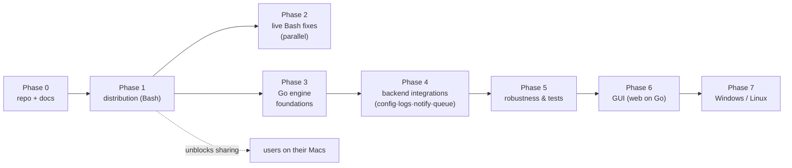
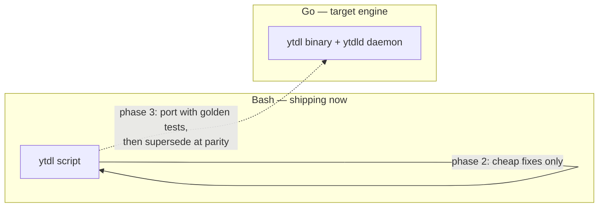
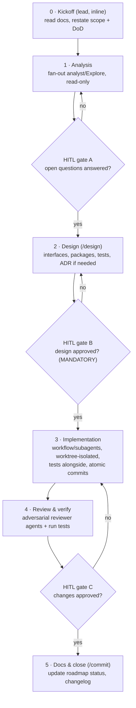

# Roadmap

Single source of truth for planned work. Updated at the end of each cycle.

Status: `done` · `in progress` · `planned` · `deferred`

The engine is a single Go binary (CLI + future queue daemon + web GUI), shelling
out to yt-dlp/ffmpeg; the installer stays Bash and Python is not adopted. See
[ADR-0003](decisions/0003-engine-language-go.md) for the rationale, and
[go-engine.md](go-engine.md) for the as-built engine. The confirmed sequence is
**foundations → backend integrations → robustness → GUI**, with the GUI last.
**Cycle 1 (foundations, phase 3) is done**; next is Cycle 2 (backend, phase 4).

## Phase 0 — Repository & documentation — `done`

| # | Item | Status |
|---|---|---|
| 0.1 | git init, baseline commit of the existing script | done |
| 0.2 | Architecture of the current script | done |
| 0.3 | Improvements and evolutions register | done |
| 0.4 | Distribution constraints analysis + ADR-0001 | done |
| 0.5 | This roadmap | done |

Documentation lives in [docs/](README.md); user-facing install instructions are
in the top-level [README](../README.md).

## Phase 1 — Distribution — `in progress` — **immediate priority**

Goal: a user with no developer tooling installs `ytdl` by pasting one line, on
any macOS from 10.13 up, and can keep it working over time.

Status: published and working. The one-liner installs cleanly on current macOS
(Apple Silicon, verified on hardware). Two things remain before calling it done:
a real end-to-end download, and a test of the legacy path on an old Intel Mac.

| # | Item | Status | Notes |
|---|---|---|---|
| 1.1 | `ytdl --version` + version constant | done | Prerequisite for update and support ([U1](improvements.md)) |
| 1.2 | `install.sh`: macOS + arch detection | done | Handles the `10.x` → `11+` scheme; covered by tests |
| 1.3 | Provision yt-dlp (binary or zipimport per target) | done | `releases/latest/download/…`, no pinned version |
| 1.4 | Verify `SHA2-256SUMS` before installing | done | Mandatory, see ADR-0001 |
| 1.5 | Provision ffmpeg per architecture | done | martin-riedl (signed) for 10.15+, evermeet for 10.13–10.14 |
| 1.6 | Install into `~/.local/bin` + PATH in `.zprofile` / `.bash_profile` | done | Idempotent; login shells are what Terminal.app starts |
| 1.7 | Actionable failure messages (no `brew install`) | done | Now point at `ytdl --update` ([U3](improvements.md)) |
| 1.8 | Guided path for macOS 10.13–10.14 (python.org 3.13) | done | Aborts with an explanation below 10.13 |
| 1.9 | `ytdl --update` (updates yt-dlp **and** the script) | done | Re-runs the installer, single provisioning path ([U2](improvements.md)) |
| 1.10 | Public GitHub repo, first release, documented one-liner | done | Published at `alergyonthestage/ytdl`; one-liner install confirmed working |
| 1.11 | Real-hardware testing | in progress | Modern path verified on Apple Silicon (below); legacy path still pending |
| 1.12 | Licence (PolyForm Strict 1.0.0) | done | Use permitted, redistribution and derivatives are not |
| 1.13 | Italian user guides (install + usage) | done | [installazione](guida-installazione.md), [uso](guida-uso.md) |

> **Superseded by [ADR-0005](decisions/0005-macos-floor-and-single-engine.md)
> (2026-07-22):** items 1.3 (zipimport per target), 1.5 (evermeet for legacy Intel),
> 1.8 (Mojave Python path) and the legacy half of 1.11 are dropped — Cycle 1 raises
> the floor to **macOS 10.15** and removes the Python/legacy path. They stay marked
> *done* for the currently-shipping Bash installer; the removal lands with the
> installer change (item 3.2, Session 3).

**Definition of done:** a tester who has never opened Terminal completes the
install unaided and downloads a track.

### 1.11 — what is verified, what remains

**Verified on real hardware (2026-07-22, MacBook Pro, macOS 15.6, Apple Silicon):**
the full modern path end to end — checksum verification, ffmpeg/ffprobe download
and extraction from the martin-riedl arm64 zips, the signed ffmpeg actually
running, PATH written to `.zprofile` and `.bash_profile`, and the final
`ytdl --version` / `yt-dlp` / `ffmpeg` checks all passing.

> **Scope caveat (Cycle 1 consolidation review, 2026-07-23):** that hardware run
> predates the compiled-binary install path. At the time it was recorded the
> installer still fetched the Bash `ytdl` script directly; the `install_ytdl`
> function — which downloads the cross-compiled Go binary, hard-fails on a missing
> checksum, and replaces the binary in place — landed ~6 hours later. So the
> yt-dlp/ffmpeg provisioning is hardware-verified, but **`install_ytdl` running
> against a real GitHub Release has not yet been exercised on a Mac**, including
> whether the ad-hoc-signed (Go-linker, not `codesign`) cross-compiled binary
> launches under Gatekeeper/AMFI. Closing this — run `install.sh` end to end
> against a real (or pre-release) tag on an actual Mac — is the blocker to clear
> before tagging `v2.0.0`. The release *mechanics* (asset names, ldflags version
> wiring, checksum format, `--latest`/trigger/permissions, darwin cross-compile)
> were statically verified in the same review and check out.

**The legacy path is no longer a gap.** macOS 10.13–10.14 (Intel + python.org
Python 3.13 + zipimport yt-dlp) was only ever checked on paper; rather than close
that gap on old hardware, [ADR-0005](decisions/0005-macos-floor-and-single-engine.md)
**drops** the legacy path (the Go engine needs 10.15+). No old-Intel-Mac testing is
required.

**A real download** has not been run yet either — installation succeeded, but the
end-to-end "paste a URL, get a tagged file" test is the true definition of done.

### Lesson learned — the raw CDN cache

`raw.githubusercontent.com` serves through a CDN that caches a branch path for a
few minutes. Right after a push, `.../main/install.sh` can still return the
previous version, which looks exactly like "the fix didn't work". A commit-pinned
URL (`.../<sha>/install.sh`) bypasses it. `git ls-remote` and `codeload` are
authoritative for what GitHub actually holds. Not worth engineering around —
`--update` runs rarely and the window is minutes — but worth remembering when a
fresh push appears not to have taken effect.

## Phase 2 — Live Bash fixes — `planned` (parallel, optional)

Cheap correctness fixes to the **currently shipping** Bash tool, worth doing for
real users today while the Go engine (phases 3–6) is built. Kept deliberately
small: only what is low-cost on Bash and not superseded by the port. The
substantive versions of persistent logs, notifications, config and the queue are
delivered by the Go engine, not bolted onto the Bash script.

| # | Item | Ref |
|---|---|---|
| 2.1 | Validate `--format` against the supported list | C1 |
| 2.2 | Handle multiple URLs, or reject extra arguments explicitly | C3 |
| 2.3 | Harden the `-b` re-exec argument forwarding | C4 |
| 2.4 | Sanitise failure-log filenames | C5 |
| 2.5 | Check AtomicParsley when format is `m4a`, or restrict formats | C2 |

## Phase 3 — Go engine foundations — `done`

The pivot to the Go engine ([ADR-0003](decisions/0003-engine-language-go.md)).
Establish the binary and reach parity with the Bash `ytdl`, so it can supersede it
without regressions. This is "foundations" in the confirmed sequence.

| # | Item | Status | Ref |
|---|---|---|---|
| 3.1 | Go module + CI cross-compile (macOS arm64 + Intel) + checksum publication | done | ADR-0003 |
| 3.2 | Installer provisions the `ytdl` binary the same way as yt-dlp/ffmpeg | done | ADR-0003 |
| 3.3 | Port the yt-dlp arg builder + metadata pipeline; **golden tests** vs the Bash argv | done | ADR-0003 |
| 3.4 | Thin CLI front-end over the shared core (parity with today's flags) | done | — |
| 3.5 | Persistent config file (`~/.config/ytdl/config`), strict `key=value` **parse, not `source`** | done | U4 |
| 3.6 | Precedence: flag > env > session override > config file > built-in default | done | U4 |

**Implemented (Session 3, 2026-07-22)** on branch `feat/go-engine/cycle1`:
`internal/{config,core,cli,run,buildinfo}` + `cmd/ytdl`, golden-tested for byte-exact
argv parity against the Bash `ytdl`; CI (`.github/workflows/`) and the single-path
installer per [ADR-0005](decisions/0005-macos-floor-and-single-engine.md). Designed in
[design-cycle1-core.md](design-cycle1-core.md) + [design-cycle1-remaining.md](design-cycle1-remaining.md).
The first release tag `v2.0.0` triggers `release.yml`.

Useful config settings — the full list lives in [improvements.md](improvements.md#u4)
(output dir, format, name template, background-by-default, concurrency, notify,
log dir/retention, embed options, …).

## Phase 4 — Backend integrations (Go) — `planned`

The maintainer's requested backend evolutions, built on the Go core.

| # | Item | Ref |
|---|---|---|
| 4.1 | Persistent central log store (`~/.local/state/ytdl/logs/`) + retention | U7 |
| 4.2 | Optional in-destination failure breadcrumb, keyed by **hash(URL)** | U7 |
| 4.3 | Auto-cleanup: a successful download removes the stale breadcrumb for that URL | U7 |
| 4.4 | System notification on completion, toggleable (`notify`, `notify_on`) | U6 |
| 4.5 | Real queue + daemon (`ytdld`): filesystem spool with atomic state transitions | U5 |
| 4.6 | Bounded concurrency (default cap 2–3; `unlimited` allowed but discouraged) | U5 |
| 4.7 | Job status inspection: `ytdl queue [--watch]`, `status`, `cancel`, `retry` | U5 |

## Phase 5 — Robustness & tests (Go) — `planned`

Hardening of the new engine once its features exist: comprehensive error handling,
edge cases, retries/backoff, YouTube rate-limit handling, and a real test suite
(Go's `testing`, beyond the golden tests of 3.3).

## Phase 6 — GUI — `planned` (last priority, high user value)

A GUI for non-developer users. It is a **front-end over the Go engine** (config +
queue + runner already built), not a reimplementation. Runtime is settled by
ADR-0003: a web UI served by the Go daemon.

| # | Item | Notes |
|---|---|---|
| 6a | AppleScript/Automator MVP: paste/drop URL, pick folder, enqueue | zero-dep, works to Mojave, immediate value for non-devs |
| 6b | Web UI served by `ytdld`: live foreground progress, format/settings, per-run/session/global output dir, settings editor, queue + in-progress view | `net/http` + SSE; needs 3–4 done |

The settings editor writing the config file is safe precisely because the config
is parsed with a whitelist, not `source`d (3.5).

## Phase 7 — Windows / Linux — `deferred`

Out of scope until macOS distribution is proven with real users. Now mostly a
second installer and dependency path, since the Go engine cross-compiles
(`GOOS`/`GOARCH`). Notifications abstract to `notify-send` on Linux.

## Deferred / evaluated, not scheduled

- **GUI installer window (`.dmg`/`.pkg`)** — deferred. A native installer window
  without Gatekeeper friction needs paid signing ($99/yr), which is out of scope.
  The constraint-respecting alternative is a double-clickable `install.command`
  (browser-quarantined → one-time Privacy & Security override), a shell wrapper
  over the same installer. Not a priority.
- **Python as a universal dependency** — evaluated and rejected
  ([ADR-0003](decisions/0003-engine-language-go.md)): it would break the
  non-interactive install for the majority to benefit only the GUI, which Go
  serves without a runtime dependency.

## Implementation via development cycles

Phases 3–6 are executed as **sequential development cycles — one per session**.
Each session orchestrates its cycle by delegating to subagents / workflows, under
one non-negotiable rule:

> **Implementation never starts without preliminary analysis + design + an explicit
> human-in-the-loop (HITL) approval of the design.**

### Per-session protocol

- **No file writes before gate B.** Stages 0–2 are analysis/design only (per the
  workflow rules). Stage 3 is the first that touches implementation files.
- **Skills/agents:** `/analyze` + `analyst`/`Explore` (stage 1), `/design` (stage 2),
  `reviewer` + `/review` (stage 4), `/commit` (stage 5).
- **Agent budget — balance by complexity, soft cap ~5–10 per cycle** (the workflow
  engine caps concurrency regardless): analysis 1–3, design 1–2, implementation
  3–8 (widest), review 2–3.
- **Workflow vs subagent:** use the Workflow tool for wide deterministic fan-out /
  pipelines and adversarial review panels (requires explicit opt-in per session —
  e.g. "orchestrate this cycle with a workflow"); use individual subagents for a
  handful of independent analysis/review tasks.

### Cycle 1 — Go engine foundations & parity (phase 3) — **done**

**Status (2026-07-22):** run across three sessions — (1) core analysis + design,
(2) remaining analysis + design, (3) implementation. **All three done.**

- **Session 1 — core:** 3.3 + 3.4 + shared-core scaffolding + config seam. See
  [design-cycle1-core.md](design-cycle1-core.md),
  [ADR-0004](decisions/0004-go-engine-package-layout.md),
  [parity contract](go-port-parity-contract.md),
  [golden-test design](golden-test-design.md).
- **Session 2 — remaining:** config file (3.5/3.6), CI (3.1), installer (3.2),
  plus the macOS floor raise. See
  [design-cycle1-remaining.md](design-cycle1-remaining.md) and
  [ADR-0005](decisions/0005-macos-floor-and-single-engine.md) (floor → 10.15, single
  Go engine, Python removed).
- **Session 3 — implementation:** the whole cycle built on branch
  `feat/go-engine/cycle1` (lead inline + adversarial review subagents). Delivered:
  the golden capture harness + 20 byte-exact references, `internal/{config,core,cli,
  run,buildinfo}` + `cmd/ytdl`, CI (`ci.yml` + `release.yml`), the single-path
  installer, and the user-doc flip to the 10.15 floor / 2.0.0. `go test -race ./...`,
  `go vet`, `gofmt`, and the 19 installer checks all green; a Stage-4 review found no
  critical issues and its fixes are applied.

**Done:** the Go `ytdl` reproduces the Bash tool's behaviour byte-for-byte (goldens
green + end-to-end argv checks), reads the config file, and installs through the
updated installer. The crown-jewel metadata pipeline is pinned by the golden tests.
**Not yet shipped:** the branch is unpushed (pushed from host); tagging `v2.0.0`
triggers the release and makes the installer's `releases/latest` URLs resolve.

### Cycle 2 — Backend integrations (phase 4 + phase 5 hardening)

- **Scope:** central persistent logs + retention; failure breadcrumb by hash(URL)
  + auto-cleanup; toggleable notifications; queue + `ytdld` daemon (spool, atomic
  transitions) + bounded concurrency + `status`/`cancel`/`retry`; hardening + tests.
- **Entry:** Cycle 1 done (Go core + config exist).
- **Done when:** queued/background downloads run under a concurrency cap with
  inspectable status; logs persist centrally and auto-clean; notifications fire per
  config; test suite green.

### Cycle 3 — GUI (phase 6)

- **Scope:** AppleScript MVP (paste/drop URL → pick folder → enqueue), then the web
  UI served by `ytdld` (live foreground progress via SSE, format/settings,
  per-run/session/global output dir, settings editor, queue + in-progress view).
- **Entry:** Cycles 1–2 done (config + queue + runner exist).
- **Done when:** a non-developer starts a foreground download and watches progress,
  launches background downloads, sees the queue, and edits settings — all without
  the Terminal.

Phase 7 (Windows/Linux) stays deferred and is not a scheduled cycle.

## Known open questions

- ~~Does the Python 3.13 install path actually work end-to-end on a real Mojave
  machine?~~ **Closed by [ADR-0005](decisions/0005-macos-floor-and-single-engine.md):**
  the floor is raised to macOS 10.15 and the Python/legacy path is dropped, so the
  question is moot.
- Is ffmpeg strictly required for every format we advertise, or only for cover
  embedding and some conversions? Affects whether ffmpeg can be optional (C2).
- Sequoia/Tahoe Gatekeeper specifics matter only if a `.app`/`.pkg` ships — now
  only relevant to a possible `install.command`, not the web GUI.
- ~~**Documentation drift (found in Session 1):** the `ytdl` script header comment
  lists an *album* ID3 tag, but `meta_args` writes only `meta_artist`/`meta_title`.~~
  **Closed (Session 3):** the Go port correctly omits album (parity, golden-tested)
  and the Bash header comment was corrected.
