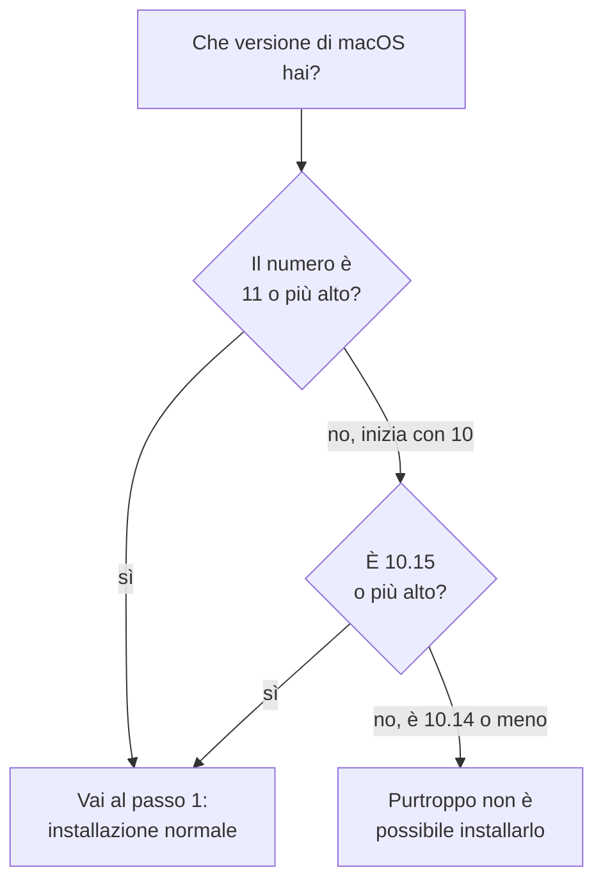

# Guida all'installazione

Questa guida ti accompagna passo passo. Non serve sapere niente di programmazione:
si tratta di copiare e incollare una riga.

Tempo necessario: circa 5 minuti.

## Prima di iniziare

Ti serve:

- un Mac con macOS 10.15 Catalina o più recente
- una connessione a internet

Non ti serve la password di amministratore: viene installato tutto dentro la tua
cartella utente, senza toccare il sistema.

### Che versione di macOS ho?

Clicca sulla **mela** in alto a sinistra → **Informazioni su questo Mac**.
Il numero che vedi (per esempio `14.5`, `12.7` o `10.15.7`) è la tua versione.



## Passo 1 — Apri il Terminale

Il Terminale è un'app già presente su ogni Mac.

1. Premi **⌘ (Command) + barra spaziatrice**: si apre una barra di ricerca al
   centro dello schermo
2. Scrivi `Terminale` e premi **Invio**

Si apre una finestra con del testo e un cursore che lampeggia. È normale che
sembri spoglia: è lì che incollerai il comando.

## Passo 2 — Incolla il comando

Copia questa riga **per intero**:

```
curl -fsSL https://raw.githubusercontent.com/alergyonthestage/ytdl/main/install.sh | bash
```

Torna sulla finestra del Terminale, incolla con **⌘ + V** e premi **Invio**.

Vedrai scorrere del testo per un minuto o due, mentre vengono scaricati i
componenti necessari. Alla fine comparirà:

```
✓ Done.
```

## Passo 3 — Apri una finestra nuova

**Chiudi il Terminale e riaprilo.** Questo passaggio serve davvero: la finestra
già aperta non conosce ancora il comando appena installato.

Poi scrivi:

```
ytdl --version
```

Se vedi quattro righe — la versione di `ytdl` (per esempio `ytdl v2.2.0`), quelle
di `yt-dlp` e di `ffmpeg`, e in fondo una riga `Aggiornamenti:` — l'installazione è
riuscita. Puoi passare alla [guida all'uso](guida-uso.md).

Che cosa vuol dire ognuna di quelle righe è spiegato nella
[guida all'uso](guida-uso.md#tenere-ytdl-aggiornato); qui basta che ci siano.

## Se qualcosa non funziona

### «command not found: ytdl»

Hai saltato il Passo 3: chiudi completamente il Terminale e riaprilo.

Se il problema resta anche dopo aver riaperto, prova a scrivere:

```
~/.local/bin/ytdl --version
```

Se questo funziona, scrivimi: significa che il comando è installato correttamente
ma il Mac non lo sta trovando da solo.

### L'installazione si ferma con un messaggio di errore

Ogni errore dell'installatore dice cosa fare. Il più comune è:

- **macOS troppo vecchio** — sotto 10.15 Catalina non è purtroppo possibile
  installarlo.

### «Checksum mismatch»

Ogni pezzo che l'installatore scarica viene controllato prima di essere messo al
suo posto. Questo messaggio vuol dire che il controllo non è tornato, e
**l'installazione si ferma senza toccare niente**: meglio nessuna installazione
che una installazione di cui non ci si fida.

Quasi sempre è un download corrotto a metà. Rilancia il comando del Passo 2. Se
compare di nuovo, **fermati e scrivimi** invece di insistere.

Da non confondere con il messaggio qui sotto, che è un'altra cosa e non ferma
niente.

### «The ffmpeg build ytdl attests … is no longer published»

Non è un errore e non devi fare nulla: l'installazione prosegue.

ytdl installa versioni esatte, controllate una per una da chi lo sviluppa. Chi
pubblica ffmpeg però tiene online solo la versione corrente, e quando ne esce una
nuova ritira la precedente. Quando capita, ytdl ha due possibilità: fermarsi —
lasciandoti senza programma per una cosa che non ti riguarda — oppure installare
la versione corrente e **dirti chiaramente** che quella non ha potuto
controllarla.

Fa la seconda. Da quel momento, in `ytdl --version` e nell'interfaccia, quel
componente risulta *non verificata: la versione attestata non è più disponibile*.
Funziona esattamente come prima; la scritta sparisce da sé a un aggiornamento
successivo.

Una precisazione che conta: **questo succede solo se chi pubblica risponde "quel
file non esiste più"**. Se invece la rete non va, o la connessione cade a metà,
l'installatore **si ferma** — non si accontenta mai di qualcosa che non ha potuto
verificare solo perché il collegamento era ballerino.

### Non trovo il Terminale

Puoi aprirlo anche da **Finder** → **Applicazioni** → **Utility** → **Terminale**.

## Come aggiornare

Ogni tanto YouTube cambia qualcosa e i download smettono di funzionare. Non è un
guasto del tuo Mac: succede a tutti e si risolve in trenta secondi.

**Non devi più accorgertene da solo.** ytdl controlla per conto suo — al massimo
una volta al giorno, mentre lo stai già usando — e quando c'è qualcosa di nuovo te
lo dice: dopo un download nel Terminale, e con una striscia in alto se usi
l'interfaccia nel browser.

Dal Terminale:

```
ytdl --update
```

Dall'interfaccia, senza Terminale: *Impostazioni* → *Versione e aggiornamenti* →
**Aggiorna**. Se ha cambiato ytdl stesso, la pagina si chiude e si riapre da sola;
non devi fare niente.

Rilanciarlo quando è già tutto a posto non costa nulla: se ne accorge e non
riscarica niente.

Il capitolo completo — che cosa significa ogni scritta, e come spegnere il
controllo automatico se preferisci — è in
[guida-uso.md](guida-uso.md#tenere-ytdl-aggiornato).

## Quali versioni installa (e perché non le scegli tu)

Non serve saperlo per usare ytdl; è qui perché prima o poi qualcuno se lo chiede.

ytdl costruisce un comando molto preciso per il programma che scarica davvero
(`yt-dlp`) e per quello che converte l'audio (`ffmpeg`). Quali versioni di quei
due funzionano con quel comando è quindi una caratteristica **di ytdl**, non una
tua preferenza — un po' come i pezzi di ricambio di un'auto: non li scegli allo
sportello.

Per questo la scelta è scritta una volta sola, in un file del progetto chiamato
`deps.conf`, che l'installatore legge ogni volta. Ha due conseguenze pratiche per
te:

- **non c'è niente da configurare**, e non puoi installare per sbaglio una
  combinazione mai provata;
- se salta fuori un problema, **si risolve per tutti insieme**, senza aspettare
  una nuova versione di ytdl: chi lo sviluppa cambia quella riga, e il tuo Mac se
  ne accorge al controllo successivo.

## Come disinstallare

Nel Terminale:

```
rm -f ~/.local/bin/ytdl ~/.local/bin/yt-dlp
rm -f ~/.local/bin/ffmpeg ~/.local/bin/ffprobe
```

La musica che hai già scaricato non viene toccata.
