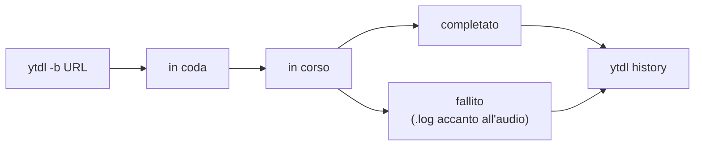

# Guida all'uso

Come usare `ytdl` per scaricare musica. Se non l'hai ancora installato, parti
dalla [guida all'installazione](guida-installazione.md).

## Il primo download

Apri il Terminale (⌘ + barra spaziatrice → `Terminale`), poi scrivi `ytdl`, uno
spazio, e incolla l'indirizzo del video **tra virgolette**:

```
ytdl "https://youtu.be/dQw4w9WgXcQ"
```

Premi Invio. Vedrai il titolo del brano e una barra di avanzamento. Alla fine ti
viene detto dove è stato salvato il file.

### ⚠️ Le virgolette sono obbligatorie

Gli indirizzi di YouTube contengono il carattere `&`, che per il Terminale
significa «esegui in background». Senza virgolette il comando viene troncato e
scarica la cosa sbagliata, o niente.

Sbagliato: `ytdl https://youtube.com/watch?v=XXX&list=YYY`
Giusto: `ytdl "https://youtube.com/watch?v=XXX&list=YYY"`

Prendi l'abitudine di metterle sempre, anche quando sembrano superflue.

## Dove finisce la musica

Nella cartella **Musica → ytdl** della tua cartella utente.

I file escono già con il nome giusto (`Artista - Titolo.mp3`) e con artista,
titolo e copertina incorporati, pronti per essere trascinati nella tua libreria
musicale.

Per salvare altrove **solo per questa volta**:

```
ytdl -o ~/Desktop "https://youtu.be/XXXX"
```

Per cambiare la cartella **per sempre**, vedi [più avanti](#cambiare-la-cartella-di-destinazione).

## Le cose che userai davvero

### Scaricare una playlist intera

Di default viene scaricato solo il brano indicato, anche se l'indirizzo fa parte
di una playlist. Per scaricare tutta la playlist aggiungi `-p`:

```
ytdl -p "https://youtube.com/playlist?list=YYYY"
```

### Scegliere il formato

Il formato predefinito è `mp3`, che va bene ovunque. Se vuoi qualità senza
perdita usa `flac`:

```
ytdl -f flac "https://youtu.be/XXXX"
```

Formati disponibili: `mp3`, `flac`, `m4a`, `opus`, `wav`.

### Vedere i nomi prima di scaricare

Utile con le playlist, per controllare che i titoli vengano puliti bene:

```
ytdl -n "https://youtube.com/playlist?list=YYYY"
```

Non scarica niente, mostra solo i nomi che verrebbero usati.

### Scaricare in background

Per playlist lunghe: il comando torna subito e il download continua per conto
suo, anche se chiudi il Terminale.

```
ytdl -b "https://youtube.com/playlist?list=YYYY"
```

I download in background vengono messi **in coda** ed eseguiti alcuni alla volta,
così non intasano la connessione. In questa modalità non vedi l'avanzamento nel
Terminale, ma puoi controllare tutto con i comandi della sezione seguente. Se un
brano fallisce, oltre alla cronologia trovi anche un file `.log` accanto al punto
in cui sarebbe finito l'audio, con la spiegazione.

### Combinare le opzioni

Le opzioni si sommano liberamente:

```
ytdl -p -f flac -o ~/Desktop "https://youtube.com/playlist?list=YYYY"
```

Playlist intera, in FLAC, sul Desktop.

## Coda, stato e cronologia

Quando scarichi in background (`-b`), tre comandi ti dicono cosa sta succedendo.



**Cosa c'è in coda adesso** — i download in attesa e in corso:

```
ytdl queue
```

Aggiungi `--watch` per vederli aggiornare dal vivo: la vista si ridisegna **sul
posto** (niente muri di testo che si accumulano) e si chiude da sola quando la
coda è finita. Premi Ctrl-C per uscire prima.

```
ytdl queue --watch
```

Ogni riga mostra il **titolo** del brano (appena `ytdl` lo conosce) con sotto
l'**indirizzo completo**, così riconosci al volo di che video si tratta — lo stesso
vale per le liste di `ytdl cancel` e `ytdl retry`. Una playlist è segnalata con
`(playlist)`.

**Come va in generale** — se il servizio di download è attivo, più un riepilogo
recente:

```
ytdl status
```

**Cosa ho scaricato** — la cronologia, i brani più recenti in cima. A differenza
della coda, include **anche i download in primo piano**, non solo quelli in
background:

```
ytdl history
```

Solo i falliti, oppure solo gli ultimi N:

```
ytdl history --failed
ytdl history --limit 50
```

Il riepilogo di `status` e la cronologia coprono un periodo (di default gli ultimi
30 giorni); l'etichetta accanto ai numeri te lo ricorda sempre.

### Annullare un download

Per fermare un download **in corso o in attesa**, lancia `ytdl cancel` senza
argomenti: mostra la lista numerata. Poi indica il numero:

```
ytdl cancel        # mostra la lista
ytdl cancel 2      # annulla il numero 2
ytdl cancel --all  # annulla tutto
```

Un download in attesa viene rimosso subito; uno già in corso viene interrotto (con
anche l'eventuale conversione), **senza lasciare file a metà** nella cartella.

### Riprovare un download fallito

`ytdl retry` (senza argomenti) elenca i download falliti; indica il numero per
rimetterlo in coda:

```
ytdl retry         # mostra i falliti
ytdl retry 1       # riprova il numero 1
ytdl retry --all   # riprova tutti
```

> Il numero riflette la lista **in quel momento**. Se scrivi degli script, usa il
> prefisso dell'identificatore (l'`id` che vedi nella lista) invece del numero: è
> stabile nel tempo.

### Fermare i download troppo lunghi

Di norma non c'è un limite di durata (un album grosso o una connessione lenta non
vengono interrotti). Se vuoi un tetto, imposta `job_timeout` (in secondi) nel file
di configurazione: un download che lo supera viene interrotto e segnato come
fallito. `0` (default) significa nessun limite.

## L'interfaccia grafica (senza Terminale)

Se preferisci non usare il Terminale, ytdl ha un'interfaccia nel browser.

**Il modo normale di aprirla è l'app YTDL**: la trovi nella cartella
**Applicazioni** e ti basta un doppio clic. Se la vuoi più comoda, trascinala sul
Dock o sulla Scrivania — funziona da qualsiasi posizione.

Quando la apri, l'icona compare per un attimo nel Dock, il browser si apre sulla
pagina di ytdl, e l'icona sparisce. È normale: **YTDL non è un programma che
resta acceso**, è solo il pulsante che accende il motore. La tua finestra su ytdl
è la pagina del browser, e c'è un solo modo di chiuderla — chiudere quella pagina.
Non c'è nessun «Esci» da cercare nel Dock.

Se preferisci, o se sei già nel Terminale, puoi aprire la stessa interfaccia così:

```
ytdl gui
```

Si apre una pagina web (sul tuo computer, non su internet) dove puoi:

- **incollare un link e scaricare**, scegliendo formato, playlist e cartella;
- **vedere la barra di avanzamento** dei download in corso, dal vivo;
- consultare la **coda** e la **cronologia** recente;
- **cambiare le impostazioni** (cartella predefinita, formato, e tutto il resto)
  senza modificare file a mano;
- **vedere se c'è un aggiornamento e installarlo**, senza aprire il Terminale —
  vedi [Tenere ytdl aggiornato](#tenere-ytdl-aggiornato).

La pagina resta la tua finestra su ytdl finché la tieni aperta; quando la chiudi
e non ci sono download in coda, il motore si spegne da solo. Se chiudi la pagina
con dei download ancora in coda, il browser ti avvisa prima di uscire.

L'interfaccia è **solo tua e solo locale**: risponde unicamente sul tuo computer
(`127.0.0.1`) e ogni sessione è protetta da un codice, quindi nessun sito web che
visiti può comandarla. La cartella per la sessione corrente si imposta dalla
pagina stessa, senza toccare la configurazione permanente.

> Se la porta predefinita è occupata, scegline un'altra:
> `YTDL_GUI_PORT=8790 ytdl gui`

> **Se fai doppio clic sull'app e non succede niente**, ytdl te lo dice con un
> messaggio a schermo. Se anche quello non compare, ogni tentativo lascia una
> riga in `~/.local/state/ytdl/launcher.log`: aprila e vedrai che cosa è andato
> storto. In quel caso puoi sempre aprire l'interfaccia dal Terminale con
> `ytdl gui`, che scrive lo stesso messaggio.

## Cambiare la cartella di destinazione

Per cambiarla stabilmente, incolla nel Terminale (sostituendo il percorso con il
tuo):

```
echo 'export YTDL_OUT_DIR="/Users/tuonome/Musica/Scaricati"' >> ~/.zprofile
```

Poi chiudi e riapri il Terminale.

Un modo semplice per ottenere il percorso corretto: trascina la cartella dal
Finder dentro la finestra del Terminale, e il percorso viene scritto da solo.

## Tenere ytdl aggiornato

YouTube cambia spesso, e quando succede lo strumento che scarica va aggiornato.
Prima dovevi accorgertene da solo; adesso te lo dice ytdl.

### Come fa a saperlo

Quando lo usi, ytdl controlla per conto suo se esiste una versione più recente —
**non più di una volta al giorno**, e solo mentre sta già facendo qualcosa. Non
c'è nessun programma che resta acceso ad aspettare, e se spegni il computer nel
frattempo non succede nulla.

Il controllo può fallire: se sei senza rete, o dietro il wi-fi di un albergo che
chiede di accettare qualcosa prima di navigare, ytdl non riesce a chiedere. In
quel caso **non dice niente** — nessun errore, nessun avviso rosso — e ti dirà
semplicemente che l'ultima verifica non è riuscita.

Questa è la parte importante: **«non sono riuscito a controllare» non vuol dire
«sei aggiornato»**. ytdl tiene le due risposte separate, sempre.

### Dove lo vedi

**Dopo un download**, se c'è un aggiornamento, compaiono due righe:

```
! Aggiornamento disponibile per ytdl v2.2.0 (hai v2.1.0), con yt-dlp 2026.08.01.
  Aggiorna con:  ytdl --update   (per non controllare più: update_check = false)
```

Se non c'è niente da dire, non compare niente.

**Quando vuoi chiederlo tu**, con `ytdl --version`:

```
ytdl v2.1.0
yt-dlp 2026.07.04   (verificata con questo ytdl)
ffmpeg 9.0   (verificata con questo ytdl)
Aggiornamenti: sei aggiornato · verificato il 21/08/2026
```

L'ultima riga è una di queste:

| Cosa leggi | Cosa significa |
|---|---|
| `sei aggiornato · verificato il …` | Tutto a posto, e ti dice **quando** l'ha verificato |
| `disponibile un aggiornamento · ytdl --update` | C'è qualcosa di nuovo |
| `non verificati (mai controllato)` | Non ha ancora fatto in tempo a chiedere |
| `non verificati (l'ultimo tentativo non ha ricevuto risposta)` | Ci ha provato e non è riuscito: probabilmente eri senza rete |
| `controllo automatico disattivato` | L'hai spento tu (più sotto come) |
| `non controllati (build locale)` | Stai usando una copia compilata a mano, non una versione rilasciata |

La stessa riga compare anche in fondo a `ytdl status`.

### Aggiornare dal Terminale

```
ytdl --update
```

Funziona **sempre**, anche se hai spento il controllo automatico: quello riguarda
solo il fatto che ytdl chieda da solo, non il tuo diritto di chiedere.

Non devi preoccuparti di lanciarlo "a vuoto": se è già tutto a posto se ne
accorge e non riscarica niente, dicendoti che cosa ha saltato.

### Aggiornare dall'interfaccia grafica (senza Terminale)

Se usi la pagina nel browser, non ti serve il Terminale per nulla di tutto questo.

Quando c'è un aggiornamento compare una **striscia in alto**, su qualunque
schermata tu sia, con il pulsante **Vedi** che ti porta al punto giusto. In
**Impostazioni**, il riquadro *Versione e aggiornamenti* c'è sempre e mostra:

- le versioni installate di ytdl, yt-dlp e ffmpeg;
- la stessa frase di stato vista sopra;
- **Controlla ora**, per chiedere subito invece di aspettare;
- una tabella di che cosa cambierebbe, quando c'è qualcosa da cambiare;
- il pulsante **Aggiorna**.

Premendo *Aggiorna* ti viene prima detto che cosa sta per succedere, e devi
confermare.

**L'aggiornamento parte solo a coda vuota.** Se ci sono download in corso o in
attesa il pulsante è spento e accanto c'è scritto perché — per esempio «2 download
in corso: l'aggiornamento parte a coda vuota». La notizia però non ti viene
nascosta: la striscia in alto la vedi lo stesso. Aspetta che la coda finisca, o
annulla ciò che non ti serve, e il pulsante si riaccende.

**Se è cambiato ytdl stesso, l'interfaccia si chiude e si riapre da sola.** È
normale, dura qualche secondo e non devi fare niente: la pagina te lo dice
(«Aggiornato. Riapro l'interfaccia…») e si ricarica da sola sulla versione nuova.
Se invece è cambiato solo qualche componente interno, non si riavvia niente e
leggerai «Aggiornato. Non serve riavviare nulla.»

Nel raro caso in cui la pagina non torni entro un minuto, te lo dice e ti indica
l'unico comando da dare: `ytdl gui`. È l'unico punto di tutta l'interfaccia in cui
viene ancora nominato il Terminale.

**Se l'aggiornamento non riesce**, la pagina non prova a riassumere che cosa è
andato storto: ti offre **Vedi il dettaglio** (il resoconto vero di che cosa è
successo) e **Riprova**, che rifà l'installazione da capo. Nel frattempo ytdl è
rimasto quello di prima — un aggiornamento fallito non ti lascia a metà.

**Se nessuno ha seguito l'aggiornamento fino in fondo** — hai chiuso il computer
mentre era in corso, per esempio — al ritorno leggerai:

> Non so come sia andato questo aggiornamento: nessuno l'ha seguito fino alla
> fine. Le versioni installate adesso sono qui sopra; riprovare è sicuro.

ytdl preferisce dirti che non lo sa piuttosto che indovinare. Guarda le versioni
scritte lì sopra: se sono già quelle nuove è andato a buon fine, altrimenti premi
*Riprova*.

### Tre scritte che potresti incontrare

| Scritta | Che cosa vuol dire | Che cosa fare |
|---|---|---|
| **non verificata: la versione attestata non è più disponibile** | ytdl installa versioni esatte, controllate una per una. Ogni tanto chi le pubblica ritira quella vecchia quando ne esce una nuova: in quel caso ytdl installa la corrente e **te lo dice**, invece di lasciarti senza programma | Niente. Funziona lo stesso. Sparirà da sé al prossimo aggiornamento |
| **non installata da ytdl** | Sul computer c'è un'altra copia di quel programma (spesso installata con Homebrew) e viene usata quella, non la nostra. Non è "vecchia": semplicemente non è quella con cui ytdl è stato provato | Se qualcosa non va, `ytdl --update` rimette al suo posto la copia di ytdl |
| **versione non registrata** | Il programma c'è, ma ytdl non ha annotato quale versione sia — di solito perché è stato installato prima che ytdl tenesse questo registro | Niente. Si sistema al primo aggiornamento |

### Spegnere il controllo automatico

È una richiesta che ytdl manda su internet dal tuo computer, quindi puoi vietarla.

Dall'interfaccia grafica: in *Impostazioni*, togli la spunta a **«Controlla da
solo se c'è un aggiornamento»**.

Dal Terminale, scrivi questa riga nel file `~/.config/ytdl/config`:

```
update_check = false
```

Da quel momento ytdl non chiede più niente da solo. Restano funzionanti
`ytdl --update`, il pulsante *Controlla ora* dell'interfaccia, e tutto ciò che
riguarda le versioni che hai già installato.

È acceso di partenza per una ragione precisa: chi ha più bisogno di sapere che
qualcosa è cambiato è proprio chi non andrebbe mai a cercare l'interruttore per
accenderlo. Per questo l'avviso, ogni volta che compare, dice anche come farlo
smettere.

## Quando qualcosa non funziona

### I download hanno smesso di funzionare

È la situazione più comune, e quasi sempre non è colpa tua: YouTube cambia
qualcosa e lo strumento che scarica va aggiornato. Succede ogni pochi mesi.

```
ytdl --update
```

Prova **sempre** questo prima di ogni altra cosa. Vale anche se ytdl ti ha appena
detto che sei aggiornato: la versione nuova può essere uscita da poche ore, e
`ytdl --update` prende comunque l'ultima disponibile.

Dall'interfaccia grafica: *Impostazioni* → *Versione e aggiornamenti* →
**Controlla ora**, e poi **Aggiorna**. Vedi
[Tenere ytdl aggiornato](#tenere-ytdl-aggiornato).

Quando un download fallisce proprio per questo motivo, ytdl te lo suggerisce da
solo insieme all'errore: non devi ricordartelo.

### «Nessun file scaricato»

Nella quasi totalità dei casi mancano le virgolette attorno all'indirizzo.
Ricontrolla il comando.

### «Opzione sconosciuta»

Hai scritto male un'opzione, oppure hai messo l'indirizzo senza virgolette e il
Terminale ha interpretato un pezzo dell'URL come opzione.

### «Forse intendevi…?»

Hai scritto male il nome di un comando: per esempio `ytdl queu` invece di `ytdl
queue`. `ytdl` te lo segnala e ti suggerisce quello giusto, invece di provare a
scaricarlo come se fosse un indirizzo. Correggi il comando e riprova. (Se davvero
volevi passare quella parola come indirizzo, forzala con `ytdl -- laparola`.)

### Il nome del file è sbagliato

`ytdl` prova a ricavare artista e titolo dai dati del brano, e quando non ci sono
li deduce dal titolo del video. Se il video ha un titolo scritto in modo insolito,
il risultato può essere impreciso. Puoi sempre rinominare il file a mano.

## Tutte le opzioni

Per l'elenco completo, sempre aggiornato:

```
ytdl --help
```

| Opzione | Cosa fa |
|---|---|
| `-o CARTELLA` | Salva in una cartella diversa, solo per questa volta |
| `-p` | Scarica l'intera playlist |
| `-f FORMATO` | Formato audio: `mp3`, `flac`, `m4a`, `opus`, `wav` |
| `-n` | Mostra i nomi senza scaricare |
| `-b` | Scarica in background e restituisce subito il controllo |
| `-v` | Mostra tutti i dettagli tecnici (utile per capire un errore) |
| `--update` | Aggiorna ytdl e i suoi componenti |
| `--version` | Versioni installate, com'è messa ciascuna, e se c'è un aggiornamento |
| `--help` | Elenco completo delle opzioni |

### Comandi della coda

| Comando | Cosa fa |
|---|---|
| `ytdl queue [--watch]` | Download in attesa e in corso (con `--watch` si aggiorna dal vivo e si chiude a coda finita) |
| `ytdl status` | Stato del servizio di download + riepilogo recente |
| `ytdl history [--failed] [--limit N]` | Cronologia dei download, anche in primo piano |
| `ytdl cancel [<n> \| --all]` | Annulla un download in corso o in attesa (senza argomenti: lista numerata) |
| `ytdl retry [<n> \| --all]` | Rimette in coda un download fallito (senza argomenti: lista numerata) |
| `ytdl gui` | Apre l'interfaccia grafica nel browser |
