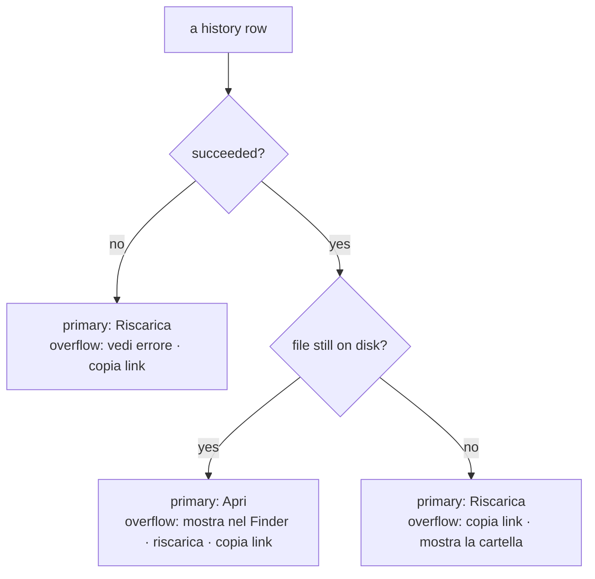

# UX principles — GUI and CLI

Normative reference for ytdl's user-facing surface, in **both** channels. It
outlives any single cycle: when a cycle adds a capability, it conforms to this
document or amends it in its ADR.

Established by [ADR-0013](decisions/0013-cycle5-unified-ux.md) (Cycle 5), which
derived it from the task analysis in [design-cycle5-ux.md](design-cycle5-ux.md).
Earlier conventions it absorbs: [ADR-0009](decisions/0009-cycle2c-cli-ux.md)
(command roles, windowed counts, TTY-aware colour) and
[ADR-0012](decisions/0012-cycle4-cli-ux-title-disambiguation.md) (titles,
display-width clipping).

## 1. The tasks the tool serves

Design against these, not against the list of existing commands. The full
analysis, with per-channel gaps at the time of Cycle 5, is in the design
document; this is the durable list.

| # | Task | Frequency |
|---|---|---|
| T1 | Download this link | very high |
| T2 | Is it working? (progress, queue) | high |
| T3 | Where did the file go? Open it | high |
| T4 | Stop it / do it again | medium |
| T5 | What did I download? Find it again | medium |
| T6 | Why did it fail? | medium |
| T7 | Change the default folder / format | medium |
| T8 | It broke — fix it (`--update`) | low, critical |

## 2. Information hierarchy

Three tiers. A surface that puts them on one plane is the defect Cycle 5 was
called to fix — do not reintroduce it.

| Tier | Content | GUI | CLI |
|---|---|---|---|
| **Always visible** | what is running and queued; where the last files landed | main view | `queue`, `status`, first screen of `history` |
| **One step away** | full history, failure detail, per-run overrides | second view, row overflow menu | a subcommand or a flag |
| **Rare but reachable** | naming regexes, log dir, retention, job timeout | collapsed "Avanzate" group | `ytdl config`, `ytdl help <argomento>` |

Corollary for help and settings: the default screen serves the top tier only.
Everything else is reachable in one step, never deleted.

## 3. Shared vocabulary

One concept, one word, both channels. Labels, help text and messages must not
invent synonyms.

| Concept | GUI label (it) | CLI surface |
|---|---|---|
| queued, not started | "In attesa" | `in attesa` |
| currently downloading | "In corso" | `in corso` |
| finished OK | "Completato" ✓ | ✓ |
| finished badly | "Non riuscito" ✗ | ✗ |
| stop a live job | "Annulla" | `ytdl cancel` |
| requeue a failed **spool** job | "Riprova" | `ytdl retry` |
| download the same thing again (from history) | "Riscarica" | `ytdl again` |
| open the audio file | "Apri" | `ytdl open` |
| show it in the file manager | "Mostra nel Finder" | `ytdl open --folder` |
| the durable record | "Cronologia" | `ytdl history` |
| the settings document | "Impostazioni" | `ytdl config` |

**Riprova vs. Riscarica** are distinct verbs because they act on distinct
objects: *Riprova* requeues a job the spool still holds, keeping its settings
snapshot and spool identity; *Riscarica* creates a new job from a history record,
which outlives the spool entry. Each is offered **only where its object is
shown** — the queue never offers Riscarica, the history never offers Riprova.

## 4. Action hierarchy

Never present a row of equal buttons. Each row exposes **one primary action**,
chosen by the row's state, with everything else behind an overflow (`···` in the
GUI, a hint line in the CLI).

An action that cannot work in the current context is shown **disabled with a
reason**, or not rendered at all when the platform does not support it — never
rendered live only to fail.

## 5. Messages and output

- **Language:** everything the user reads is Italian; code, comments, identifiers
  and documentation are English (`docs/guida-*.md` are the Italian exceptions, by
  audience).
- **Marks:** `✓` success · `✗` failure · `▸` an action taken · `!` a warning ·
  `•`/`▸` list items. Consistent across both channels.
- **An error says what to do next.** A message that only states what went wrong
  is incomplete (e.g. a missing dependency points at `ytdl --update`, not at a
  package manager).
- **Empty states teach.** "Coda vuota" alone is a wasted line; it carries the
  next step (`accoda con ytdl -b <url>`).
- **Never a number without its window** (ADR-0009): counts and lists state the
  period they cover ("ultimi 30 giorni", "da sempre").
- **Failure reason inline, detail on demand:** one capped line explains *why* in
  the list; the full `.log` is one action away.
- **Terminal output is width-aware** (ADR-0012): lines are clipped by display
  **columns**, not runes, so CJK and emoji never wrap; colour only on a TTY with
  `NO_COLOR` unset.

## 6. Platform actions

Opening files and revealing folders is the only place ytdl invokes the desktop
(`open` on macOS, `xdg-open` on Linux). It lives in one package, is advertised as
a capability so no dead control is ever rendered, and — when reached over the
local HTTP API — resolves its path from ytdl's own records, never from the
request (see ADR-0013 §3).

## 7. Rule for new capability

A capability lands in **both** channels, or the cycle's ADR records the asymmetry
and its reason. The asymmetries Cycle 5 inherited (cancel/retry CLI-only, live
progress GUI-only, "where is my file" in neither) all came from nobody having
written this rule down.
