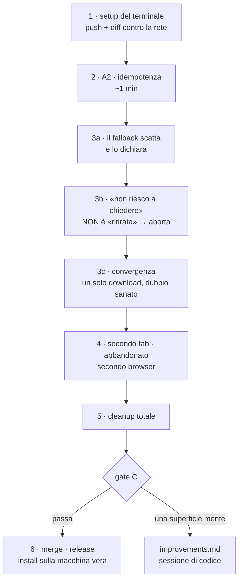

# Verifica a mano — Ciclo 6-plus, quel che resta

**Documento transitorio**, cancellato alla chiusura del ciclo insieme a
[handoff-cycle6plus-gatec.md](handoff-cycle6plus-gatec.md). Riscritto da zero il
**2026-08-23**: la versione precedente era lunga 1125 righe e per tre quarti
descriveva passi già eseguiti.

**È in italiano** — eccezione deliberata alla regola «documentazione in inglese».
Non è documentazione del progetto: è una procedura operativa che il maintainer
esegue a mano, riga per riga, e sparisce con il ciclo. Tutto ciò che resta
(registri, ADR, riferimenti) è e rimane in inglese.

Niente qui è normativo. Le decisioni stanno in
[ADR-0016](decisions/0016-cycle6plus-update-path.md), i finding in
[improvements.md](improvements.md#cycle6plus-gatec).

---

## 0. Da dove si riparte

**A1b è passato il 2026-08-23.** La consegna ha funzionato: la pagina si è
ricaricata da sola sul binario nuovo. Stato attuale del sandbox:

```
ytdl      v2.2.0-rc1
yt-dlp    2026.08.19
ffmpeg    9.0
Sei aggiornato — verificato 23/08/26, 11:48
```

Quel singolo run era un installer vero contro la rete vera su hardware vero, e
quindi ha chiuso più del suo passo:

| | esito |
|---|---|
| **A1** la consegna | **fatto** — la cosa che questo ciclo non aveva mai fatto |
| **A2** primo run dell'installer in rete | **fatto** — incluso ffmpeg dal pin e i due checksum verificati |
| **A4** la GUI in un browser vero | **fatto** per tutto il flusso di update, in un browser |
| **C1** i quattro `sha256` | **chiuso** — arm64 attestato dall'esecuzione, tutti e quattro ri-hashati il 2026-08-23 |
| **C2** il test di accettazione | **fatto** — l'update è andato dalla sola GUI, senza Terminale |
| `release.yml` | eseguito davvero |
| **A2** *idempotenza* | **fatto 2026-08-23** — nessun download; 44,7 s, registrati come [`V28`](improvements.md#V28) |
| **A3a** il fallback scatta e lo dichiara | **fatto 2026-08-23** — installer e CLI corretti; **la GUI no**: [`V27`](improvements.md#V27) |
| **A3b** «non riesco a chiedere» ≠ «ritirata» | **da rifare** — la ricetta con `/etc/hosts` era sbagliata → [§3b](#a3) |
| **A3c** convergenza | **da fare** → [§3](#a3) |
| **B5** + secondo tab + secondo browser | **da fare** → [§4](#b4) |

Difetti trovati finora:

| | |
|---|---|
| [`V26`](improvements.md#V26) | il bottone *Conferma* resta cliccabile durante l'installazione — **rinviato al Ciclo 10** |
| [`V27`](improvements.md#V27) | con un ffmpeg non attestato la GUI lo mostra due volte, la prima come «versione non registrata», che è **falso** — **da decidere prima di chiudere il gate** |
| [`V28`](improvements.md#V28) | un'installazione che non installa niente costa 45 s, quasi tutti nello stesso probe ripetuto — da decidere con `V25` |

### L'ordine



### Cosa è vivo adesso, e non va toccato prima del cleanup

| | |
|---|---|
| release **`v2.2.0-rc1`** su GitHub | **NON cancellarla**: §2 e §3 installano `ytdl` da `releases/latest`. Si cancella in [§5](#cleanup) |
| sandbox `~/.ytdl-dev/` | binario `v2.2.0-rc1`, `installed.conf` presente, yt-dlp 2026.08.19, ffmpeg dal pin |
| `~/.local/bin/ytdl` (quello vero) | **v2.1.0, mai toccato** — si aggiorna solo in [§6](#chiusura), a ciclo chiuso |
| tre backup in `~` | `~/.local/bin.backup-*`, `~/ytdl-bin-backup-*`, `~/ytdl-state-backup-*` |

### Le due trappole che hanno bruciato tre sedute

**1 · Nel sandbox ci sono due binari diversi. Usa quello giusto.**

| percorso | versione | cos'è |
|---|---|---|
| `~/.ytdl-dev/bin/ytdl` | **v2.2.0-rc1** | quello che l'installer sostituisce — **usa questo** |
| `tmp/dev/ytdl-darwin-arm64` | v2.0.9 | il build vecchio di A1b, che `ydev` esegue ancora |

Da qui in avanti **`ydev` non si usa più**: chiama il binario per percorso.

**2 · Ciò che conta è quello che serve la rete, non il working tree.** Il runner
scarica `install.sh` da `raw.githubusercontent.com/<slug>/<branch>/`, cioè da
**origin**. Un commit non pushato è invisibile: è il finding
[`V24`](improvements.md#V24), che ha reso inutili tre sedute. Il controllo è in
[§1](#setup) e va rifatto dopo ogni push.

---

<a id="setup"></a>

## 1. Setup — una volta, e a ogni nuovo terminale

Tutte le sezioni seguenti presuppongono queste righe. Se apri un terminale nuovo,
ripetile: `eval` e `export` vivono solo nella shell dove li hai digitati.

```bash
cd ~/Scripts/yt-download

# le sei variabili del sandbox, in QUESTA shell:
# XDG_STATE_HOME · XDG_CONFIG_HOME · YTDL_INSTALL_DIR · YTDL_BIN_DIR
# YTDL_OUT_DIR · YTDL_GUI_PORT
eval "$(hack/ytdl-dev.sh env)"

# il ramo da cui vengono install.sh e deps.conf
export YTDL_BRANCH=feat/update-path/implementation

# scorciatoia per il binario GIUSTO (non ydev)
yd() { "$HOME/.ytdl-dev/bin/ytdl" "$@"; }
```

Poi **pubblica quello che testerai** e verifica che la rete lo serva davvero:

```bash
git push origin feat/update-path/implementation
git push origin test/withdrawn-ffmpeg          # il ramo usa-e-getta di §3, già pronto

RAW="https://raw.githubusercontent.com/alergyonthestage/ytdl/$YTDL_BRANCH"
diff <(curl -fsSL "$RAW/install.sh") install.sh && echo "install.sh OK"
diff <(curl -fsSL "$RAW/deps.conf")  deps.conf  && echo "deps.conf OK"
```

**Devono stampare entrambi `OK` e nient'altro.** Se `diff` produce output, la CDN
di GitHub non ha ancora recepito il push (può tardare qualche minuto): aspetta e
ripeti. Non proseguire prima.

Controllo finale del punto di partenza:

```bash
yd --version
```

Devono uscire **quattro righe**, con `ytdl v2.2.0-rc1`, `yt-dlp 2026.08.19`,
`ffmpeg 9.0` **senza** alcuna qualifica accanto, e una riga di stato.

> `ffmpeg 9.0` è corretto e non è un troncamento: ffmpeg è **confrontato** per
> build id (`1785863997_9.0`) e **mostrato** per versione, perché il numero di
> build non dice niente a chi legge. E l'assenza di «non verificata» accanto è
> essa stessa un'informazione: quella riga compare solo con
> `ffmpeg_pinned = false`.

---

<a id="a2"></a>

## 2. A2 — l'idempotenza (≈1 minuto)

**Cosa prova.** Il primo run dell'installer l'hai già fatto (era l'update di A1b).
Questo è il **secondo**, ed è un percorso di codice diverso: i tre salti
`ytdlp_is_current` · `ffmpeg_is_current` · `ytdl_is_current`, che per la prima
volta leggono un `installed.conf` che esiste davvero.

**Perché conta.** È la proprietà di [ADR-0016 §11](decisions/0016-cycle6plus-update-path.md):
l'update comune deve durare secondi. È ciò che rende accettabile chiedere a una
persona non tecnica di restare ferma davanti alla GUI durante un aggiornamento. Se
non regge, ogni update futuro ri-scarica ffmpeg — 28 MB — senza motivo.

```bash
time curl -fsSL "https://raw.githubusercontent.com/alergyonthestage/ytdl/$YTDL_BRANCH/install.sh" | bash
```

| Deve accadere | Non deve accadere |
|---|---|
| `✓ yt-dlp 2026.08.19 is already what ytdl requires` | una riga `▸ Downloading yt-dlp …` |
| `✓ ffmpeg 1785863997_9.0 is already what ytdl requires` | una riga `▸ Downloading ffmpeg …` |
| `✓ ytdl v2.2.0-rc1 is already the newest` | una riga `▸ Downloading ytdl_macos_arm64…` |
| `✓ PATH already configured` | una modifica a `~/.zprofile` |
| `✓ Done.` e **nessun download** | un abort |

**Sul tempo:** misurato il 2026-08-23, **44,7 secondi**, di cui solo 5,2 di CPU.
Il resto è lo stesso `yt-dlp --version` rieseguito sette volte. Il run è
**corretto** — non scarica niente — e il test verifica quello; il costo è
registrato a parte come [`V28`](improvements.md#V28), perché 45 secondi non sono
i «secondi» che ADR-0016 §11 promette a chi sta davanti alla GUI.

**Un caso che NON è un fallimento:** se yt-dlp ha pubblicato una release nuova nel
frattempo, `yt_dlp_version = latest` fa il suo mestiere e lo scarica. Verificato il
2026-08-23: l'ultima è ancora `2026.08.19`, quindi deve saltarlo. Se scarica,
controlla prima che upstream non si sia mosso.

**Nota su `~/.zprofile`:** `setup_path` non è sandboxato — scrive sul profilo
vero. Sulla tua macchina la riga c'è già dall'installazione originale, quindi
stampa `PATH already configured` e non tocca nulla. Se scrivesse, è un finding.

---

<a id="a3"></a>

## 3. A3 — il fallback su build ritirata (≈10 minuti)

**Cosa prova.** L'unico percorso di `install.sh` mai eseguito: cosa succede quando
la build di ffmpeg che `deps.conf` attesta **non esiste più** a monte.

**Perché conta, e non è un caso di scuola.** martin-riedl pubblica **solo** la
build corrente. Verificato oggi: il pin è `1785863997_9.0`, ma il redirect
`latest` punta già a **`1787073674_9.0.1`** — upstream si è già mosso di una
versione. Il 404 arriverà da solo, entro settimane. Se questo percorso è rotto ci
sono due esiti opposti e sono entrambi cattivi: **ytdl diventa non installabile**
per tutti, oppure **installa byte non verificati dicendo che sono verificati**.

Il ramo usa-e-getta è **già pronto e committato**: `test/withdrawn-ffmpeg`,
identico al ramo di implementazione tranne una riga —
`ffmpeg_build_arm64 = 9999999999_9.9`, un id che dà `404` (verificato). Solo
arm64: su un Mac Intel la stessa ricetta prenderebbe ancora il percorso pinned.

### 3a. Il fallback deve scattare, e deve dirlo

```bash
export YTDL_BRANCH=test/withdrawn-ffmpeg
curl -fsSL "https://raw.githubusercontent.com/alergyonthestage/ytdl/$YTDL_BRANCH/install.sh" | bash
```

| Deve accadere | Non deve accadere |
|---|---|
| `! The ffmpeg build ytdl attests (9999999999_9.9) is no longer published.` | un successo silenzioso |
| `! Installing the current build instead — it CANNOT be checksum-verified.` | |
| `! ytdl will say so; nothing else changes.` | |
| `✓ ffmpeg and ffprobe installed (NOT verified — the attested build is gone)` | `✓ … installed (verified)` |
| l'installazione **arriva a `✓ Done.`** | un abort |

Poi il marker e le superfici:

```bash
cat ~/.ytdl-dev/state/ytdl/installed.conf
yd --version
```

| Deve leggersi | Non deve leggersi |
|---|---|
| nel marker: `ffmpeg_pinned = false` | `ffmpeg_pinned = true`, o la chiave assente |
| nel marker: `ffmpeg_build = 1787073674_9.0.1` (o la build corrente del giorno) | `ffmpeg_build = 9999999999_9.9` — registrerebbe ciò che ha chiesto, non ciò che ha installato |
| `ffmpeg 9.0.1   (non verificata: la versione attestata non è più disponibile)` | `ffmpeg 9.0.1` liscio |
| | `ffmpeg non installato` — era il difetto `V12` |

> **§3a è stato eseguito ed è passato il 2026-08-23** — avvisi corretti, marker
> con `ffmpeg_pinned = false` e `ffmpeg_build = 1787073674_9.0.1`, CLI che stampa
> `ffmpeg 9.0.1   (non verificata: la versione attestata non è più disponibile)`.
> **Ma la GUI no**: mostra ffmpeg due volte, la prima come «versione non
> registrata», che è falso. È [`V27`](improvements.md#V27), e va deciso prima di
> chiudere il gate. Se rifai §3a dopo la correzione, è questa riga a controllare.

E la riga che è la più facile da sbagliare — **una copia non attestata è
NON CONFRONTATA, non obsoleta** (ADR-0016 §15, terza proprietà). Apri la GUI e
premi **Controlla ora**:

```bash
yd gui
```

| Deve accadere | Non deve accadere |
|---|---|
| il blocco versioni mostra ffmpeg con l'avviso «non verificato» | ffmpeg dato per «verificata con questo ytdl» |
| *Cosa cambia* **non nomina ffmpeg** | un aggiornamento fantasma di ffmpeg |
| il verdetto non offre un update che non risolverebbe nulla | un update che riappare a ogni controllo per sempre |

Chiudi la scheda quando hai finito (il daemon si spegne da solo a coda vuota).

### 3b. «Non riesco a chiedere» non è «è stata ritirata»

**Questo è il confine che protegge la proprietà comprata da ADR-0016 §12**: mai
degradare in silenzio a «non verificato» per colpa di una connessione ballerina.
Una copia non verificata ottenuta perché il wi-fi dell'albergo singhiozza è
esattamente ciò che il pin esiste per impedire.

> ### ⚠️ La ricetta con `/etc/hosts` NON funziona — non usarla
>
> Provata il 2026-08-23 e **bypassata**: l'installer ha scaricato ffmpeg
> normalmente e ha stampato `✓ Checksum verified`. Non è un difetto del codice, è
> la ricetta che era sbagliata.
>
> `ffmpeg.martin-riedl.de` ha **record AAAA** (`2a06:98c1:3120::7`,
> `2a06:98c1:3121::7`). Una riga in `/etc/hosts` dirotta solo l'**IPv4**; il
> resolver di macOS unisce la voce del file con l'AAAA che arriva dal DNS, curl
> preferisce l'IPv6, e il blocco non esiste mai.
>
> **Prova indiretta che era attivo lo stesso:** con quella riga in `/etc/hosts`
> sul Mac, anche il container ha smesso di risolvere quel nome in IPv4 — Docker
> Desktop inoltra il DNS al resolver dell'host. Bloccava, ma la famiglia
> sbagliata.
>
> **Se la riga è ancora lì, toglila adesso** (blocca quel dominio per tutto il
> Mac, e per il container):
>
> ```bash
> grep -n 'ytdl gate C' /etc/hosts
> sudo sed -i '' '/ytdl gate C, temporaneo/d' /etc/hosts
> sudo dscacheutil -flushcache && sudo killall -HUP mDNSResponder
> curl -sI https://ffmpeg.martin-riedl.de/ | head -1     # deve rispondere
> ```

**La ricetta giusta usa `~/.curlrc`**, che è meglio in ogni dimensione: niente
`sudo`, niente cache DNS, e `--resolve` vale per **entrambe** le famiglie perché
scavalca la risoluzione invece di alterarla. `install.sh` invoca `curl` senza
`-q`, quindi ogni sua chiamata legge quel file — e `--resolve` tocca **solo**
l'host nominato, perciò `deps.conf` continua a scaricarsi da GitHub.

Precondizione: dopo §3a il marker dice `ffmpeg_pinned = false`, quindi ffmpeg non
è mai «già corrente» e il download **viene tentato**. È la condizione che serve.
Se hai già eseguito §3c, rifai prima §3a.

```bash
export YTDL_BRANCH=feat/update-path/implementation      # torna al pin vero

# 1. metti da parte un eventuale ~/.curlrc tuo, poi dirotta SOLO ffmpeg
[ -f ~/.curlrc ] && cp ~/.curlrc ~/.curlrc.ytdl-bak
echo '--resolve ffmpeg.martin-riedl.de:443:127.0.0.1' >> ~/.curlrc

# 2. controlla che il dirottamento sia davvero in vigore PRIMA di lanciare
curl -s -o /dev/null -w 'ffmpeg-host  http=%{http_code}
' https://ffmpeg.martin-riedl.de/
curl -s -o /dev/null -w 'github       http=%{http_code}
' https://raw.githubusercontent.com/

# 3. adesso l'installer
curl -fsSL "https://raw.githubusercontent.com/alergyonthestage/ytdl/$YTDL_BRANCH/install.sh" | bash
echo "exit=$?"
```

Al punto 2 devono uscire **`ffmpeg-host http=000`** e **`github http=301`**. Se
`ffmpeg-host` risponde qualcosa di diverso da `000`, il dirottamento non è in
vigore e il punto 3 non proverebbe niente: fermati.

| Deve accadere al punto 3 | Non deve accadere |
|---|---|
| `▸ Downloading ffmpeg 1785863997_9.0…` | un fallback |
| `✗ Download failed: https://ffmpeg.martin-riedl.de/download/macos/arm64/1785863997_9.0/ffmpeg.zip` | `installed (NOT verified — the attested build is gone)` |
| `The server answered 000.` | «is no longer published» |
| **`exit=1`** | `exit=0` |
| il marker resta com'era, `ffmpeg_pinned = false` | una chiave cambiata da questo run |

**Ripristina subito**, prima di §3c:

```bash
rm -f ~/.curlrc
[ -f ~/.curlrc.ytdl-bak ] && mv ~/.curlrc.ytdl-bak ~/.curlrc
curl -s -o /dev/null -w 'ffmpeg-host  http=%{http_code}
' https://ffmpeg.martin-riedl.de/   # atteso 200
```

### 3c. La convergenza — il dubbio deve sanarsi in un solo download

Decisione ratificata §16.3: una macchina rimasta con una copia non attestata deve
tornare attestata al primo installer utile, non trascinarsi il dubbio.

> **Attenzione:** la ricetta vecchia diceva «ri-esegui l'installer da `main`».
> Era **sbagliata**: `deps.conf` non esiste su `main` fino al merge, quindi
> `load_deps` aborta subito. Si usa il ramo di implementazione.

```bash
export YTDL_BRANCH=feat/update-path/implementation
curl -fsSL "https://raw.githubusercontent.com/alergyonthestage/ytdl/$YTDL_BRANCH/install.sh" | bash
```

| Deve accadere | Non deve accadere |
|---|---|
| ffmpeg viene ri-scaricato **una volta** dall'URL pinned | un salto (`already what ytdl requires`) |
| `✓ Checksum verified (ffmpeg.zip)` e `(ffprobe.zip)` | un checksum mismatch |
| `✓ ffmpeg and ffprobe installed (verified)` | |
| nel marker `ffmpeg_pinned` **sparisce** e `ffmpeg_build = 1785863997_9.0` | `ffmpeg_pinned = false` che sopravvive |
| `yd --version` torna a `ffmpeg 9.0` **senza** qualifica | l'avviso «non verificata» che resta |

E che converga davvero — ri-esegui una terza volta:

```bash
curl -fsSL "https://raw.githubusercontent.com/alergyonthestage/ytdl/$YTDL_BRANCH/install.sh" | bash
```

Deve saltare tutto e non scaricare niente, esattamente come in §2.

---

<a id="b4"></a>

## 4. B5 — la corsa abbandonata, il secondo tab, il secondo browser (≈15 minuti)

Tre verifiche in una sola sessione di GUI, perché condividono la preparazione.
Sono le due superfici che questo ciclo ha aggiunto per ultime e che nessun browser
ha mai reso: un run **adottato al caricamento** (`V17`) e un run che **nessuno ha
seguito fino alla fine** (`V16`, `V18`, §16.2).

### 4a. Preparazione — riportare il sandbox a «update disponibile»

Adesso dice «Sei aggiornato», quindi il bottone *Aggiorna* non esiste. Serve di
nuovo un dislivello: si ricostruisce il binario vecchio, esattamente come in A1b.

```bash
hack/ytdl-dev.sh stop
YTDL_DEV_VERSION=v2.0.9 hack/ytdl-dev.sh build darwin/arm64
hack/ytdl-dev.sh install
eval "$(hack/ytdl-dev.sh env)"
export YTDL_BRANCH=feat/update-path/implementation
~/.ytdl-dev/bin/ytdl gui
```

La pagina deve mostrare `ytdl v2.0.9` e *Cosa cambia* `v2.0.9 → v2.2.0-rc1`. Se
mostra ancora `v2.2.0-rc1`, un daemon vecchio sta ancora servendo: `hack/ytdl-dev.sh stop`
e ricomincia da capo.

### 4b. Il secondo tab adotta il run, e non ne avvia un secondo (`V17`)

1. Premi **Aggiorna**, poi **Conferma**.
2. **Subito**, apri una seconda scheda sullo stesso indirizzo (o duplica la
   scheda).

| Deve accadere nella SECONDA scheda | Non deve accadere |
|---|---|
| il pannello dice **«Aggiornamento in corso…»** senza che tu prema nulla | il banner «È disponibile un aggiornamento» con nessun controllo e nessuna spiegazione — era `V17` |
| nessun bottone che avvii un secondo update | un secondo installer sopra il primo |
| quando finisce, **entrambe** le schede si ricaricano sul binario nuovo | una sola che si ricarica, o un ciclo di ricariche |

> **Difetto noto, non registrarlo di nuovo:** nella **prima** scheda il bottone
> *Conferma* resta cliccabile per tutta l'installazione, ed è
> [`V26`](improvements.md#V26), già rinviato al Ciclo 10. Premerlo risponde «un
> aggiornamento è già in corso». Se trovi qualcosa **oltre** a questo, è nuovo.

3. Lascia finire. Torni a `v2.2.0-rc1`: è anche una seconda conferma della
   consegna, gratis.

### 4c. Lo stato «abbandonato» dice solo ciò che si sa (`V16` · `V18` · §16.1)

Si può produrre **in modo deterministico**, senza corse: lo stato è *derivato* in
lettura da un record che dice «running» mentre nessuno lo sta eseguendo. Scriviamo
esattamente quel record.

```bash
cat > ~/.ytdl-dev/state/ytdl/update-run.json <<JSON
{"state":"running","started_at":"$(date -u +%Y-%m-%dT%H:%M:%SZ)","pid":99999}
JSON
cat ~/.ytdl-dev/state/ytdl/update-run.json
```

`99999` è oltre il pid massimo di macOS, quindi non appartiene a nulla; e
`started_at` è **adesso**, così a decidere è il pid e non il fermo di due ore —
che è precisamente la regola §16.1 sotto esame.

Ora **ricarica la pagina**. Senza premere niente, il pannello deve leggere:

> Non so come sia andato questo aggiornamento: nessuno l'ha seguito fino alla
> fine. Le versioni installate adesso sono qui sopra; riprovare è sicuro.

| Deve accadere | Non deve accadere |
|---|---|
| non afferma **né** successo **né** fallimento | «L'aggiornamento non è riuscito» |
| non nomina **nessuna causa** | «ytdl si è chiuso prima che finisse» — la formulazione rimossa da `V18` |
| offre **Vedi il dettaglio** e **Riprova** | un vicolo cieco |
| **Riprova** avvia davvero un run | il record che blocca ogni update futuro — era `V1` |

Premi **Riprova**: manda `force`, quindi ri-scarica tutto (~90 MB) e ri-verifica i
checksum. Al termine dirà «Aggiornato. Non serve riavviare nulla.» — e **qui è
corretto**, perché ytdl non è cambiato. È il caso legittimo di quella frase.

**Il rovescio della regola**, subito dopo: mentre un installer è **davvero** in
corso il pannello deve dire *in corso*, mai *abbandonato*. Lo hai già visto in
§4b; se in §4b diceva «abbandonato», è un finding bloccante.

### 4d. Il secondo browser

Ripeti §4b in **Safari** se hai usato Chrome, o viceversa. Bastano gli occhi, su
cose che un test sul DOM non vede:

- il banner non copre il contenuto;
- la tabella *Cosa cambia* non sfonda la larghezza;
- il blocco del log scorre invece di allungare la pagina;
- il bottone *Aggiorna* disabilitato mostra il motivo al passaggio del mouse.

---

<a id="cleanup"></a>

## 5. Cleanup totale

Da eseguire **anche se ti fermi a metà**. Copre tutto quello che le quattro sedute
hanno creato, non solo le sezioni qui sopra.

### 5a. Fuori dalla tua macchina

```bash
# 1. la pre-release: releases/latest deve tornare a v2.1.0 finché il ciclo
#    non spedisce davvero. gh NON è installato sul Mac né autenticato nel
#    container: cancella release E tag dalla web UI di GitHub, poi qui:
git tag -d v2.2.0-rc1
git push origin --delete test/withdrawn-ffmpeg
git fetch --prune --prune-tags origin
```

Poi conferma che la leva che raggiunge tutte le installazioni è intatta —
**`deps.conf` non deve esistere su `main`** fino al merge:

```bash
curl -o /dev/null -sw '%{http_code}\n' \
  https://raw.githubusercontent.com/alergyonthestage/ytdl/main/deps.conf     # atteso 404
curl -sI https://github.com/alergyonthestage/ytdl/releases/latest | \
  awk 'tolower($1)=="location:"{print $2}'                                    # atteso …/tag/v2.1.0
```

Il ramo `feat/update-path/implementation` **resta** su origin: è quello che
mergia.

### 5b. Sulla tua macchina

```bash
cd ~/Scripts/yt-download

# il branch di prova, anche in locale
git branch -D test/withdrawn-ffmpeg

# ~/.curlrc, se §3b si è interrotto prima del ripristino
grep -n 'ffmpeg.martin-riedl.de' ~/.curlrc 2>/dev/null && rm -f ~/.curlrc
[ -f ~/.curlrc.ytdl-bak ] && mv ~/.curlrc.ytdl-bak ~/.curlrc

# /etc/hosts, dalla ricetta sbagliata del 2026-08-23 — la riga può esserci
# più di una volta, il sed le toglie tutte
grep -n 'ytdl gate C' /etc/hosts && \
  { sudo sed -i '' '/ytdl gate C, temporaneo/d' /etc/hosts
    sudo dscacheutil -flushcache; sudo killall -HUP mDNSResponder; }
curl -sI https://ffmpeg.martin-riedl.de/ | head -1        # deve rispondere

# il sandbox e i build (l'installazione vera non viene toccata)
hack/ytdl-dev.sh reset
rm -rf tmp/dev
rm -f  tmp/results-gate.md          # il tuo transcript, ormai registrato

# le variabili, in ogni terminale che le ha
unset YTDL_BRANCH YTDL_REPO YTDL_DEV_VERSION \
      XDG_STATE_HOME XDG_CONFIG_HOME YTDL_INSTALL_DIR YTDL_BIN_DIR \
      YTDL_OUT_DIR YTDL_GUI_PORT
unset -f yd 2>/dev/null; unalias ydev 2>/dev/null
```

> **`YTDL_BRANCH` è quella che va tolta con più cura**: guida la probe,
> `ytdl --update` **e** il pulsante *Aggiorna* della GUI. Lasciata in
> `~/.zprofile` punterebbe la tua macchina a un ramo di prova all'infinito. Non
> c'è mai stata: controlla comunque con `grep YTDL_ ~/.zprofile ~/.bash_profile`.

### 5c. Verifica che l'installazione vera sia esattamente come era

**In un terminale NUOVO**, senza nessuna delle variabili sopra:

```bash
ytdl --version
ls ~/.local/state/ytdl
```

| Atteso | Se differisce |
|---|---|
| **due** righe, `ytdl v2.1.0` | qualcosa è girato fuori dal sandbox |
| `daemon.log`, `logs`, `queue` — e **nessun `installed.conf`** | idem |

Se differisce, ripristina dai backup:

```bash
ls -d ~/*backup* ~/.local/bin.backup-*      # guarda le date che hai davvero
# poi, con il nome giusto:
rm -rf ~/.local/bin        && cp -a ~/ytdl-bin-backup-<data>   ~/.local/bin
rm -rf ~/.local/state/ytdl && cp -a ~/ytdl-state-backup-<data> ~/.local/state/ytdl
```

### 5d. I backup

Solo **dopo** che §5c è andato bene:

```bash
rm -rf ~/.local/bin.backup-* ~/ytdl-bin-backup-* ~/ytdl-state-backup-*
```

---

<a id="chiusura"></a>

## 6. Chiusura del ciclo — dopo la tua conferma

Non parte niente di questo finché non dici che il gate è passato.

### 6a. Chiudere il gate e mergiare

```bash
cd ~/Scripts/yt-download
git checkout feat/update-path/implementation

# i due documenti transitori spariscono qui: questo file e l'handoff
git rm docs/verifica-cycle6plus.md docs/handoff-cycle6plus-gatec.md
git commit -m "docs: close cycle 6-plus gate C"

git checkout main
git merge --no-ff feat/update-path/implementation
git push origin main
```

> **Gotcha noto:** `.cco/` è montata in sola lettura nel container, quindi
> `checkout` e `merge` falliscono lì su qualunque ref che tocchi quei file. Il
> merge va fatto **sul Mac**, dove non c'è quel vincolo.

Da questo momento `deps.conf` è su `main`, ed è la leva che raggiunge ogni
installazione entro un giorno.

### 6b. La release

La versione la scegli tu; il `[Unreleased]` del changelog è già scritto su questo
ciclo. Se è `v2.2.0`:

```bash
git tag -a v2.2.0 -m "v2.2.0 — update path"
git push origin v2.2.0
```

`release.yml` parte sul tag, compila entrambe le architetture e pubblica con
`--latest`. **Aspetta che l'Action finisca**, poi:

```bash
curl -sI https://github.com/alergyonthestage/ytdl/releases/latest | \
  awk 'tolower($1)=="location:"{print $2}'          # atteso …/tag/v2.2.0
```

### 6c. Aggiornare il ytdl vero sulla tua macchina

La v2.1.0 installata **non ha il percorso di update** — è esattamente il buco che
questo ciclo chiude — quindi l'unica via è ri-eseguire l'installer. È l'ultima
volta che serve: da qui in poi si aggiorna da sola, dalla GUI.

**Apri un terminale completamente nuovo** e verifica di essere pulito, perché una
sola variabile del sandbox rimasta reinstallerebbe di nuovo dentro `~/.ytdl-dev`:

```bash
env | grep -E '^(YTDL_|XDG_STATE_HOME|XDG_CONFIG_HOME)'     # deve stampare NULLA
```

Chiudi la GUI vera se è aperta (l'installer sostituisce il binario sotto al
daemon), poi:

```bash
curl -fsSL https://raw.githubusercontent.com/alergyonthestage/ytdl/main/install.sh | bash
```

| Deve accadere | Nota |
|---|---|
| `▸ Downloading yt-dlp 2026.08.19…` | la tua ha ancora la 2026.07.04 |
| `▸ Downloading ffmpeg 1785863997_9.0…` + `✓ Checksum verified` ×2 | il tuo ffmpeg precede il marker e non ha build id registrato |
| `▸ Downloading ytdl_macos_arm64…` | |
| `✓ Done.` | |

Verifica finale:

```bash
ytdl --version
cat ~/.local/state/ytdl/installed.conf
```

Devono uscire **quattro** righe con `ytdl v2.2.0`, e `installed.conf` deve esistere
per la prima volta su questa macchina, con `ffmpeg_pinned = true`.

> Da qui in poi il campione «installazione che precede il marker» non esiste più.
> È già stato osservato e messo a verbale (prerequisito P4 della vecchia guida,
> finding `V12`), quindi non si perde niente.

---

## Come registrare l'esito

- **Una superficie che afferma il falso** → in
  [improvements.md](improvements.md#cycle6plus-gatec), con la riproduzione. È una
  sessione di **codice**, non di documentazione, e il gate non passa.
- **Un passo che non hai potuto eseguire** → scrivilo esplicitamente. «Rivisto due
  volte» non deve mai essere letto come «esercitato», e nemmeno «verificato a
  mano». Se salti §3, la riga da scrivere è: *il fallback su build ritirata non è
  mai scattato*, e resta nell'ADR e nella roadmap.
- **Tutto passa** → il gate passa, questo file e
  [handoff-cycle6plus-gatec.md](handoff-cycle6plus-gatec.md) vengono cancellati, e
  si procede con [§6](#chiusura).
