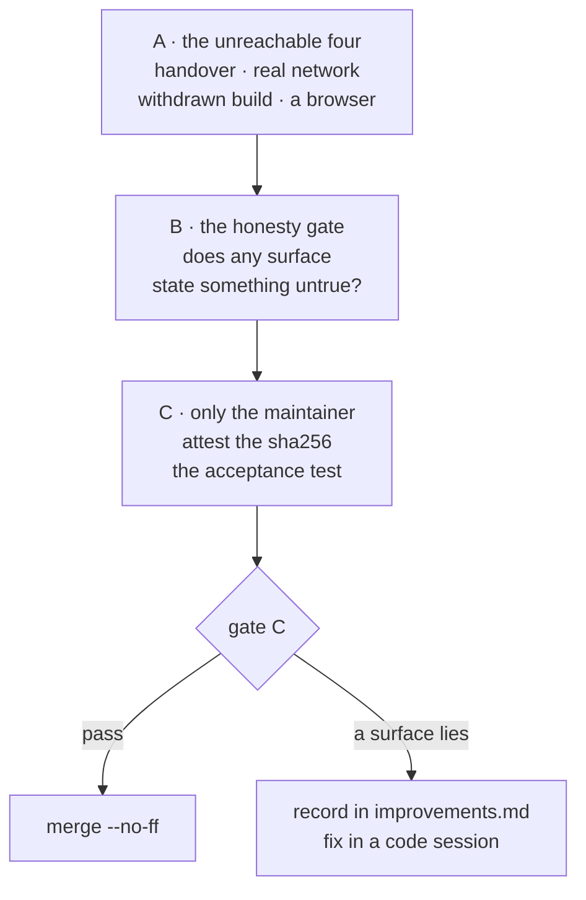
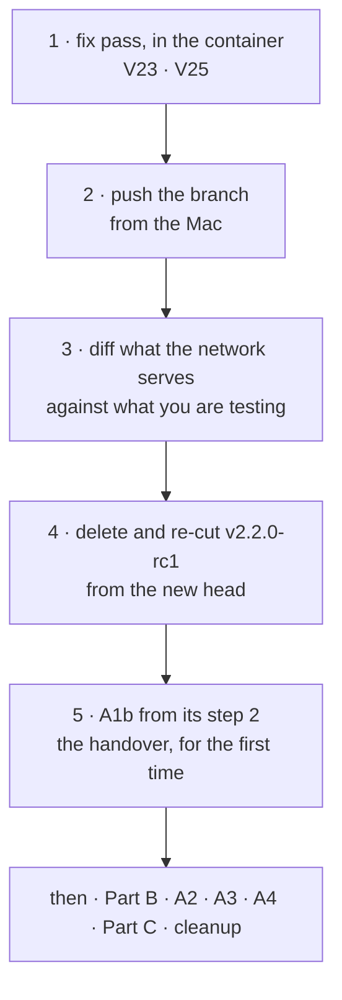
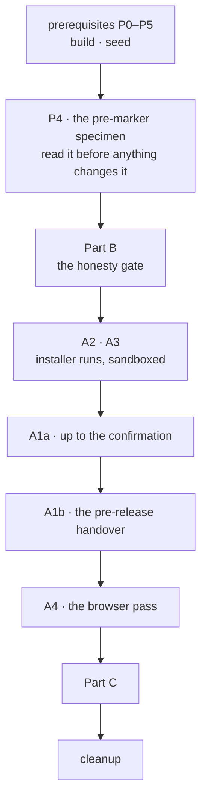

# Manual verification — Cycle 6-plus (the update path)

**Transient document**, like the handoff it accompanies: it is deleted when the
cycle closes and merges. It exists because the maintainer asked to verify gate C
**by hand** before approving it, and because a large part of this cycle is
**structurally unreachable** by the test suite — a suite that runs in a Linux
container with no ffmpeg, no browser and no network.

Nothing here is normative. The rulings are in
[ADR-0016](decisions/0016-cycle6plus-update-path.md); the two finding registers
are in [improvements.md](improvements.md).

> ### ▶ Resuming a pass already in progress?
>
> Go to **[Ripresa](#ripresa)** first. Three sittings have run and finding
> [`V24`](improvements.md#V24) showed that none of them tested the code they were
> meant to. That section has the corrected sequence and what is still live on the
> machine and on GitHub; the prerequisites and Part A below are written for it.

> ### ⚠️ Read this before touching `deps.conf`
>
> **A commit to `deps.conf` on `main` reaches every existing installation within
> a day, with no release.** That is the point of it, and it is why several
> recipes below use a **throwaway branch** plus `YTDL_BRANCH`, never `main`.
>
> Delete the test branch when you are done. A pin left behind on a branch nobody
> reads is harmless; the same pin on `main` is a fleet-wide change.

## 0. What the container already established

Do **not** re-verify these by hand — re-run without the test cache on
**2026-08-22**:

| Check | State |
|---|---|
| `go build ./...` · `go vet ./...` · `gofmt -l .` | clean |
| `go test -race -count=1 ./...` | green, every package — **4 m 26 s** |
| `bash tests/test-installer.sh` | **103** assertions, 0 failed — also under a real bash 3.2 |
| `git diff main -- internal/core/ internal/daemon/` | empty — the parity gate holds |

> **A full suite run now costs 91 GB of `/tmp` (finding `V25`).** `cmd/ytdl`'s
> tests exec and then kill the real `yt-dlp`, and a killed PyInstaller bundle
> never removes its `/tmp/_MEI…` extraction — 1715 of them, ~50 MB each, per run.
> That is what turned the container's filesystem read-only twice. **Sweep after
> every run, in the container:**
>
> ```bash
> find /tmp -maxdepth 1 -name '_MEI*' -type d -print0 | xargs -0 -r rm -rf
> ```

What follows is only what those cannot reach.



<a id="ripresa"></a>

## Ripresa — where this pass actually stands, 2026-08-22

**Read this before anything else.** Three sittings of gate C have run, and the
last one found that **none of them tested what they were meant to test**
(finding [`V24`](improvements.md#V24)). Everything below is the corrected
sequence, in the order to run it.

### What went wrong, in one paragraph

The update path does not run the installer from your working tree. It downloads
it from `raw.githubusercontent.com/<slug>/<branch>/install.sh` — **from
`origin`** — and `origin` is eight commits behind. So every *Aggiorna* ran the
**pre-`V21`** installer: it aborted on line 541 under bash 3.2, the old `EXIT`
trap turned the status into 0, and the page reported «Aggiornato. Non serve
riavviare nulla.» for an install that installed nothing. The banner never
cleared because nothing ever changed, and «un aggiornamento è già in corso» on
the second press was the first press still running. Nothing you saw was a new
defect: it was `V21` and `V23`, unfixed, because the fixes were never published.

### What is settled, and needs nothing further from you

| | |
|---|---|
| `V23`'s mechanism | **proven in the container** against a bash 3.2 built from source: it enters the `EXIT` trap with `$? = 0` after a `set -u` abort. The three-line experiment the old handoff asked you to run is **done** — do not run it. |
| the applied `V23` hardening | **does not fix it.** `local rc=$?` is 0 under bash 3.2 for exactly this case. A proven fix exists (a completion flag); it is a code change, not a gate-C step. |
| `curl.Wait()` before `sh.Wait()` | **ruled out.** The parent never reads the pipe, so the ordering is harmless. |
| where the `/tmp/_MEI*` came from | **answered** — see `V25` in §0. |

### The order to run things now



**1 — in the container, and this needs the maintainer's go-ahead.** `V23` and
`V25` are code fixes and gate C does not make them. Approve the fix pass, then it
happens there and the branch is committed.

**2 — push, from the Mac.** The container has no credentials for `origin`; this
is yours. From `~/Scripts/yt-download` — the same directory the container has
mounted, so its `HEAD` is already the commit to push:

```bash
git push origin feat/update-path/implementation
```

**3 — prove that what the network serves is what you are testing.** This is the
check `P3` was missing, and it is the one that would have saved three sittings:

```bash
export YTDL_BRANCH=feat/update-path/implementation
diff <(curl -fsSL "https://raw.githubusercontent.com/alergyonthestage/ytdl/$YTDL_BRANCH/install.sh") install.sh   && echo "OK — the update path will run the installer you are testing"
```

Any output at all means **stop**: the branch is not up to date, or GitHub's raw
CDN has not caught up yet (it can lag a few minutes — wait and repeat). Do not
press *Aggiorna* before this line prints `OK`.

**4 — the release must be rebuilt from the new head.** `v2.2.0-rc1` currently
exists and points at `8b80b66`, which is **behind** the fixes. Delete it in the
GitHub web UI (release *and* tag), then re-cut it — the full recipe is
[A1b step 1](#a1b), rewritten.

**5 — then A1b from its step 2**, and the rest of the checklist in the suggested
order below. `A1b` is still the thing this cycle has never once completed.

### What is already on your machine from the previous sittings

Left in place deliberately; the cleanup section at the end removes all of it.

| | |
|---|---|
| `~/.ytdl-dev/` | the sandbox, with a `v2.0.9` build installed and a stale `update-run.json` |
| `~/.local/bin.backup-*`, `~/ytdl-bin-backup-*`, `~/ytdl-state-backup-*` | three backups you took; keep them until the end |
| `v2.2.0-rc1` on GitHub | **live** — it must be deleted and re-cut, see step 4 |
| `tmp/results-gate.md` | your transcript; it is gitignored scratch, and it is what this section was reconstructed from |

**Worth doing before step 4, while the evidence is still there** — it costs four
lines and confirms the diagnosis on the real machine rather than by inference:

```bash
tail -40 ~/.ytdl-dev/state/ytdl/update.log     # expect the line-541 unbound variable
cat ~/.ytdl-dev/state/ytdl/update-run.json     # expect state=done, exit_code=0
ls ~/.ytdl-dev/state/ytdl/installed.conf       # expect: No such file (nothing was installed)
~/.ytdl-dev/bin/ytdl --version | head -1       # expect ytdl v2.0.9 (the binary was never replaced)
```

If `update.log` shows anything *other* than the line-541 abort, that is a new
finding and it goes in the register before the fix pass starts.

---

## Prerequisites — five things that are NOT true by default

**Added 2026-08-21, after the first attempt on real hardware.** The original
draft of this file assumed the `ytdl` on your `$PATH` was the thing under test.
It is not, and four further assumptions were wrong with it. Nothing below is
optional: skip one and most of Part A and Part B silently test the *released*
v2.1.0, which has none of this cycle in it.

### P0. What you are running now, and how to tell

```
$ ytdl --version
ytdl v2.1.0
yt-dlp 2026.07.04
```

**Two lines and no `Aggiornamenti:` line is the released v2.1.0** — the build
that predates this cycle. The branch build prints one line per component *plus*
a state line (§8.3 of [cli-reference.md](cli-reference.md)). Likewise
`~/.local/state/ytdl/installed.conf` is **absent**, and that is correct: the
marker is written only by the new installer.

Use those two facts as your check at any point: if `--version` is two lines, you
are testing the wrong binary.

### P1. Build the branch binary — and run it in a sandbox

The commands are in [Setup](#setup); this
section is *why* they are what they are. The tool is
[`hack/ytdl-dev.sh`](../hack/ytdl-dev.sh), and the full reference — including
what the sandbox does **not** isolate — is [dev-testing.md](dev-testing.md).

Two things it does that a hand-rolled export list gets wrong:

- **It sets all six variables together.** `YTDL_INSTALL_DIR` (where `install.sh`
  writes) and `YTDL_BIN_DIR` (where the engine reads) are the same directory under
  two different names. Set one and you get a sandbox that half works — the
  installer writing where nothing reads, or the engine reading the real
  `~/.local/bin` while the installer replaces it. `hack/ytdl-dev.sh env` prints
  the exact set if you want to see it.
- **It always stamps the version**, and refuses to produce a build stamped `dev`
  (P2).

**This changes the shape of gate C for the better.** With the sandbox, the state
dir, the config, the dependency directory *and* the installer's target are all
under `~/.ytdl-dev` — so **A2 and A3 no longer destroy your installed ytdl**
(P5), and the whole of Part B runs without touching anything real.

### P2. The version stamp decides whether anything happens at all

**A build with no `-ldflags` reports `dev`, and a `dev` build is never checked and
never reported stale** (`update.DevVersion`). Every update surface goes inert:
you would get `Aggiornamenti: non controllati (build locale)` and conclude,
wrongly, that nothing works.

So the stamp is not cosmetic — it is the switch:

| Stamp | What it produces |
|---|---|
| *(none)* → `dev` | everything inert. **Never use this for gate C** |
| `v2.1.0-test` | ytdl compares equal-ish to nothing; the *dependency* half still moves. Good default for Part B |
| **a version OLDER than the latest release**, e.g. `v2.0.9` | the probe sees `releases/latest` = `v2.1.0` and reports **an update to ytdl itself**. This is how you make the banner, the changes table and the *Aggiorna* confirmation appear **without releasing anything** |

The stamp is a string comparison, not a parse — nothing validates that it looks
like a version, and nothing orders it. It only has to *differ*.

### P3. `origin` is what is under test — not your working tree — **this one cost three sittings**

**Rewritten 2026-08-22 after [`V24`](improvements.md#V24).** The earlier version
of this prerequisite asked whether the branch *existed* on `origin` and whether
`deps.conf` answered `200` there. Both were true, at a commit eight behind the
one being tested, and every run afterwards silently exercised the old code.

**Nothing in the update path reads your working tree.** Three artefacts are
fetched over the network, every time:

| what | from where | used by |
|---|---|---|
| `install.sh` | `raw.githubusercontent.com/<slug>/<branch>/install.sh` | the GUI's *Aggiorna*, `ytdl --update` |
| `deps.conf` | `raw.githubusercontent.com/<slug>/<branch>/deps.conf` | the probe **and** the installer |
| the `ytdl` binary | `github.com/<slug>/releases/latest/download/…` | the installer |

So a commit that is not on `origin` is invisible, and a release that is not
re-cut still carries the old binary. The check has to compare **content**:

```bash
export YTDL_BRANCH=feat/update-path/implementation
RAW="https://raw.githubusercontent.com/alergyonthestage/ytdl/$YTDL_BRANCH"

diff <(curl -fsSL "$RAW/install.sh") install.sh && echo "install.sh OK"
diff <(curl -fsSL "$RAW/deps.conf")  deps.conf  && echo "deps.conf OK"
git status --short --branch | head -1        # must not say "ahead"
```

All three must be silent-and-OK before any *Aggiorna*, any `--update`, and any
`A2`/`A3` run. Raw's CDN can lag a few minutes behind a push; wait and repeat
rather than assuming.

**Why `YTDL_BRANCH` is needed at all**, unchanged: the probe fetches the pin from
`<branch>/deps.conf`, `<branch>` defaults to `main`, and **`deps.conf` does not
exist on `main`** — it is new in this cycle. Point at a branch without one and
the build reports

```
Aggiornamenti: non verificati (l'ultimo tentativo non ha ricevuto risposta)
```

for ever, no matter what you do. That is the code behaving correctly on a
question nobody can answer, and it makes B1, B3, B4 and all of Part A
unreachable.

> **Pushing this branch is safe, and here is precisely why.** A `deps.conf` on
> `main` is the fleet-wide lever — every installation reads `main` by default. A
> `deps.conf` on a **branch** is read by nobody except a machine that has opted in
> with `YTDL_BRANCH`. Pushing the branch changes nothing for any existing user.
>
> `unset YTDL_BRANCH` when you finish, and never put it in `~/.zprofile`: it
> steers the probe, `ytdl --update` **and** the GUI's *Aggiorna* alike.

**The container cannot push.** It has no credentials for `origin` (`gh` is not
authenticated there either), so `git push` is always yours to run on the Mac. The
repository is the same directory on both sides — `~/Scripts/yt-download` is
`/workspace/yt-download` — so there is nothing to transfer first: whatever the
container committed is already your `HEAD`.

### P4. Your current installation is a specimen — do not reinstall it yet

**Answering "should I uninstall and reinstall?" — no, and it would gain you
nothing.** `install.sh` on `main` is the *old* installer, and it installs
`releases/latest`, which is v2.1.0: you would spend the download to arrive
exactly where you already are.

Worse, you would destroy something useful. A machine installed **before the
marker existed** is a real specimen of a case the code handles deliberately and
that no test covers on real hardware: `LoadMarker` finds nothing, ffmpeg has no
recorded build, and an absent `ffmpeg_pinned` key is read as *attested* (because
every install predating ADR-0016 §15 took the pinned path or no path at all).
Your machine should therefore print, with the branch build:

```
ffmpeg (versione non registrata)
```

and **not** `ffmpeg non installato`, and not a false `non verificata`. Check that
before you change anything — it is a free finding you can only make once.

Back up what an installer run would overwrite:

```bash
cp -a ~/.local/bin ~/.local/bin.backup-$(date +%F)
```

### P5. An installer run replaces the binary under test — unless you sandbox

`install_ytdl` downloads from
`https://github.com/<slug>/releases/latest/download` — **the latest release**.
The installer cannot install an unreleased branch build, so an installer run
(A2, A3, *Aggiorna*, `ytdl --update`) replaces the ytdl binary with v2.1.0 and
silently ends your test.

**Inside the sandbox this is harmless**: `YTDL_INSTALL_DIR` points at
`~/.ytdl-dev/bin`, so the installer replaces the *sandbox* copy and your real
`~/.local/bin/ytdl` is never touched. Restore the dev build with:

```bash
hack/ytdl-dev.sh build darwin/arm64 && ydev --version
```

**Outside the sandbox it is not.** If you insist on testing against the real
install, back it up first (see Preparation) and check `ytdl --version` prints
four lines whenever you resume — two means an installer run put v2.1.0 back, and
everything measured after that point measured the wrong build.

<a id="setup"></a>

## Setup — do this once, and once per new terminal

**Added 2026-08-21, because the first attempt got here and could not proceed.**
The earlier draft assumed an environment it never told you to build, used a `ydev`
shortcut it only defined halfway down, and in two places said "export the
variables" without saying which or how. All of that is here now, in one place,
before anything needs it.

### 1. In the container — build

```bash
export GIT_CONFIG_COUNT=1 GIT_CONFIG_KEY_0=safe.directory \
       GIT_CONFIG_VALUE_0=/workspace/yt-download
hack/ytdl-dev.sh build darwin/arm64          # darwin/amd64 on an Intel Mac
```

### 2. On the Mac — seed, point at the branch, and define the shortcut

```bash
cd ~/Scripts/yt-download

hack/ytdl-dev.sh seed                        # copies yt-dlp/ffmpeg into the sandbox
export YTDL_BRANCH=feat/update-path/implementation
alias ydev='hack/ytdl-dev.sh run'
```

**`ydev` is a shell alias, not a command.** It exists only in the terminal where
you typed that line. If you ever see:

```
bash: ydev: command not found
```

you are in a terminal that never ran this section — re-run the three lines above.
`export YTDL_BRANCH=…` is lost the same way, and losing *that* one is quieter:
everything still runs, and every check just reads `non verificati`.

Anywhere below, `ydev <args>` and `hack/ytdl-dev.sh run <args>` are the same
thing. So `ydev gui` is `hack/ytdl-dev.sh run gui`, and there is no
`hack/ytdl-dev.sh gui` — the script's own commands are:

| Command | What it does |
|---|---|
| `build [GOOS/GOARCH]` | cross-compile, always stamped |
| `seed` | copy yt-dlp/ffmpeg into the sandbox |
| `run <args>` | run the built binary with the sandbox environment |
| `install` | put the build where a real install lives — **required for A1b only** |
| `stop` | stop the sandbox daemon (never the real one) |
| `env` · `status` · `reset` | print the exports · show state · delete the sandbox |

**`stop` is the one people miss.** `ytdl gui` reuses a daemon that is already
listening, so a rebuild does **not** replace a running one: the old binary keeps
serving and the page keeps showing the old version, which looks like the build
did nothing. `hack/ytdl-dev.sh status` says whether one is running.

### 3. Check the setup before trusting anything

```bash
ydev --version
```

Expected — **four** lines, a stamp that is not `dev`, and a state line:

```
ytdl v0.0.0-dev.<sha>
yt-dlp 2026.07.04
ffmpeg (versione non registrata)          ← correct on a pre-marker machine (P4)
Aggiornamenti: <one of the six states>
```

| What you see instead | What it means |
|---|---|
| two lines, `ytdl v2.1.0` | you ran the installed build, not `ydev` |
| `Aggiornamenti: non controllati (build locale)` | the binary is stamped `dev` — rebuild with the script, which always stamps (P2) |
| `Aggiornamenti: non verificati (l'ultimo tentativo…)`, always | `YTDL_BRANCH` is unset or points at a branch with no `deps.conf` (P3) |
| `yt-dlp (non sono riuscito a leggerne la versione)` | a cold yt-dlp exceeded the read budget — finding `V20` |
| everything looks right, but *Aggiorna* keeps ending in «Aggiornato. Non serve riavviare nulla.» with the version unchanged | `origin` is behind your working tree — run P3's three `diff` lines, finding `V24` |

**`ydev --version` cannot detect the `V24` failure.** It reads only local facts
and the cached verdict; nothing on this screen depends on what `origin` serves.
Only P3's content check can tell you, and it has to be run after every push.

### When a *different* program needs the variables

`ydev` sets the sandbox for the binary **it** launches. `install.sh` is launched
by `bash`, not by the script, so it has to inherit the variables instead:

```bash
eval "$(hack/ytdl-dev.sh env)"     # exports the six into THIS shell
```

That is needed exactly twice, in A2 and A3. `hack/ytdl-dev.sh env` prints them
rather than setting them, so you can see what you are getting; `hack/ytdl-dev.sh
status` shows where the sandbox is and what is in it.

### Opening the dev GUI — use `localhost`, not `127.0.0.1`

`ydev gui` prints and opens `http://127.0.0.1:8790/?t=<token>`, because the host
is hardcoded. That works, but cookies **ignore the port** (RFC 6265), so a dev GUI
and the real GUI on `127.0.0.1` overwrite each other's session cookie and one of
them starts answering `401`.

If you have both open, load the dev one by hand on the other host — `localHost`
accepts `localhost`, so it is a different cookie domain:

```bash
open "http://localhost:8790/?t=$(cat ~/.ytdl-dev/state/ytdl/gui.token)"
```

The `?t=` is what sets the cookie, so it has to be there the first time.

**`gui.token` does not exist until a GUI daemon has started at least once.** Run
`ydev gui` first; `cat: …/gui.token: No such file or directory` means no daemon of
yours has ever run, not that something is broken.

If you are **not** running the real GUI at the same time, none of this matters —
`127.0.0.1:8790` and `localhost:8790` both reach the same server, and either is
fine.

## Preparation

Do the five prerequisites first. Then, on the Mac:

```bash
ls ~/.local/state/ytdl
```

**On a machine that predates this cycle you will see only `daemon.log`, `logs`
and `queue`, and that is correct** — every file below is created on demand by the
new binary or the new installer. An empty result is not a broken install; it is a
machine that has never run any of this.

The four state files this cycle adds, all under `~/.local/state/ytdl/`:

| File | Written by | What it is | Safe to delete? |
|---|---|---|---|
| `update.json` | the branch binary, after a check | the cached verdict | **yes** — forces "mai controllato" |
| `update-run.json` | the GUI's *Aggiorna* | the record of one installer run | **yes** — forgets the last run |
| `update.log` | the installer, via the GUI | that run's output | yes |
| `installed.conf` | the **new** `install.sh` only | what the installer actually put down | **no** — deleting it loses the ffmpeg build id, and ffmpeg then reads *versione non registrata* until the next install |

Keep a copy of both directories before you start — the state dir, and the
binaries an installer run would overwrite:

```bash
cp -a ~/.local/state/ytdl ~/ytdl-state-backup-$(date +%F)
cp -a ~/.local/bin        ~/ytdl-bin-backup-$(date +%F)
```

### Suggested order

**Resuming rather than starting?** [Ripresa](#ripresa) has the order that applies
to you; the one below is for a pass run from nothing.

Inside the sandbox almost nothing is destructive any more, so the order is about
gathering the one-shot observation first and leaving the release for last:



Only two things still reach outside the sandbox, and both are in Part A: the
pre-release in **A1b** (which is public until you delete it) and the throwaway
branch in **A3** (which is invisible to anyone who has not opted in). Both have a
cleanup step.

---

## Part A — the four things nothing has ever exercised

### A1. The handover, end to end

**Never run anywhere.** `handOver` calls `os.Exit`, so no test can execute it.
Two preconditions *were* confirmed in the container: the page's bare `fetch`
calls authenticate through the `SameSite=Strict` cookie, and
`DefaultFirstClientGrace` (2 min) comfortably covers the page's 60 s
`RESTART_TIMEOUT_MS`.

> **Corrected 2026-08-21.** This step previously said "install the previous
> release deliberately". **That does not work**, and the reason is worth stating
> because it constrains when A1 can be done at all:
>
> `install_ytdl` fetches from `<slug>/releases/latest/download` — **the latest
> release**. The installer cannot install an unreleased branch build. So a
> handover today would replace the branch build with **v2.1.0**, which has no
> update path in it: the page's `newBuildIsServing` polls `/api/state` for
> `update.installed.ytdl`, v2.1.0 serves no `update` object at all, the check
> never becomes true, and after 60 s you get the "non sono riuscito a riaprire
> l'interfaccia" fallback. **You would be reading a failure that is an artefact of
> the setup, not a defect.**
>
> The handover is only testable **between two builds that both carry the update
> path**.

#### A1a. What IS testable before any release

With the branch build stamped **older than the latest release** (P2) and
`YTDL_BRANCH` set (P3), everything up to the moment of handover works and is
worth checking:

1. `ydev gui` (browse it at `http://localhost:8790/`), then *Impostazioni* → *Versione e aggiornamenti* → **Controlla
   ora**. The banner appears; the changes table lists `ytdl` with your stamp on
   the left and the real latest tag on the right.
2. Press **Aggiorna**. The confirmation **must** say «L'interfaccia si chiude e
   si riapre da sola» — that clause appears only when `ytdl` is among the
   changes, which is `confirmUpdate`'s whole point.
3. Press **Annulla**. Nothing should have started.

Stop there unless you have set up A1b. Confirming is what launches an installer
that will overwrite your test binary (P5).

#### A1b. The full handover — with a real pre-release

**Rewritten 2026-08-21 after the first attempt.** The earlier draft was wrong in
three ways that cost a release: it never said to press **Aggiorna**, its numbered
steps started at 4, and it put the cleanup *before* the action, so a reader
following it in order deleted the release before using it. It also had the sandbox
arranged so the handover could not have worked. All four are fixed below; the
steps are one sequence, and nothing is deleted until step 9.

Two builds that both carry the update path means **publishing one**. Decided by
the maintainer, 2026-08-21: publish it on the real repository. The first
non-maintainer install was **deferred precisely until this cycle ships**, so there
is no installation anywhere a release could reach — and a real pre-release also
exercises `release.yml`, which has never run for this cycle.

> **Why the binary has to be `install`ed and not just `run`.** The daemon re-execs
> `os.Executable()`, and `install.sh` replaces `$YTDL_INSTALL_DIR/ytdl`. If the
> running binary is the one in `tmp/dev/`, the handover restarts **that** — the
> old build — the page never sees a new version, and you get the 60-second
> "non sono riuscito a riaprire l'interfaccia" for a reason that has nothing to do
> with the code under test. `hack/ytdl-dev.sh install` makes the two the same
> file, exactly as a real installation has them.

<a id="a1b"></a>

**1. Push the branch, then publish the release candidate — in that order.**

**Rewritten 2026-08-22 after [`V24`](improvements.md#V24).** The earlier version
began at the tag. A tag can be pushed from a local commit while the branch it
came from is not, which is exactly what happened: `v2.2.0-rc1` was cut from
`8b80b66` while `origin`'s branch stayed at `0b33f33`, so the *release* carried
some fixes and the *installer* carried none.

```bash
# a. the branch first — this is what install.sh and deps.conf are served from
git push origin feat/update-path/implementation

# b. prove the network now serves what you are testing (prerequisite P3)
export YTDL_BRANCH=feat/update-path/implementation
RAW="https://raw.githubusercontent.com/alergyonthestage/ytdl/$YTDL_BRANCH"
diff <(curl -fsSL "$RAW/install.sh") install.sh && echo "install.sh OK"
diff <(curl -fsSL "$RAW/deps.conf")  deps.conf  && echo "deps.conf OK"

# c. the tag must point at the head you just pushed
git tag -d v2.2.0-rc1 2>/dev/null            # a stale local tag, if any
git tag v2.2.0-rc1 && git push origin v2.2.0-rc1
git log -1 --oneline v2.2.0-rc1              # must equal your HEAD
```

**If `v2.2.0-rc1` already exists on GitHub, delete it first** — release *and*
tag, in the web UI (`gh` is not installed on the Mac). Pushing a tag that the
remote already has is a no-op: it does **not** re-run `release.yml`, and the
release keeps the old binary. `git push` printing `[new tag]` is the confirmation
that it really was gone.

`release.yml` triggers on `v*`, builds both architectures, stamps
`GITHUB_REF_NAME` and publishes with `gh release create --latest`, so
`releases/latest` becomes the rc. **Wait for the Actions run to finish** before
step 4 — a probe that runs first will simply not see it. Confirm:

```bash
curl -sI https://github.com/alergyonthestage/ytdl/releases/latest | \
  awk 'tolower($1)=="location:"{print $2}'      # expect …/tag/v2.2.0-rc1
```

**2. Stop anything still serving.** A rebuild does **not** replace a running
daemon: `ytdl gui` reuses whatever is already listening, so the old binary keeps
answering and the new stamp never appears.

```bash
hack/ytdl-dev.sh stop
```

**3. Build an OLDER build to update *from*, and install it into the sandbox.**

```bash
YTDL_DEV_VERSION=v2.0.9 hack/ytdl-dev.sh build darwin/arm64
hack/ytdl-dev.sh seed
hack/ytdl-dev.sh install
export YTDL_BRANCH=feat/update-path/implementation
```

**4. Start the GUI from the installed copy** — not through `ydev`, for the reason
in the box above:

```bash
eval "$(hack/ytdl-dev.sh env)"
~/.ytdl-dev/bin/ytdl gui
```

If it reports «Il motore non ha aperto l'interfaccia in tempo», the binary was
cold and took longer than the 10-second wait. Run it again; the second start is
warm. The page's address is printed either way.

**5. Check what the page says BEFORE touching anything.** *Impostazioni* →
*Versione e aggiornamenti*:

| Must read | If it does not |
|---|---|
| `ytdl` **v2.0.9** | a daemon from an earlier build is still serving — go back to step 2 |
| *Cosa cambia*: `ytdl` v2.0.9 → **v2.2.0-rc1** | the release has not published yet, or `releases/latest` is still v2.1.0 — wait, then press **Controlla ora** |

**And one thing the page cannot tell you**: whether the installer it is about to
download is the one you are testing. Re-run step 1b if you have pushed anything
since — a page showing the correct pair of builds and then updating to nothing is
precisely what `V24` looked like.

Do not proceed until both rows are right. Everything after this measures nothing
if the page is describing a different pair of builds.

**6. Press *Aggiorna*, and confirm.** The confirmation **must** say
«L'interfaccia si chiude e si riapre da sola» — that clause appears only when
`ytdl` is among the changes, which is `confirmUpdate`'s whole point. Press
**Conferma**.

**7. Watch, without touching anything.**

| Must happen | Must **not** happen |
|---|---|
| «Aggiornamento in corso…» | a `401` or any mention of reopening with `ytdl gui` |
| «Aggiornato. Riapro l'interfaccia…» | the page hanging past 60 s |
| the page reloads **once**, by itself | a second reload, or a reload loop |
| after the reload, the versions block shows **v2.2.0-rc1** | the session asking you to authenticate again |

The token handover is what makes that work; if it were broken you would land on
a page answering `401 … riapri l'interfaccia con ytdl gui` — a Terminal, i.e.
exactly the acceptance test failing.

> **«Aggiornato. Non serve riavviare nulla.» is a FAILURE here.** That sentence is
> `state == "done" && !changed`, and `changed` is false only when the installer
> did not replace the ytdl binary. In A1b it always should. If you see it, the run
> did not do what it says — stop, and read the log before pressing anything else:
>
> ```bash
> tail -40 ~/.ytdl-dev/state/ytdl/update.log
> cat ~/.ytdl-dev/state/ytdl/update-run.json
> ~/.ytdl-dev/bin/ytdl --version | head -1     # is the binary on disk the rc?
> ```
>
> Pressing *Aggiorna* again only starts a second run over the top of the first,
> and answers «un aggiornamento è già in corso» while it does.

**What the sandbox changes here.** The installer writes to `YTDL_INSTALL_DIR`, so
the rc lands in `~/.ytdl-dev/bin/ytdl` and your real `~/.local/bin/ytdl` stays on
v2.1.0 throughout. The whole sequence happens inside the sandbox — the first time
this cycle has had a way to run it without consequences.

**8. Repeat once with a second tab open.** The second tab must also show the
running panel (it adopts the run on load — `V17`), and must not start a second
update. Getting back to a pre-update state costs a rebuild:

```bash
hack/ytdl-dev.sh stop
YTDL_DEV_VERSION=v2.0.9 hack/ytdl-dev.sh build darwin/arm64 && hack/ytdl-dev.sh install
```

**9. Only now, clean up.**

```bash
gh release delete v2.2.0-rc1 --cleanup-tag   # on the Mac; gh is not authenticated in the container
unset YTDL_BRANCH
```

Then confirm `releases/latest` is back to v2.1.0 and that `deps.conf` is still
absent on `main` — the full cleanup checklist is at the end of this document.

> **If you deleted the release before step 7** — which the earlier draft invited —
> nothing is lost but the tag. Re-run step 1 to publish it again, then continue
> from step 2. The tag was removed by `--cleanup-tag`, so `git tag v2.2.0-rc1`
> recreates it from the current branch head.

#### A1c. If you skip A1b

Say so in the result. "The handover has never run end to end" then remains true
after gate C, and it stays on the list in the roadmap and the ADR — it must not
quietly become "verified" because A1a passed.

### A2. `install.sh` against the real network

Never run against real hosts on a real Mac. The container tests are pure bash and
mock every fetch.

**Requires P3** — the branch pushed. The installer on `main` is the *old* one and
would tell you nothing about this cycle; and the new one aborts immediately
without a reachable `deps.conf`, which `main` does not have.

**Sandboxed, so it costs you nothing.** `YTDL_INSTALL_DIR` sends the installer
into `~/.ytdl-dev/bin`, and the marker into `~/.ytdl-dev/state/ytdl` — your real
install is not touched. Rebuild the dev binary afterwards, since the installer
will have replaced the sandbox copy with v2.1.0.

```bash
eval "$(hack/ytdl-dev.sh env)"     # the six variables, in this shell
export YTDL_BRANCH=feat/update-path/implementation
curl -fsSL "https://raw.githubusercontent.com/alergyonthestage/ytdl/$YTDL_BRANCH/install.sh" | bash
```

`eval` is needed here because the installer is `bash`, not the dev script — it
has to inherit the variables rather than be launched by it.

Then, the property this cycle added — **idempotence**:

```bash
curl -fsSL "https://raw.githubusercontent.com/alergyonthestage/ytdl/$YTDL_BRANCH/install.sh" | bash
```

The second run must report each component as **already current** and download
nothing. Time it: the whole point of ADR-0016 §11 is that the common update is
seconds, which is what makes it reasonable to ask a non-technical user to sit
through one from the GUI.

Then verify the marker matches reality — and note this is the **first** time
`installed.conf` exists at all (P4):

```bash
cat ~/.ytdl-dev/state/ytdl/installed.conf
~/.ytdl-dev/bin/yt-dlp --version
~/.ytdl-dev/bin/ffmpeg -version | head -1
```

With a marker present, `ydev --version` should stop saying *versione non
registrata* for ffmpeg and start naming its build — that is the pre-marker
specimen of P4 turning into a marked install, and it is worth seeing once.

### A3. The withdrawn-build fallback

**Has never fired** — no build has been withdrawn yet. Force it.

It needs the throwaway branch **pushed**, and it must be branched off the
implementation branch so it carries the new `install.sh` as well as the doctored
`deps.conf`. Sandboxed like A2, so nothing real is at risk.

On a throwaway branch, set an ffmpeg build id that does not exist:

```bash
git checkout -b test/withdrawn-ffmpeg
# in deps.conf, for YOUR architecture only:
#   ffmpeg_build_arm64 = 9999999999_9.9
git commit -am "test: a build id that cannot resolve" && git push -u origin test/withdrawn-ffmpeg
```

Then, on the Mac. `install.sh` reads `BRANCH="${YTDL_BRANCH:-main}"` and fetches
`deps.conf` from that same branch, so exporting it is all that is needed:

```bash
export YTDL_BRANCH=test/withdrawn-ffmpeg
curl -fsSL "https://raw.githubusercontent.com/alergyonthestage/ytdl/$YTDL_BRANCH/install.sh" | bash
```

**`unset YTDL_BRANCH` when you are done**, and remember it also steers
`ytdl --update` and the probe — leaving it set in your shell profile would point
your own machine at a test branch indefinitely. The throwaway branch itself is
deleted in the cleanup below.

| Must happen | Must **not** happen |
|---|---|
| three warnings: the attested build is no longer published · installing the current one · it cannot be checksum-verified | a silent success |
| the install **completes** | an abort |
| `installed.conf` gains `ffmpeg_pinned = false` | the marker claiming it is pinned |
| `ydev --version` shows ffmpeg as **`non verificata: la versione attestata non è più disponibile`** | ffmpeg reading «verificata con questo ytdl» |
| the GUI's versions block shows the same, as a warning row | the GUI calling it «non installato» (that was `V12`) |
| the update verdict does **not** report an ffmpeg change | a phantom ffmpeg update that reappears on every check |

That last row is `ADR-0016 §15`'s third property and the easiest to get wrong: an
unattested copy is **uncompared**, not stale.

Then verify it **converges** (ratified decision §16.3): re-run the *real*
installer from `main`. It must re-fetch ffmpeg exactly **once**, and afterwards
`ffmpeg_pinned` must be gone from the marker and the *non verificata* line must
disappear. Re-run once more: no download.

**Also verify the boundary that must NOT fall back.** Turn the wi-fi off and run
the installer: it must **abort** with «The server answered nothing at all», never
degrade to unverified. "Could not ask" is not "was withdrawn".

### A4. A browser has never rendered this GUI

Every GUI assertion comes from node running the real functions against fake DOM
nodes, or from curl against a live daemon. Open it in **Safari** and in
**Chrome**, and look at the two surfaces this cycle added last:

- the **abandoned panel** (recipe in B5);
- a run **adopted on page load** — start an update from one tab, then open a
  second tab, or simply reload.

Check the ordinary things a DOM test cannot: the banner does not cover content,
the changes table does not overflow, the log block scrolls rather than stretching
the page, and the disabled **Aggiorna** button shows its reason on hover.

---

## Part B — the honesty gate

**Run all of it in the sandbox**, with the `ydev` alias and `YTDL_BRANCH` from
[Setup](#setup) — so `ydev --version` is
the dev build reading its own state dir at `~/.ytdl-dev/state/ytdl`. Nothing in
this Part touches the installed ytdl.

> **Already found here, 2026-08-21: [`V20`](improvements.md#cycle6plus-gatec) —
> blocking.** On a Mac where `yt-dlp --version` takes longer than 3 s (measured:
> 7.4 s), ytdl reports «sei aggiornato» while unable to compare yt-dlp at all,
> and renders the timeout as «versione non registrata». Until it is fixed, treat
> every yt-dlp version and every `sei aggiornato` on this page as unreliable, and
> check `ydev --version` really shows a yt-dlp version before trusting B1 or B3.

Gate C's question is exactly one: **does any surface state something untrue?**
This cycle failed that question twice before catching it, so each state is
listed with the exact words it must produce.

### B1. The three verdict states must never collapse into two

| To produce | Do this | `ydev --version` last line must read |
|---|---|---|
| **up to date** | normal machine, after a check | `sei aggiornato · verificato il GG/MM/AAAA` — **with a date** |
| **not verified, never checked** | `rm ~/.ytdl-dev/state/ytdl/update.json`, then `ydev --version` immediately | `non verificati (mai controllato)` |
| **not verified, probe failed** | wi-fi off, `rm ~/.ytdl-dev/state/ytdl/update.json`, run a download, wait, then `ydev --version` | `non verificati (l'ultimo tentativo non ha ricevuto risposta)` |
| **available** | recipe B3 | `disponibile un aggiornamento · ytdl --update` |
| **consent off** | `update_check = false` in `~/.ytdl-dev/config/ytdl/config` | `controllo automatico disattivato` |

**The failure to hunt for:** any path where a failed probe reads as
`sei aggiornato`. That is the defect Cycle 5's gate C existed for.

> **Four of these were confirmed by execution in the container on 2026-08-21**,
> against a release-stamped build with a hand-written `update.json` and shimmed
> dependencies — `disponibile un aggiornamento · ytdl --update`,
> `controllo automatico disattivato`, `non verificati (mai controllato)` and
> `non controllati (build locale)`, each byte-for-byte as documented. The
> **two worth your time** are the ones that need a real machine:
> `sei aggiornato · verificato il …` (does it carry a date?) and
> `non verificati (l'ultimo tentativo non ha ricevuto risposta)` (does a dead
> network really land there, and not on "sei aggiornato"?).
>
> Also confirmed by execution: the notice is byte-identical to the sample in
> B3, and `ytdl <url> 2>/dev/null` carries **no** update line — the stdout
> contract holds.

Do the same in the GUI (*Impostazioni* → *Versione e aggiornamenti*), where the
same five states must appear as sentences. Check that turning the checkbox off
while a verdict exists produces **two sentences** — the verdict, and then
«Il controllo automatico è disattivato.» — rather than collapsing the verdict
into "unknown".

### B2. A failed probe is silent

With the wi-fi off, run several downloads. Across all of them there must be
**no** error, **no** banner, and **nothing on stderr** about the update check.
The only place the failure may appear is when you go and ask (`--version`,
`status`, the GUI block).

### B3. The notice, and the direction it must survive

Produce an update **without releasing one** by pinning an older yt-dlp on a
throwaway branch:

```bash
git checkout -b test/pin-older
# deps.conf:  yt_dlp_version = <a tag OLDER than what you have installed>
git commit -am "test: pin an older yt-dlp" && git push -u origin test/pin-older
```

On the Mac, `export YTDL_BRANCH=test/pin-older`, delete `update.json`, run a
download, then run another.

| Must happen | Must **not** happen |
|---|---|
| two lines on **stderr** after the download's own output | anything on stdout |
| the wording is «Aggiornamento disponibile per ytdl: richiede yt-dlp X (hai Y).» | «è disponibile una versione più recente» — that would be a **lie** for a rollback |
| the second line names `update_check` | a notice that never says how to stop it |
| `ydev status` prints the **state line**, not the two-line notice | the same news twice on one screen |

**Verify the stdout contract explicitly** — this is the compatibility promise:

```bash
ydev "https://youtu.be/XXXX" 2>/dev/null    # stdout alone: NO update lines
ydev "https://youtu.be/XXXX" 1>/dev/null    # stderr alone: the notice
```

Then delete the branch and `unset YTDL_BRANCH`.

### B4. The empty-queue gate blocks the action, never the news

1. Enqueue something long: `ydev -b "<a long playlist>"`.
2. With the update available (B3's branch still set), open the GUI.

| Must happen | Must **not** happen |
|---|---|
| the **banner still shows** — the news is never withheld | a hidden banner |
| the banner text appends the reason and the count | a count with no noun («2» alone) |
| **Aggiorna** is **disabled**, with the reason beside it | a live button that fails when pressed |
| after the queue drains, the button becomes live | needing a reload to re-enable it |

3. The server-side re-check: with an empty queue, draw the button, then enqueue a
   job from the CLI **before** clicking. The click must be refused with the
   reason — emptiness is re-checked at the click, not only when the button was
   drawn.

### B5. The abandoned run says only what is known

This is ratified decision §16.2 and finding `V18`. Force it:

```bash
# start an update from the GUI, then, while install.sh is running:
pkill -f 'ytdl __daemon'      # kill the daemon, NOT the installer
```

`install.sh` is `setsid`'d and finishes anyway. Reopen with `ydev gui`.

The panel must read, on load, without you pressing anything:

> Non so come sia andato questo aggiornamento: nessuno l'ha seguito fino alla
> fine. Le versioni installate adesso sono qui sopra; riprovare è sicuro.

| Must happen | Must **not** happen |
|---|---|
| it claims **neither** success nor failure | «L'aggiornamento non è riuscito» |
| it names **no cause** | «ytdl si è chiuso prima che finisse» — the wording `V18` removed |
| **Vedi il dettaglio** and **Riprova** are offered | a dead end |
| a *later* update can still start | the run blocking every future update (that was `V1`) |

That last row is the whole reason the state exists. Confirm it by pressing
**Riprova** and watching it actually start.

**The pid rule** (§16.1). Check the backstop cannot be tripped by a live
installer: start an update, and while it runs confirm the panel says
*in corso*, **not** abandoned. Then, separately, hand-edit `update-run.json` to
carry a `pid` that belongs to nothing and reload — it must read as abandoned at
once, without waiting two hours.

### B6. The foreign-dependency warning

With a Homebrew yt-dlp present, move ours aside:

```bash
mv ~/.ytdl-dev/bin/yt-dlp ~/.ytdl-dev/bin/yt-dlp.off   # the sandbox copy
ydev --version                                          # now $PATH answers instead
```

| Must happen | Must **not** happen |
|---|---|
| `yt-dlp X   (da /opt/homebrew/bin/yt-dlp — non installata da ytdl)` | it being reported as out of date |
| a **separate** stderr warning after a download | it folded into the update notice |
| the warning appears **even with `update_check = false`** | consent gating a local fact |
| the GUI shows a warning row, not «non installato» | `V12` again |

Restore with `mv ~/.ytdl-dev/bin/yt-dlp.off ~/.ytdl-dev/bin/yt-dlp`, or just `hack/ytdl-dev.sh seed` again.

### B7. Nothing offers what it cannot do

Walk the GUI once with this single question. In particular: on a machine where
the update capability is absent, **no update control is rendered at all** — never
a dead one (`ux-principles.md` §4).

---

## Part C — the two things only the maintainer can close

### C1. Attest the four `sha256` values — **blocking**

**The four ffmpeg sums in `deps.conf` were COMPUTED in the Linux container, not
attested.** The entire value of ADR-0016 §12 is that the sum means *someone
checked*. This must not ship as it stands.

A **wrong** sum is worse than a missing one: it is a checksum mismatch, which
**aborts** the install — and a mismatch is not a withdrawal, so it does not fall
back. A wrong sum makes ytdl uninstallable.

The URL is `ffmpeg_url_for` in `install.sh`, which builds
`$FFMPEG_BASE/<arch>/<build>/<tool>.zip`. On the Mac, for each of the four:

```bash
BASE=https://ffmpeg.martin-riedl.de/download/macos

# arm64 — build id from deps.conf: ffmpeg_build_arm64
ARCH=arm64 BUILD=1785863997_9.0
# amd64 — build id from deps.conf: ffmpeg_build_amd64
# ARCH=amd64 BUILD=1785871427_9.0

for tool in ffmpeg ffprobe; do
  curl -fsSL -o "/tmp/$tool-$ARCH.zip" "$BASE/$ARCH/$BUILD/$tool.zip" \
    && echo "ffmpeg_sha256_${ARCH}_${tool} = $(shasum -a 256 "/tmp/$tool-$ARCH.zip" | awk '{print $1}')"
done
```

The output is already in `deps.conf`'s own key shape, so it can be diffed against
the file directly. Then **actually run the binaries** — an attestation is of a
build you fetched *and tested*, not of bytes you hashed.

Two limits to record rather than gloss:

- **The amd64 pair cannot be *tested* on an Apple Silicon Mac**, only hashed. Say
  so; the sum still guarantees immutability, which is what §12 claims and all it
  claims.
- If a build **404s** while you are doing this, upstream has already withdrawn it.
  Do not paper over it with the current build's sum — re-pin the build id *and*
  its sums together, and take the opportunity to confirm A3 against reality.

### C2. The acceptance test

> A person who is **not** the maintainer goes from "there is an update" to "I am
> on it" **from the GUI alone**, with nobody at their keyboard.

It is verified when that happens, and not before. Everything in Part A and Part B
is preparation for it.

If a Terminal is needed at any point other than the 60-second-timeout fallback
(A1), the cycle has not met its own acceptance test — record where, and it
becomes an input to **Cycle 6-launch**, which removes even that one.

---

## Cleanup — everything this pass created

Run through this even if you stop half-way. Two items reach outside your machine.

### Outside your machine

```bash
# 1. the pre-release from A1b — until this cycle ships properly,
#    releases/latest must go back to v2.1.0.
#    gh is NOT installed on the Mac and NOT authenticated in the container:
#    delete the release AND its tag in the GitHub web UI, then locally:
git tag -d v2.2.0-rc1
git fetch --prune --prune-tags origin       # confirms the remote tag is gone

# 2. the throwaway branch from A3
git push origin --delete test/withdrawn-ffmpeg
```

**The implementation branch stays on `origin`.** It is what merges, and after
[`V24`](improvements.md#V24) leaving it pushed is the safer state, not the riskier
one: a branch nobody has opted into with `YTDL_BRANCH` reaches no installation.

Then confirm the fleet-wide lever is untouched — **`deps.conf` must still not
exist on `main`** until the merge:

```bash
curl -o /dev/null -sw '%{http_code}\n' \
  https://raw.githubusercontent.com/alergyonthestage/ytdl/main/deps.conf     # expect 404
curl -sI https://github.com/alergyonthestage/ytdl/releases/latest | \
  awk 'tolower($1)=="location:"{print $2}'                                   # expect …/tag/v2.1.0
```

The implementation branch itself **stays** — it is what merges.

### On your machine

```bash
unset YTDL_BRANCH YTDL_REPO YTDL_DEV_VERSION
hack/ytdl-dev.sh reset          # deletes ~/.ytdl-dev; the real install is untouched
rm -rf tmp/dev                  # the built binaries (gitignored anyway)
rm -f  tmp/results-gate.md      # the session transcript, once its findings are registered
```

And the three backups taken across the sittings, once `ytdl --version` below is
confirmed correct:

```bash
rm -rf ~/.local/bin.backup-* ~/ytdl-bin-backup-* ~/ytdl-state-backup-*
```

Your installed ytdl should be exactly as it started — **v2.1.0, two lines of
`--version`, and still no `~/.local/state/ytdl/installed.conf`**:

```bash
ytdl --version
ls ~/.local/state/ytdl
```

If either differs, something ran outside the sandbox. The backups from
*Preparation* are what you restore from.

## Recording the result

- **A surface that states something untrue** → record it in
  [improvements.md](improvements.md) with the reproduction, and it is a **code**
  session, not a docs one. Gate C does not pass.
- **A step that could not be run** (no second Mac, no amd64 hardware) → say so
  explicitly. "Reviewed twice" must never be read as "exercised", and neither
  must "verified by hand".
- **Everything passes** → gate C passes, this file and
  `handoff-cycle6plus-gatec.md` are deleted, and the cycle merges with
  `--no-ff`. The release still waits on C1.
