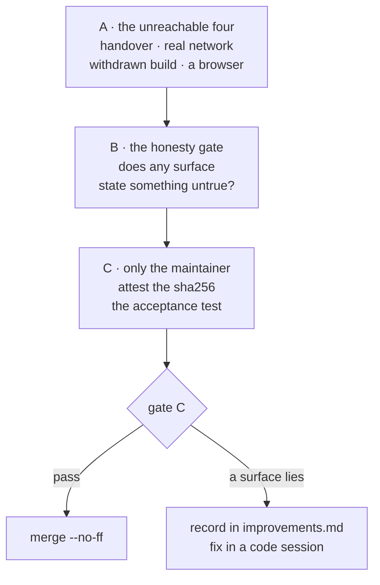

# Manual verification — Cycle 6-plus (the update path)

**Transient document**, like the handoff it accompanies: it is deleted when the
cycle closes and merges. It exists because the maintainer asked to verify gate C
**by hand** before approving it, and because a large part of this cycle is
**structurally unreachable** by the test suite — a suite that runs in a Linux
container with no ffmpeg, no browser and no network.

Nothing here is normative. The rulings are in
[ADR-0016](decisions/0016-cycle6plus-update-path.md); the two finding registers
are in [improvements.md](improvements.md).

> ### ⚠️ Read this before touching `deps.conf`
>
> **A commit to `deps.conf` on `main` reaches every existing installation within
> a day, with no release.** That is the point of it, and it is why several
> recipes below use a **throwaway branch** plus `YTDL_BRANCH`, never `main`.
>
> Delete the test branch when you are done. A pin left behind on a branch nobody
> reads is harmless; the same pin on `main` is a fleet-wide change.

## 0. What the container already established

Do **not** re-verify these by hand — they are green and were re-run without the
test cache on 2026-08-19:

| Check | State |
|---|---|
| `go build ./...` · `go vet ./...` · `gofmt -l .` | clean |
| `go test -race -count=1 ./...` | green, every package |
| `bash tests/test-installer.sh` | 101 assertions, 0 failed |
| `git diff main -- internal/core/ internal/daemon/` | empty — the parity gate holds |
| `internal/update` run five times cold under `-race` | no flakiness |

What follows is only what those cannot reach.



## Preparation

On the Mac, in a Terminal:

```bash
ytdl --version          # note what you are on BEFORE anything
ls ~/.local/state/ytdl  # update.json · update-run.json · update.log · installed.conf
cat ~/.local/state/ytdl/installed.conf
```

The four state files this cycle uses, all under `~/.local/state/ytdl/`:

| File | What it is | Safe to delete? |
|---|---|---|
| `update.json` | the cached verdict | **yes** — forces "mai controllato" |
| `update-run.json` | the record of one installer run | **yes** — forgets the last run |
| `update.log` | that run's output | yes |
| `installed.conf` | what the installer actually put down | **no** — deleting it loses the ffmpeg build id, and ffmpeg then reads *versione non registrata* until the next install |

Keep a copy before you start:

```bash
cp -a ~/.local/state/ytdl ~/ytdl-state-backup-$(date +%F)
```

---

## Part A — the four things nothing has ever exercised

### A1. The handover, end to end

**Never run anywhere.** `handOver` calls `os.Exit`, so no test can execute it.
Two preconditions *were* confirmed in the container: the page's bare `fetch`
calls authenticate through the `SameSite=Strict` cookie, and
`DefaultFirstClientGrace` (2 min) comfortably covers the page's 60 s
`RESTART_TIMEOUT_MS`.

It needs a **real ytdl version change**, so it is genuinely testable only around a
release, or by installing an older ytdl first.

1. Install the previous release deliberately, then open `ytdl gui`.
2. *Impostazioni* → *Versione e aggiornamenti* → **Controlla ora**. The banner
   should appear and the changes table should list `ytdl`.
3. Press **Aggiorna**, confirm. The confirmation **must** say
   «L'interfaccia si chiude e si riapre da sola» — it says that only when `ytdl`
   is among the changes.
4. Watch, without touching anything.

| Must happen | Must **not** happen |
|---|---|
| «Aggiornamento in corso…» | a `401` or any mention of reopening with `ytdl gui` |
| «Aggiornato. Riapro l'interfaccia…» | the page hanging past 60 s |
| the page reloads **once**, by itself | a second reload, or a reload loop |
| after the reload, the versions block shows the **new** ytdl | the session asking you to authenticate again |

The token handover is what makes step 4 work; if it were broken you would land on
a page that answers `401 … riapri l'interfaccia con ytdl gui`, which is exactly
the acceptance test failing.

5. Repeat once **with a second tab open** on the same interface. The second tab
   must also show the running panel (it adopts the run on load — finding `V17`),
   and must not start a second update.

### A2. `install.sh` against the real network

Never run against real hosts on a real Mac. The container tests are pure bash and
mock every fetch.

```bash
curl -fsSL https://raw.githubusercontent.com/alergyonthestage/ytdl/main/install.sh | bash
```

Then, the property this cycle added — **idempotence**:

```bash
curl -fsSL .../install.sh | bash    # run it a second time, unchanged
```

The second run must report each component as **already current** and download
nothing. Time it: the whole point of ADR-0016 §11 is that the common update is
seconds, which is what makes it reasonable to ask a non-technical user to sit
through one from the GUI.

Then verify the marker matches reality:

```bash
cat ~/.local/state/ytdl/installed.conf
~/.local/bin/yt-dlp --version
~/.local/bin/ffmpeg -version | head -1
```

### A3. The withdrawn-build fallback

**Has never fired** — no build has been withdrawn yet. Force it.

On a throwaway branch, set an ffmpeg build id that does not exist:

```bash
git checkout -b test/withdrawn-ffmpeg
# in deps.conf, for YOUR architecture only:
#   ffmpeg_build_arm64 = 9999999999_9.9
git commit -am "test: a build id that cannot resolve" && git push -u origin test/withdrawn-ffmpeg
```

Then, on the Mac. `install.sh` reads `BRANCH="${YTDL_BRANCH:-main}"` and fetches
`deps.conf` from that same branch, so exporting it is all that is needed:

```bash
export YTDL_BRANCH=test/withdrawn-ffmpeg
curl -fsSL "https://raw.githubusercontent.com/alergyonthestage/ytdl/$YTDL_BRANCH/install.sh" | bash
```

**`unset YTDL_BRANCH` when you are done**, and remember it also steers
`ytdl --update` and the probe — leaving it set in your shell profile would point
your own machine at a test branch indefinitely.

| Must happen | Must **not** happen |
|---|---|
| three warnings: the attested build is no longer published · installing the current one · it cannot be checksum-verified | a silent success |
| the install **completes** | an abort |
| `installed.conf` gains `ffmpeg_pinned = false` | the marker claiming it is pinned |
| `ytdl --version` shows ffmpeg as **`non verificata: la versione attestata non è più disponibile`** | ffmpeg reading «verificata con questo ytdl» |
| the GUI's versions block shows the same, as a warning row | the GUI calling it «non installato» (that was `V12`) |
| the update verdict does **not** report an ffmpeg change | a phantom ffmpeg update that reappears on every check |

That last row is `ADR-0016 §15`'s third property and the easiest to get wrong: an
unattested copy is **uncompared**, not stale.

Then verify it **converges** (ratified decision §16.3): re-run the *real*
installer from `main`. It must re-fetch ffmpeg exactly **once**, and afterwards
`ffmpeg_pinned` must be gone from the marker and the *non verificata* line must
disappear. Re-run once more: no download.

**Also verify the boundary that must NOT fall back.** Turn the wi-fi off and run
the installer: it must **abort** with «The server answered nothing at all», never
degrade to unverified. "Could not ask" is not "was withdrawn".

### A4. A browser has never rendered this GUI

Every GUI assertion comes from node running the real functions against fake DOM
nodes, or from curl against a live daemon. Open it in **Safari** and in
**Chrome**, and look at the two surfaces this cycle added last:

- the **abandoned panel** (recipe in B5);
- a run **adopted on page load** — start an update from one tab, then open a
  second tab, or simply reload.

Check the ordinary things a DOM test cannot: the banner does not cover content,
the changes table does not overflow, the log block scrolls rather than stretching
the page, and the disabled **Aggiorna** button shows its reason on hover.

---

## Part B — the honesty gate

Gate C's question is exactly one: **does any surface state something untrue?**
This cycle failed that question twice before catching it, so each state is
listed with the exact words it must produce.

### B1. The three verdict states must never collapse into two

| To produce | Do this | `ytdl --version` last line must read |
|---|---|---|
| **up to date** | normal machine, after a check | `sei aggiornato · verificato il GG/MM/AAAA` — **with a date** |
| **not verified, never checked** | `rm ~/.local/state/ytdl/update.json`, then run `ytdl --version` immediately | `non verificati (mai controllato)` |
| **not verified, probe failed** | wi-fi off, `rm update.json`, run a download, wait, then `ytdl --version` | `non verificati (l'ultimo tentativo non ha ricevuto risposta)` |
| **available** | recipe B3 | `disponibile un aggiornamento · ytdl --update` |
| **consent off** | `update_check = false` in `~/.config/ytdl/config` | `controllo automatico disattivato` |

**The failure to hunt for:** any path where a failed probe reads as
`sei aggiornato`. That is the defect Cycle 5's gate C existed for.

> **Four of these were confirmed by execution in the container on 2026-08-21**,
> against a release-stamped build with a hand-written `update.json` and shimmed
> dependencies — `disponibile un aggiornamento · ytdl --update`,
> `controllo automatico disattivato`, `non verificati (mai controllato)` and
> `non controllati (build locale)`, each byte-for-byte as documented. The
> **two worth your time** are the ones that need a real machine:
> `sei aggiornato · verificato il …` (does it carry a date?) and
> `non verificati (l'ultimo tentativo non ha ricevuto risposta)` (does a dead
> network really land there, and not on "sei aggiornato"?).
>
> Also confirmed by execution: the notice is byte-identical to the sample in
> B3, and `ytdl <url> 2>/dev/null` carries **no** update line — the stdout
> contract holds.

Do the same in the GUI (*Impostazioni* → *Versione e aggiornamenti*), where the
same five states must appear as sentences. Check that turning the checkbox off
while a verdict exists produces **two sentences** — the verdict, and then
«Il controllo automatico è disattivato.» — rather than collapsing the verdict
into "unknown".

### B2. A failed probe is silent

With the wi-fi off, run several downloads. Across all of them there must be
**no** error, **no** banner, and **nothing on stderr** about the update check.
The only place the failure may appear is when you go and ask (`--version`,
`status`, the GUI block).

### B3. The notice, and the direction it must survive

Produce an update **without releasing one** by pinning an older yt-dlp on a
throwaway branch:

```bash
git checkout -b test/pin-older
# deps.conf:  yt_dlp_version = <a tag OLDER than what you have installed>
git commit -am "test: pin an older yt-dlp" && git push -u origin test/pin-older
```

On the Mac, `export YTDL_BRANCH=test/pin-older`, delete `update.json`, run a
download, then run another.

| Must happen | Must **not** happen |
|---|---|
| two lines on **stderr** after the download's own output | anything on stdout |
| the wording is «Aggiornamento disponibile per ytdl: richiede yt-dlp X (hai Y).» | «è disponibile una versione più recente» — that would be a **lie** for a rollback |
| the second line names `update_check` | a notice that never says how to stop it |
| `ytdl status` prints the **state line**, not the two-line notice | the same news twice on one screen |

**Verify the stdout contract explicitly** — this is the compatibility promise:

```bash
ytdl "https://youtu.be/XXXX" 2>/dev/null    # stdout alone: NO update lines
ytdl "https://youtu.be/XXXX" 1>/dev/null    # stderr alone: the notice
```

Then delete the branch and `unset YTDL_BRANCH`.

### B4. The empty-queue gate blocks the action, never the news

1. Enqueue something long: `ytdl -b "<a long playlist>"`.
2. With the update available (B3's branch still set), open the GUI.

| Must happen | Must **not** happen |
|---|---|
| the **banner still shows** — the news is never withheld | a hidden banner |
| the banner text appends the reason and the count | a count with no noun («2» alone) |
| **Aggiorna** is **disabled**, with the reason beside it | a live button that fails when pressed |
| after the queue drains, the button becomes live | needing a reload to re-enable it |

3. The server-side re-check: with an empty queue, draw the button, then enqueue a
   job from the CLI **before** clicking. The click must be refused with the
   reason — emptiness is re-checked at the click, not only when the button was
   drawn.

### B5. The abandoned run says only what is known

This is ratified decision §16.2 and finding `V18`. Force it:

```bash
# start an update from the GUI, then, while install.sh is running:
pkill -f 'ytdl __daemon'      # kill the daemon, NOT the installer
```

`install.sh` is `setsid`'d and finishes anyway. Reopen `ytdl gui`.

The panel must read, on load, without you pressing anything:

> Non so come sia andato questo aggiornamento: nessuno l'ha seguito fino alla
> fine. Le versioni installate adesso sono qui sopra; riprovare è sicuro.

| Must happen | Must **not** happen |
|---|---|
| it claims **neither** success nor failure | «L'aggiornamento non è riuscito» |
| it names **no cause** | «ytdl si è chiuso prima che finisse» — the wording `V18` removed |
| **Vedi il dettaglio** and **Riprova** are offered | a dead end |
| a *later* update can still start | the run blocking every future update (that was `V1`) |

That last row is the whole reason the state exists. Confirm it by pressing
**Riprova** and watching it actually start.

**The pid rule** (§16.1). Check the backstop cannot be tripped by a live
installer: start an update, and while it runs confirm the panel says
*in corso*, **not** abandoned. Then, separately, hand-edit `update-run.json` to
carry a `pid` that belongs to nothing and reload — it must read as abandoned at
once, without waiting two hours.

### B6. The foreign-dependency warning

With a Homebrew yt-dlp present, move ours aside:

```bash
mv ~/.local/bin/yt-dlp ~/.local/bin/yt-dlp.off
ytdl --version
```

| Must happen | Must **not** happen |
|---|---|
| `yt-dlp X   (da /opt/homebrew/bin/yt-dlp — non installata da ytdl)` | it being reported as out of date |
| a **separate** stderr warning after a download | it folded into the update notice |
| the warning appears **even with `update_check = false`** | consent gating a local fact |
| the GUI shows a warning row, not «non installato» | `V12` again |

Restore with `mv ~/.local/bin/yt-dlp.off ~/.local/bin/yt-dlp`.

### B7. Nothing offers what it cannot do

Walk the GUI once with this single question. In particular: on a machine where
the update capability is absent, **no update control is rendered at all** — never
a dead one (`ux-principles.md` §4).

---

## Part C — the two things only the maintainer can close

### C1. Attest the four `sha256` values — **blocking**

**The four ffmpeg sums in `deps.conf` were COMPUTED in the Linux container, not
attested.** The entire value of ADR-0016 §12 is that the sum means *someone
checked*. This must not ship as it stands.

A **wrong** sum is worse than a missing one: it is a checksum mismatch, which
**aborts** the install — and a mismatch is not a withdrawal, so it does not fall
back. A wrong sum makes ytdl uninstallable.

The URL is `ffmpeg_url_for` in `install.sh`, which builds
`$FFMPEG_BASE/<arch>/<build>/<tool>.zip`. On the Mac, for each of the four:

```bash
BASE=https://ffmpeg.martin-riedl.de/download/macos

# arm64 — build id from deps.conf: ffmpeg_build_arm64
ARCH=arm64 BUILD=1785863997_9.0
# amd64 — build id from deps.conf: ffmpeg_build_amd64
# ARCH=amd64 BUILD=1785871427_9.0

for tool in ffmpeg ffprobe; do
  curl -fsSL -o "/tmp/$tool-$ARCH.zip" "$BASE/$ARCH/$BUILD/$tool.zip" \
    && echo "ffmpeg_sha256_${ARCH}_${tool} = $(shasum -a 256 "/tmp/$tool-$ARCH.zip" | awk '{print $1}')"
done
```

The output is already in `deps.conf`'s own key shape, so it can be diffed against
the file directly. Then **actually run the binaries** — an attestation is of a
build you fetched *and tested*, not of bytes you hashed.

Two limits to record rather than gloss:

- **The amd64 pair cannot be *tested* on an Apple Silicon Mac**, only hashed. Say
  so; the sum still guarantees immutability, which is what §12 claims and all it
  claims.
- If a build **404s** while you are doing this, upstream has already withdrawn it.
  Do not paper over it with the current build's sum — re-pin the build id *and*
  its sums together, and take the opportunity to confirm A3 against reality.

### C2. The acceptance test

> A person who is **not** the maintainer goes from "there is an update" to "I am
> on it" **from the GUI alone**, with nobody at their keyboard.

It is verified when that happens, and not before. Everything in Part A and Part B
is preparation for it.

If a Terminal is needed at any point other than the 60-second-timeout fallback
(A1), the cycle has not met its own acceptance test — record where, and it
becomes an input to **Cycle 6-launch**, which removes even that one.

---

## Recording the result

- **A surface that states something untrue** → record it in
  [improvements.md](improvements.md) with the reproduction, and it is a **code**
  session, not a docs one. Gate C does not pass.
- **A step that could not be run** (no second Mac, no amd64 hardware) → say so
  explicitly. "Reviewed twice" must never be read as "exercised", and neither
  must "verified by hand".
- **Everything passes** → gate C passes, this file and
  `handoff-cycle6plus-docs.md` are deleted, and the cycle merges with
  `--no-ff`. The release still waits on C1.
