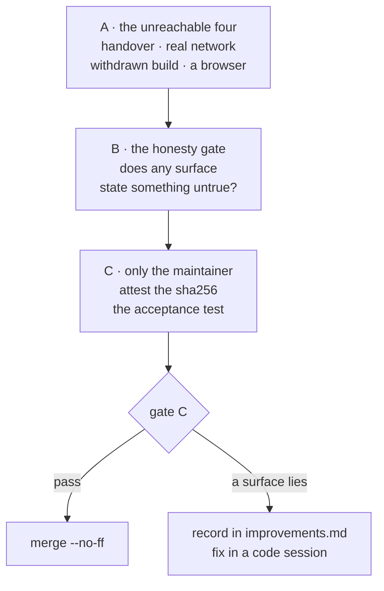
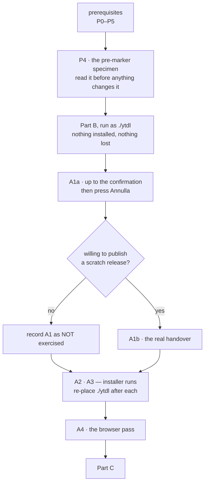

# Manual verification — Cycle 6-plus (the update path)

**Transient document**, like the handoff it accompanies: it is deleted when the
cycle closes and merges. It exists because the maintainer asked to verify gate C
**by hand** before approving it, and because a large part of this cycle is
**structurally unreachable** by the test suite — a suite that runs in a Linux
container with no ffmpeg, no browser and no network.

Nothing here is normative. The rulings are in
[ADR-0016](decisions/0016-cycle6plus-update-path.md); the two finding registers
are in [improvements.md](improvements.md).

> ### ⚠️ Read this before touching `deps.conf`
>
> **A commit to `deps.conf` on `main` reaches every existing installation within
> a day, with no release.** That is the point of it, and it is why several
> recipes below use a **throwaway branch** plus `YTDL_BRANCH`, never `main`.
>
> Delete the test branch when you are done. A pin left behind on a branch nobody
> reads is harmless; the same pin on `main` is a fleet-wide change.

## 0. What the container already established

Do **not** re-verify these by hand — they are green and were re-run without the
test cache on 2026-08-19:

| Check | State |
|---|---|
| `go build ./...` · `go vet ./...` · `gofmt -l .` | clean |
| `go test -race -count=1 ./...` | green, every package |
| `bash tests/test-installer.sh` | 101 assertions, 0 failed |
| `git diff main -- internal/core/ internal/daemon/` | empty — the parity gate holds |
| `internal/update` run five times cold under `-race` | no flakiness |

What follows is only what those cannot reach.



## Prerequisites — five things that are NOT true by default

**Added 2026-08-21, after the first attempt on real hardware.** The original
draft of this file assumed the `ytdl` on your `$PATH` was the thing under test.
It is not, and four further assumptions were wrong with it. Nothing below is
optional: skip one and most of Part A and Part B silently test the *released*
v2.1.0, which has none of this cycle in it.

### P0. What you are running now, and how to tell

```
$ ytdl --version
ytdl v2.1.0
yt-dlp 2026.07.04
```

**Two lines and no `Aggiornamenti:` line is the released v2.1.0** — the build
that predates this cycle. The branch build prints one line per component *plus*
a state line (§8.3 of [cli-reference.md](cli-reference.md)). Likewise
`~/.local/state/ytdl/installed.conf` is **absent**, and that is correct: the
marker is written only by the new installer.

Use those two facts as your check at any point: if `--version` is two lines, you
are testing the wrong binary.

### P1. Build the branch binary — and run it in a sandbox

**Use [`hack/ytdl-dev.sh`](../hack/ytdl-dev.sh); the full reference is
[dev-testing.md](dev-testing.md).** It sets every isolation variable together,
which is the part that is easy to get half-right by hand:

```bash
hack/ytdl-dev.sh build darwin/arm64    # in the container; darwin/amd64 on Intel
hack/ytdl-dev.sh seed                  # copy yt-dlp/ffmpeg into the sandbox
hack/ytdl-dev.sh run -- --version      # on the Mac
```

**This changes the shape of gate C for the better.** With the sandbox, the state
dir, the config, the dependency directory *and* the installer's target are all
under `~/.ytdl-dev` — so **A2 and A3 no longer destroy your installed ytdl**
(P5), and the whole of Part B runs without touching anything real.

`uname -m` says which architecture: `arm64` → `darwin/arm64`, `x86_64` →
`darwin/amd64`.

#### Doing it by hand instead

You do **not** need Go on the Mac. `CGO_ENABLED=0` makes the binary static, so
the container builds a real Mach-O for macOS, and the repo is a shared mount —
what is built in the container appears in the repo folder on the Mac.

First, your architecture (the answer changes the `GOARCH`):

```bash
uname -m          # arm64 = Apple Silicon · x86_64 = Intel
```

Then, **in the container**, from `/workspace/yt-download`:

```bash
export GIT_CONFIG_COUNT=1 GIT_CONFIG_KEY_0=safe.directory \
       GIT_CONFIG_VALUE_0=/workspace/yt-download

CGO_ENABLED=0 GOOS=darwin GOARCH=arm64 \
  go build -ldflags "-X github.com/alergyonthestage/ytdl/internal/buildinfo.Version=v2.1.0-test" \
  -o ytdl ./cmd/ytdl
```

Use `GOARCH=amd64` on an Intel Mac. The output lands at `./ytdl` in the repo
root, which is **already in `.gitignore`** — it will not be committed.

On the Mac, in the repo folder:

```bash
xattr -d com.apple.quarantine ./ytdl 2>/dev/null   # only if Gatekeeper objects
./ytdl --version
```

**Run it by path (`./ytdl`) for the whole of Part B.** That is non-destructive:
it leaves your installed v2.1.0 alone, and dependency resolution still finds
`~/.local/bin` because `update.BinDir()` is fixed, not relative to the binary.
Only Part A needs it *installed* — see P4.

### P2. The version stamp decides whether anything happens at all

**A build with no `-ldflags` reports `dev`, and a `dev` build is never checked and
never reported stale** (`update.DevVersion`). Every update surface goes inert:
you would get `Aggiornamenti: non controllati (build locale)` and conclude,
wrongly, that nothing works.

So the stamp is not cosmetic — it is the switch:

| Stamp | What it produces |
|---|---|
| *(none)* → `dev` | everything inert. **Never use this for gate C** |
| `v2.1.0-test` | ytdl compares equal-ish to nothing; the *dependency* half still moves. Good default for Part B |
| **a version OLDER than the latest release**, e.g. `v2.0.9` | the probe sees `releases/latest` = `v2.1.0` and reports **an update to ytdl itself**. This is how you make the banner, the changes table and the *Aggiorna* confirmation appear **without releasing anything** |

The stamp is a string comparison, not a parse — nothing validates that it looks
like a version, and nothing orders it. It only has to *differ*.

### P3. The branch must be pushed, or the probe cannot answer at all

**Resolved 2026-08-21: the branch is now on `origin`** and
`raw.githubusercontent.com/.../feat/update-path/implementation/deps.conf`
answers `200`. This section is kept because the failure it describes is silent
and would otherwise be diagnosed as a bug in the probe.

That blocks more than the installer. The probe fetches the pin from
`raw.githubusercontent.com/<slug>/<branch>/deps.conf`, `<branch>` defaults to
`main`, and **`deps.conf` does not exist on `main`** — it is new in this cycle.
Point at a branch without a `deps.conf` and the build reports:

```
Aggiornamenti: non verificati (l'ultimo tentativo non ha ricevuto risposta)
```

for ever, no matter what you do. That is the code behaving correctly on a
question nobody can answer — and it makes B1, B3, B4 and all of Part A
unreachable. **It is the first thing to check when the update surface looks
dead.**

Point the machine at the branch that does carry it:

```bash
export YTDL_BRANCH=feat/update-path/implementation
```

> **This is safe, and here is precisely why.** A `deps.conf` on `main` is the
> fleet-wide lever — every installation reads `main` by default. A `deps.conf`
> on a **branch** is read by nobody except a machine that has opted in with
> `YTDL_BRANCH`. Pushing the branch changes nothing for any existing user.
>
> `unset YTDL_BRANCH` when you finish, and never put it in `~/.zprofile`: it
> steers the probe, `ytdl --update` **and** the GUI's *Aggiorna* alike.

### P4. Your current installation is a specimen — do not reinstall it yet

**Answering "should I uninstall and reinstall?" — no, and it would gain you
nothing.** `install.sh` on `main` is the *old* installer, and it installs
`releases/latest`, which is v2.1.0: you would spend the download to arrive
exactly where you already are.

Worse, you would destroy something useful. A machine installed **before the
marker existed** is a real specimen of a case the code handles deliberately and
that no test covers on real hardware: `LoadMarker` finds nothing, ffmpeg has no
recorded build, and an absent `ffmpeg_pinned` key is read as *attested* (because
every install predating ADR-0016 §15 took the pinned path or no path at all).
Your machine should therefore print, with the branch build:

```
ffmpeg (versione non registrata)
```

and **not** `ffmpeg non installato`, and not a false `non verificata`. Check that
before you change anything — it is a free finding you can only make once.

Back up what an installer run would overwrite:

```bash
cp -a ~/.local/bin ~/.local/bin.backup-$(date +%F)
```

### P5. An installer run replaces the binary under test — unless you sandbox

`install_ytdl` downloads from
`https://github.com/<slug>/releases/latest/download` — **the latest release**.
The installer cannot install an unreleased branch build, so an installer run
(A2, A3, *Aggiorna*, `ytdl --update`) replaces the ytdl binary with v2.1.0 and
silently ends your test.

**Inside the sandbox this is harmless**: `YTDL_INSTALL_DIR` points at
`~/.ytdl-dev/bin`, so the installer replaces the *sandbox* copy and your real
`~/.local/bin/ytdl` is never touched. Restore the dev build with:

```bash
hack/ytdl-dev.sh build darwin/arm64 && hack/ytdl-dev.sh run -- --version
```

**Outside the sandbox it is not.** If you insist on testing against the real
install, back it up first (see Preparation) and check `ytdl --version` prints
four lines whenever you resume — two means an installer run put v2.1.0 back, and
everything measured after that point measured the wrong build.

## Preparation

Do the five prerequisites first. Then, on the Mac:

```bash
ls ~/.local/state/ytdl
```

**On a machine that predates this cycle you will see only `daemon.log`, `logs`
and `queue`, and that is correct** — every file below is created on demand by the
new binary or the new installer. An empty result is not a broken install; it is a
machine that has never run any of this.

The four state files this cycle adds, all under `~/.local/state/ytdl/`:

| File | Written by | What it is | Safe to delete? |
|---|---|---|---|
| `update.json` | the branch binary, after a check | the cached verdict | **yes** — forces "mai controllato" |
| `update-run.json` | the GUI's *Aggiorna* | the record of one installer run | **yes** — forgets the last run |
| `update.log` | the installer, via the GUI | that run's output | yes |
| `installed.conf` | the **new** `install.sh` only | what the installer actually put down | **no** — deleting it loses the ffmpeg build id, and ffmpeg then reads *versione non registrata* until the next install |

Keep a copy of both directories before you start — the state dir, and the
binaries an installer run would overwrite:

```bash
cp -a ~/.local/state/ytdl ~/ytdl-state-backup-$(date +%F)
cp -a ~/.local/bin        ~/ytdl-bin-backup-$(date +%F)
```

### The order matters now

Because every installer run overwrites the binary under test (P5), do the
non-destructive work first and batch the destructive work at the end:



`ytdl --version` must show **four lines** whenever you resume: two means an
installer run has put v2.1.0 back and whatever you measured after that point was
measuring the wrong build.

---

## Part A — the four things nothing has ever exercised

### A1. The handover, end to end

**Never run anywhere.** `handOver` calls `os.Exit`, so no test can execute it.
Two preconditions *were* confirmed in the container: the page's bare `fetch`
calls authenticate through the `SameSite=Strict` cookie, and
`DefaultFirstClientGrace` (2 min) comfortably covers the page's 60 s
`RESTART_TIMEOUT_MS`.

> **Corrected 2026-08-21.** This step previously said "install the previous
> release deliberately". **That does not work**, and the reason is worth stating
> because it constrains when A1 can be done at all:
>
> `install_ytdl` fetches from `<slug>/releases/latest/download` — **the latest
> release**. The installer cannot install an unreleased branch build. So a
> handover today would replace the branch build with **v2.1.0**, which has no
> update path in it: the page's `newBuildIsServing` polls `/api/state` for
> `update.installed.ytdl`, v2.1.0 serves no `update` object at all, the check
> never becomes true, and after 60 s you get the "non sono riuscito a riaprire
> l'interfaccia" fallback. **You would be reading a failure that is an artefact of
> the setup, not a defect.**
>
> The handover is only testable **between two builds that both carry the update
> path**.

#### A1a. What IS testable before any release

With the branch build stamped **older than the latest release** (P2) and
`YTDL_BRANCH` set (P3), everything up to the moment of handover works and is
worth checking:

1. `./ytdl gui`, then *Impostazioni* → *Versione e aggiornamenti* → **Controlla
   ora**. The banner appears; the changes table lists `ytdl` with your stamp on
   the left and the real latest tag on the right.
2. Press **Aggiorna**. The confirmation **must** say «L'interfaccia si chiude e
   si riapre da sola» — that clause appears only when `ytdl` is among the
   changes, which is `confirmUpdate`'s whole point.
3. Press **Annulla**. Nothing should have started.

Stop there unless you have set up A1b. Confirming is what launches an installer
that will overwrite your test binary (P5).

#### A1b. The full handover — with a real pre-release

Two builds that both carry the update path means **publishing one**.

**Decided by the maintainer, 2026-08-21: publish it on the real repository.** The
earlier draft of this step routed around a scratch repo to protect the first
non-maintainer user; that install was **deferred precisely until this cycle
ships**, so there is no installation anywhere that a release could reach. The
risk that made a scratch repo worth its cost does not exist, and a real
pre-release additionally exercises `release.yml`, which has never run for this
cycle.

```bash
git tag v2.2.0-rc1 && git push origin v2.2.0-rc1
```

`release.yml` triggers on `v*`, builds both architectures, stamps
`GITHUB_REF_NAME` and publishes with `gh release create --latest`. So
`releases/latest` becomes the rc — which is exactly what the probe must see.

Then, on the Mac, give the sandbox an **older** build to update *from*:

```bash
YTDL_DEV_VERSION=v2.0.9 hack/ytdl-dev.sh build darwin/arm64
hack/ytdl-dev.sh seed
export YTDL_BRANCH=feat/update-path/implementation
hack/ytdl-dev.sh run -- gui        # opens on :8790
```

Browse it at **`http://localhost:8790/`**, not `127.0.0.1` — cookies ignore the
port, so a dev GUI and a real GUI on `127.0.0.1` fight over one session cookie
(see [dev-testing.md](dev-testing.md)). `localhost` is in `localHost`'s
allowlist, so it is a different cookie domain and they coexist.

> **Afterwards, delete the release and the tag.** Until this cycle merges and
> ships properly, `releases/latest` should go back to v2.1.0:
>
> ```bash
> gh release delete v2.2.0-rc1 --cleanup-tag     # on the Mac; gh is not authenticated in the container
> ```
>
> And re-check that `deps.conf` on **`main`** is still absent: the fleet-wide
> lever is that file on that branch, and nothing in this test should have put
> one there.

4. Watch, without touching anything.

| Must happen | Must **not** happen |
|---|---|
| «Aggiornamento in corso…» | a `401` or any mention of reopening with `ytdl gui` |
| «Aggiornato. Riapro l'interfaccia…» | the page hanging past 60 s |
| the page reloads **once**, by itself | a second reload, or a reload loop |
| after the reload, the versions block shows **v2.2.0-rc1** | the session asking you to authenticate again |

The token handover is what makes that work; if it were broken you would land on
a page answering `401 … riapri l'interfaccia con ytdl gui` — a Terminal, i.e.
exactly the acceptance test failing.

**Note what the sandbox changes here.** The installer writes to
`YTDL_INSTALL_DIR`, so the rc lands in `~/.ytdl-dev/bin/ytdl` and your real
`~/.local/bin/ytdl` stays on v2.1.0 throughout. The handover self-execs
`os.Executable()`, which is the sandbox copy — so the whole sequence happens
inside the sandbox, which is the first time this cycle has had a way to run it
without consequences.

5. Repeat once **with a second tab open**. The second tab must also show the
   running panel (it adopts the run on load — `V17`), and must not start a second
   update.

6. Afterwards: `unset YTDL_BRANCH`, delete the release and tag, and
   `hack/ytdl-dev.sh reset` when you no longer need the sandbox.

#### A1c. If you skip A1b

Say so in the result. "The handover has never run end to end" then remains true
after gate C, and it stays on the list in the roadmap and the ADR — it must not
quietly become "verified" because A1a passed.

### A2. `install.sh` against the real network

Never run against real hosts on a real Mac. The container tests are pure bash and
mock every fetch.

**Requires P3** — the branch pushed. The installer on `main` is the *old* one and
would tell you nothing about this cycle; and the new one aborts immediately
without a reachable `deps.conf`, which `main` does not have.

**Costs you the test binary (P5).** The installer will put v2.1.0 at
`~/.local/bin/ytdl`. Re-place it afterwards with `cp ./ytdl ~/.local/bin/ytdl`.

```bash
export YTDL_BRANCH=feat/update-path/implementation
curl -fsSL "https://raw.githubusercontent.com/alergyonthestage/ytdl/$YTDL_BRANCH/install.sh" | bash
```

Then, the property this cycle added — **idempotence**:

```bash
curl -fsSL "https://raw.githubusercontent.com/alergyonthestage/ytdl/$YTDL_BRANCH/install.sh" | bash
```

The second run must report each component as **already current** and download
nothing. Time it: the whole point of ADR-0016 §11 is that the common update is
seconds, which is what makes it reasonable to ask a non-technical user to sit
through one from the GUI.

Then verify the marker matches reality:

```bash
cat ~/.local/state/ytdl/installed.conf
~/.local/bin/yt-dlp --version
~/.local/bin/ffmpeg -version | head -1
```

### A3. The withdrawn-build fallback

**Has never fired** — no build has been withdrawn yet. Force it.

Same two costs as A2: it needs the throwaway branch **pushed**, and it replaces
`~/.local/bin/ytdl` with v2.1.0 (P5). Branch this one off the implementation
branch, so it carries the new `install.sh` as well as the doctored `deps.conf`.

On a throwaway branch, set an ffmpeg build id that does not exist:

```bash
git checkout -b test/withdrawn-ffmpeg
# in deps.conf, for YOUR architecture only:
#   ffmpeg_build_arm64 = 9999999999_9.9
git commit -am "test: a build id that cannot resolve" && git push -u origin test/withdrawn-ffmpeg
```

Then, on the Mac. `install.sh` reads `BRANCH="${YTDL_BRANCH:-main}"` and fetches
`deps.conf` from that same branch, so exporting it is all that is needed:

```bash
export YTDL_BRANCH=test/withdrawn-ffmpeg
curl -fsSL "https://raw.githubusercontent.com/alergyonthestage/ytdl/$YTDL_BRANCH/install.sh" | bash
```

**`unset YTDL_BRANCH` when you are done**, and remember it also steers
`ytdl --update` and the probe — leaving it set in your shell profile would point
your own machine at a test branch indefinitely.

| Must happen | Must **not** happen |
|---|---|
| three warnings: the attested build is no longer published · installing the current one · it cannot be checksum-verified | a silent success |
| the install **completes** | an abort |
| `installed.conf` gains `ffmpeg_pinned = false` | the marker claiming it is pinned |
| `ytdl --version` shows ffmpeg as **`non verificata: la versione attestata non è più disponibile`** | ffmpeg reading «verificata con questo ytdl» |
| the GUI's versions block shows the same, as a warning row | the GUI calling it «non installato» (that was `V12`) |
| the update verdict does **not** report an ffmpeg change | a phantom ffmpeg update that reappears on every check |

That last row is `ADR-0016 §15`'s third property and the easiest to get wrong: an
unattested copy is **uncompared**, not stale.

Then verify it **converges** (ratified decision §16.3): re-run the *real*
installer from `main`. It must re-fetch ffmpeg exactly **once**, and afterwards
`ffmpeg_pinned` must be gone from the marker and the *non verificata* line must
disappear. Re-run once more: no download.

**Also verify the boundary that must NOT fall back.** Turn the wi-fi off and run
the installer: it must **abort** with «The server answered nothing at all», never
degrade to unverified. "Could not ask" is not "was withdrawn".

### A4. A browser has never rendered this GUI

Every GUI assertion comes from node running the real functions against fake DOM
nodes, or from curl against a live daemon. Open it in **Safari** and in
**Chrome**, and look at the two surfaces this cycle added last:

- the **abandoned panel** (recipe in B5);
- a run **adopted on page load** — start an update from one tab, then open a
  second tab, or simply reload.

Check the ordinary things a DOM test cannot: the banner does not cover content,
the changes table does not overflow, the log block scrolls rather than stretching
the page, and the disabled **Aggiorna** button shows its reason on hover.

---

## Part B — the honesty gate

Gate C's question is exactly one: **does any surface state something untrue?**
This cycle failed that question twice before catching it, so each state is
listed with the exact words it must produce.

### B1. The three verdict states must never collapse into two

| To produce | Do this | `ytdl --version` last line must read |
|---|---|---|
| **up to date** | normal machine, after a check | `sei aggiornato · verificato il GG/MM/AAAA` — **with a date** |
| **not verified, never checked** | `rm ~/.local/state/ytdl/update.json`, then run `ytdl --version` immediately | `non verificati (mai controllato)` |
| **not verified, probe failed** | wi-fi off, `rm update.json`, run a download, wait, then `ytdl --version` | `non verificati (l'ultimo tentativo non ha ricevuto risposta)` |
| **available** | recipe B3 | `disponibile un aggiornamento · ytdl --update` |
| **consent off** | `update_check = false` in `~/.config/ytdl/config` | `controllo automatico disattivato` |

**The failure to hunt for:** any path where a failed probe reads as
`sei aggiornato`. That is the defect Cycle 5's gate C existed for.

> **Four of these were confirmed by execution in the container on 2026-08-21**,
> against a release-stamped build with a hand-written `update.json` and shimmed
> dependencies — `disponibile un aggiornamento · ytdl --update`,
> `controllo automatico disattivato`, `non verificati (mai controllato)` and
> `non controllati (build locale)`, each byte-for-byte as documented. The
> **two worth your time** are the ones that need a real machine:
> `sei aggiornato · verificato il …` (does it carry a date?) and
> `non verificati (l'ultimo tentativo non ha ricevuto risposta)` (does a dead
> network really land there, and not on "sei aggiornato"?).
>
> Also confirmed by execution: the notice is byte-identical to the sample in
> B3, and `ytdl <url> 2>/dev/null` carries **no** update line — the stdout
> contract holds.

Do the same in the GUI (*Impostazioni* → *Versione e aggiornamenti*), where the
same five states must appear as sentences. Check that turning the checkbox off
while a verdict exists produces **two sentences** — the verdict, and then
«Il controllo automatico è disattivato.» — rather than collapsing the verdict
into "unknown".

### B2. A failed probe is silent

With the wi-fi off, run several downloads. Across all of them there must be
**no** error, **no** banner, and **nothing on stderr** about the update check.
The only place the failure may appear is when you go and ask (`--version`,
`status`, the GUI block).

### B3. The notice, and the direction it must survive

Produce an update **without releasing one** by pinning an older yt-dlp on a
throwaway branch:

```bash
git checkout -b test/pin-older
# deps.conf:  yt_dlp_version = <a tag OLDER than what you have installed>
git commit -am "test: pin an older yt-dlp" && git push -u origin test/pin-older
```

On the Mac, `export YTDL_BRANCH=test/pin-older`, delete `update.json`, run a
download, then run another.

| Must happen | Must **not** happen |
|---|---|
| two lines on **stderr** after the download's own output | anything on stdout |
| the wording is «Aggiornamento disponibile per ytdl: richiede yt-dlp X (hai Y).» | «è disponibile una versione più recente» — that would be a **lie** for a rollback |
| the second line names `update_check` | a notice that never says how to stop it |
| `ytdl status` prints the **state line**, not the two-line notice | the same news twice on one screen |

**Verify the stdout contract explicitly** — this is the compatibility promise:

```bash
ytdl "https://youtu.be/XXXX" 2>/dev/null    # stdout alone: NO update lines
ytdl "https://youtu.be/XXXX" 1>/dev/null    # stderr alone: the notice
```

Then delete the branch and `unset YTDL_BRANCH`.

### B4. The empty-queue gate blocks the action, never the news

1. Enqueue something long: `ytdl -b "<a long playlist>"`.
2. With the update available (B3's branch still set), open the GUI.

| Must happen | Must **not** happen |
|---|---|
| the **banner still shows** — the news is never withheld | a hidden banner |
| the banner text appends the reason and the count | a count with no noun («2» alone) |
| **Aggiorna** is **disabled**, with the reason beside it | a live button that fails when pressed |
| after the queue drains, the button becomes live | needing a reload to re-enable it |

3. The server-side re-check: with an empty queue, draw the button, then enqueue a
   job from the CLI **before** clicking. The click must be refused with the
   reason — emptiness is re-checked at the click, not only when the button was
   drawn.

### B5. The abandoned run says only what is known

This is ratified decision §16.2 and finding `V18`. Force it:

```bash
# start an update from the GUI, then, while install.sh is running:
pkill -f 'ytdl __daemon'      # kill the daemon, NOT the installer
```

`install.sh` is `setsid`'d and finishes anyway. Reopen `ytdl gui`.

The panel must read, on load, without you pressing anything:

> Non so come sia andato questo aggiornamento: nessuno l'ha seguito fino alla
> fine. Le versioni installate adesso sono qui sopra; riprovare è sicuro.

| Must happen | Must **not** happen |
|---|---|
| it claims **neither** success nor failure | «L'aggiornamento non è riuscito» |
| it names **no cause** | «ytdl si è chiuso prima che finisse» — the wording `V18` removed |
| **Vedi il dettaglio** and **Riprova** are offered | a dead end |
| a *later* update can still start | the run blocking every future update (that was `V1`) |

That last row is the whole reason the state exists. Confirm it by pressing
**Riprova** and watching it actually start.

**The pid rule** (§16.1). Check the backstop cannot be tripped by a live
installer: start an update, and while it runs confirm the panel says
*in corso*, **not** abandoned. Then, separately, hand-edit `update-run.json` to
carry a `pid` that belongs to nothing and reload — it must read as abandoned at
once, without waiting two hours.

### B6. The foreign-dependency warning

With a Homebrew yt-dlp present, move ours aside:

```bash
mv ~/.local/bin/yt-dlp ~/.local/bin/yt-dlp.off
ytdl --version
```

| Must happen | Must **not** happen |
|---|---|
| `yt-dlp X   (da /opt/homebrew/bin/yt-dlp — non installata da ytdl)` | it being reported as out of date |
| a **separate** stderr warning after a download | it folded into the update notice |
| the warning appears **even with `update_check = false`** | consent gating a local fact |
| the GUI shows a warning row, not «non installato» | `V12` again |

Restore with `mv ~/.local/bin/yt-dlp.off ~/.local/bin/yt-dlp`.

### B7. Nothing offers what it cannot do

Walk the GUI once with this single question. In particular: on a machine where
the update capability is absent, **no update control is rendered at all** — never
a dead one (`ux-principles.md` §4).

---

## Part C — the two things only the maintainer can close

### C1. Attest the four `sha256` values — **blocking**

**The four ffmpeg sums in `deps.conf` were COMPUTED in the Linux container, not
attested.** The entire value of ADR-0016 §12 is that the sum means *someone
checked*. This must not ship as it stands.

A **wrong** sum is worse than a missing one: it is a checksum mismatch, which
**aborts** the install — and a mismatch is not a withdrawal, so it does not fall
back. A wrong sum makes ytdl uninstallable.

The URL is `ffmpeg_url_for` in `install.sh`, which builds
`$FFMPEG_BASE/<arch>/<build>/<tool>.zip`. On the Mac, for each of the four:

```bash
BASE=https://ffmpeg.martin-riedl.de/download/macos

# arm64 — build id from deps.conf: ffmpeg_build_arm64
ARCH=arm64 BUILD=1785863997_9.0
# amd64 — build id from deps.conf: ffmpeg_build_amd64
# ARCH=amd64 BUILD=1785871427_9.0

for tool in ffmpeg ffprobe; do
  curl -fsSL -o "/tmp/$tool-$ARCH.zip" "$BASE/$ARCH/$BUILD/$tool.zip" \
    && echo "ffmpeg_sha256_${ARCH}_${tool} = $(shasum -a 256 "/tmp/$tool-$ARCH.zip" | awk '{print $1}')"
done
```

The output is already in `deps.conf`'s own key shape, so it can be diffed against
the file directly. Then **actually run the binaries** — an attestation is of a
build you fetched *and tested*, not of bytes you hashed.

Two limits to record rather than gloss:

- **The amd64 pair cannot be *tested* on an Apple Silicon Mac**, only hashed. Say
  so; the sum still guarantees immutability, which is what §12 claims and all it
  claims.
- If a build **404s** while you are doing this, upstream has already withdrawn it.
  Do not paper over it with the current build's sum — re-pin the build id *and*
  its sums together, and take the opportunity to confirm A3 against reality.

### C2. The acceptance test

> A person who is **not** the maintainer goes from "there is an update" to "I am
> on it" **from the GUI alone**, with nobody at their keyboard.

It is verified when that happens, and not before. Everything in Part A and Part B
is preparation for it.

If a Terminal is needed at any point other than the 60-second-timeout fallback
(A1), the cycle has not met its own acceptance test — record where, and it
becomes an input to **Cycle 6-launch**, which removes even that one.

---

## Recording the result

- **A surface that states something untrue** → record it in
  [improvements.md](improvements.md) with the reproduction, and it is a **code**
  session, not a docs one. Gate C does not pass.
- **A step that could not be run** (no second Mac, no amd64 hardware) → say so
  explicitly. "Reviewed twice" must never be read as "exercised", and neither
  must "verified by hand".
- **Everything passes** → gate C passes, this file and
  `handoff-cycle6plus-docs.md` are deleted, and the cycle merges with
  `--no-ff`. The release still waits on C1.
